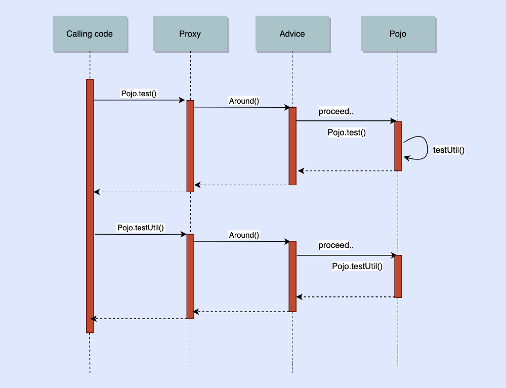

=== Proxy-объекты (шаблон Заместитель)

1. Прокси в Java
2. Прокси в Spring (AOP)
3. Основная терминология AOP
4. Пример работы прокси
5. Влияние на производительность

==== Прокси в Java

*_Прокси-класс_* — это некоторая «*_надстройка_*» над оригинальным классом, которая позволяет при необходимости изменить его поведение.

- Шаблон Заместитель: link:https://refactoring.guru/ru/design-patterns/proxy[refactoring.guru]
- Пример прокси в Java: link:https://javarush.ru/groups/posts/2281-dinamicheskie-proksi[javarush]

Example of proxy (NOT WORKING, ClassCastException):
*_See_* _ch2_plain_java.sn1_proxy/..._

==== JDK dynamic proxy vs CGLIB proxy

link:https://stackoverflow.com/questions/10664182/what-is-the-difference-between-jdk-dynamic-proxy-and-cglib#:~:text=JDK%20Dynamic%20proxy%20can%20only,No%20need%20for%20interfaces.[stackoverflow]

*_JDK Dynamic proxy_* может проксировать только _используя интерфейс_ (поэтому ваш целевой класс должен имплементировать интерфейс, который также будет имплементирован прокси-классом).

*_CGLIB_* (и *_javassist_* - библиотека для упраления байт-кодом - link:https://habr.com/ru/post/664818/[habr]) может создавать прокси используя наследование. Прокси становится наследником целевого класса, интерыейс здесь не нужен.

Поэтому Java Dynamic proxies может проксировать:
[source, java]
----
public class Foo implements iFoo {}
----

В то время как CGLIB может проксировать:
[source, java]
----
public class Foo
----

==== Прокси в Spring (AOP)

Оригинал: link:https://habr.com/ru/post/597797/[habr]

Прокси в случае Spring - это объект, созданный при помощи *_АОП_* для реализации так называемых аспектных контрактов. Проще говоря, это *_обертка вокруг экземпляра bean_*, которая может использовать функционал оригинального бина, но со своими доработками. Spring использует прокси под капотом для автоматического добавления дополнительного поведения без изменения существующего кода. Это достигается одним из двух способов:

- *_JDK dynamic proxy_* - Spring AOP по умолчанию использует JDK dynamic proxy, которые позволяют проксировать любой интерфейс (или набор интерфейсов). Если целевой объект реализует хотя бы один интерфейс, то будет использоваться динамический прокси JDK.
- *_CGLIB-прокси_* - используется по умолчанию, если бизнес-объект не реализует ни одного интерфейса.

Так как прокси по сути просто оборачивает bean - он может добавить логику до и после выполнения методов. Что он, по сути, и делает.

image::img/spring_aop_proxy.png[]

Spring при помощи определенных _аннотаций_ понимает, какой класс нужно обернуть в прокси. На этапе вызова метода у нужного бина спринг возвращает уже не оригинал бина - а его прокси-обертку. Вызванный метод попадает в этот самый прокси объект в котором сначала выполняется логика до - далее вызываем реальный метод - и в конце делаем логику после. Таким образом можно реализовать любую дополнительную логику по типу логирования, транзакционности и т.д.

==== Основная терминология AOP

- *_Aspect_*: некий код, который актуален для несколько классов. Управление транзакциями является хорошим примером сквозного аспекта в корпоративных Java-приложениях. В Spring AOP аспекты реализуются с помощью аннотации *_@Aspect_* (стиль _@AspectJJ_) или XML-конфигурации для класса.
- *_Join point_*: точка во время выполнения программы, такая как выполнение метода или обработка исключения. В Spring AOP точка соединения всегда представляет собой выполнение метода.
- *_Advice_*: действие, предпринимаемое аспектом в определенной точке соединения. Advice можно разделить на те, которые выполняются только "до" основной логики метода либо "после" либо "вокруг" (и до и после). Многие AOP-фреймворки, включая Spring, моделируют advice как *_перехватчик_* который поддерживает *_цепочку других перехватчиков_* вокруг точки соединения.
- *_Pointcut_*: предикат, который соответствует _join point_. *_Advice_* ассоциируется с выражением *_pointcut_* и запускается в любой точке соединения, совпадающей с указателем (например, выполнение метода с определенным именем). Концепция точек соединения (join point), сопоставляемых выражениями pointcut, является центральной в AOP, и Spring по умолчанию использует язык выражений *_AspectJ pointcut_*.
- *_Introduction_*: объявление дополнительных методов или полей от имени типа. Spring AOP позволяет вам вводить новые интерфейсы (и соответствующую реализацию) в любой рекомендуемый объект. Например, вы можете использовать introduction, чтобы заставить bean реализовать интерфейс IsModified, чтобы упростить кэширование.
- *_Target object_*: объект, который советуется одним или несколькими аспектами. Также известен как *_"advised object"_*. Поскольку Spring AOP реализуется с помощью _прокси_ во время выполнения, этот объект всегда является _проксированным объектом_.
- *_AOP proxy_*: объект, созданный AOP-фреймворком для реализации аспектов. В Spring Framework прокси AOP - это динамический прокси JDK или прокси CGLIB.
- *_Weaving_*: связывание аспектов с другими типами приложений или объектами для создания нужной логики. Это может быть сделано во время компиляции (например, с помощью компилятора AspectJ), во время загрузки или во время выполнения. Spring AOP, как и другие чисто Java AOP-фреймворки, выполняет weaving во время выполнения.

==== Пример работы прокси
*_See_* _ch1_spring.sn1_proxy/..._

Результат выполнения:
----
test method called
testUtil method called
Execution time for Test.test :: 18 ms
Out of Test
testUtil method called
Execution time for Test.testUtil :: 0 ms
----

Когда Spring определяет, что bean `Test` советует одним или несколькими аспектами, он автоматически генерирует для него прокси, чтобы перехватывать все вызовы методов и выполнять дополнительную логику, когда это необходимо. Однако из вывода видно, что дополнительная логика работает для `pojo.testUtil()`, но не для `this.testUtil()`. Почему так? Потому что последний перехватывается не прокси, а реальным целевым классом. В результате прокси никогда не срабатывает. Давайте рассмотрим детальнее:

Вызов *_pojo.test()_* происходит на объекте класса *_Pojo_*. Spring перехватывает данный вызов и создает прокси, который, в свою очередь, вызывает advice. *_Advice_* непосредственно вызывает целевой метод. И "магия" заключается в том, что целевой метод сам у себя вызывает еще один метод, о котором спринг ничего не знает.

==== Влияние на производительность

Смотри оригинал: link:https://habr.com/ru/post/597797/[habr]
