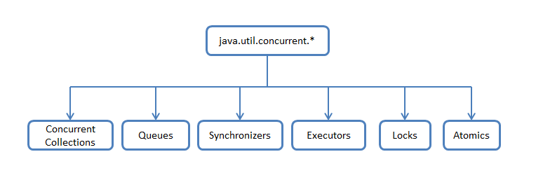

== JAVA.UTIL.CONCURRENT
links: link:https://habr.com/ru/company/luxoft/blog/157273/[habr1], link:https://www.baeldung.com/java-util-concurrent[baeldung]

- Intro
- Executor Services
- Collections
- Locks ()

=== Intro

В пакете _java.util.concurrent_ можно поделить классы и интерфейсы по функциональному признаку, а затем пробежаться по реализации конкретных частей:

1. *_Concurrent Collections_* — гораздо лучше работают в многопоточной среде нежели стандартные коллекции. Вместо базового враппера _Collections.synchronizedList_ с блокированием доступа ко всей коллекции используются *_блокировки_* по сегментам данных или же используется *_неблокирующая синхронизация_* (wait-free algorithms).
2. *_Queues_* — *_неблокирующие_* и *_блокирующие очереди_* с поддержкой многопоточности. _Неблокирующие_ очереди заточены на скорость и работу без блокирования потоков. _Блокирующие_ очереди используются, когда нужно "притормозить" потоки "_Producer_" или "_Consumer_", если не выполнены какие-либо условия, например, очередь пуста или переполнена, или же нет свободного "_Consumer'a_".
3. *_Synchronizers_* — вспомогательные утилиты для *_синхронизации_* потоков.
4. *_Executors_* — содержит фрейморки для создания *_пулов потоков_*, планирования работы *_асинхронных_* задач с получением результатов.
5. *_Locks_* — представляет собой альтернативные и более гибкие механизмы *_синхронизации потоков_* по сравнению с базовыми _synchronized_, _wait()_, _notify()_, _notifyAll()_.
6. *_Atomics_* — классы с поддержкой атомарных операций над примитивами и ссылками (link:https://itsobes.ru/JavaSobes/kak-ustroeny-atomiki/[itsobes]).

=== Executor Services, Future

*_Executor_* - _интерфейс_ для классов, реализующих запуск Runnable задач. Executor does not require the task execution to be asynchronous. The simplest of all is the executable interface. To create an executer instance, we need to create an invoker and invoke task via it: +
*_See_* _sn9_concurrent/Invoker.java_

*_ExecutorService_* - интерфейс, который описывает сервис для запуска Runnable или Callable задач. Методы *_submit()_* на вход принимают задачу в виде _Callable_ или _Runnable_, а в качестве возвращаемого значения идет *_Future_*, через который можно получить результат. +
Метод *_invokeAll()_* блокируют основной поток до завершения всех задач в переданном списке или до истечения заданного таймаута. Метод *_invokeAny()_* блокируют вызывающий поток до завершения любой из переданных задач. +
После вызова метода *_shutdown()_*, данный сервис больше не будет принимать задачи, кидая RejectedExecutionException при попытке закинуть задачу в сервис. +
*_See_* _sn9_concurrent/ExecutorServiceExample.java_

*_ScheduledExecutorService_* — В дополнении к методам ExecutorService, данный интерфейс добавляет возможность запускать отложенные задачи. +
*_See_* _sn9_concurrent/ScheduledExecutorServiceExample.java_

*_Future_* - интерфейс для получения результатов работы асинхронной операции. Ключевым методом здесь является метод *_get_*, который блокирует текущий поток (с таймаутом или без) до завершения работы асинхронной операции в другом потоке. Также, дополнительно существуют методы для отмены операции и проверки текущего статуса. В качестве имплементации часто используется класс *_FutureTask_*.

=== Collections

*_ConcurrentHashMap_* - Карта делится на N различных *_сегментов_* (16 по умолчанию, максимальное значение представляет собой степень двойки). Каждый сегмент представляет собой потокобезопасную таблицу элементов карты. Между хэш-кодами ключей и соответствующими им сегментами устанавливается зависимость на основе применения к старшим разрядам хэш-кода битовой маски. *_See_* link:https://habr.com/ru/post/132884/[habr]

*_PriorityBlockingQueue_* - многопоточной оберткой над PriorityQueue.

*_ArrayBlockingQueue_* - Класс блокирующей очереди, построенный на классическом кольцевом буфере. Помимо размера очереди, доступна возможность управлять «честностью» блокировок. Если fair=false (по умолчанию), то очередность работы потоков не гарантируется. Более подробно о «честности» можно посмотреть в описании ReentrantLock'a.

*_LinkedBlockingQueue_* — Блокирующая очередь на связанных нодах, реализованная на «two lock queue» алгоритме: один лок на добавление, другой на вытаскивание элемента. За счет двух локов, по сравнению с ArrayBlockingQueue, данный класс показывает более высокую производительность, но и расход памяти у него выше. Размер очереди задается через конструктор и по умолчанию равен Integer.MAX_VALUE.

=== Locks

*_ReentrantLock_* — Лок на вхождение. Только один поток может зайти в защищенный блок. Класс поддерживает «честную» (fair) и «нечестную» (non-fair) разблокировку потоков. При «честной» разблокировке соблюдается порядок освобождения потоков, вызывающих lock(). При «нечестной» разблокировке порядок освобождения потоков не гарантируется, но, как бонус, такая разблокировка работает быстрее. По умолчанию, используется «нечестная» разблокировка.

