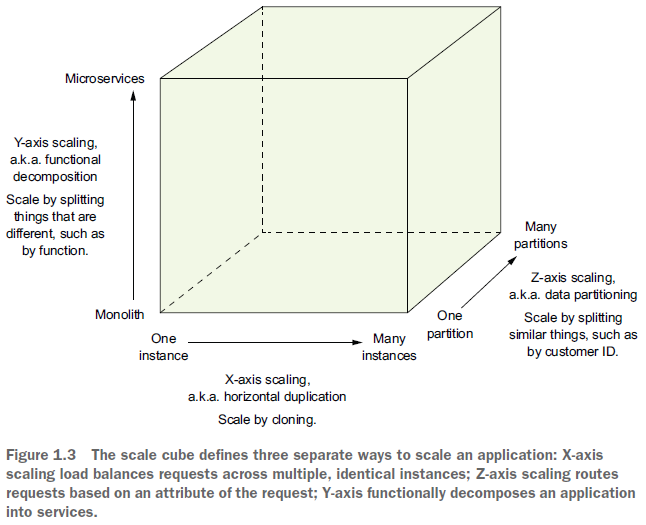

== Микросервисы вместо монолита

*Content:*

- 1. Микросервисы и scale cube. Определение микросервиса
- 2. Микросервисы как форма модульности
- 3. Каждый микросервис имет свою базу данных
- 4. Microservices VS SOA
- 5. Преимущества микросервисной архитектуры
  * 5.1 Continuous delivery and deployment of large, complex applications
  * 5.2 Сервисы небольшие и легко обслуживаемые
  * 5.3 Сервисы масштабируются независимо
  * 5.4 Архитектура микросервисов позволяет командам быть автономными
  * 5.5 Архитектура микросервисов позволяет легко экспериментировать и внедрять новые технологии
  * 5.6 Хорошая fault isolation (изоляция неисправностей)
- 6. Недостатки микросервисной архитектуры
  * 6.1 Спроектировать правильный set of services сложно
  * 6.2 Распределенные системы сложны
  * 6.3 Развертывание функций, охватывающих несколько сервисов, требует тщательной координации
  * 6.4 Трудно решить, когда переходить на микросервисную архитектуру

=== 1. Микросервисы и scale cube. Определение микросервиса

Микросервисы предполагают _функциональную декомпозицию_, когда некоторый продукт представляет собой набор сервисов. Важно, чтобы у каждой службы был свой связный и сфокусированный набор обязанностей. Разделение также может происходить по бизнес-домену и пр.

Ещё есть принцип двух пицц - над каждым микросервисом может работать команда, которую можно накормить "двумя пиццами" - 3-4 человека.

На рисунке представлено три подхода к application scale - по функциональным признакам (microservices), horizontal scaling (больше инстансов приложения - к слову, даже монолитного) и data partitioning (разделение по данным):

Зачастую микросервисная архитектура приводит к возможности развертывания нескольких инстансов того или иного сервиса, но это не обязательно - так как нужно реализовывать синхронизацию и/или блокировки в базе, etc.

=== 2. Микросервисы как форма модульности

Модульность необходима при разработке больших и сложных приложений. Приложения должны быть разложены на модули, которые разрабатываются и понимаются разными людьми.

Архитектура микросервисов использует сервисы как единицу модульности. У сервиса есть API, которое сложно нарушить. Мы не можем обойти API и получить доступ к внутреннему классу как в монолите. Другие преимущества использования сервисов как модулей - возможность их независимо деплоить и скейлить

=== 3. Каждый микросервис имет свою базу данных

Очевидно :)

=== 4. Microservices VS SOA

[cols="1,8,8"]
|===
|
|SOA
|Microservices

|Inter-service
communication
|_Smart pipes_, such as *_Enterprise Service
Bus_*, using heavyweight protocols,
such as *_SOAP_* and the other *_WebSocket_*
standards.
|_Dumb pipes_, such as a *_message
broker_*, or direct service-to-service
communication, using lightweight
protocols such as *_REST_* or *_gRPC_*

|Data
|Глобальная модель данных и общие базы данных
|Модель данных и база данных отдельная для каждого сервиса

|Typical block (service)
|Крупное монолитное приложение
|небольшой сервис
|===

Приложения SOA обычно используют тяжелые технологии, такие как _SOAP_ и другие стандарты _WebSocket_. Они часто используют _ESB_ - канал, который содержит бизнес-логику и логику обработки сообщений для интеграции сервисов. Микросервисы, как правило, используют брокеры сообщений или _lightweight_ протоколы, такие как _REST_ или _gRPC_.

Приложения SOA обычно имеют глобальную модель данных и совместно используют базы данных.

Еще одно ключевое различие между SOA и микросервисной архитектурой — размер сервисов. SOA обычно используется для интеграции больших, сложных, монолитных приложений. В результате приложение SOA обычно состоит из нескольких крупных сервисов, тогда как приложение на основе микросервисов обычно состоит из десятков или сотен более мелких сервисов.

=== 5. Преимущества микросервисной архитектуры

- Continuous delivery and deployment of large, complex applications
- Сервисы небольшие и легко обслуживаемые, они могут деплоиться независимо
- Сервисы масштабируются независимо
- Архитектура микросервисов позволяет командам быть автономными
- Архитектура микросервисов позволяет легко экспериментировать и внедрять новые технологии
- Хорошая fault isolation (изоляция неисправностей)

=== 5.1 Continuous delivery and deployment of large, complex applications

Наиболее важным преимуществом микросервисной архитектуры является то, что она обеспечивает непрерывную доставку и развертывание больших и сложных приложений. Это

- 1. Улучшает тестируемость приложения. Юнит-тесты проще писать и быстрее выполнять
- 2. Каждый сервис можно развернуть независимо, на _dev_ окружении очень просто поменять _image_. Можно часто вносить изменения в _production_.
- 3. Каждая команда несет ответственность за разработку и развертывание одной или нескольких сервисов. Каждая команда может разрабатывать, развертывать и масштабировать свои сервисы независимо от всех остальных команд. В результате скорость разработки намного выше.

=== 5.2 Сервисы небольшие и легко обслуживаемые

Каждый сервис относительно мал. Код легче понять разработчику. Небольшая кодовая база не замедляет работу IDE. Каждый сервис обычно запускается намного быстрее, чем большой монолит, что также делает разработчиков более продуктивными и ускоряет развертывание.

=== 5.3 Сервисы масштабируются независимо

Каждый сервис можно масштабировать независимо от других (replicas). Каждому сервису можно прописать индивидуальные `resources.limits`, `resources.requests` по `memory/cpu` - см link:https://github.com/KonstantinovD/kuber-learning/blob/master/docs/sn05-Resources.adoc[KonstantinovD/sn05-Resources.adoc].

=== 5.4 Архитектура микросервисов позволяет командам быть автономными

То же, что и 5.1, 5.2.

=== 5.5 Архитектура микросервисов позволяет легко экспериментировать и внедрять новые технологии

Микросервисная архитектура устраняет любые долгосрочные обязательства перед стеком технологий. При разработке нового сервиса можно выбрать выбирать любой язык и фреймворк, которые лучше всего подходят для этого сервиса.

Поскольку сервисы небольшие, их переписывание с использованием лучших языков и технологий становится практичным. Если пробная версия новой технологии не удалась, вы можете отказаться от этой работы, не рискуя всем проектом. Это сильно отличается от использования монолитной архитектуры, где ваш первоначальный выбор технологии серьезно ограничивает вашу способность использовать другие языки и платформы в будущем.

=== 5.6 Хорошая fault isolation (изоляция неисправностей)

Микросервисная архитектура лучше изолирует ошибки. Например, утечка памяти в одной службе влияет только на эту службу. Другие службы будут продолжать обрабатывать запросы в обычном режиме. Для сравнения, один неправильно работающий компонент монолитной архитектуры может разрушить работу всей системы.

=== 6. Недостатки микросервисной архитектуры

Микросервисная архитектура также имеет ряд существенных недостатков и проблем. Далее мы будем рассматривать, как их устранить. Вот список основных недостатков:

- Найти правильный набор сервисов сложно
- Распределенные системы сложны, что затрудняет разработку, тестирование и развертывание
- Развертывание функций, охватывающих несколько сервисов, требует тщательной координации
- Трудно решить, когда переходить на микросервисную архитектуру

=== 6.1 Спроектировать правильный set of services сложно

Не существует конкретного, четко определенного алгоритма для разбиения системы на сервисы. Это что-то вроде искусства. Что еще хуже, при неправильном разбиении системы может получиться _anti-pattern **"распределенный монолит"**_, состоящий из связанных сервисов, которые должны разворачиваться вместе. _Распределенный монолит_ обладает недостатками как монолитной, так и микросервисной архитектур.

=== 6.2 Распределенные системы сложны

Сервисы должны обрабатывать недоступность другого сервиса, использовать механизм межпроцессного взаимодействия (разные процессы, очередь сообщений, общая БД для реплик и т. д.). Каждая служба имеет свою собственную базу данных, что затрудняет реализацию транзакций и запросов, охватывающих службы. Как описано в главе 4, микросервисное приложение должно использовать *_Saga pattern_* для обеспечения согласованности данных между службами.

IDE и другие инструменты разработки ориентированы на создание монолитных приложений и не предоставляют явной поддержки для разработки распределенных приложений. Написание интеграционных тестов также является сложной задачей. Для успешного развертывания микросервисов необходим высокий уровень автоматизации - CI/CD (continuous integration/delivery).

=== 6.3 Развертывание функций, охватывающих несколько сервисов, требует тщательной координации

Вы должны создать план развертывания, который упорядочивает deploying сервисов на основе зависимостей между ними. Это сильно отличается от монолитной архитектуры, где вы можете атомарно обновить несколько компонент - они все в одном приложении.

=== 6.4 Трудно решить, когда переходить на микросервисную архитектуру

Обычно все начинают с монолита (особенно стартапы или во время прототипирования, когда еще не понятен вектор развития приложения). Когда же приходит время переходить на микросервисную архитектуру, рефакторинг может быть затруднен запутанными зависимостями и размытыми бизнес-доменами.