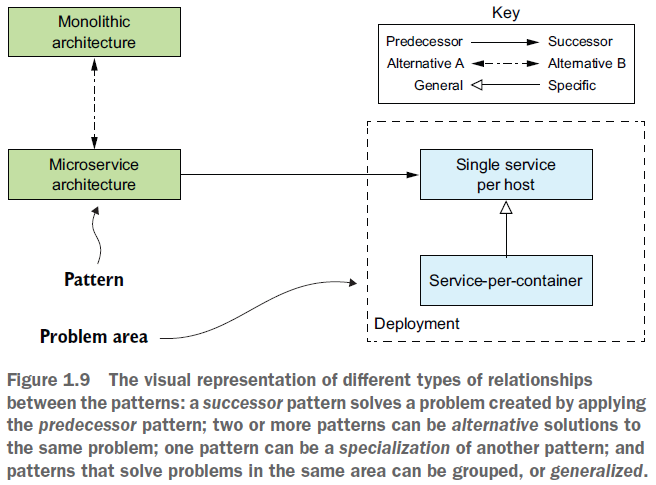
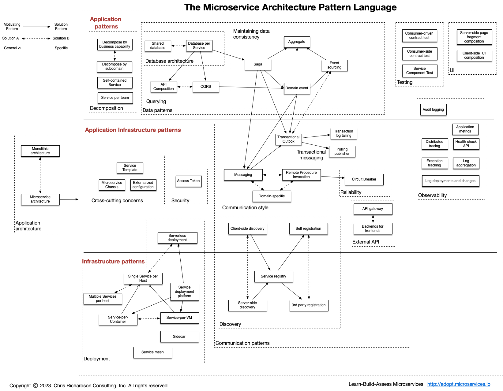

== The Microservice architecture pattern language

*Content:*

- 1. Definition of the "Microservice architecture pattern language"
- 2. Обзор паттернов "Microservice architecture pattern language"

=== 1. Definition of the "Microservice architecture pattern language"

В книге предлагается язык паттернов для микросервисной архитектуры. Давайте рассмотрим виды _relations_, которые будут применяться на схемах. Мы рассматриваем _relations_ между различными паттернами. Существует пять типов отношений между паттернами:

- *_Predecessor_* —  _Предшественник_ — это паттерн, который обосновывает потребность в текущем паттерн. Например, паттерн микросервисной архитектуры является предшественником всех остальных паттернов (chain of responsibility, Strategy, etc.), за исключением паттерна монолитной архитектуры.
- *_Successor_* —  _Преемник_ — паттерн, решающий проблему, возникшую в результате текущего паттерна. Например, применяя паттерн микросервисной архитектуры, мы затем применяем многочисленные паттерны-преемники, включая _**Service discovery** pattern_ и _**Circuit breaker** pattern_.
- *_Alternative_* —  _Альтернатива_ — паттерн, предлагающий альтернативное решение проблемы, решаемой текущим паттерном. Например, паттерн _Монолит_ и паттерн _Микросервисы_ являются альтернативами друг для друга.
- *_Generalization_* — _Обобщение_ — шаблон, являющийся общим решением проблемы. Обычно у обобщения есть несколько различных реализаций. Пример обобщения с различными реализациями - _**Single service per host** pattern_.
- *_Specialization_* — _Специализация_ — Специальная форма или паттерн-имплементация некоторого паттерна. Например, шаблон *_Deploy a service as a container_* это специализация паттерна
*_Single service per host_*.

Кроме того, мы можем группировать паттерны, решающие проблемы в конкретной проблемной области. Подробное описание связанных паттернов дает ценное руководство по эффективному решению конкретной проблемы. Рассмотрим пример визуализации отношений между паттернами:

Паттерны в _pattern language_ работают вместе для решения проблем в конкретной области. В частности, здесь расматривается *_Microservice
architecture pattern language_*. Это набор взаимосвязанных программных архитектур и паттернов проектирования для микросервисов. Давайте посмотрим на этот язык паттернов.

=== 2. Обзор паттернов "Microservice architecture pattern language"

_Язык шаблонов архитектуры микросервисов_ — это набор паттернов, которые помогут вам спроектировать приложение с использованием архитектуры микросервисов. Он описывает монолитную архитектуру и микросервисную архитектуру, а также их преимущества и недостатки. Затем, если микросервисная архитектура хорошо подходит для вашего приложения, язык паттернов поможет вам эффективно использовать ее, решая различные проблемы архитектуры и дизайна. На рисунке показана highlevel-структура языка шаблонов, взятая с link:https://microservices.io/patterns/index.html[]:

Язык паттернов состоит из нескольких групп паттернов. Они являются _преемниками_ группы паттернов архитектуры приложений - паттерна _Монолит_ и паттерна _Микросервисы_. Группы паттернов являются решениями проблем, возникающих при использовании паттерна _Микросервисы_.

Паттерны также разделены на три слоя:

- 1) *_Infrastructure patterns_* — решают проблемы, которые относятся к инфраструктуре, не относящейся к разработке.
- 2) *_Application infrastructure patterns_* — для проблем с инфраструктурой приложения, которые в том числе влияют на разработку (devops).
- *_Application patterns_* — решают проблемы разработки.

Также смотри данную схему на link:https://microservices.io/patterns/index.html[microservices.io].
