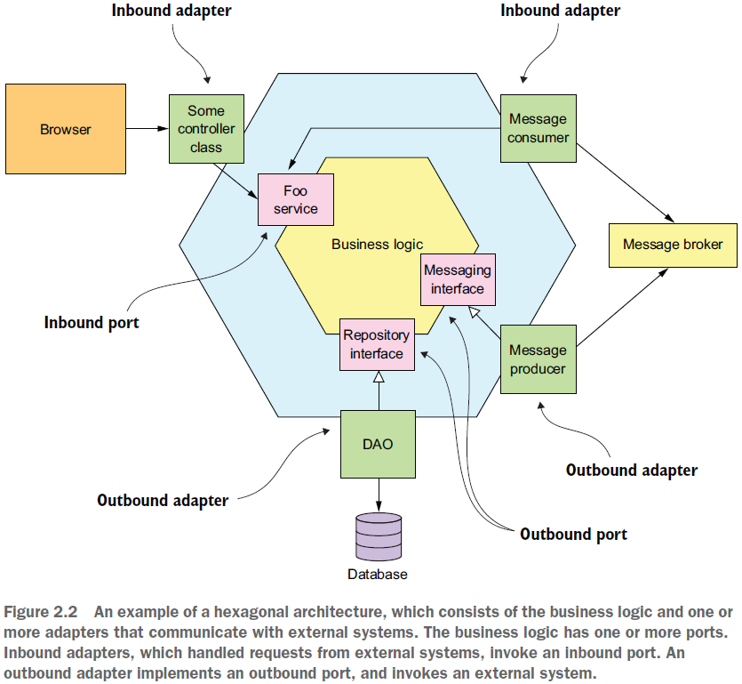

== Что такое "Сервис"

*Content:*

- 1. Service как автономный компонент с API
- 2. Loose coupling (слабое соединение)
- 3. Shared libraries
- 4. Размер сервиса не имеет значения

=== 1. Service как автономный компонент с API

Сервис - это автономный, независимо развертываемый программный компонент, который реализует определенную функциональность. Сервис имеет API, который предоставляет доступ к его функциям. Существует два типа операций: _commands_ и _queries_. API состоит из:

- *_commands_* - например, _createOrder()_, - производят какие-то действия и/или изменяют данные
- *_queries_* - например, _findOrderById()_, - получают данные
- *_events_* - публикация _events_, которые кем-то потребляются

API сервиса инкапсулирует его внутреннюю реализацию. В отличие от монолита, разработчик не может написать код, который обходит его API. В результате микросервисная архитектура обеспечивает модульность приложения.

Типичный сервис имеет link:https://microservices.io/post/microservices/general/2019/02/16/whats-a-service-part-1.html[hexagonal]-архитектуру (шестиугольную архитектуру). Его API реализуется _адаптерами_, которые взаимодействуют с бизнес-логикой сервиса. _Адаптер операций_ вызывает бизнес-логику, а _адаптер событий_ публикует события, создаваемые бизнес-логикой. Пример hexagonal-архитектуры:

В главе 12 мы увидим, что представление о реализации сервиса может принимать различные формы. Компонент может быть автономным процессом, веб-приложением или пакетом OSGI, работающим в контейнере, или бессерверной облачной функцией. Однако важным требованием является наличие у сервиса _API_ и возможности _независимого развертывания_.

=== 2. Loose coupling (слабое соединение)

Важной характеристикой микросервисной архитектуры является то, что сервисы слабо связаны. Все взаимодействие с сервисом происходит через его API, который инкапсулирует детали реализации. Это позволяет изменять реализацию службы, не затрагивая клиентов-потребителей API. Слабосвязанные сервисы удобны в сопровождении и в тестировании.

Требование, чтобы службы были слабо связаны и взаимодействовали только через API, запрещает взаимодействие сервисов через базу данных. Сохранение конфиденциальности данных позволяет разработчику изменять схему базы данных своего сервиса, не тратя время на координацию с разработчиками, работающими над другими сервисами. Отсутствие общего доступа к таблицам базы данных также улучшает изоляцию во время выполнения. Это гарантирует, например, что если один сервис удерживает блокировку таблицы или базы данных, он не блокирует другой сервис.

=== 3. Shared libraries

Если мы делаем какую-нибудь _common-lib_ для сервисов, надо убедиться, что через нее мы случайно не создадим сложную связь между сервисами. Вы должны стремиться использовать библиотеки для функциональности, которая вряд ли изменится. Например, в типичном приложении для каждой службы нет смысла реализовывать общий класс _Billing_.

=== 4. Размер сервиса не имеет значения

Одна из проблем термина "микросервис" заключается в том, что, судя по названию, сервис должен быть очень маленьким. На самом деле размер не является useful metric.

Лучше определить хорошо спроектированный _service_ как service, который может разработать и поддерживать небольшая команда с минимальными затратами времени и с минимальным сотрудничеством с другими командами (2-pizza team, 5-6 человек). Теоретически команда может отвечать только за один service, так что этот service ни в коем случае не является микро. И наоборот, если для службы требуется большая команда или ее тестирование занимает много времени, вероятно, имеет смысл разделить команду и service на части. Или если вам постоянно нужно менять службу из-за изменений в других службах или если это вызывает изменения в других службах, это признак что он не слабо связан. Возможно, вы даже построили распределенный монолит.

Архитектура микросервисов структурирует приложение как набор небольших слабо связанных сервисов. В результате это улучшает атрибуты времени разработки — ремонтопригодность, тестируемость, возможность развертывания и т. д. — и позволяет организации быстрее разрабатывать более качественное программное обеспечение.
