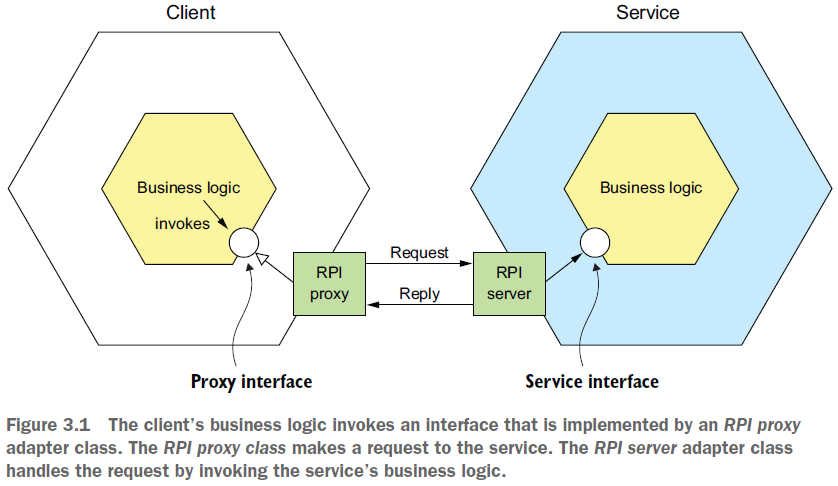
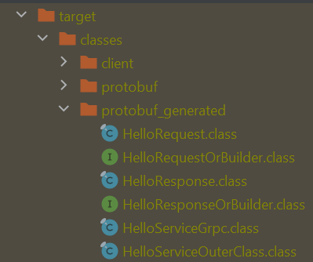

== Коммуникация через синхронный Remote Procedure Call паттерн. REST. gRPC и Protobuf

*Source code:*

- link:../../protobuf-learning/[protobuf-learning] (5)

*Content:*

* 1. Remote Procedure Call паттерн
* 2. REST
* 3. Определение REST API
** 3.1 Проблема получения разных объектов в одном запросе
** 3.2 Проблема отображения операций в HTTP-verbs
* 4. REST - преимущества и недостатки
* 5. Использование gPRC (Google Remote Procedure Call) framework

=== 1. Remote Procedure Call паттерн

Как работает RPI? Бизнес-логика клиента вызывает _proxy-interface_, реализованный классом _прокси-адаптера RPI_. _RPI proxy_ отправляет запрос _service_. Запрос обрабатывается адаптером _RPI server_, который вызывает бизнес-логику сервиса через _service interface_. Затем он отправляет ответ _RPI proxy_, который отправляет результат бизнес-логике клиента:

_Proxy-interface_ обычно инкапсулирует базовый communication protocol. Существует множество протоколов комменикации, например - REST и gRPC.

=== 2. REST

Ключевым понятием в REST является *_ресурс_*, который обычно представляет собой один бизнес-объект (или массив бизнес-объектов), такой как _Customer_ или _Product_. REST использует HTTP-verbs для управления ресурсами, на которые ссылаются с помощью URL-адреса. Например, GET возвращает представление ресурсав формате XML-документа или объекта JSON (или двоичный формат и пр.). Запрос POST создает новый ресурс, а запрос PUT обновляет ресурс.

Многие разработчики утверждают, что их API-интерфейсы на основе HTTP являются _RESTful_. Но модель уровней REST несколько сложнее:

- Уровень 0 — клиенты вызывают сервис, отправляя HTTP POST-запросы к ее _единственному_ эндпоинту. В каждом запросе указывается _action to perform_, _target of the action_ (например, бизнес-объект) и любые параметры.
- Уровень 1 — сервис уровня 1 поддерживает ресурсы - свой урл для каждого ресурса. Чтобы выполнить действие над ресурсом, клиент делает POST-запрос, в котором указывается действие, которое необходимо выполнить, и любые параметры.
- Уровень 2 — сервис использует HTTP-verbs для выполнения действий: GET/POST/PUT. В query parameters и body, если они есть, указываются _actions_ параметры.
- Уровень 3 — сервис основан на принципе _HATEOAS_ (Hypertext As The Engine Of Application State). Основная идея заключается в том, что ресурс, возвращаемый GET-запросом, содержит ссылки для выполнения действий над этим ресурсом. Например, клиент может отменить заказ, используя ссылку. Преимущества HATEOAS заключаются в том, что больше не нужно жестко привязывать URL-адреса к клиентскому коду (link:http://infoq.com/news/2009/04/hateoas-restful-api-advantages[hateoas-restful-api-advantages]).

=== 3. Определение REST API

Мы определяем API, используя язык определения интерфейса (IDL). Наиболее популярным REST IDL является Спецификация Open API, которая возникла на основе проекта с открытым исходным кодом Swagger.

=== 3.1 Проблема получения разных объектов в одном запросе

Обычно REST возвращает ресурс бизнес-объекта. Проблема следующая - как извлечь несколько связанных объектов в одном запросе, если нет отношения аггрегации? Например, представьте, что клиент REST хочет получить _Order_ и _Order Consumer_. Потребуется несколько циклов передачи данных (как минимум два запроса). Это привело к росту популярности альтернативных технологий API, таких как link:http://graphql.org[GraphQL] и link:http://netflix.github.io/falcor/[Netflix Falcor], которые предназначены для поддержки эффективной выборки данных.

=== 3.2 Проблема отображения операций в HTTP-verbs

Еще одна распространенная проблема проектирования REST API заключается в том, как сопоставить операции, которые вы хотите выполнять с бизнес-объектом, с HTTP-verbs. REST API может использовать PUT для обновлений, но может быть несколько способов обновить заказ, включая его отмену, пересмотр заказа и т. д. Одним из решений является определение url-подресурса. Служба заказов, например, имеет эндпоинт `/orders/{orderId}/cancel` для отмены заказов и эндпоинт `/orders/{orderId}/revise` для проверки заказов. К сожалению, данное решение не является _RESTful_.

=== 4. REST - преимущества и недостатки

Использование REST имеет множество преимуществ:

- Это просто.
- Легко тестировать через _Postman_ или _curl_.
- Поддерживает request/response style communication.
- HTTP совместим с брандмауэрами.
- Не требует промежуточного брокера, что упрощает архитектуру системы.

А также определенные недостатки:

- Поддерживает *_только_* request/response style communication.
- Reduced availability. Клиент и сервис взаимодействуют напрямую без посредника - они должны быть доступны на протяжении всего обмена.
- Клиенты должны знать расположение (URL) экземпляров сервиса. Это нетривиальная проблема в современном приложении, для решения которой используется механизм _service discovery_ для обнаружения экземпляров сервиса.
- Получение нескольких ресурсов в одном запросе является сложной задачей.
- Иногда сложно сопоставить несколько операций обновления с HTTP-verbs.

REST является стандартом де-факто для API, хотя есть пара интересных альтернатив. _GraphQL_, например, реализует гибкую и эффективную выборку данных. В главе 8 обсуждается GraphQL и рассматривается шаблон шлюза API. _gRPC_ — еще одна альтернатива REST.

=== 5. Использование gPRC (Google Remote Procedure Call) framework

Поскольку HTTP предоставляет только ограниченное количество HTTP-verbs, не всегда просто разработать REST API, поддерживающий несколько операций обновления. Технология IPC, позволяющая избежать этой проблемы, — это *_gRPC_*, фреймворк для написания многоязычных клиентов и серверов. Клиент и сервер обмениваются двоичными сообщениями в формате _Protocol Buffers_ с использованием _HTTP/2_. Вы определяете API-интерфейсы gRPC с помощью Protocol Buffers-based IDL, который представляет собой механизм Google для сериализации структурированных данных. Вы используете компилятор Protocol Buffer для создания client-side stubs и server-side skeletons.

Для _gRPC_ используется протокол `HTTP/2`. В отличие от `HTTP/1.1`, в котором все запросы и ответы хранятся в текстовом формате, `HTTP/2` использует уровень двоичного фрейма для инкапсуляции всех сообщений в двоичном формате, сохраняя при этом семантику HTTP - methods и headers. пакеты запросов и ответов разбиваются на кадры и могут обрабатываться параллельно, что значительно повышает гибкость передачи данных. HTTP/2 поддерживает мультиплексирование. Подробнее см link:https://novikov.ua/http-1-1-%D0%BF%D1%80%D0%BE%D1%82%D0%B8%D0%B2-http-2-%D0%B2-%D1%87%D0%B5%D0%BC-%D1%80%D0%B0%D0%B7%D0%BD%D0%B8%D1%86%D0%B0/#:~:text=%D0%92%20%D0%BE%D1%82%D0%BB%D0%B8%D1%87%D0%B8%D0%B5%20%D0%BE%D1%82%20HTTP%20%2F%201.1,%D0%BA%D0%B0%D0%BA%20%D0%B3%D0%BB%D0%B0%D0%B3%D0%BE%D0%BB%D1%8B%2C%20%D0%BC%D0%B5%D1%82%D0%BE%D0%B4%D1%8B%20%D0%B8%20%D0%B7%D0%B0%D0%B3%D0%BE%D0%BB%D0%BE%D0%B2%D0%BA%D0%B8.[тут] и link:https://www.8host.com/blog/v-chem-raznica-mezhdu-http1-1-i-http2/[тут].

API gRPC состоит из одной или нескольких служб и определений сообщений запроса/ответа. Определение службы аналогично интерфейсу Java и представляет собой набор строго типизированных методов. Помимо поддержки простого запроса/ответа RPC, gRPC поддерживает потоковую передачу RPC. Сервер может ответить клиенту потоком сообщений. В качестве альтернативы клиент может отправить поток сообщений на сервер.

gRPC использует протокольные буферы в качестве формата сообщения. Protocol Buffers — это, как упоминалось ранее, эффективный компактный двоичный формат. Это тегированный формат. Каждое поле сообщения Protocol Buffers пронумеровано и имеет код типа. Получатель сообщения может извлечь поля, которые ему нужны, и пропустить поля, которые он не распознает. В результате gRPC позволяет API развиваться, сохраняя при этом обратную совместимость. Пример API gRPC, описанный в protobuf-файле - link:../../protobuf-learning/src/main/resources/protobuf/HelloService.proto[HelloService.proto]:

[source, protobuf]
----
// какой синтаксис использует этот protobuf-файл
syntax = "proto3";
// По умолчанию компилятор создает весь код Java в одном файле Java.
// Поэтому мы переопределяем параметр 'java_multiple_files',
// то есть все будет создано в отдельных файлах.
option java_multiple_files = true;
// package where generated java files will be placed
package protobuf_generated;

message HelloRequest {
  string firstName = 1;
  string lastName = 2;
}

message HelloResponse {
  string greeting = 1;
}

service HelloService {
  rpc hello(HelloRequest) returns (HelloResponse);
}
----

_HelloRequest_ и _HelloResponse_ являются типизированными сообщениями. Например, сообщение _HelloRequest_ имеет поле _firstName_ типа _string_. Значение тега поля равно 1.

При запуске gRPC через maven-compiler (link:../../protobuf-learning/pom.xml[protobuf-learning/pom.xml]) будут генерироваться файлы _skeleton_ и _stub_:

Работа по обмену сообщениями возлагается на client - link:../../protobuf-learning/src/main/java/client/GrpcClient.java[GrpcClient.java] и на server - link:../../protobuf-learning/src/main/java/server/GrpcServer.java[GrpcServer.java] и link:../../protobuf-learning/src/main/java/server/HelloServiceImpl.java[HelloServiceImpl.java].

Запустим GrpcServer и после него - GrpcClient:

- логи GrpcClient:
----
Sending to server: firstName: "Baeldung"
lastName: "gRPC"

Response received from server:
greeting: "Hello, Baeldung gRPC"
----

- логи GrpcServer:
----
Request received from client:
firstName: "Baeldung"
lastName: "gRPC"
----

gRPC имеет несколько преимуществ:

- Разработать API с широким набором операций обновления несложно.
- Имеет эффективный и компактный механизм IPC, особенно при обмене большими сообщениями.
- Bidirectional streaming enables both RPI and messaging styles of communication.
- Он обеспечивает взаимодействие между клиентами и службами, написанными на самых разных языках.

gRPC также имеет несколько недостатков:

- Клиентам _JavaScript_ требуется больше усилий для использования API на основе gRPC, чем API на основе REST/JSON.
- Старые брандмауэры могут не поддерживать HTTP/2.
