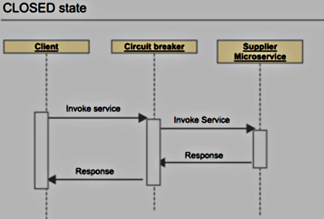
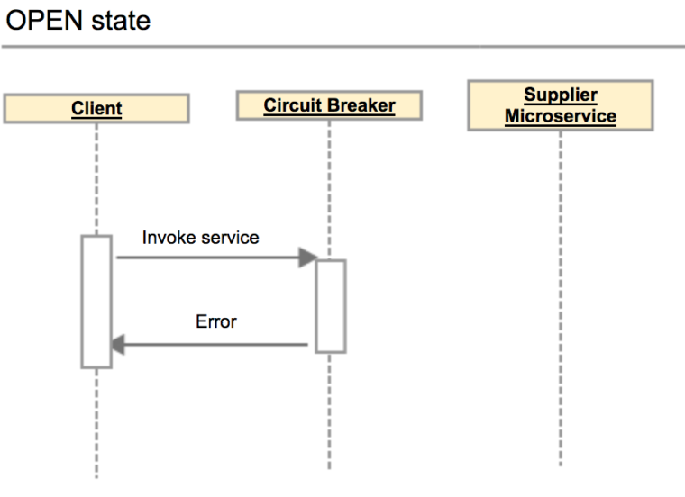
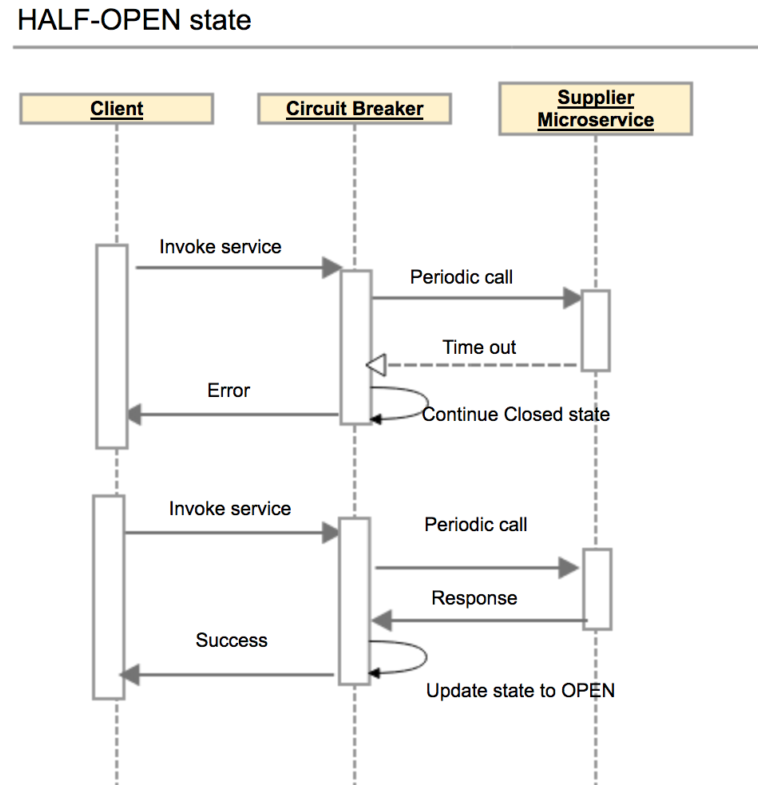
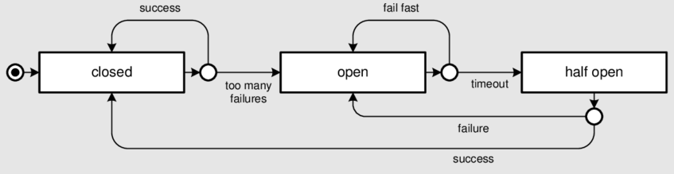
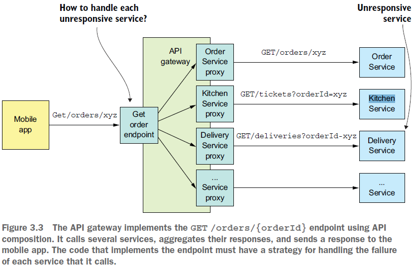

== Circuit breaker pattern. Api gw + api composition in case services not respond

*Content:*

- 1. Circuit breaker pattern
- 2. Автоматический circuit breaker - состояния
- 3. Circuit breaker и Spring boot
- 4. API-gateway - обработка ответа недоступного сервиса при API composition pattern

=== 1. Circuit breaker pattern

REST и gRPC - это механизмы синхронной связи, поэтому они страдают от проблемы _partial failure (частичного сбоя)_. Давайте разберемся, что это такое и как с этим бороться.

В распределенной системе всякий раз, когда сервис выполняет синхронный запрос к другому сервису, постоянно присутствует риск _частичного сбоя_. Сервис может быть не в состоянии своевременно ответить на запрос клиента, т. к. отключен из-за сбоя/технического обслуживания либо просто перегружен и отвечает на запросы очень долго. Поскольку клиент заблокирован в ожидании ответа, существует опасность того, что _partial failure_ может распространиться на клиентов клиента и т. д. и вызвать сбой системы.

Для этого можно использовать *_circuit breaker pattern_*. Это _RPI-прокси_, который немедленно отклоняет вызовы на время TIMEOUT - время ожидания - после того, как количество последовательных сбоев превышает указанный порог. См также:

- link:http://microservices.io/patterns/reliability/circuit-breaker.html[circuit-breaker-pattern],
- link:https://techblog.constantcontact.com/software-development/circuit-breakers-and-microservices/[circuit-breakers-and-microservices],
- link:https://martinfowler.com/bliki/CircuitBreaker.html[CircuitBreaker.html].

_**Circuit breaker** (прерыватель цепи)_ позволяет создать отказоустойчивую систему, которая может корректно работать, когда сервисы либо недоступны, либо имеют большую задержку.

=== 2. Автоматический circuit breaker - состояния

Автоматический _circuit breaker_ имеет 3 различных состояния:

- *_Closed_* – когда все нормально, автоматический _circuit breaker_ остается в замкнутом состоянии, и все вызовы проходят через службы. Когда количество сбоев превышает заданный порог, _circuit breaker_ срабатывает и переходит в состояние *_Open_*.
 +
- *_Open_* – _circuit breaker_ возвращает ошибку для вызовов без выполнения функции. +

- *_Half-Open_* – после времени TIMEOUT _circuit breaker_ переключается в полуоткрытое состояние, чтобы проверить, доступен ли сервис сейчас. Если сервис снова недоступен, _circuit breaker_ снова переходит в состояние *_Open_* на время TIMEOUT. В случае успеха жо он возвращается в состояние *_Closed_* и продолжает передавать запросы. +

Схема переходов _circuit breaker_ из одного состояния в другое:

=== 3. Circuit breaker и Spring boot

Для Spring Boot можно использовать реализацию прерывателя цепи из библиотеки fault tolerance (отказоустойчивости) _Netflix Hystrix_ (link:https://www.baeldung.com/spring-cloud-netflix-hystrix[spring-cloud-netflix-hystrix]) - правда она _deprecated_ в _spring-cloud-commons-3.0.1_:

[source, java]
----
@EnableCircuitBreaker
@RestController
@SpringBootApplication
public class CampaignApplication {

  @Autowired
  private TrackingService trackingService;

  @Bean
  public RestTemplate rest(RestTemplateBuilder builder) {
    return builder.build();
  }

  @RequestMapping("/to-track")
  public String toTrack() {
    return trackingService.getStats();
  }

  public static void main(String[] args) {
    SpringApplication.run(ReadingApplication.class, args);
  }
}
----
Аннотация *_@EnableCircuitBreaker_* сообщает _Spring Cloud_ о том, что приложение использует _circuit breakers_, которые позволяют отслеживать, открывать и закрывать их в зависимости от доступности службы отслеживания.

=== 4. API-gateway - обработка ответа недоступного сервиса при API composition pattern

Использование такой библиотеки, как _Hystrix_, — это только часть решения. Вы также должны решить, как ваши сервисы должны отвечать, если какой-то сервис недоступен открыт. Самый простой вариант - возвращать ошибку. В других сценариях может иметь смысл возврат резервного значения, например значения по умолчанию или кэшированного ответа.

Например, в главе 7 описывается, как _API-gateway_ может реализовать операцию запроса _findOrder()_ с помощью *_API composition pattern_*. Его реализация эндпоинта `GET /orders/{orderId}` вызывает несколько сервисов - Order Service, Kitchen Service, Delivery Service и т. д. и объединяет результаты.

Вполне вероятно, что данные каждого сервиса не одинаково важны для клиента. Данные Order Service критически необходимы и если сервис едоступен - возвращается ошибка. Данные других сервисов менее критичны. Например, клиент может отображать полезную информацию для пользователя, даже если Delivery Service был недоступен - _API-gateway_ должен либо вернуть кешированную версию данных Delivery Service, либо исключить эти данные из ответа:

