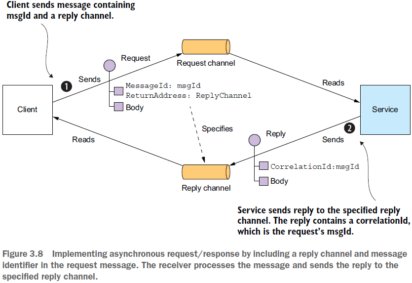
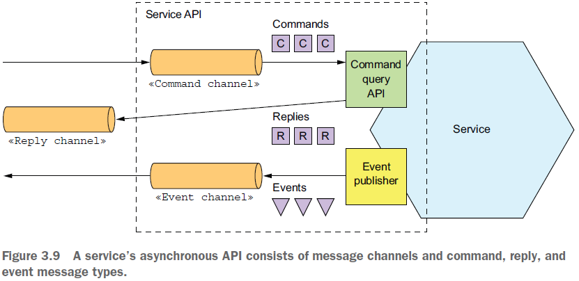
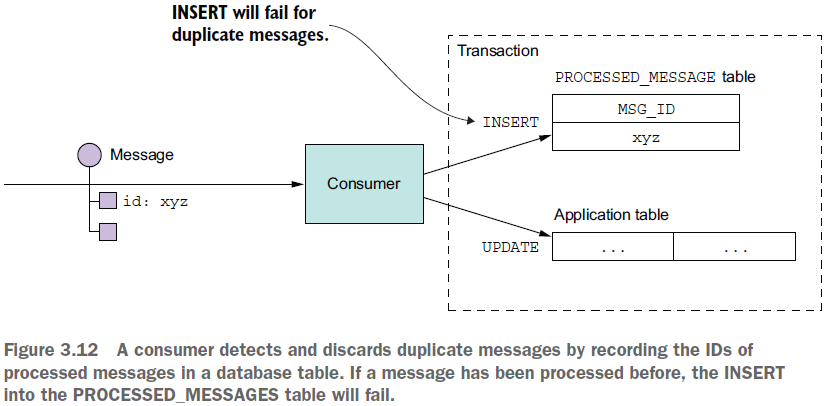
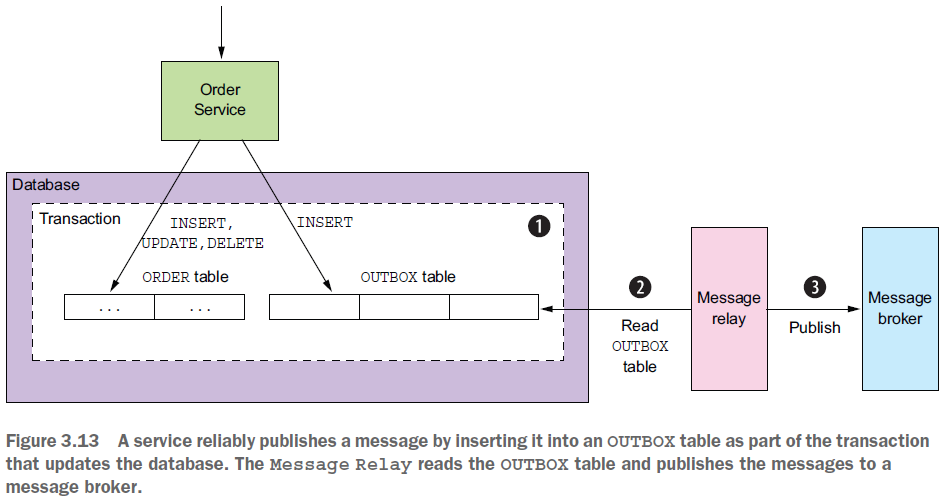
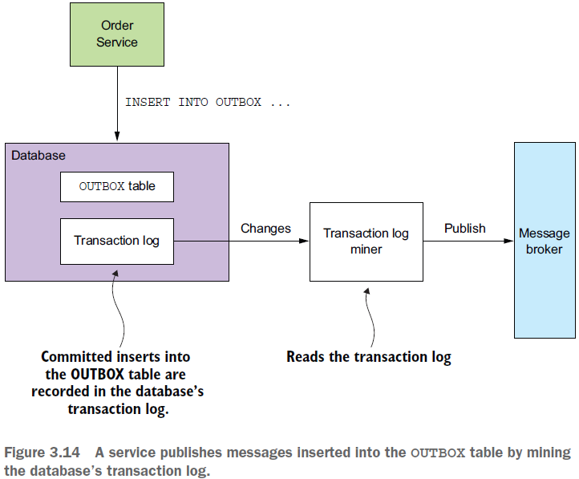
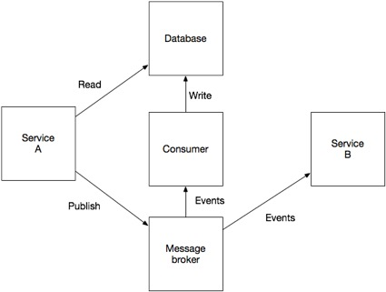

== Communicating using the Asynchronous messaging pattern

*Content:*

- 1. Messaging pattern intro
- 2. About messages
- 3. Service asynchronous API specification
- 4. Каналы сообщений
- 5. Брокеры сообщений
- 6. Проблема: Конкурирующие consumer-ы и порядок сообщений. Sharded channels
- 7. Проблема: Обработка дубликатов сообщений.
- 8. Транзакционный обмен сообщениями

=== 1. Messaging pattern intro

При использовании _Messaging pattern_ (link:http://microservices.io/patterns/communication-style/messaging.html[messaging.html]) сервисы взаимодействуют путем асинхронного обмена сообщениями. Обычно используется _брокер сообщений_, который выступает в качестве посредника между сервисами.

Другой вариант - архитектура без посредников, когда сервисы взаимодействуют друг с другом напрямую. Поскольку связь является асинхронной, клиент отправляет сервису сообщение и не не блокируется в ожидании ответа. Вместо этого клиент написан с расчетом на то, что ответ не будет получен немедленно.

Схема отправки запроса и получения ответа:

=== 2. About messages

Сообщение состоит из _headers_ и _body_. Headers могут содержать _return address_, указывающий топик, который нужно отправить ответ на данное сообщение.

Существует несколько видов сообщений:

- *_Document_* — общее сообщение, содержащее только данные. Получатель решает, как его интерпретировать. Ответ на команду является примером сообщения документа.
- *_Command_* — сообщение, эквивалентное RPC-запросу. Он определяет операцию для вызова и ее параметры.
- *_Event_* — сообщение события. Событие часто является *_domain event_*, которое представляет собой изменение состояния _domain object_, такого как Order или Customer.

*_Domain event_* - наиболее часто используется при обновлении состояния какого-нибудь бизнес-объекта.

=== 3. Service asynchronous API specification

Асинхронный API сервиса состоит из операций, вызываемых клиентами, и событий, публикуемых сервисом. Спецификация асинхронного API сервиса состоит из:

- *_message channels_* - их имён и направленностей - сервис может как отправлять _messages_ в _channel_, так и читать и оттуда.
- _**command** message types_
- _**reply** message types_
- _**event** message types_

=== 4. Каналы сообщений

Обмен сообщениями осуществляется по каналам сообщений. Существует два типа каналов: _point-point_ и _publish-subscribe_:

- Канал _point-point_ доставляет сообщение ровно одному из потребителей, который читает из канала. Службы используют каналы точка-точка для стилей взаимодействия один на один, описанных ранее. Например, _Command message_ отправляются по каналу _point-point_.
- Канал _publish-subscribe_ доставляет каждое сообщение всем подключенным потребителям. Службы используют каналы публикации-подписки для взаимодействия _one-to-many_. Например, сообщение о событии обычно отправляется по каналу публикации-подписки.

Kafka по факту предоставляет _publish-subscribe_-каналы (множество консьюмеров), но мы можем сами логически реализовать _point-point_-канал.

=== 5. Брокеры сообщений

Брокер сообщений — это посредник, через который проходят все сообщения. Два важных преимущества использования брокера: 1) _producer_-у не нужно знать сетевое местоположение _consumer_-a; 2) _брокер_ хранит сообщения в буфере до тех пор, пока _consumer_ их не обработает. Примеры популярных opensource-брокеров: _ActiveMQ_, _RabbitMQ_, _Apache Kafka_ и т. д.  Существуют также облачные службы обмена сообщениями, такие как _AWS Kinesis_ и _AWS SQS_.

При выборе брокера сообщений необходимо учитывать различные факторы:

- *_Supported messaging standards_*. Поддерживает ли брокер сообщений какие-либо стандарты, такие как _AMQP_ и _STOMP_, или он является проприетарным?
- *_Messaging ordering_*. Сохраняет ли брокер сообщений порядок сообщений?
- *_Delivery guarantees_*. Какие гарантии доставки дает брокер?
- *_Persistence (сохраняемость)_*. Сохраняются ли сообщения на диске и могут ли они пережить сбои брокера?
- *_Durability (долговечность)_*. Если потребитель повторно подключается к брокеру сообщений, будет ли он получать сообщения, которые были отправлены, когда он был отключен?
- *_Scalability_*. Насколько масштабируемым является брокер сообщений?
- *_Latency_* — какова задержка при передаче сообщений?
- *_Competing consumers_*. Поддерживает ли брокер сообщений конкурирующих потребителей?

Каждый брокер сообщений реализует концепцию канала сообщений по-своему:

[cols="1,1,3"]
|===
|*MESSAGE BROKER*
|*POINT-TO-POINT CHANNEL*
|*PUBLISH-SUBSCRIBE-CHANNEL*

|_JMS_
|Queue
|Topic

|_Apache Kafka_
|Topic
|Topic

|_AMQP-based_ brokers, such as _RabbitMQ_
|_Exchange + Queue_ (Точка обмена + очередь)
|_Fanout exchange_ (все сообщения доставляются во все очереди) + _queue per
consumer_ (В AMQP если на очереди сидят несколько потребителей, то все получат часть сообщений и все различные).

|_AWS Kinesis_
|Stream
|Stream

|_AWS SQS_
|Queue
|-

|===

=== 6. Проблема: Конкурирующие consumer-ы и порядок сообщений. Sharded channels

Одной из проблем является масштабирование _consumer_-ов сообщений при сохранении порядка сообщений. Распространенным требованием является наличие нескольких экземпляров сервиса для одновременной обработки сообщений. Более того, даже один экземпляр службы может использовать потоки для одновременной обработки нескольких сообщений. Но при одновременной обработке сообщений нобходимо, чтобы сообщения обрабатывались в правильном порядке, а каждое сообщение обрабатывалось один раз.

Например, представьте, что три пода читают из топика, где последовательно появляются сообщения о событиях _Order Created_, _Order Updated_, _Order Cancelled_. Из-за задержек, связанных сетью или _garbage collections_ сообщения могут обрабатываться не по порядку, что приводит к странному поведению. Теоретически один экземпляр сервиса может обработать сообщение _Order Cancelled_ до того, как другой сервис обработает сообщение _Order Created_!

Распространенным решением, используемым современными брокерами сообщений, такими как _Apache Kafka_ и _AWS Kinesis_, является использование *_sharded (partitioned) channels_* (shard - сегмент). Решение состоит из трех частей:

1. *_Sharded channel_* состоит из двух или более _shards_, каждый из которых ведет себя как _channel_.

2. _Producer_ указывает *_shard key_* в _header_-ах сообщений, который обычно представляет собой произвольную строку или последовательность байтов. Брокер сообщений использует _shard key_ для назначения сообщения определенному shard/partition. Например, он может выбрать shard, вычислив хэш _shard key_ по модулю количества сегментов.

3. Брокер группирует разных _consumer_-ов и считает их одним _consumer_-ом. _Apache Kafka_, например, использует *_"consumer group"_*. Брокер сообщений назначает каждый shard каждому из получателей и переназначает shards при добавлении или удалении _consumer_-ов из группы.

Теперю каждый _event_/_command_/_reply_ об _Order_ имеет _orderId_ в качестве _shard key_. Таким образом один _Order_ обрабатывается одной подой сервиса - и сообщения гарантированно обрабатываются по порядку.

=== 7. Проблема: Обработка дубликатов сообщений.

Существует несколько различных способов обработки повторяющихся сообщений:

- 1. Идемпотентная обработка сообщений

Если логика приложения, обрабатывающая сообщения, является идемпотентной, то повторяющиеся сообщения не представляют опасности. Логика приложения является идемпотентной, если ее многократный вызов с одними и теми же входными значениями не дает дополнительного эффекта. Например, отмена уже отмененного заказа является идемпотентной операцией. То же самое можно сказать и о создании заказа с идентификатором, предоставленным клиентом. Идемпотентный обработчик сообщений может безопасно выполняться несколько раз при условии, что брокер сообщений сохраняет порядок при повторной доставке сообщений. К сожалению, логика приложения часто не является идемпотентной. Или вы можете использовать брокер сообщений, который не сохраняет порядок при повторной доставке сообщений.

- 2. Отслеживание сообщений и удаление дубликатов

Рассмотрим, например, обработчик сообщений, который авторизует потребительскую кредитную карту. Он должен авторизовать карту ровно один раз для каждого заказа. Этот пример логики приложения имеет разный эффект при каждом вызове. Обработчик сообщений должен стать идемпотентным, обнаруживая и отбрасывая повторяющиеся сообщения.

_Consumer_ может просто хранить id сообщений в базе данных, записывая id собщения в таблицу как часть транзакции, которая создает и обновляет бизнес-объекты. Если сообщение является дубликатом, INSERT завершится ошибкой, и потребитель сможет отбросить сообщение:

Другой вариант заключается в том, что обработчик сообщений записывает идентификаторы сообщений в таблицу приложения. Этот подход особенно полезен при использовании NoSQL-бд с ограниченной моделью транзакций, которая не поддерживает обновление двух таблиц как часть транзакции базы данных. В главе 7 показан пример такого подхода.

=== 8. Транзакционный обмен сообщениями

Зачастую сообщения могут публиковаться как часть транзакции, которая обновила БД. Отправка мессаджа должна происходить атомарно с обновением БД, в противном случае система может оказаться в несогласованном состоянии. Стандартный вариант (для Кафки не подходит) - распределенная транзакция на БД и брокер сообщений. Еще можно использовать _2PC_ - протокол двухфазного коммита (это еще сложнее). Но есть варианты получше (см. link:https://habr.com/ru/company/nix/blog/322214/[habr]):

- *_Вариант 1 - Pattern: Transactional outbox_*. Использование _таблицы_ базы данных в качестве _временной очереди сообщений_. Когда сервис обновляет агрегат, он внутри локальной транзакции добавляет событие в специальную таблицу базы данных OUTBOX. Отдельный процесс периодически просматривает таблицу OUTBOX и публикует события, отправляя их брокеру сообщений. Использование таблицы базы данных в качестве очереди сообщений обеспечивает согласованность при чтении и публикацию бизнес-событий высокого уровня, но подразумевает, что разработчик должен не забыть опубликовать событие при изменении состояния. Кроме того, это дополнительная нагрузка на БД. +

- *_Вариант 2 - Pattern: Transaction log tailing_*. Берутся записи из журнала транзакций, преобразуются в события и отправляются брокеру сообщений. Важным преимуществом этого подхода является то, что он не требует каких-либо изменений приложения. Недостаток, однако, заключается в сложной реализации для каких-нибудь специфичных API конкретной реализации БД. Кроме того, это может затруднить реверс-инжиниринг бизнес-событий высокого уровня — причин для обновления базы данных — от низкоуровневых изменений до строк в таблицах. Можно использовать платформу Eventuate Tram. +

- *_Вариант 3 - отдельный consumer для записи в БД_*. Отдельно выделенный _consumer_ подписывается на сообщения брокера, и, получив их, обновляет базу данных. Такой подход гарантирует, что и база данных обновляется, и событие публикуется. Его недостаток заключается в том, что это гораздо более сложная модель согласованности, в которой приложение не может сразу же прочитать то, что оно само отправило для записи в базу данных: +

