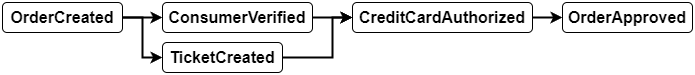
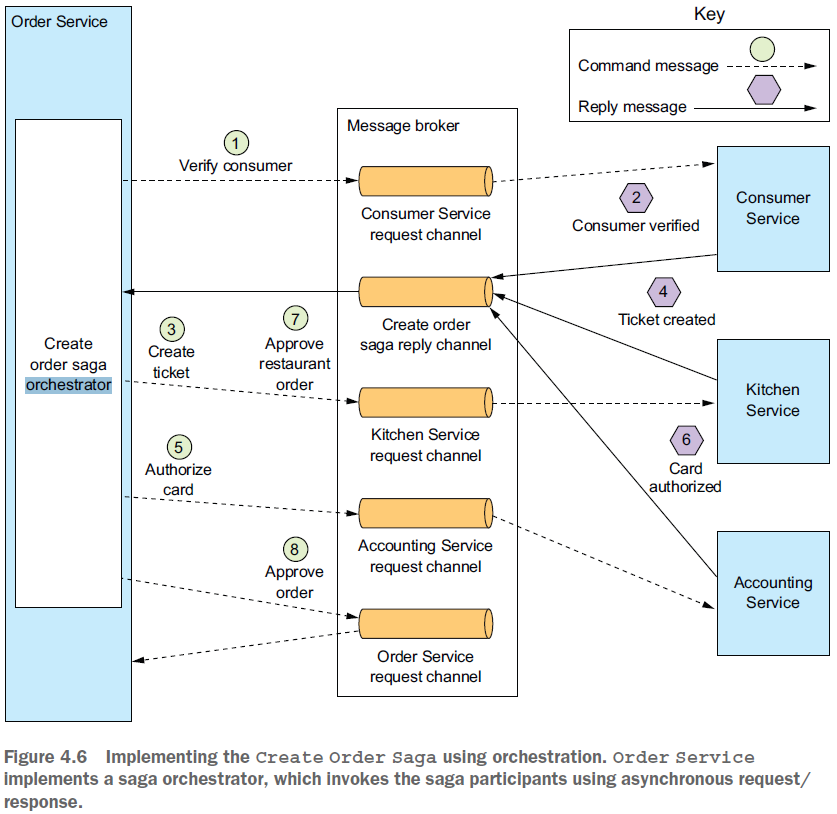

== Sagas pattern for transactions

*Content:*

- 1. Причина потребности в Sagas pattern. 2PC - 2 phase commit
- 2. Проблемы транзакций в микросервисной архитектуре
- 3. Sagas pattern - обеспечение согласованности данных. Пример саги
- 4. Sagas использует компенсационные транзакции для отката изменений
- 5. Координация sagas
- 6. Саги на основе хореографии. Пример Order create saga
- 7. Хореография - надежность event-based коммуникации
- 8. Хореография - преимущества и недостатки
- 9. Саги на основе оркестрации. Пример Order create saga
- 10. State machine для Order create saga
- 11. Sagas pattern + Оркестрация + транзакционная отправка сообщений
- 12. Оркестрация - преимущества и недостатки
- 13. Проблема отсутствия изоляции в Sagas pattern
- 13.1 Sagas pattern - Lost updates problem
- 13.2 Sagas pattern - Dirty reads problem
- 14. Sagas pattern - предотвращение аномалий - intro
- 14.1 Структура транзакций в саге
- 14.2 Контрмера: Semantic lock
- 14.3 Контрмера: Commutative updates (Коммутативные обновления)
- 14.4 Контрмера: Pessimistic view (пессимистический подход)
- 14.5 Контрмера: Reread value. Паттерн Optimistic Offline Lock
- 14.6 Контрмера: Version file
- 14.7 Контрмера: By value

=== 1. Причина потребности в Sagas pattern. 2PC - 2 phase commit

Транзакции являются важным компонентом любого корпоративного приложения. Без транзакций было бы невозможно поддерживать согласованность данных. Транзакции _ACID_ (_Atomicity, Consistency, Isolation, Durability_) создают иллюзию того, что каждая транзакция имеет эксклюзивный доступ к данным. Проблема заключается в реализации транзакций для операций, которые обновляют данные, принадлежащие нескольким сервисам.

Традиционный подход к управлению распределенными транзакциями (*_2PC_*, _2 phase commit_ - link:https://neerc.ifmo.ru/wiki/index.php?title=2_Phase_Commit[статья итмо]) не является хорошим выбором для современных приложений. Вместо транзакций ACID лучше использовать так называемую *_Saga_* — _последовательность локальных транзакций, управляемую сообщениями_. Основная проблема _**Saga** pattern_ заключается в том, что _Sagas_ являются *_ACD_* (атомарность, согласованность, долговечность), но не имеют *_I_* - изоляции. В результате приложение должно использовать контрмеры - методы проектирования, которые предотвращают или уменьшают влияние аномалий параллелизма, вызванных отсутствием изоляции.

Но на самом деле даже монолитные приложения обычно не используют стандартные ACID-транзакции. Например, многие приложения используют более низкий уровень изоляции транзакций для повышения производительности. Кроме того, многие важные бизнес-процессы, такие как перевод денег между счетами в разных банках, в конечном итоге являются согласованными. Даже link:https://www.enterpriseintegrationpatterns.com/ramblings/18_starbucks.html[Starbucks] не использует двухфазную фиксацию.

=== 2. Проблемы транзакций в микросервисной архитектуре

Почти каждый запрос, обрабатываемый корпоративным приложением, выполняется в транзакции базы данных. _Spring_ предоставляет декларативный механизм - аннотацию _@Transactional_, которая обеспечивает автоматическое выполнение вызовов методов внутри транзакции. В результате легко написать транзакционную бизнес-логику внутри одной БД. Однако управление транзакциями является сложной задачей даже в монолите, если он использует несколько баз данных и брокеров сообщений. А в микросервисной архитектуре транзакции охватывают несколько сервисов со своими БД.

Традиционный подход к обеспечению согласованности данных между несколькими службами, базами данных или брокерами сообщений заключается в использовании распределенных транзакций. Стандартом де-факто для управления распределенными транзакциями является модель *_X/Open XA_* — см. link:https://en.wikipedia.org/wiki/X/Open_XA[Open_XA - wiki]. XA использует _2PC_, чтобы убедиться, что все участники транзакции либо фиксируют, либо откатывают транзакцию. Также требуетс механизма межпроцессного взаимодействия, который распространяет глобальный идентификатор XA-транзакции. Большинство RDBMS и некоторые брокеры совместимы с XA. JVM предлагает JTA для распределенных транзакций.

Одна из проблем заключается в том, что многие современные технологии - некоторые NoSQL-БД - MongoDB, Cassandra, современные брокеры - RabbitMQ и Apache Kafka не поддерживают распределенные транзакции.

Еще одна проблема распределенных транзакций - синхронность. Для фиксации распределенной транзакции должны быть доступны все участвующие сервисы, в том числе глобальный _**Transaction Manager** (TM)_ - иначе идет сложный процесс повторного опроса с ожиданием поднятия подов (а упавшие поды должны сохранять свои состояния, особенно если они ответили "Да, я могу закоммитить транзакцию", а потом упали).

Существует link:https://en.wikipedia.org/wiki/CAP_theorem[CAP-теорема] Эрика Брюэра, в которой утверждается, что система может иметь только два из следующих трех свойств: согласованность, доступность и устойчивость к разбиению. Сегодня архитекторы предпочитают иметь доступную систему, а не непротиворечивую.

=== 3. Sagas pattern - обеспечение согласованности данных. Пример саги

*_Саги_* — это механизм поддержания согласованности данных в микросервисной архитектуре без использования распределенных транзакций. Вы определяете _сагу_ для каждой системной команды, которой необходимо обновить данные в нескольких сервисах. *_Сага_* — _это последовательность **локальных транзакций**_. Каждая локальная транзакция обновляет данные в пределах одного сервиса (можно юзать стандартные ACID-транзакции).

КОманда инициирует первый шаг саги. Завершение локальной транзакции инициирует выполнение следующей локальной транзакции. Координация шагов реализуется с помощью асинхронного обмена сообщениями. Важным преимуществом асинхронного обмена сообщениями является то, что он гарантирует выполнение всех шагов саги, даже если один или несколько участников саги временно недоступны.

Саги отличаются от ACID-транзакций. Саги не имеют свойства *_Isolation_*. Кроме того, поскольку каждая локальная транзакция фиксирует свои изменения, сагу необходимо откатывать с помощью компенсирующих транзакций. Давайте посмотрим на пример саги создания _Order_:

_Order Service_ реализует операцию `createOrder()`, используя эту _сагу_. Первая локальная транзакция _саги_ инициируется внешним запросом на создание заказа. Каждая из остальных пяти локальных транзакций инициируется завершением предыдущей.

Эта сага состоит из следующих локальных транзакций:

- 1) Order Service — создание _Order_ в статусе APPROVAL_PENDING.
- 2) Consumer Service — проверка того, что потребитель может создать _Order_.
- 3) Kitchen Service — проверка деталей _Order_ и создание _Ticket_ в статусе CREATE_PENDING.
- 4) Accounting Service — авторизация кредитной карты потребителя.
- 5) Kitchen Service — изменение состояние _Ticket_ на AWAITING_ACCEPTANCE.
- 6) Order Service — изменение статуса _Order_ на APPROVED.

Сервис публикует сообщение, когда локальная транзакция завершается. Затем это сообщение запускает следующий шаг в _саге_. Использование обмена сообщениями не только гарантирует слабую связанность участников саги, но и гарантирует завершение _саги_. Это связано с тем, что если получатель сообщения временно недоступен, брокер сообщений хранит сообщение до тех пор, пока оно не будет доставлено.

На первый взгляд саги кажутся простыми, но есть несколько проблем с их использованием. Одной из проблем является отсутствие изоляции между сагами. Еще одна проблема — откат изменений при возникновении ошибки. Давайте посмотрим, как решить данные проблемы.

=== 4. Sagas использует компенсационные транзакции для отката изменений

Отличительной особенностью традиционных транзакций ACID является то, что бизнес-логика может легко откатить транзакцию, если обнаружит нарушение бизнес-правила. Он выполняет оператор ROLLBACK, и база данных отменяет все сделанные до сих пор изменения. К сожалению, автоматически откатить саги нельзя, потому что каждый шаг фиксирует свои изменения в локальной базе данных. Это означает, например, что в случае сбоя авторизации кредитной карты на четвертом этапе саги о создании _Order_ (пример выше) мы должны явным образом отменить изменения, сделанные на первых трех этапах, с помощью компенсационных транзакций.

Если локальная транзакция терпит неудачу, механизм координации саги должен выполнить компенсирующие транзакции, которые отклоняют _Order_ и, возможно, _Ticket_. Важно отметить, что не все шаги требуют компенсационных транзакций. Шаги только для чтения, такие как `verifyConsumerDetails()`, не требуют компенсирующих транзакций. Также не компенсируются такие шаги, как `authorizeCreditCard()` - потому что шаги после него не могут завершиться неудачей (в противном случае у нас inconsistency в системе). В таблице показаны компенсирующие транзакции для каждого шага саги о создании заказов:

[cols="1,4,4,4"]
|===
|STEP
|SERVICE
|TRANSACTION
|COMPENSATION TRANSACTION

|1
|Order Service
|`createOrder()`
|`rejectOrder()`

|2
|Consumer Service
|`verifyConsumerDetails()`
|—

|3
|Kitchen Service
|`createTicket()`
|`rejectTicket()`

|4
|Accounting Service
|`authorizeCreditCard()`
|—

|5
|Kitchen Service
|`approveTicket()`
|—

|6
|Order Service
|`approveOrder()`
|—
|===

Чтобы увидеть, как используются компенсационные транзакции, представьте себе сценарий, в котором авторизация кредитной карты потребителя завершается неудачно. В этом сценарии сага выполняет следующие локальные транзакции:

- 1) Order Service — создание _Order_ в статусе APPROVAL_PENDING.
- 2) Consumer Service — проверка того, что потребитель может создать _Order_.
- 3) Kitchen Service — проверка деталей _Order_ и создание _Ticket_ в статусе CREATE_PENDING.
- 4) Accounting Service — авторизация кредитной карты потребителя - FAILED!.
- 5) Kitchen Service — изменение состояние _Ticket_ на CREATE_REJECTED.
- 6) Order Service — изменение статуса _Order_ на REJECTED.

Пятый и шестой этапы — это компенсационные транзакции, которые отменяют обновления, сделанные _Kitchen Service_ и _Order Service_ соответственно. Логика координации саги отвечает за последовательность выполнения форвардных и компенсационных транзакций. Давайте посмотрим, как это работает.

=== 5. Координация sagas

Реализация саги состоит из логики, координирующей ее шаги. Когда сага инициируется системной командой, логика координации должна выбрать и указать первому участнику саги выполнить локальную транзакцию и т. д. Есть несколько разных способов реализовать логику координации саги:

- *_Choreography_* - _Хореография_ — распределить принятие решений и последовательность шагов между участниками саги. В основном они общаются, обмениваясь событиями.

- *_Orchestration_* - Оркестрация — централизация логики в *_Saga Orchestrator_*. _Оркестратор саги_ отправляет сообщения с командами участникам саги, сообщая им, какие операции выполнять.

=== 6. Саги на основе хореографии. Пример Order create saga

При использовании хореографии нет централизованного _Saga Orchestrator_. Вместо этого участники саги подписываются на события друг друга и отвечают соответствующим образом.

На картинке показан дизайн основанной на хореографии версии саги создания _Order_. Участники общаются, обмениваясь событиями. Каждый участник, начиная с _Order Service_, обновляет свою базу данных и публикует событие, которое триггерит следующего участника. В данном случее показан _sunny-day scenario_:

image:img/CreateOrder_choreography_saga_sunny_day_scenario.png[]

Рассмотрим _sunny-day scenario_ пошагово:

- 1) Order Service — создает _Order_ в состоянии APPROVAL_PENDING и публикует событие *_OrderCreated_*.
- 2) Consumer Service — использует событие _OrderCreated_, проверяет, может ли потребитель создать _Order_, и публикует событие *_ConsumerVerified_*.
- 3) Kitchen Service — использует событие _OrderCreated_, проверяет _Order_, создает _Ticket_ в состоянии CREATE_PENDING и публикует событие *_TicketCreated_*.
- 4) Accounting Service — использует событие _OrderCreated_ и создает авторизацию кредитной карты в состоянии PENDING через метод `createPendingAuthorization()`.
- 5) Accounting Service — использует события _TicketCreated_ и _ConsumerVerified_, списывает средства с кредитной карты потребителя и публикует событие *_CreditCardAuthorized_*.
- 6) Kitchen Service — использует событие _CreditCardAuthorized_ и изменяет состояние _Ticket_ на AWAITING_ACCEPTANCE.
- 7) Order Service — получает событие _CreditCardAuthorized_, изменяет состояние _Order_ на APPROVED и публикует событие *_OrderApproved_*.

Итого, цепочка событий выглядит так: +

_Order create saga_ также должна обрабатывать сценарий, в котором участник саги отклоняет заказ и публикует какое-либо _событие отказа_. Например, может произойти сбой авторизации кредитной карты потребителя. Сага должна выполнить компенсирующие транзакции, чтобы отменить то, что уже было сделано. В данном случее показан _rainy-day scenario_, когда _AccountingService_ не может авторизовать кредитную карту потребителя:

Рассмотрим _rainy-day scenario_ пошагово:

- 1) Order Service — создает _Order_ в состоянии APPROVAL_PENDING и публикует событие *_OrderCreated_*.
- 2) Consumer Service — использует событие _OrderCreated_, проверяет, может ли потребитель создать _Order_, и публикует событие *_ConsumerVerified_*.
- 3) Kitchen Service — использует событие _OrderCreated_, проверяет _Order_, создает _Ticket_ в состоянии CREATE_PENDING и публикует событие *_TicketCreated_*.
- 4) Accounting Service — использует событие _OrderCreated_ и создает авторизацию кредитной карты в состоянии PENDING через метод `createPendingAuthorization()`.
- 5) Accounting Service — использует события _TicketCreated_ и _ConsumerVerified_, пытается списать средства с кредитной карты потребителя и публикует событие *_CreditCardAuthorizationFailed_*.
- 6) Kitchen Service — использует событие _CreditCardAuthorizationFailed_ и изменяет состояние _Ticket_ на CREATE_REJECTED.
- 7) Order Service — получает событие _CreditCardAuthorized_, изменяет состояние _Order_ на REJECTED.

Итого, цепочка событий выглядит так: +

Участники хореографических саг взаимодействуют с помощью _publish/subscribe_. Давайте подробнее рассмотрим некоторые проблемы, которые необходимо учитывать при реализации _publish/subscribe-based коммуникации_ для саг.

=== 7. Хореография - надежность event-based коммуникации

Первая проблема как - описывалось ранее - из-за межсервисного зваимодействия важно, чтобы обновление базы данных и публикация события происходили атомарно, как часть транзакции.

Вторая проблема — это обеспечение того, чтобы участник саги имел возможность сопоставлять каждое получаемое им событие со своими собственными данными. Решение состоит в том, чтобы участник саги публиковал события, содержащие некоторый *_Correlation ID_* (в _headers_) - например, участники _Order create saga_ могут использовать *_orderId_* в качестве идентификатора корреляции, который передается от одного участника к другому. Кроме того, _Correlation ID_ нужно использовать при логировании для лучшего анализа проблем с конкретным _Order_ в нескольких сервисах - см. link:https://skonves.github.io/pages/correlation-ids.html[link]

=== 8. Хореография - преимущества и недостатки

Саги, основанные на хореографии, имеют ряд преимуществ:

- *_Simplicity_* — сервисы публикуют события при создании, обновлении или удалении бизнес-объектов.
- *_Loose coupling (слабая связь)_* — участники подписываются на события и взаимодействуют напрямую.

А также определенные недостатки:

- _Хореография более сложна для понимания_ - в отличие от оркестрации, в коде нет ни одного места, определяющего хореографическую сагу. Вместо этого хореография распределяет реализацию саги по сервисам. Следовательно, разработчику иногда сложно понять, как работает та или иная сага.
- _Циклические зависимости между службами_ - участники саги подписываются на события друг друга, что часто создает циклические зависимости. Хотя это не всегда проблема, циклические зависимости считаются _design smell_.
- _Risk of *tight coupling* (риск тесной связи)_ — каждый участник саги должен подписаться на все события, которые его затрагивают. Например, _Accounting Service_ должен подписаться на все события, которые приводят к списанию или возмещению средств с кредитной карты потребителя. В результате существует риск того, что данный сервис потребуется обновлять при обновлении жизненного цикла _Order_, который вообще-то является ответственностью _Order Service_.

Хореография может хорошо работать для простых саг, но из-за этих недостатков для более сложных саг лучше использовать оркестрацию.

=== 9. Саги на основе оркестрации. Пример Order create saga

Оркестрация — еще один способ реализации _sagas_. _Saga Orchestrator_ общается с участниками саги, используя взаимодействие в стиле _async request/response_. Он отправляет _command message_ сервису с указанием операции. После того, как этот участник саги выполнил операцию, он отправляет _reply message_ оркестратору. Затем оркестратор обрабатывает сообщение и определяет, какой шаг саги следует выполнить следующим.

На картинке показан дизайн основанной на оркестрации версии саги создания _Order_. Сага управляется классом _CreateOrderSaga_, который вызывает участников саги с помощью _async request/response_. Класс оркестратора отслеживает процесс и отправляет _command messages_ участникам саги, таким как _Kitchen Service_ и _Consumer Service_. Класс _CreateOrderSaga_ считывает ответные сообщения из своего ответного канала, а затем определяет следующий шаг шаги, если таковой имеется.

Изначально _Order Service_ создает _Order_ и оркестратор _CreateOrderSaga_. После этого _flow_ для _sunny-day scenario_ выглядит следующим образом:

- 1) Saga Orchestrator отправляет command *_VerifyConsumer_* в Consumer Service.
- 2) Consumer Service отвечает ответным message *_ConsumerVerified_*.
- 3) Saga Orchestrator получает message _ConsumerVerified_ и отправляет command *_CreateTicket_* в Kitchen Service.
- 4) Kitchen Service отвечает ответным message *_TicketCreated_*.
- 5) Saga Orchestrator отправляет command *_AuthorizeCard_* в Accounting Service.
- 6) Accounting Service отвечает ответным message *_CardAuthorized_*.
- 7) Saga Orchestrator отправляет command *_ApproveTicket_* в Kitchen Service.
- 8) Saga Orchestrator отправляет command *_ApproveOrder_* в Order Service.

Обратите внимание, что на последнем этапе _Saga Orchestrator_ отправляет command в свой же _Order Service_. Он может отправить сообщение напрямую внутри кода _Order Service_. Но чтобы быть последовательным, сага рассматривает _Order Service_ как еще одного участника - плюс это позволит сохранить message в брокере.

Итого, цепочка commands/response messages выглядит так: +

Каждая из диаграмм, подобных картинке выше, изображает один сценарий саги, но у саги может быть множество сценариев. Например, в _Order create saga_ есть четыре сценария. Помимо _sunny-day scenario_, есть еще три _rainy-day scenarios_. Saga может упасть из-за ошибки либо в Consumer Service, либо в Kitchen Service, либо в Accounting Service. Поэтому полезно моделировать сагу как _**State machine** (конечный автомат)_, потому что он описывает все возможные сценарии.

=== 10. State machine для Order create saga

_Saga Orchestrator_ хорошо моделируется с использованием _**State machine** (конечный автомат)_. Конечный автомат состоит из набора состояний и набора переходов между состояниями, которые запускаются событиями. На картинке ниже показана модель конечного автомата для _Order create saga_:

=== 11. Sagas pattern + Оркестрация + транзакционная отправка сообщений

Каждый шаг саги, основанной на оркестрации, состоит из сервиса, обновляющего базу данных и публикующего сообщение. Получается что сервис должен использовать обмен транзакционными сообщениями для атомарного обновления базы данных и публикации сообщений.

=== 12. Оркестрация - преимущества и недостатки

Саги на основе оркестровки имеют несколько преимуществ:

- _Более простые зависимости_ - Одним из преимуществ оркестрации является отсутствие циклических зависимостей. _Saga Orchestrator_ вызывает участников саги, но участники не вызывают оркестратор. В результате _Saga Orchestrator_ зависит от участников, а не наоборот, поэтому циклических зависимостей нет.
- _Less coupling (Меньшая связанность)_ — каждая служба реализует API, который вызывается оркестратором, поэтому ей не нужно знать о событиях, опубликованных другими участниками саги.
- _Улучшает разделение задач и упрощает бизнес-логику_ — логика координации саги локализована в _Saga Orchestrator_, а объекты предметной области не имеют сведений о сагах, в которых они участвуют. Например, аггрегат _Order_ не знает ни о каких сагах, поэтому он имеет более простую модель _State machine_. Во время выполнения саги _Order_ переходит непосредственно из состояния APPROVAL_PENDING в состояние APPROVED и не имеет промежуточных состояний, соответствующих шагам саги. В результате бизнес-модель становится намного проще.

Оркестрация также имеет один недостаток: риск централизации слишком большого количества бизнес-логики в _Saga Orchestrator_. К счастью, вы можете избежать этой проблемы, разработав оркестраторы, которые отвечают исключительно за виртуализацию и не содержат никакой другой бизнес-логики.

=== 13. Проблема отсутствия изоляции в Sagas pattern

Другая, пожалуй, самая большая проблема, с которой вы столкнетесь при использовании саг, — отсутствие изоляции. Давайте рассмотрим эту проблему и способы ее решения.

*_I_* в *_ACID_* означает _Isolation_. Изоляция ACID-транзакций гарантирует, что результат одновременного выполнения нескольких транзакций будет таким же, как если бы они выполнялись в последовательном порядке. База данных создает иллюзию того, что каждая транзакция ACID имеет эксклюзивный доступ к данным. Изоляция значительно упрощает написание бизнес-логики, которая выполняется одновременно.

Отсутствие изоляции может вызвать аномалии. На первый взгляд отсутствие изоляции кажется невозможным. Но на практике разработчики обычно соглашаются на меньшую изоляцию в обмен на более высокую производительность. СУРБД позволяет указать уровень изоляции для каждой транзакции. Уровень изоляции по умолчанию обычно слабее полной Serializable-изоляции.

Проблема _Sagas pattern_ заключается в том, что _Isolation_ нет вообще - и обновления, сделанные каждой из локальных транзакций саги, сразу видны другим сагам после фиксации этой транзакции. Такое поведение может вызвать две проблемы. Во-первых, другие саги могут изменять данные, к которым обращается сага, во время ее выполнения. Во-вторых, другие саги могут считывать эти данные до того, как сага завершит свои обновления, и, следовательно, могут прочитать несогласованные данные (read uncommitted).

Отсутствие изоляции может вызвать следующие три аномалии:

- Lost updates — одна сага изменяется без чтения изменений, сделанных другой сагой.
- Dirty reads — транзакция или сага считывает обновления, сделанные сагой, которая еще не завершила эти обновления.
- Fuzzy/nonrepeatable reads — два разных шага саги читают одни и те же данные и получают разные результаты, потому что другая сага внесла обновления.

Могут возникнуть все три аномалии, но первые две являются наиболее распространенными и наиболее сложными.

=== 13.1 Sagas pattern - Lost updates problem

Аномалия потерянного обновления возникает, когда одна сага перезаписывает обновление, сделанное другой сагой. Рассмотрим, например, следующий сценарий:

- 1) Первый шаг _Order create saga_ создает _Order_.
- 2) Пока эта сага выполняется, _Order cancel saga_ отменяет _Order_.
- 3) Последний шаг _Order cancel saga_ подтверждает заказ.

В этом сценарии _Order create saga_ игнорирует обновление, сделанное _Order cancel saga_, и перезаписывает его. В результате приложение отправит заказ, который клиент отменил. Позже в этом разделе я покажу, как предотвратить потерю обновлений.

=== 13.2 Sagas pattern - Dirty reads problem

Грязное чтение происходит, когда одна сага считывает данные, которые находятся в процессе обновления другой сагой. Например, пусть у пользователя есть кредитный лимит для заказа еды. Пусть пользователь пытается отменить старый заказ и сразу же создает новый на ту же сумму монет, при этом отмена старого заказа почему-то падает:

- 0) _Create Order Saga_ - первый заказ, стоимость 50 монет (баланс был 50 стал 0).
- 1) _Order cancel saga_ — отмена первого заказа. Увеличение доступного кредита (баланс был 50 стал 0).
- 2) _Create Order Saga_ — создание нового заказа, дубликата - уменьшение доступного кредита (баланс был 50 стал 0).
- 3) Отмена _Order cancel saga_ — компенсирующая транзакция, не получилось отменить первый заказ - уменьшается доступный кредит (баланс был 0 стал -50) -> *ERROR!!!*.

В этом сценарии _Order create saga_ выполняет грязное чтение доступного кредита, что позволяет потребителю разместить заказ, превышающий его кредитный лимит. Это неприемлемый риск для бизнеса.

=== 14. Sagas pattern - предотвращение аномалий - intro

Давайте посмотрим, как предотвратить влияние этого и других видов аномалий на приложение.

Разработчик обязан писать саги таким образом, чтобы либо предотвратить аномалии, либо свести к минимуму их влияние на бизнес. Мы уже видели пример стратегии, предотвращающей аномалии - использование статусов _*_PENDING_, таких как _APPROVAL_PENDING_. Стратегия использования в _Order_ состояний _*_PENDING_ является примером *_semantic lock_* - семантическая блокировке. Предлагается несколько контрмер для обеспечения согласованности:

- 1) *_Semantic lock_* — _Семантическая блокировка_ — блокировка на уровне приложения.
- 2) *_Commutative updates_* - _Коммутативные обновления_ — проектирование операций обновления так, чтобы они могли выполняться в любом порядке.
- 3) *_Pessimistic view_* — _Пессимистический подход_ — изменить порядок шагов саги, чтобы свести к минимуму бизнес-риски.
- 4) *_Reread value_* - _Перечитать значение_ — предотвратить *_dirty write_* путем повторного считывания данных, чтобы убедиться, что они не изменились, прежде чем перезаписывать их.
- 5) *_Version file_* — записывает операции, которые выполняются с аггрегатом, в специальное место (таблицу) чтобы можно было изменить их порядок.
- 6) *_By value_* — поскольку приложение знает бизнес-риски каждого кейса, можно чередовать саги и распределенные транзакции _2PC_.

=== 14.1 Структура транзакций в саге

Прежде чем мы опишем контрмеры, следует описать структуру саги. В  модели, показанной на картинке, сага состоит из трех типов транзакций:

- *_Компенсируемые транзакции_* — транзакции, которые потенциально могут быть отменены с помощью компенсирующей транзакции.
- *_Ключевая транзакция_* — решающий момент в саге. Если ключевая транзакция фиксируется, сага будет выполняться до завершения. Ключевая транзакция может быть транзакцией, которая не подлежит компенсации или ретраю. В качестве альтернативы это может быть последняя компенсируемая транзакция или первая _retriable_-транзакция.
- *_Retriable транзакции_* — транзакции, которые следуют за ключевой транзакцией и гарантированно завершатся успешно.

В _Order create saga_ шаги `createOrder()`, `verifyConsumerDetails()` и `createTicket()` являются компенсируемыми транзакциями. Транзакции `createOrder()` и `createTicket()` имеют компенсирующие транзакции, которые отменяют их обновления. Транзакция `verifyConsumerDetails()` доступна только для чтения, поэтому компенсирующая транзакция не требуется. +
Транзакция `authorizeCreditCard()` является ключевой транзакцией данной саги. Если кредитная карта потребителя может быть авторизована, эта сага гарантированно завершится. +
Шаги `approveTicket()` и `approveOrder()` — это repeatable транзакции, которые следуют за ключевой транзакцией.

Различие между _компенсируемыми_ транзакциями и _retriable_ транзакциями особенно важно. Каждый тип транзакций играет свою роль в контрмерах.

Давайте теперь рассмотрим каждую контрмеру, начиная с контрмеры семантической блокировки.

=== 14.2 Контрмера: Semantic lock

_Компенсируемая_ транзакция саги устанавливает флаг в любой записи, которую она создает или обновляет. Флаг указывает на то, что запись не зафиксирована и потенциально может быть изменена. Флаг может быть либо блокировкой, либо предупреждением. Он очищается либо повторной транзакцией — сага завершается успешно — либо компенсирующей транзакцией: сага откатывается. Поле `Order.state` — отличный пример семантической блокировки. Состояния _*_PENDING_, такие как APPROVAL_PENDING и REVISION_PENDING, реализуют семантическую блокировку.

Управление lock — это только половина проблемы. Также необходимо решить, как сага должна поступать с заблокированной записью. Рассмотрим, например, системную команду `cancelOrder()`. Клиент может вызвать эту операцию для отмены заказа, находящегося в состоянии APPROVAL_PENDING. Первый сценарий - завершить команду `cancelOrder()` с ошибкой - легко реализовать, но это неудобно для клиента, поскольку ему приходится реализовывать логику повторных попыток. Другим вариантом является блокировка `cancelOrder()` до тех пор, пока lock не будет снят с записи.

=== 14.3 Контрмера: Commutative updates (Коммутативные обновления)

Одной из простых мер противодействия является проектирование коммутативных операций обновления. Операции коммутативны, если их можно выполнять в любом порядке. Операции debit() и credit() могут быть коммутативными, если мы игнорируем проверки текущего состояния счета. Эта контрмера исключает _lost updates_.

Рассмотрим, например, сценарий, в котором сагу необходимо откатить после того, как компенсируемая транзакция списала (или зачислила) счет на счет. Компенсирующая транзакция может просто кредитовать (или дебетовать) счет, чтобы отменить обновление.

=== 14.4 Контрмера: Pessimistic view (пессимистический подход)

Данная контрмера переупорядочивает шаги саги, чтобы минимизировать бизнес-риски из-за _dirty read_. Рассмотрим, например, сценарий, ранее использовавшийся для описания аномалии _dirty read_ (пункт 13.2). В этом сценарии сага выполнила грязное чтение доступного кредита и создала заказ, который превысил лимит потребительского кредита. Чтобы снизить риск этого, данная контрмера переупорядочивает сагу об отмене заказа:

- 1) Order Service — изменение состояния _Order_ на CANCELLED.
- 2) Delivery Service — отмена доставки.
- 3) Customer Service — увеличение доступного кредита.

В переупорядоченной саге доступный кредит изменяется в retriable транзакции, что говорит о том, что кредит увеличится только при полном завершении транзакции - а значит другие саги смогут получить только _меньшее_ количество монет на счету, но никак не _большее_. Это снижает риски.

=== 14.5 Контрмера: Reread value. Паттерн Optimistic Offline Lock

Контрмера повторного чтения предотвращает _lost updates_. Сага, использующая эту контрмеру, повторно считывает запись перед ее обновлением, проверяет, не изменилась ли она, а затем обновляет запись. Если запись была изменена, сага прерывается и, возможно, перезапускается. Эта контрмера является формой паттерна *_Optimistic Offline Lock_* - см. link:https://martinfowler.com/eaaCatalog/optimisticOfflineLock.html[martinfowler - OptimisticOfflineLock.html].

=== 14.6 Контрмера: Version file

Мы записываем в базу все полученные операции, которые будут что-то записывать. Это способ превратить некоммутативные операции в коммутативные. Допустим, _Order cancel saga_ отменяет авторизацию кредитной карты потребителя до того, как _Order create saga_ авторизует карту. В таком случае в базу запишется запрос об отмене авторизации. Затем, когда _Accounting Service_ получит последующий запрос на авторизацию карты, сервис заметит, что уже получил запрос на отмену авторизации, и пропустит авторизацию кредитной карты.

=== 14.7 Контрмера: By value

Это стратегия выбора механизмов параллелизма на основе бизнес-рисков. Поскольку приложение знает бизнес-риски каждого кейса, можно чередовать саги и распределенные транзакции _2PC_.
