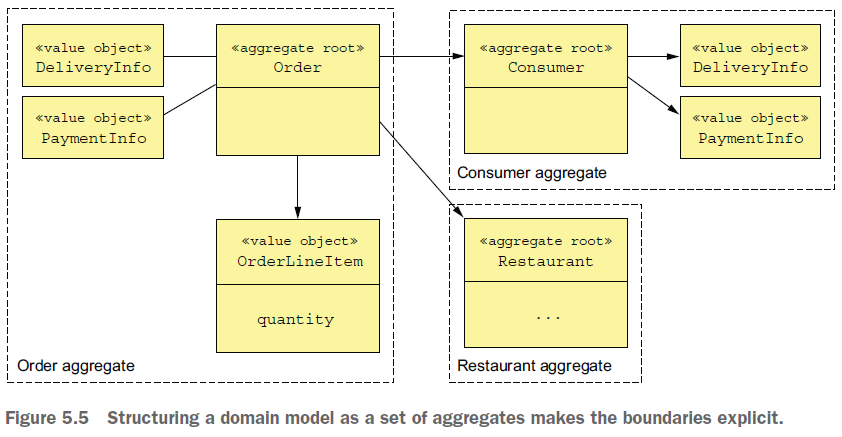
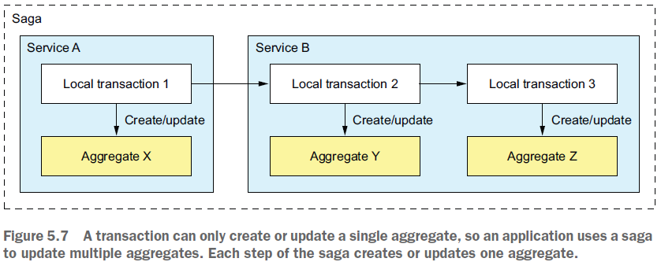

== Pattern: Aggregate

*Content:*

- 1. Aggregate intro
- 2. Агрегаты обеспечивают согласованность данных
- 3. Aggregate rules
- 3.1 RULE #1. Reference only aggregate root
- 3.2 RULE #2. Межагрегатные ссылки должны использовать только Primary key
- 4. Степень детализации агрегата

=== 1. Aggregate intro

*_Aggregate_* — это кластер *_domain-object_*-ов, который можно рассматривать как единое целое. Он состоит из *_root entity_* (корневой сущности) и, возможно, одной или нескольких других _entities_ и _value-objects_. Многие бизнес-объекты моделируются как агрегаты. Агрегаты имеют явные границы внутри доменной модели. Например, грубая модель предметной области приложения food delivery может состоять из агрегатов - такие существительные, как _Order_, _Consumer_, _Restaurant_ - это агрегаты - см. пример на картинке:

_Aggregates_ разбивают модель предметной области на отдельные фрагменты, которыми легче опрерировать (через CRUD). Причем CRUD-операции действуют на весь агрегат, а не на его части. Агрегат часто полностью загружается из базы данных, а удаление агрегата удаляет все его объекты из базы данных.

=== 2. Агрегаты обеспечивают согласованность данных

Обновление всего агрегата, а не его частей, решает проблемы согласованности данных. Операции обновления вызываются в корне агрегата, что обеспечивает невозможность несогласованного обновления части агрегата. Кроме того, параллелизм поддерживается блокировкой _aggregate root_ с использованием, например, _version number_ или _database-level lock_. Например, вместо непосредственного обновления количества позиций клиент должен вызвать метод в корне агрегата _Order_, который обеспечивает соблюдение таких инвариантов, как минимальная сумма заказа. Однако данныц подход не требует обновления всего агрегата в базе данных. Приложение может, например, обновить только строки, соответствующие объекту Order и обновленному OrderLineItem.

=== 3. Aggregate rules

DDD требует, чтобы агрегаты подчинялись набору правил. Эти правила гарантируют, что совокупность является автономной единицей, которая может применять свои инварианты. Рассмотрим каждое из правил.

=== 3.1 RULE #1. Reference only aggregate root

Aggregate root entity - единственная часть агрегата, на которую могут ссылаться классы вне агрегата. Клиент может обновить агрегат, только вызвав метод aggregate root агрегата. В данном случае сохраняются инварианты и обеспечиваются блокировки параллелизма.

=== 3.2 RULE #2. Межагрегатные ссылки должны использовать только Primary key

Агрегаты должны ссылаются друг на друга по id, а не по ссылкам на объекты. Например, _Order_ ссылается на своего _Consumer_, используя Consumer id, а не ссылку на Consumer object (Hibernate-case).

Этот подход сильно отличается от традиционного объектного моделирования, которое рассматривает внешние ключи в модели предметной области как _design smell_. Он имеет ряд преимуществ. Использование идентификатора означает, что агрегаты слабо связаны. Это гарантирует, что границы агрегатов будут четко определены, и позволит избежать случайного обновления другого агрегата. Кроме того, это позволит ссылаться на объект другого сервиса, которого нет в базе текущего сервис.

Этот подход также упрощает persistence, поскольку агрегат является единицей хранения. Это упрощает хранение агрегатов в базе данных NoSQL, такой как MongoDB. Это также устраняет необходимость в _transparent **lazy loading**_ и связанных с ней проблемах.

=== 3.3 RULE #3. Одна транзакция создает или обновляет один агрегат

Транзакция может создавать или обновлять только один агрегат. Это ограничение идеально подходит для микросервисной архитектуры. Это гарантирует, что транзакция находится внутри одного сервиса. Это ограничение также соответствует ограниченной модели транзакций большинства NoSQL-БД.

Это правило усложняет реализацию операций, требующих создания или обновления нескольких агрегатов. Но это именно та проблема, которую решает *_pattern Saga_*. Каждый шаг _Saga_ создает или обновляет ровно один агрегат. В примере на картинке сага состоит из трех транзакций. Первая транзакция обновляет агрегат X в сервисе A. Две другие транзакции находятся в сервисе B. Одна транзакция обновляет агрегат X, а другая обновляет агрегат Y:

Альтернативный подход к обеспечению согласованности между несколькими агрегатами в рамках одной службы заключается в cheating-е и обновлении нескольких агрегатов в рамках транзакции. Например, сервис B может обновлять агрегаты Y и Z в одной транзакции. Это возможно только при использовании реляционной СУБД.

==== 4. Степень детализации агрегата

При разработке модели предметной области ключевой параметр - это размер каждого агрегата. С одной стороны, агрегаты в идеале должны быть небольшими. Поскольку обновления для каждого агрегата сериализуются, более мелкие агрегаты увеличат количество одновременных запросов, которые может обрабатывать приложение, улучшая масштабируемость. Это также улучшит взаимодействие с пользователем, поскольку уменьшит вероятность того, что два пользователя попытаются выполнить конфликтующие обновления одного и того же агрегата. С другой стороны, поскольку агрегат является областью транзакции, вам может потребоваться определить агрегат более крупным, чтобы сделать конкретное обновление атомарным.
