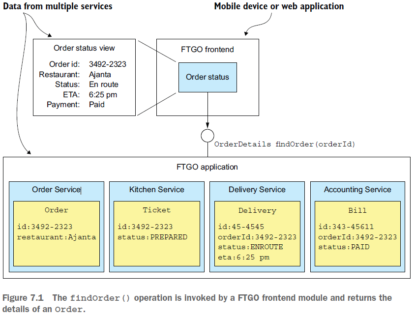
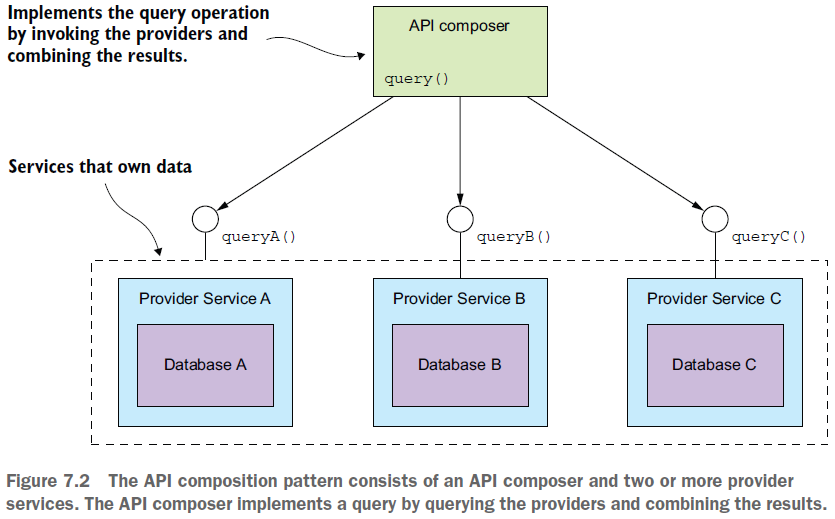

== Pattern: API Composition

*Content:*

- 1. Проблема извлечения данных из нескольких сервисов
- 2. API Composition - обзор шаблона
- 3. Проблемы и нюансы API Composition
  * (3.1) Кто играет роль API Composer-а?
  * (3.2) Реактивная модель программирования
  * (3.3) Снижение service availability
  * (3.4) Data inconsistency or obsolescence (устаревание)

=== 1. Проблема извлечения данных из нескольких сервисов

Периодически необходимо извдекать разрозненные данные из баз данных, принадлежащих нескольким сервисам. Для решения этой проблемы существует два подхода:

- _API Composition pattern_ — это самый простой подход, и его следует использовать везде, где это возможно. Клиенты сервисов самостоятельно вызывают сервисы и объединяют результаты.
- _Command query responsibility segregation (CQRS)_ — _шаблон разделения ответственности командных запросов_. Он мощнее, чем _API Composition_, но он также и более сложный. Он поддерживает одну или несколько databases view, которые аггрегируют данные из разных таблиц.

=== 2. API Composition - обзор шаблона

Допустим, нам надо получить данные сразу из нескольких сервисов. Это может быть mobile app, которое отображает все данные о заказе:

Шаблон API Composition состоит из двух основных частей:

- *_API composer_* — реализует операцию запроса, опрашивая все сервисы.
- *_Provider service_* — сервис, который возвращает некоторые требуемые данные _API composer_-у:

_API composer_ может быть клиентом, например веб-приложением, которому нужны данные для отображения веб-страницы. Или это может быть отдельный сервис, например, логика _API composer_ может быть частью *_API-gateway_* или его варианта *_Backends for frontends_*.

Данный паттерн является относительно простым, но он не всегда может быть применим или же в некоторых случаях _API composer_-у придется выполнять неэффективное соединение больших наборов данных в памяти.

=== 3. Проблемы и нюансы API Composition

==== (3.1) Кто играет роль API Composer-а?

- Если это клиентское приложение, то это может быть нецелесообразно для клиентов, которые находятся за пределами брандмауэра и обращаются к службам через медленную network.
- Это может быть _API-gateway_.
- Если логика слишком сложна для _API-gateway_ (интеграция с opensearch) - можно вынести ее в отдельный сервис или фасад - какой-нибудь *_entity-manager_*.

==== (3.2) Реактивная модель программирования

При разработке распределенной системы минимизация задержки является постоянной проблемой. Если это возможно, _API composer_ должен вызывать _provider service_ параллельно, хотя иногда нужны последовательные вызовы если для вызова одного сервиса требуется результат вызова другого.

Логика эффективного выполнения комбинации последовательных и параллельных вызовов службы может быть сложной. Чтобы компоновщик API был удобным в сопровождении, а также производительным и масштабируемым, можно использовать реактивный дизайн, основанный на _Java Completable-Future’s_ наблюдаемых _RxJava_ или какой-либо другой эквивалентной абстракцией. Данная тема также рассматривается в Главе 8, вместе с _API-gateway pattern_.

==== (3.3) Снижение service availability

Если мы опрашиваем три сервиса и их доступность - 99.5%, то доступность _API composer_ (3 сервиса плюс сам композер) равна `99.5%^(3+1)=98%`. Решение этой проблемы - кеширование или неполный возврат данных - см link:p077_circuit_breaker_pattern.adoc[p077_circuit_breaker_pattern - пункт 4]

==== (3.4) Data inconsistency or obsolescence (устаревание)

Мы забираем данные по очереди, без использования распределенных транзакция. Пока мы забираем данные у одной службы, соответствующие данные в другой уже могут устареть (если данные сильно связаны). Могут вернуться противоречивые данные, и не всегда _API composer_ может разрезолвить _data inconsistency_.