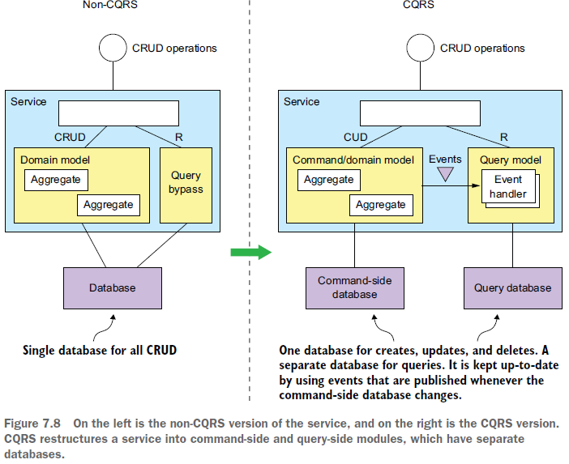

== Pattern: CQRS (Command Query Responsibility Segregation)

*Content:*

- 1. CQRS - причины использования
- 2. CQRS - архитектура/обзор паттерна
- 3. Преимущества CQRS
- 4. Недостатки CQRS

=== 1. CQRS - причины использования

*_CQRS_* - _Command Query Responsibility Segregation_ - _Сегрегация Ответственности Команд и Запросов (query)_. _CQRS_ является обобщением архитектуры, когда используется и *_СУБД для транзакционной записи_*, и *_text search database_*, такие как _Elasticsearch_ или _Solr_. Некоторые приложения поддерживают синхронизацию баз данных, выполняя одновременную запись в обе базы данных. Другие периодически копируют данные из СУБД в _text search database_. Приложения с такой архитектурой используют сильные стороны нескольких баз данных: транзакционные свойства СУБД и возможности запросов _text search database_.

Существует много проблем при реализации сложных текстовых запросов с участием запроса данных из множества микросервисов. Рассмотрим три наиболее часто встречающиеся:

- 1) Использование _API composition pattern_ для извлечения данных, разбросанных по нескольким сервисам, приводит к дорогостоящим и неэффективным соединениям в памяти.
- 2) Сервис, которой принадлежат данные, хранит данные в такой форме или в такой базе данных, которая не поддерживает требуемый запрос.
- 3) Необходимость разделения ответственности означает, что сервис, которому принадлежат данные, не является сервисом, который должен выполнять операцию запроса.

Решением всех трех этих проблем является использование шаблона CQRS.

=== 2. CQRS - архитектура/обзор паттерна

Паттерн _CQRS_, как следует из названия, заключается в сегрегации или разделении задач. Паттерн разделяет модель данных и модули, которые ее используют, на две части: *_commands part_* и *_queries part_*. *_Commands part_* - _command-side modules and data model_ - реализуют операции _CREATE_, _UPDATE_ и _DELETE_ (*_CUD_*). *_Queries part_* - _query-side modules and data model_ - реализуют _queries_ - READ-запросы. *_Queries part_* поддерживает синхронизацию своей модели данных с моделью данных на стороне *_commands part_*, подписываясь на события, публикуемые *_commands part_*.

В сервисе, не основанном на CQRS, операции CRUD обычно реализуются моделью предметной области, сопоставленной с базой данных. Для повышения производительности несколько запросов могут обходить модель предметной области и напрямую обращаться к базе данных (*_query bypass_*). Единая постоянная модель данных поддерживает как _commands_, так и _queries_.

В сервисе на основе CQRS _commands part_ модель домена обрабатывает операции CRUD и простые запросы без соединения, основанные на _primary key_. _Commands part_ публикует _domain events_ всякий раз, когда ее данные изменяются. Эти события могут быть опубликованы с использованием такой платформы, как _Eventuate Tram_, или с использованием _Event sourcing pattern_.

Отдельная _query model_ обрабатывает нетривиальные запросы и не отвечает за реализацию бизнес-логики. _Query side_ содержит обработчики событий, которые подписываются на _domain events_ и обновляют БД.

По факту _CQRS_ представляет собой *_event-based_* обобщение популярного подхода с использованием РСУБД в качестве системы записи и _text search mechanism_, такого как _Elasticsearch_, для обработки текстовых запросов. Отличие заключается в том, что CQRS использует более широкий спектр типов баз данных, а не только _text search mechanism_. Кроме того, databases на CQRS-_queries part_  обновляются почти в реальном времени путем подписки на _domain events_.

=== 3. Преимущества CQRS

Рассмотрим преимущества CQRS:

- Поддержка event sourcing pattern
- Разнообразный набор эффективных запросов
- Разделение задач для _commands-части_ и _queries-части_ приложения - упрощение логики

Основное преимущество CQRS заключается в том, что благодаря ему появляется возможность реализовывать запросы в микросервисной архитектуре, особенно использующие event sourcing. Это позволяет приложению эффективно поддерживать разнообразный набор запросов. Другим преимуществом является то, что разделение ответственности зачастую упрощает _command_ и _query_ части приложения.

CQRS также преодолевает серьезное ограничение event sourcing pattern. Например, решение link:https://www.eventstore.com/[_Event store_] - хранилище событий - поддерживает только запросы на основе primary key. Шаблон CQRS устраняет это ограничение, определяя одно или несколько представлений агрегатов, которые поддерживаются в актуальном состоянии путем подписки на потоки событий, которые публикуются агрегатами на основе источника событий. В результате приложение, основанное на источнике событий, всегда использует CQRS.

Другим преимуществом CQRS является разделение задач. Модель предметной области и соответствующая ей постоянная модель данных не обрабатывают ни команды, ни запросы. Шаблон CQRS определяет отдельные модули кода и схемы базы данных для команд и запросов службы. При разделении задач стороны команд и стороны запросов, вероятно, будут проще и легче в обслуживании.

=== 4. Недостатки CQRS

Несмотря на то, что CQRS имеет ряд преимуществ, у него есть и существенные недостатки:

- Более сложная архитектура
- Временной лаг между командами и запросами

Одним из недостатков является то, что CQRS требует дополнительных усилий по разработке и эксплуатации системы. Необходимо создать и развернуть query-сервис, который умеет обновлять представления и делать запросы к ним. Кроме того, необходимо развернуть хранилище представлений. Более того, приложение может использовать разные типы баз данных, что еще больше усложняет работу по их поддержке.

Другой недостаток CQRS связан с временным лагом между командами и запросами. Как и следовало ожидать, существует задержка между моментом, когда командная часть обновляет агрегат, и моментом, когда это событие обрабатывается на стороне запроса и обновляется представление. Клиентское приложение, которое обновляет агрегат, а затем сразу же делает запрос с использованием представлений, может увидеть предыдущую версию агрегата. Поэтому приложение должно быть написано таким образом, чтобы не допустить получения пользователем этого потенциального несоответствия.

Одно из решений проблемы временного лага заключается в том, что API-интерфейсы для  _command-side_ и API-интерфейсы для _query-side_ предоставляют клиенту информацию о версии, которая позволяет ему определить, что _query side is **out-of date**_ (устарела). A client can poll the query-side view until it’s *_up-to-date_*.

UI-приложение, такое как native mobile application или single page JavaScript приложение может справляться с лагаом репликации, обновляя свою локальную модель после успешного выполнения команды без выдачи запроса. Например, он может обновить свою модель, используя данные, возвращаемые запросом. Assumption такого подхода предполагает, что когда действие пользователя инициирует запрос, локальная репликация будет актуальной. Одним из недостатков этого подхода является то, что UI-коду может потребоваться дублировать логику сервера на своей стороно чтобы обновлять модель.

Как видите, _CQRS_ имеет как преимущества, так и недостатки. Как упоминалось ранее, лучше всего использовать _API composition_, когда это возможно, а _CQRS_ использовать только тогда, когда это реально необходимо.
