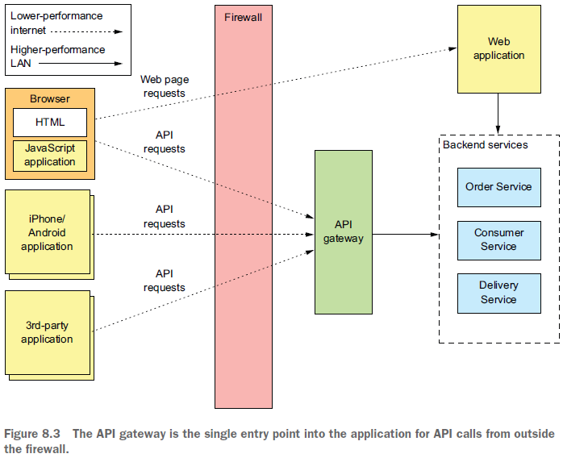
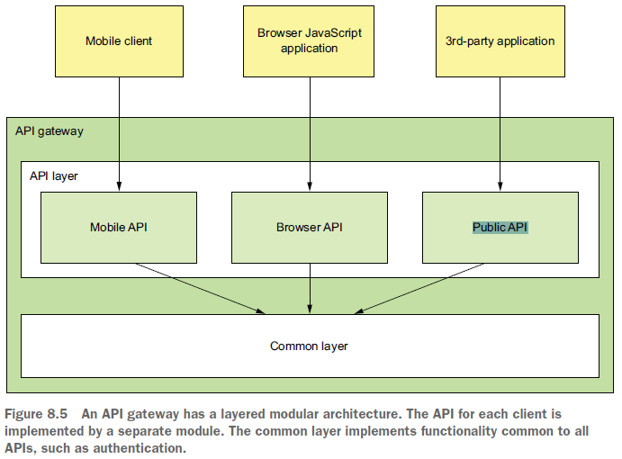
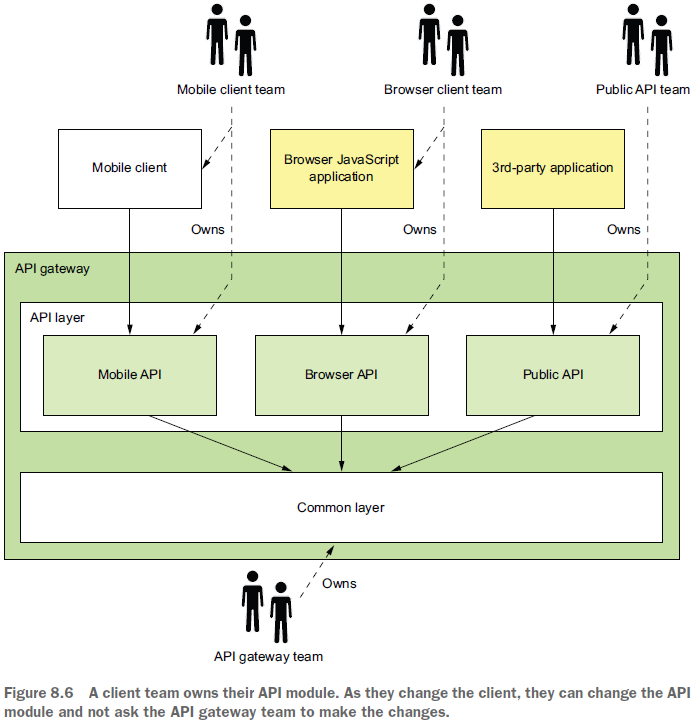
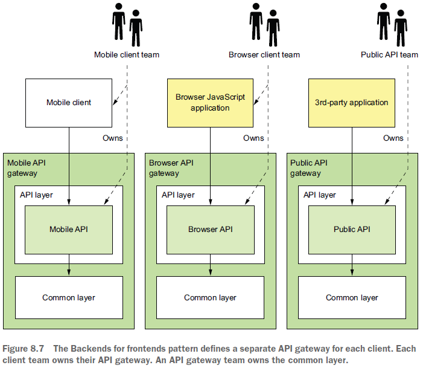

== API gateway pattern. Backends for Frontends pattern.

*Content:*

- 1. API gateway overview
- 2. Request routing
- 3. Edge functions - пограничные функции
- 4. Архитектура API-gateway
- 5. Модель владения исходным кодом API-gateway
- 6. Backends for Frontends pattern
- 7. Преимущества и недостатки API-gateway
- 8. Особенности проектирования API-gateway
- 8.1 Производительность и масштабируемость
- 8.2 Использование реактивного программирования
- 8.3 Обработка partial failures (частичного отказа)
- 8.4 Api-gateway и использование других паттернов

=== 1. API gateway overview

*_API-gateway_* — это сервис, который является _точкой входа (entry point)_ в приложение. Он отвечает за маршрутизацию запросов, реализацию _API composition pattern_, аутентификацию и т. д. Также он занимается _protocol translation_ - _API-gateway_ транслирует _клиент-friendly_ протоколы, такие как HTTP и WebSockets, в _client-unfriendly_ протоколы , которые используют сервисы (Kafka, protobuf, etc.), и наоборот.

_API-gateway_ похож на шаблон Facade из объектно-ориентированного дизайна (link:https://refactoring.guru/ru/design-patterns/facade[refactoring.guru]). _API-gateway_ точно так же инкапсулирует внутреннюю архитектуру приложения и предоставляет API своим клиентам.

=== 2. Request routing

Одной из ключевых функций _API-gateway_ является маршрутизация запросов. Шлюз API реализует некоторые операции API, направляя запросы в соответствующую службу. При получении запроса сервис сверяется с картой маршрутизации, которая указывает, к какому сервису направить запрос. Эта функция идентична функциям обратного проксирования, предоставляемым веб-серверами, такими как NGINX.

_API-gateway_ выполняет _protocol translation_. Он может предоставлять _RESTful API_ внешним клиентам, даже если внутренние сервисы используют зоопарк протоколов, включая REST и gRPC.

Проблема с единым универсальным API заключается в том, что у разных клиентов часто разные требования. Один из способов решить эту проблему — дать клиентам возможность указывать в запросе, какие поля и связанные объекты должен возвращать сервер. Но зачастую такой подход не дает клиентам необходимого контроля. Гораздо лучший вариант - предоставление каждому клиенту собственного API. В *_шаблоне Backends for Frontends_* (link:https://microservices.io/patterns/apigateway.html[apigateway.html]) - развитиие _шаблона API-gateway_ - концепция *_API-per-client_* еще более развита путем определения отдельного _API-gateway_ для каждого клиента.

=== 3. Edge functions - пограничные функции

Хотя основными обязанностями _API-gateway_ являются маршрутизация и _API composition_, он также может реализовывать так называемые *_edge functions_* - _пограничные функции_. Пограничные функции реализуются на границе приложения. Примеры пограничных функций, которые может реализовать приложение, включают следующее:

- *_Authentication_* — проверка личности клиента, делающего запрос.
- *_Authorization_* — проверка того, что клиент авторизован для выполнения конкретной операции.
- _**Rate limiting** (ограничение скорости)_ — ограничение количества запросов в секунду от определенного клиента и/или от всех клиентов.
- *_Caching_* — кэширование ответов для уменьшения количества запросов к службам.
- *_Metrics collection_* — сбор метрик об использовании API для целей биллинговой аналитики (link:https://ru.wikipedia.org/wiki/%D0%91%D0%B8%D0%BB%D0%BB%D0%B8%D0%BD%D0%B3[Биллинг - wiki]).
- *_Request logging_* — логирование запросов.

Часть данных функций можно реализовать на стороне бэка - например, кэширование и сбор метрик. +
Также эти функции можно реализовать в *_пограничном сервисе_*, который находится перед _API-gateway_ — это первая entry point для внешнего клиента. Он аутентифицирует запрос и выполняет другую пограничную обработку, прежде чем передать его _API-gateway_. Это разделяет ответственность, позволяет имплементить приложения с несколькими _API-gateway_. К недостаткам _пограничного сервиса_ можно отнести дополнительный _delay_ из-за передачи данных по сети. +
В результате часто бывает удобно использовать третий вариант и реализовать эти пограничные функции, особенно авторизацию, в самом _API-gateway_. В итоге у нас на один сетевой переход меньше, что снижает _delay_.

=== 4. Архитектура API-gateway

_API-gateway_ имеет многоуровневую модульную архитектуру. Его архитектура состоит из двух уровней: _API layer_ и _Common layer_. _API layer_ состоит из одного или нескольких независимых API-модулей, каждый из которых реализует API для конкретного клиента. Общий уровень реализует общие функции, включая пограничные функции, такие как аутентификация.

В этом примере шлюз API имеет три модуля API:

- _Mobile API_ — реализует API для мобильного клиента.
- _Browser API_ — реализует API для приложения JavaScript, работающего в браузере.
- _Public API_ — реализует API для сторонних разработчиков.

=== 5. Модель владения исходным кодом API-gateway

Важный вопрос: кто отвечает за разработку _API-gateway_?

Если за это отвечает отдельная команда, то мы заново переизобретаем SOA, где команда Enterprise Service Bus (ESB) отвечала за всю разработку ESB. Если разработчику, работающему над мобильным приложением, требуется доступ к определенному сервису, он должен отправить запрос команде шлюза API и дождаться, пока они предоставят API. Такое централизованное узкое место в организации сильно противоречит философии микросервисной архитектуры, которая продвигает слабосвязанные автономные команды.

Более оптимальный подход - каждая команда владеет своим API-модулем, а команда _API-gateway_ отвечает за разработку общего модуля и за операционные аспекты. Когда команде необходимо изменить свой API, они регистрируют изменения в исходном _API-gateway_-репозитории:

=== 6. Backends for Frontends pattern

В предыдущем случае ответственность за кодовую базу _API-gateway_ размыта. Несколько команд вносят изменения в один и тот же репозиторий. Хотя это и не так плохо, как _SOA ESB_, такое размывание обязанностей противоречит философии архитектуры микросервисов, согласно которой: +
----
"Если вы что-то создаете, то оно принадлежит вам"
----

Решение состоит в том, чтобы иметь _API-gateway_ для каждого клиента, так называемый шаблон *_Backends for Frontends (BFF)_* (link:https://microservices.io/patterns/apigateway.html[apigateway.html]). Каждый API-модуль становится автономным _API-gateway_, который разрабатывается и управляется одной клиентской командой. В идеале все _API-gateway_ используют один и тот же стек технологий. Общая функциональность — это общая библиотека, реализованная командой _API-gateway_.

Помимо четкого определения обязанностей, _шаблон BFF_ имеет и другие преимущества. API-модули изолированы друг от друга, что повышает надежность. Каждый API масштабируется независимо. Шаблон BFF также сокращает время запуска, поскольку каждый _API-gateway_ представляет собой более компактное и простое приложение.

=== 7. Преимущества и недостатки API-gateway

Основным преимуществом использования _API-gateway_ является то, что он инкапсулирует внутреннюю структуру приложения. Вместо того, чтобы вызывать определенные службы, клиенты взаимодействуют со шлюзом. _API-gateway_ предоставляет каждому клиенту API для конкретного клиента, что сокращает количество циклов обмена данными между клиентом и приложением. Это также упрощает клиентский код.

_API-gateway_ также имеет некоторые недостатки. Это еще один высокодоступный компонент, который необходимо разрабатывать, развертывать и управлять им. Также существует риск того, что он станет _development bottleneck_. Однако, несмотря на эти недостатки, для большинства реальных приложений имеет смысл использовать _API-gateway_. При необходимости вы можете использовать шаблон _Backends for frontends_, чтобы команды могли разрабатывать и развертывать свои API независимо друг от друга.

=== 8. Особенности проектирования API-gateway

Рассмотрим различные вопросы проектирования _API-gateway_. При его разработке необходимо учитывать несколько моментов:

- Производительность и масштабируемость
- Использование реактивного программирования
- Обработка partial failures (частичного отказа)
- Api-gateway и использование других паттернов

=== 8.1 Производительность и масштабируемость

Ключевое проектное решение, влияющее на производительность и масштабируемость, заключается в том, должен ли _API-gateway_ использовать синхронный или асинхронный ввод-вывод.

В модели синхронного ввода-вывода каждое сетевое соединение обрабатывается выделенным потоком. Это простая модель программирования, и она работает достаточно хорошо. Например, это основа широко используемой среды сервлетов Java EE, хотя эта среда предоставляет возможность асинхронного выполнения запроса. Однако одним из ограничений синхронного ввода-вывода является то, что потоки операционной системы имеют большой вес, поэтому существует ограничение на количество потоков и, следовательно, одновременных подключений, которые может иметь _API-gateway_.

Другой подход заключается в использовании модели асинхронного (неблокирующего) ввода-вывода. В этой модели один поток цикла событий отправляет запросы ввода-вывода в _event handlers_. У вас есть выбор из множества технологий асинхронного ввода-вывода. На _JVM_ вы можете использовать одну из платформ на основе *_NIO_*, такую как *_Netty_*, *_Vertx_*, *_Spring Reactor_* или *_JBoss Undertow_*. Одним из популярных вариантов, отличных от _JVM_, является *_NodeJS_*, платформа, построенная на движке _Chrome JavaScript_.

Неблокирующий ввод-вывод намного более масштабируем, потому что он не требует дополнительных затрат на использование нескольких потоков. Недостатком, однако, является то, что асинхронная модель программирования на основе обратного вызова намного сложнее. Код сложнее писать, понимать и отлаживать. Event handlers must return quickly to avoid blocking the event loop thread.

=== 8.2 Использование реактивного программирования

Задача состоит в том, чтобы писать подерживаемый параллельный код.

Традиционный способ написания масштабируемого параллельного кода заключается в использовании callbacks. Асинхронный, _event-driven_ ввод-вывод, по сути основан на callbacks. Даже _API composer_ обычно использует callbacks. Он может выполнять запросы одновременно, вызывая
[source, java]
----
Future future = ExecutorService.submitCallable()
----
Проблема в том, что этот метод возвращает Future с блокирующим API. Более масштабируемый подход заключается в том, что компоновщик API вызывает
[source, java]
----
ExecutorService.submit(Runnable)
----
и для каждого Runnable вызывает обратный вызов с результатом запроса. Callback накапливает результаты и, как только все они получены, отправляет ответ обратно клиенту.

Написание кода с использованием традиционного _asynchronous callbacks_ подхода быстро приведет вас в _callback hell_ - кодовая база будет запутанной и сложной для понимания, особенно когда необходимо сочетать параллельные и последовательные запросы. Гораздо лучшим подходом является написание кода _API composition_ в декларативном стиле с использованием реактивного программирования. Примеры реактивных абстракций для *_JVM_*:

- *_Java 8 __CompletableFutures___*
- *Project Reactor _Monos_*
- *RxJava (Reactive Extensions for Java) _Observables_*, created by Netflix specifically
to solve this problem in its API gateway.
- *Scala _Futures_*

_API-gateway_ на основе *_NodeJS_* будет использовать *JavaScript _promises_* или *_RxJS_*, которые являются реактивными расширениями для JavaScript. Использование одной из этих реактивных абстракций позволит вам писать простой и понятный параллельный код.

=== 8.3 Обработка partial failures (частичного отказа)

_API-gateway_ должен быть не только масштабируемым, но и надежным. Один из способов добиться надежности — запустить несколько экземпляров шлюза _behind a load balancer_. Если один экземпляр выйдет из строя, балансировщик нагрузки направит запросы на другие экземпляры.

Для обработки запросов с высокой задержкой или при недоступности сервисов используется _Circuit breaker pattern_.

=== 8.4 Api-gateway и использование других паттернов

В главах 3 и 11 фигурировали _паттерн **service discovery**_ и *_patterns for observability_*. Шаблоны обнаружения сервисов позволяют клиенту определить сетевое расположение экземпляра сервиса. Шаблоны observability (наблюдение) позволяют разработчикам отслеживать поведение приложения и устранять неполадки. _API-gateway_ зачастую реализует эти архитектурные шаблоны.
