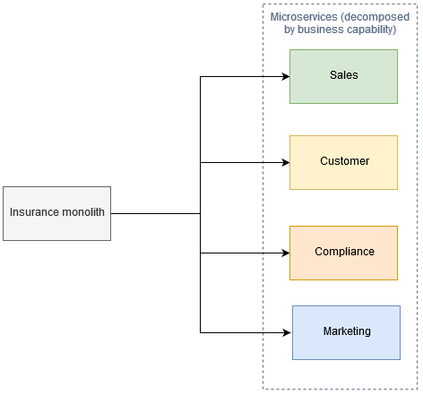
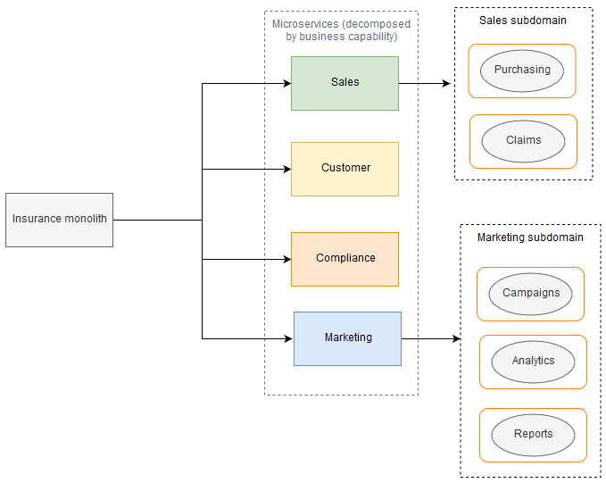
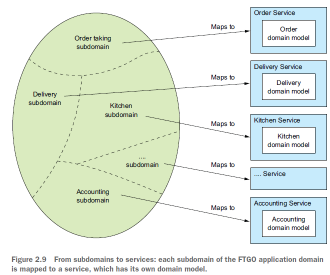

== Паттерны декомпозиции

*Content:*

- 1. Pattern: Decompose by business capability
- 2. Pattern: Decompose by subdomain
- 3. Принципы объектно-ориентированного проектирования и микросервисы
  * 3.1 Single Responsibility Principle (SRP)
  * 3.2 Common Closure Principle (CCP)

=== 1. Pattern: Decompose by business capability

*_See:_* link:https://microservices.io/patterns/decomposition/decompose-by-business-capability.html[decompose-by-business-capability.html]

Business capability (умение, возможность) организации определяются путем анализа цели, структуры и бизнес-процессов организации. Каждую business-capability можно рассматривать как _service_. Его спецификация состоит из различных компонентов, включая inputs, outputs и service-level agreements.

Business-capability часто сосредоточены на конкретном бизнес-объекте. Например, _Order Management_ is responsible for orders, _Customer Management_ is responsible for customers.

В качастве примера рассмотрим монолитное приложение страховой компании (insurance). Его можно декомпозировать на 4 части:

- _Продажи страховок_
- _Клиенты (работа с клиентами)_
- _Жалобы и заявки_
- _Маркетинг_ (изучение потребности рынка в товарах и услугах)

=== 2. Pattern: Decompose by subdomain

Термин *_subdomain_* в описан книге про DDD - "Domain-driven design by Eric Evans". _Subdomain_ - поддомен или субдомен - может быть использован для разложения монолитов сначала на domains, а потом на subdomains. Паттерн подходит для монолитов с четкими границами между _subdomain-related modules_. Это означает, что вы можете разложить монолит, переупаковав существующие модули в микросервисы, без существенного переписывания существующего кода. Данный подход разбивает _domain model_ организации на отдельные _subdomains_, которые помечаются как:

- *_core_* (ключевые особенности бизнеса)
- *_supporting_* (вспомогательные, возможно, связанные с бизнесом, но не отличительные черты)
- *_generic_* (не специфичные для бизнеса особенности)

У каждого _subdomain_ есть _model_, и область действия этой модели называется *_bounded context_* (ограниченный контекст). Микросервисы разрабатываются вокруг _bounded context_.

==== Преимущества и недостатки Decompose by subdomain Pattern
[cols="1,1"]
|===
|Преимущества
|Недостатки

|Слабосвязанная архитектура обеспечивает масштабируемость, отказоустойчивость, ремонтопригодность, расширяемость,  location transparency (прозрачность местоположения), protocol independence и time independence.
|Может создавать слишком много microservices, что усложняет service discovery и интеграцию

|Системы становятся более scalable и более предсказуемыми.
|Поддомены бизнеса трудно идентифицировать, потому что они требуют глубокого понимания бизнеса в целом.
|===

Пример декомпозиции монолита страховой компании (insurance) сначала по business-capability, а потом по subdomains:

А это - пример subdomain-декомпозиции приложения приготовления и доставки еды.

=== 3. Принципы объектно-ориентированного проектирования и микросервисы

Мы можем адаптировать и использовать некоторые принципы объектно-ориентированного проектирования при проектировании микросервисов:

- *_Single Responsibility principle_* (_SRP_) - _Принцип единой ответственности_ - для определения обязанностей класса.
- *_Common Closure Principle_* (_CCP_) - Общий принцип закрытия - для организации классов в пакеты.

=== 3.1 Single Responsibility Principle (SRP)

Принцип единой ответственности заключается в следующем:
----
"У класса должна быть только одна причина для изменения" - Роберт С. Мартин
----
Каждая ответственность, которую несет класс, является потенциальной причиной изменения этого класса. Если класс имеет несколько обязанностей, которые изменяются независимо друг от друга, класс не будет стабильным. Следуя SRP, вы определяете классы, каждый из которых несет одну ответственность и, следовательно, одну причину для изменения.

Мы можем применять _SRP_ при определении архитектуры микросервисов и создавать небольшие взаимосвязанные сервисы, каждый из которых несет единую ответственность. Это уменьшит размер сервисов и повысит их стабильность. Например в приложении доставки еды за каждый аспект доставки еды потребителю — прием заказа, подготовка заказа и доставка — отвечает отдельная служба.

=== 3.2 Common Closure Principle (CCP)

Другим полезным принципом является Общий принцип закрытия:
----
"Классы в пакете должны быть закрыты вместе от одинаковых изменений. Изменение, влияющее на пакет, затрагивает все классы в этом пакете" - Роберт С. Мартин
----

Идея состоит в том, что если два класса изменяются синхронно по одной и той же основной причине, то они принадлежат одному и тому же пакету. Например, эти классы реализуют какой-то аспект конкретного бизнес-правила. Цель состоит в том, чтобы при изменении этого бизнес-правила разработчикам нужно было изменить код только в небольшом количестве пакетов (в идеале только в одном).

Мы можем применять _CCP_ при создании микросервисной архитектуры. Это сведет к минимуму количество сервисов, которые необходимо изменить и задеплоить при изменении некоторых требований. В идеале изменение затронет только одну команду и одну службу. CCP — это "противоядие" от антипаттерна _распределенного монолита_.
