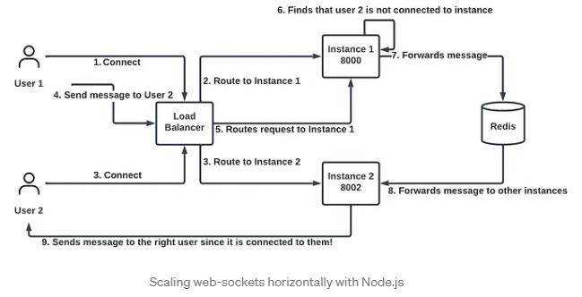
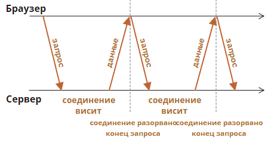

== System design notes

- link:https://apolomodov.medium.com/preparation-for-system-design-interview-66489d7a0af6[как подготовиться к системному дизайну]
- github design - link:https://github.com/donnemartin/system-design-primer/tree/master#system-design-topics-start-here[github]
- design many sites - link:https://tianpan.co/notes/2016-02-13-crack-the-system-design-interview[tianpan.co]

- link:https://www.youtube.com/watch?v=KZleZ0-mtKU[Youtube - проектирование видеохостинга] и
link:https://apolomodov.medium.com/example-of-system-design-interview-7790a5569207[статья об этом же]

- Проектирование Тиндера link:https://www.youtube.com/watch?v=fC29tPYCdXc[youtube]
- *86.400*

- Порешать задачки с примерами - link:https://nealford.com/katas/list.html[katas list],
link:https://www.architecturalkatas.solutions/index.php/Main_Page[katas solutions - а там нет нихрена :(], зато есть link:https://github.com/marckoch?tab=repositories[german solutions]
- Видео - обзор системного дизайна за 30 минут - link:https://www.youtube.com/watch?v=jAi0hZTmOag[youtube]
- C4 модель - link:https://habr.com/ru/companies/usetech/news/676196/[habr]
- A/B тестирование - новый функционал показываем ток определенной группе юзеров, разделяя их по меткам в cookies браузера - link:https://habr.com/ru/articles/233911/[habr].
- MongoDB 3.2 поддерживает валидацию документов - link:https://stackoverflow.com/questions/12550210/how-to-apply-constraints-in-mongodb[stackoverflow]

=== Передача данных

1. TCP/IP - transmission control protocol, internet protocol. TCP отвечает за установление и упарвление соединением между компьютерами чтобы обеспечить надежную доставку данных, а также контролирует поток данных чтобы избежать перегрузки сети. IP же отвечает за передачу пакетов данных между компьютерами в сети.
2. DNS - выдает IP по имени сайта (http:my-site.com -> 123.123.5.4)
3. HTTP (hypertext transfer protocol) - самый верхний в модели OSI - application level.
4. REST (representational state transfer) - стиль архитектуры ПО для построения распределенных систем.
5. Web Sockets - установка двунаправленного соединения между веб-браузером и веб-сервером. В этом случае сервер и браузер могут взаимодействовать и передавать данные в реальном времени без необходимости обновлять страницу. В HTTP мы обычно сами инициируем запросы. Это обновление чатов в реальном времени, игры, обновление данных при изменении, карты (при изменении положения пользователя меняются и координаты), совместное использование документов - для апдейта. link:https://ru.hexlet.io/blog/posts/chto-takoe-websocket-i-kak-oni-voobsche-rabotayut[Что такое вебсокеты].
6. Очереди

- Зачем нужен select for update - link:https://ru.stackoverflow.com/questions/1064951/%D0%97%D0%B0%D1%87%D0%B5%D0%BC-%D0%BD%D1%83%D0%B6%D0%B5%D0%BD-select-for-update[ru.stackoverflow]
- YandexDB - по дефолту link:https://ydb.tech/ru/docs/concepts/transactions[serializable transactions].
- 8 правил проектирования API - link:https://habr.com/ru/articles/536036/[habr]
- как говорить про ... https://vk.com/video-46638176_456239220[vk video]
- redis vs tarantool - link:https://habr.com/ru/companies/vk/articles/550062/[habr]
- hazelcast vs redis - link:https://cloudinfrastructureservices.co.uk/redis-vs-hazelcast-whats-the-difference/[cloudinfrastructureservices], link:https://hazelcast.org/compare-with-redis/#:~:text=The%20biggest%20difference%20between%20Hazelcast,this%20introduces%20extra%20network%20hops.[hazelcast.org]
- Comet сервер - link:https://ru.wikipedia.org/wiki/Comet_(%D0%BF%D1%80%D0%BE%D0%B3%D1%80%D0%B0%D0%BC%D0%BC%D0%B8%D1%80%D0%BE%D0%B2%D0%B0%D0%BD%D0%B8%D0%B5)[wiki], link:https://basecourse.ru/comet/teh.php[basecourse.ru]
- S3 database - link:https://serverspace.by/about/blog/chto-takoe-hranilishe-s3/[serverspace.by]
- Neo4j - графовая БД - link:https://habr.com/ru/articles/650623/[habr]
- Redis - link:https://mcs.mail.ru/blog/kak-ispolzovat-raznye-struktury-dannyh-redis-smotrim[структуры данных]

- MongoDB HighLoad++ - link:https://habr.com/ru/companies/ua-hosting/articles/487638/[habr]

- Redis Pub/Sub для скейлинга websocket приложений - link:https://shrihariprakash.medium.com/scaling-node-js-chat-apps-to-the-moon-6bc64dd3f638[medium]:

- Для хранения сообщений _Facebook Messenger_ использует *_HBase_*, _Discord_ - *_Cassandra_*.
- Длинный HTTP-опрос - link:https://learn.javascript.ru/long-polling[learn.javascript.ru] +
 +

---

- CDN - link:https://github.com/donnemartin/system-design-primer#content-delivery-network[github]
- Redis может выполнять несколько сотен тысяч операций чтения в секунду при размещении на стандартном сервере
- Производительность Redis - link:https://habr.com/ru/articles/64917/[habr] - 74239 запросов SET в секунду, 79239 запросов GET в секунду: +

  $ redis-benchmark -t set,lpush -n 100000 -q
  SET: 74239.05 requests per second
  LPUSH: 79239.30 requests per second

- Например, эталонный тест, задающий 4 КБ строк в Redis со скоростью 100 000 запросов в секунду, на самом деле будет потреблять 3,2 Гбит / с пропускной способности и, вероятно, будет соответствовать каналу 10 Гбит / с, но не 1 Гбит / с. Во многих реальных сценариях пропускная способность Redis ограничена сетью задолго до того, как она будет ограничена процессором. See link:https://redis.io/docs/management/optimization/benchmarks/[Redis benchmark]

- Redis куча всего link:https://habr.com/ru/companies/wunderfund/articles/685894/[habr]
- Собрались линуксоиды и меряются производительностью Redis - link:https://www.linux.org.ru/forum/development/13278680[linux.org.ru]

