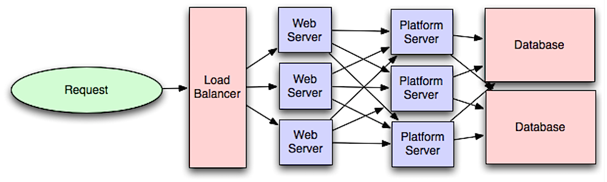
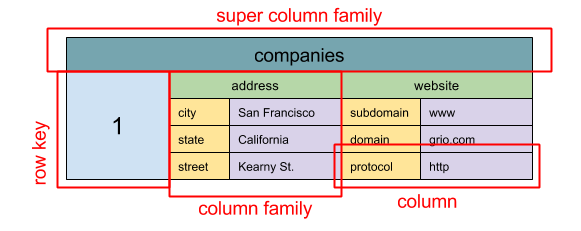

= System Design Notes 2

- link:#cap-theorem[CAP Theorem] +
- link:#consistency-patterns[Шаблоны согласованности] +
- link:#availability-parallel-sequential[Доступность параллельно или последовательно] +
- link:#DNS[DNS - Domain name system] +
- link:#CDN[CDN - Content delivery network] +
- link:#load-balancer[Load balance] +
- link:#reverse-proxy[Reverse proxy (Обратный прокси) web server] +
- link:#application-layer[Application layer] +
- link:#databases[Реляционные базы данных] +
- link:#nosql[NoSQL] +
- link:#nosql-types[NoSQL - основные типы БД] +
- link:#caching[Кеширование - виды кеширования] +

== Github system-design-primer
link:https://github.com/donnemartin/system-design-primer/tree/master#system-design-topics-start-here[link github]

- CAP Theorem - link:https://github.com/donnemartin/system-design-primer/tree/master#cap-theorem[link] [[cap-theorem]] +
Network ненадежен поэтому P - обязательно! Выбираем между AP/CP. +
* CP - непротиворечивость и устойчивость к разделам. +
Ожидание ответа от разделенного узла может привести к ошибке тайм-аута. CP — хороший выбор, если вашему бизнесу требуются атомарные операции чтения и записи. +
* AP — доступность и устойчивость к разделам +
Возвращается наиболее доступная версия данных. Для распространения записи по всем узлам нужно время. Согласованность в конечном счёте - eventual consistency

- Шаблоны согласованности - варианты их синхронизации - link:https://github.com/donnemartin/system-design-primer/tree/master#consistency-patterns[link] [[consistency-patterns]]
* *_Weak consistency_* - после записи чтение может увидеть последние изменения, а может и не увидеть. Используется подход "наилучшая производительность". Слабая согласованность хорошо работает в случаях использования в реальном времени, таких как телефонная связь (при восстановлении соединения вы не слышите то что пропустили), видеочат и многопользовательские игры в реальном времени.
* *_Eventual consistency_* - после записи чтение в конце концов увидит последние изменения (обычно в течение миллисекунд). Данные реплицируются асинхронно.
* *_Strong consistency_* - После записи чтение увидит это. Данные реплицируются синхронно. Строгая согласованность - характерна для РСУБД и файловых систем.

- Доступность параллельно или последовательно - link:https://github.com/donnemartin/system-design-primer/tree/master#availability-in-parallel-vs-in-sequence[link] [[availability-parallel-sequential]].
* Общая доступность снижается, когда два компонента с доступностью < 100 % расположены последовательно.
* Общая доступность увеличивается, когда два компонента с доступностью < 100 % работают параллельно.

- DNS - Domain name system - link:https://github.com/donnemartin/system-design-primer/tree/master#domain-name-system[link] [[DNS]] +
image:img/dns_schema.jpg[] +
DNS сервера иерархичны, с несколькими "авторитетными" root-серверами на верхнем уровне. Низкоуровневые DNS кешируют ответы от root-серверов. Результаты DNS также могут кэшироваться браузером. +
Недостатки DNS: сложное управление, ddos-атаки, минимальная но все таки задержка (которую можно уменьшить через кеширование). +
Сервисы DNS могут направлять трафик различными способами:
* *_Weighted round robin_* -> не пускает на maintenance servers, баланс между размерами кластера, позволяет A/B testing.
* *_Latency-based_* (на основе задержки)
* *_Geolocation-based_*

- CDN - Content delivery network - link:https://github.com/donnemartin/system-design-primer/tree/master#content-delivery-network[link] [[CDN]] +
image:img/cdn_schema.jpg[] +
Глобально распределенная сеть прокси-серверов, для доставки контента в места, расположенные ближе к пользователю. Для этих мест вы переписываете URL-адреса, чтобы они указывали на CDN. Есть два типа CDN - push и pull.
* Push CDN - вы сами кладете в CDN нужный вам контент. Сайты с небольшим объемом трафика или контентом, который не часто обновляется, хорошо работают с push CDN. Контент размещается в CDN один раз, а не извлекается через регулярные промежутки времени.
* Pull CDN - сами запрашивают новый контент с вашего сервера, когда первый пользователь запрашивает контент. Если TTL истёк а пришел юзер за контентом то CDN опять запрашивает контент. Могут генерить избыточный трафик.

- Load balancer - link:https://github.com/donnemartin/system-design-primer/tree/master#load-balancer[link] [[load-balancer]] +
Дополнительно к балансировке load balancer может:
* *_Управлять SSL_* - дешифровать входящий траффик и шифровать исходящий.
* *_Сохранять Session_* - но это плохо если скейлим балансеры. Лучше хранить сессии в кеше к которому будут обращаться балансеры.
Балансировщики нагрузки могут маршрутизировать трафик на основе различных показателей, в том числе:
* Random
* Least loaded
* Session/cookies (stucked)
* Round robin or weighted round robin

- Reverse proxy (Обратный прокси) web server - link:https://github.com/donnemartin/system-design-primer/tree/master#reverse-proxy-web-server[link] и больше про link:https://www.nginx.com/resources/glossary/reverse-proxy-vs-load-balancer/[reverse-proxy VS load-balancer] [[reverse-proxy]] +
image:img/reverse-proxy-web-server.png[]

- Application layer - link:https://github.com/donnemartin/system-design-primer/tree/master#application-layer[link] [[application-layer]] +
 +
Отделение web-layer от application layer (platform layer) позволяет независимо масштабировать и настраивать оба уровня. Добавление нового API приводит к добавлению application servers без обязательного добавления дополнительных web servers. +
Такие системы, как _Consul_, _Etcd_, and _Zookeeper_ выполняют маршрутизацию на основе зарегистрированных names/addresses/ports. И Consul, и Etcd имеют встроенное key-value store которое может хранить значения конфигурации и другие общие данные.

- Реляционные базы данных - link:https://github.com/donnemartin/system-design-primer/tree/master#database[link] [[databases]] +
Существует множество методов масштабирования реляционной базы данных: репликация *_master-slave_*, репликация *_master-master_*, *_федерация_*, *_шардирование_*, *_денормализация_* и *_настройка SQL_*.
* *_Репликация master-slave_* - master обслуживает чтение и запись, реплицируя запись на один или несколько slave, которые обслуживают только чтение. Если master отключается, система становится read-only до тех пор, пока slave не повысят до master или пока не будет создан новый master.
* *_Репликация мастер-мастер_* - Оба мастера выполняют операции чтения и записи и координируют друг с другом операции записи. Если один из мастеров выходит из строя, система может продолжать работать как с чтением, так и с записью. +
_Недостатки_: Вам понадобится балансировщик нагрузки. Также либо будет weak consistency, либо задержка записи из-за синхронизации. Также придется разрешать конфликты (см. "векторные часы"). +
 +
* *_Федерация_* - разделяет базы данных по функциям. Например, вместо единой монолитной базы данных у вас может быть три базы данных: forums, users, and products, что приведет к уменьшению трафика чтения и записи в каждую базу данных. Меньшие базы данных -> больше данных в памяти, -> больше попаданий в кэш из-за локальности кэша. +
_Недостатки_: Join неэффективен. Логика приложения сложна. +
image:img/federation.png[]
* *_Шардинг_* - ну тут все понятно :)
* *_Денормализация_*

- NoSQL - link:https://github.com/donnemartin/system-design-primer/tree/master#nosql[link] [[nosql]] +
4 основных типа:
* key-value store
* document store
* graph database
* wide column store (это составные Value - link:https://habr.com/ru/companies/vk/articles/675556/[habr])
Аналог CAP-теоремы для NoSQL - BASE-теорема. В отличие от CAP, BASE предпочитает доступность согласованности:
* Basically available - система гарантирует доступность.
* Soft state - состояние системы может меняться со временем даже без воздействий извне.
* Eventual consistency - система станет согласованной в течение определенного периода времени, учитывая, что система не получает входных данных в течение этого периода.

- NoSQL - основные типы БД [[nosql-types]] +
Рассмотрим подробнее основные типы:
* *_Key-value store_* - Redis и проч. Операции чтения и записи O(1).
* *_Document store_* +
Хранилище документов (XML, JSON, двоичных файлов и т. д.). Предоставляют API или язык запросов на основе внутренней структуры самого документа. +
В зависимости от базовой реализации документы организованы по коллекциям, тегам, метаданным или каталогам. +
Некоторые document store, такие как MongoDB и CouchDB, также предоставляют SQL-подобный язык для выполнения сложных запросов. DynamoDB поддерживает как пары "ключ-значение", так и документы. +
Document store обеспечивают высокую гибкость и часто используются для работы с периодически изменяющимися данными.
* *_Wide column store_* +
Абстракция: `nested map ColumnFamily<RowKey, Columns<ColKey, Value, Timestamp>>` +
 +
Основной единицей данных в широком хранилище столбцов является _column_ (name/value pair). Column может быть сгруппирован в _column families_ (аналогично таблице SQL). _Super column families_ дополнительно группируют column families. Вы можете получить доступ к каждому column независимо с помощью _row key_, а columns с одним и тем же _row key_ образуют строку. Каждое значение содержит timestamp для управления версиями и разрешения конфликтов. +
 Такие хранилища, как _BigTable_, _HBase_ и _Cassandra_, хранят ключи в лексикографическом порядке, что позволяет эффективно извлекать диапазоны ключей. +
Wide column store обеспечивают высокую доступность и высокую масштабируемость. Они часто используются для очень больших наборов данных.
* *_Graph database_* +
image:img/graph_database.png[]
В графовой базе данных каждый узел является записью, а каждая дуга — отношением между двумя узлами. Базы данных графов оптимизированы для представления сложных отношений со многими внешними ключами или отношениями "many-to-many". +
Базы данных графов обеспечивают высокую производительность для моделей данных со сложными отношениями, такими как социальная сеть.

- Кеширование - link:https://github.com/donnemartin/system-design-primer/tree/master#cache[link] [[caching]] +
Когда обновлять кеш:
* *_Cache-aside (Кэш в стороне)_* +
image:img/cache_aside.png[] +
Приложение отвечает за чтение и запись из хранилища. Если данных нет в кэше, приложение ходит за ними в бащу и потом еще записывает в кэш. Кэш не взаимодействует с хранилищем напрямую. Так работает Memcached. +
_Недостатки_: +
1. каждый cache miss дает три обращения
2. Данные могут устареть, если они обновляются в базе данных. Эта проблема устраняется за счет установки времени жизни (TTL), которое принудительно обновляет запись в кэше, или с помощью сквозной записи.
3. Когда нода кэша выходит из строя, новая нода пуста, что увеличивает задержку.
* *_Write-through (сквозная запись)_* +
image:img/write-through.png[] +
Приложение использует кеш в качестве основного хранилища данных, читая и записывая в него данные, а кеш отвечает за чтение и запись в базу данных. Медленная операция записи, но быстрая операция чтения данных из кеша. Используется для надежности - в банковских, медицинских системах и др. +
_Недостатки_: +
1. Медленная запись данных - операция записи завершена только когда данные записаны и в кеш, и в БД.
2. Большинство записанных данных могут никогда не быть прочитаны, но проблему можно минимизировать с помощью TTL.
* *_Write-behind (write-back, обратная запись)_* +
image:img/write-behind.png[] +
Приложение добавляет/обновляет данные в кеше. данные асинхронно записываются в БД через очередь. +
_Недостатки_: +
1. Возможна потеря данных, если кеш выйдет из строя до того, как его содержимое попадет в хранилище данных.
2. Сложная реализация.
* *_Refresh-ahead (Предварительное обновление)_* +
image:img/refresh-ahead.png[] +
Вы можете настроить кэш так, чтобы он автоматически обновлял любую запись, к которой недавно обращались, до истечения TTL. Упреждающее обновление может привести к уменьшению задержки по сравнению со сквозным чтением, если кеш может точно предсказать, какие элементы могут понадобиться в будущем. +
_Недостатки_: +
1. Неточное прогнозирование того, какие элементы могут понадобиться в будущем, может привести к снижению производительности по сравнению с отсутствием упреждающего обновления.

