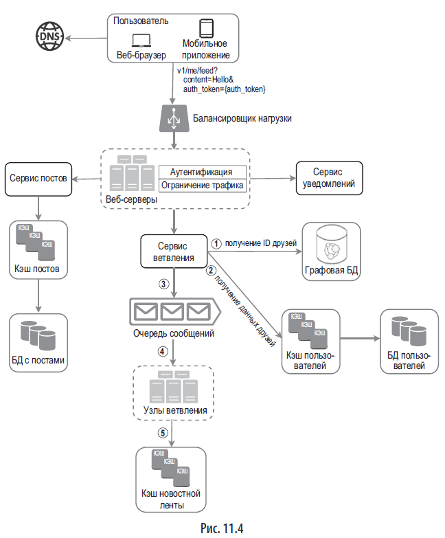
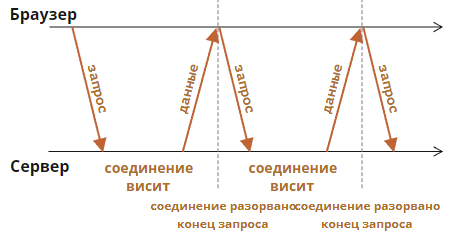

=== Полезные ссылки на книгу

=== p40 - ПРИБЛИЗИТЕЛЬНЫЕ ОЦЕНКИ (показатели латентности и показатели доступности).

=== p46 - ОБЩИЕ ПРИНЦИПЫ ПРОХОЖДЕНИЯ ИНТЕРВЬЮ ПО ПРОЕКТИРОВАНИЮ ИТ-СИСТЕМ:

 Шаг 1: понять задачу и определить масштаб решения - p47
 Шаг 2: предложить общее решение и получить согласие - p50
 Шаг 3: глубокое погружение в проектирование - p52
 Шаг 4: подведение итогов - p55

Готовьтесь к типичным вопросам! link:https://www.interviewbit.com/system-design-interview-questions/[interviewbit]

===== Тайминг и структура собеса

 Шаг 1. Понять задачу и определить масштаб: 3–10 минут.
 Шаг 2. Предложить общее решение и получить одобрение: 10–15 минут.
 Шаг 3. Подробное проектирование: 10–25 минут.
 Шаг 4. Подведение итогов: 3–5 минут.

=== p58 ПРОЕКТИРОВАНИЕ ОГРАНИЧИТЕЛЯ ТРАФИКА - Api-gateway

 Алгоритмы ограничения трафика:
 -------------------------------
 + алгоритм маркерной корзины (token bucket); - p63
 + алгоритм дырявого ведра (leaking bucket); - p66
 + счетчик фиксированных интервалов (fixed window counter); - p67
 + журнал скользящих интервалов (sliding window log); - p69
 + счетчик скользящих интервалов (sliding window counter). - p71

 Маркерная корзина - p63
 --------
 1) Для разных конечных точек API обычно нужны разные корзины. Например, если пользователь публикует 1 сообщение в секунду, добавляет 150 друзей в день и «лайкает» 5 сообщений в секунду, каждому пользователю нужно выделить 3 корзины.
 2) Если нам нужно фильтровать запросы в зависимости от IP-адресов, каждому IP-адресу требуется корзина.
 3) Если система допускает не больше 10 000 запросов в секунду, логично предусмотреть глобальную корзину для всех запросов.

 Алгоритм дырявого ведра - p66
 --------
 1) Тупо очередь запросов и все, нельзя забалансить нагрузку как в маркерной корзине. Эффективное потребление памяти при ограниченном размере очереди, подходит для задач, которые требуют стабильной скорости обработки

 Счетчик фиксированных интервалов - p67
 --------
 1) Алгоритм делит заданный период времени на одинаковые интервалы и назначает каждому из них счетчик. Как только счетчик достигнет лимита, новые запросы начинают отклоняться, пока не начнется следующий интервал.
 2) Минус - всплески трафика на границе временных интервалов могут привести к приему запросов, количество которых превышает квоту.

 Журнал скользящих интервалов - p69
 --------
 1) Алгоритм следит за временными метками запросов, которые хранятся в кэше - Redis.
 2) Когда поступает новый запрос, все просроченные запросы отбрасываются. Просроченными считают запросы раньше начала текущего временного интервала. Если количество записей в журнале не превышает допустимое, запрос принимается, а если нет — отклоняется.
 3) Плюс - ограничение трафика, реализованное с помощью этого алгоритма, получается очень точным; на любом скользящем интервале запросы не превышают заданный лимит.
 4) Минус - этот алгоритм потребляет много памяти, потому что даже в случае отклонения запроса соответствующая временная метка записывается в журнал.

 Счетчик скользящих интервалов - p71
 --------
 1) сглаживание всплесков трафика: текущая частота запросов зависит от той, которая использовалась на предыдущем интервале; экономия памати.

====== p74 Проектирование ограничителя траффика. Шаг 3 - подробное проектирование

=== p83 - СОГЛАСОВАННОЕ ХЕШИРОВАНИЕ

Виртуальный узел ссылается на настоящий; каждый сервер представлен на кольце несколькими виртуальными узлами. На рисунке у сервера 0 и сервера 1 есть по три виртуальных узла. Число 3 выбрано произвольно; в реальных системах виртуальных узлов значительно больше. Благодаря виртуальным узлам каждый сервер отвечает сразу за несколько отрезков. Отрезки (грани) с меткой s0 принадлежат серверу 0, а отрезки с меткой s1 — серверу 1.

====== p93 - Добавление и удаление сервера - как перераспределять хеши

=== p96 ПРОЕКТИРОВАНИЕ ХРАНИЛИЩА ТИПА «КЛЮЧ–ЗНАЧЕНИЕ»

====== Теорема CAP - p98
====== Согласованность - p104

 1.1) N = количество реплик.
 1.2) W = кворум записи размера W. Операция записи считается успешной, только если она подтверждена W репликами.
 1.3) R = кворум чтения размера R. Чтобы операцию записи можно было считать успешной, необходимо дождаться ответа как минимум от R реплик.
 -----
 2) Выбор значений для W, R и N — это типичный компромисс между латентностью и согласованностью. Если W = 1 или R = 1, операция завершается быстро, так как координатору нужно ждать ответа только от одной из реплик. Если же W или R больше 1, система становится более согласованной, но при этом координатору придется ждать ответа от самой медленной реплики, что замедлит выполнение запросов.
 4) W + R > N гарантирует строгую согласованность, поскольку в системе должен быть как минимум один узел с тем же минимальным набором данных.

 Как сконфигурировать N, W и R для наших задач? Вот несколько возможных вариантов:
 + если R = 1 и W = N, система оптимизирована для быстрого чтения;
 + если W = 1 и R = N, система оптимизирована для быстрой записи;
 + если W + R > N, гарантируется строгая согласованность (обычно N = 3, W = R = 2);
 + если W + R <= N, строгая согласованность не гарантируется.

 Согласованность в конечном счете - это разновидность слабой согласованности. Рано или поздно все обновления распространяются по системе и все реплики становятся согласованными.

====== Устранение несогласованности: согласованность, версионирование и векторные часы - p106

 Векторные часы — это пара [сервер, версия], связанная с элементом данных. С ее помощью можно проверить, какая из двух версий более новая и есть ли между ними конфликт:

link:https://neerc.ifmo.ru/wiki/index.php?title=%D0%92%D0%B5%D0%BA%D1%82%D0%BE%D1%80%D0%BD%D1%8B%D0%B5_%D1%87%D0%B0%D1%81%D1%8B[Векторные часы - итмо]

====== Обработка сбоев - p110

====== Реализация - Диаграмма архитектуры системы - p116

=== ПРОЕКТИРОВАНИЕ ГЕНЕРАТОРА УНИКАЛЬНЫХ ИДЕНТИФИКАТОРОВ В РАСПРЕДЕЛЕННЫХ СИСТЕМАХ - p122

=== ПРОЕКТИРОВАНИЕ СИСТЕМЫ ДЛЯ СОКРАЩЕНИЯ URL-АДРЕСОВ - p131

====== Длина hashValue - p137

Мы возвращаем base64 от ID записи |id|shortURL|longURL| в качестве нового URL-адреса

=== ПРОЕКТИРОВАНИЕ ПОИСКОВОГО РОБОТА - p144

=== ПРОЕКТИРОВАНИЕ СИСТЕМЫ УВЕДОМЛЕНИЙ - p166

Как запретить дубликаты?

- Вариант 1 - хранить пришедшие id в Redis с timeElapsed = 2 дня, например.
- Вариант 2 - использовать timestamp который кафка ставит на сообщения

Импрувменты:

- Использовать DLT очереди и возвращать сообщение обратно если не обработано
- Ограничители траффика
- *_severity_* у сообщений - чтобы гибко настраивать ограничитель траффика

=== ПРОЕКТИРОВАНИЕ ЛЕНТЫ НОВОСТЕЙ - p183

====== Шаг 3: подробное проектирование - p188
- Сервис ветвления: ветвление при записи и ветвление при чтении

=== ПРОЕКТИРОВАНИЕ СИСТЕМЫ МГНОВЕННОГО ОБМЕНА СООБЩЕНИЯМИ - p197

====== WebSocket - p202

====== Общая архитектура - p204
- *_Сервисы без сохранения состояния_* +
Используются для взаимодействия с клиентами по принципу «запрос–ответ». На их основе реализованы такие функции, как вход в систему, регистрация, профили пользователей и т. д.
- *_Сервисы с сохранением состояния_* +
Единственный сервис, который хранит свое состояние, — это чат. Это обусловлено тем, что каждый клиент поддерживает постоянное сетевое соединение с сервером чата. Пока сервер остается доступным, клиент обычно не переходит на другой сервер. Чтобы серверы не перегружались, механизм обнаружения сервисов координирует свою работу с чатом.

*Более подробная схема - p206*

- Клиент поддерживает постоянное соединение с сервером чата по _WebSocket_, чтобы обеспечить обмен сообщениями в реальном времени.
- Серверы чата отвечают за отправку/получение сообщений.
- Серверы присутствия следят за тем, находятся ли пользователи в сети.
- Серверы API занимаются всем остальным, включая вход в систему, регистрацию, редактирование профиля и т. д.
- Серверы уведомлений отправляют push-уведомления.
- Хранилище типа «ключ–значение» используется для хранения истории переписки. Когда пользователь появляется в сети, он видит все предыдущие сообщения.

====== Модели данных - разные модели у private_message и group_message - p209

====== Генерация message_id - p210
- message_id должны быть уникальными;
- message_id должны поддерживать сортировку по времени - у новых строк идентификаторы должны быть больше, чем у старых.

Как это решить?

- 1) Глобальный генератор последовательных 64-битных чисел вроде _Snowflake_.
- 2) Локальный генератор последовательных чисел. Локальным его делает то, что message_id уникальны только в пределах группы. Этот подход работает, потому что сообщения достаточно упорядочивать на уровне приватного канала или группы. Локальные ID легче реализовать по сравнению с глобальными.

===== ШАГ 3: ПОДРОБНОЕ ПРОЕКТИРОВАНИЕ - p211

====== Обнаружение сервисов - p211 - Zookeeper

====== Маршруты прохождения сообщений - p211 - вот для чего нужны сервера в сети/не в сети

- 5.A Если пользователь Б в сети, сообщение направляется на сервер 2, к которому он подключен.
- 5.B Если пользователь Б не в сети, отправляется push-уведомление.
- 6. Сервер чата 2 передает сообщение пользователю Б. Между пользователем Б и сервером чата 2 установлено постоянное соединение по WebSocket.

===== Синхронизация сообщений между несколькими устройствами - p213

Каждое устройство использует переменную под названием _cur_max_message_id_ для отслеживания ID последнего сообщения и может получить новые значения из хранилища.

===== Маршрут прохождения сообщений в небольшом групповом чате - p215
Два варианта:

- Либо каждому юзеру свою очередь сообщений городить (тогда синхронизация упрощается - каждый юзер чекает свою очередь) - но это для небольшой группы - а то дубликатов сообщений будет оч много.
- Либо заставлять юзера ходить за сообщениями в базу - если группа оч большая

===== Сетевой статус - p216

Лучший вариант - механизм пульсации - клиент шлет серверам сетевого статуса события. Если интервал неполучения пульсации выходит за предел - считается что пользователь не в сети.

Инфа о сетевом статусе тоже распространяется через очереди всем друзьям которые подписались. Но если у нас большая группа друзей - то показывать только тех с которыми мы взаимодействовали недавно.

=== ПРОЕКТИРОВАНИЕ СИСТЕМЫ АВТОЗАПОЛНЕНИЯ ПОИСКОВЫХ ЗАПРОСОВ - p222

Общая архитектура системы состоит из двух сервисов:

- Сервис сбора данных. Собирает пользовательские поисковые запросы и накапливает их в режиме реального времени. Для больших наборов данных обработка в реальном времени является нецелесообразной, но она послужит хорошей отправной точкой.
- Сервис запросов. Возвращает 5 самых популярных строк для заданного поискового запроса или его начальной части.

Выборка по частоте не должна производиться из простой таблицы в РСУБД - это оч медленно. Есть другие варианты - префиксное дерево: +
 +

*_Ограничение максимальной длины префикса_* +
Пользователи редко вводят длинные поисковые запросы. Длина префикса небольшая (p=50). Тогда операция поиска префикса имеет временную сложность не O(p) а O (1).

*_Кэширование самых популярных поисковых запросов в каждом узле_* +
Чтобы не выполнять обход всего дерева, мы сохраняем k наиболее часто используемых запросов в каждом узле. Пользователю будет достаточно 5–10 вариантов автозаполнения, поэтому k будет относительно небольшим числом. В нашем конкретном случае кэшируются только пять верхних поисковых запросов.

Обновленное префиксное дерево. В каждом узле хранится пять верхних запросов: +

=====  Сервис сбора данных - p233

Обновлять данные в реалтайме непрактично. 1) замедление работы 2) если дерефо сформировано, изменение самых популярных вариантов может быть незначительным. Приложения вроде Twitter, работающие в реальном времени, нуждаются в актуальных вариантах автозаполнения. Но, к примеру, в Google варианты автозаполнения для многих ключевых слов могут практически не меняться изо дня в день.

Структура сервиса сбора данных: +

===== БД префиксного дерева - p235
===== Сервис запросов - p236

Сервис запросов должен работать молниеносно. Мы предлагаем следующие оптимизации:

- AJAX-запросы. В веб-приложениях для извлечения результатов автозаполнения обычно используются AJAX-запросы. Их основное преимущество в том, что для отправки/получения запроса/ответа браузеру не нужно обновлять всю веб-страницу целиком.
- Кэширование на уровне браузера. Во многих приложениях варианты автозаполнения меняются не очень часто. В связи с этим их можно хранить в кэше браузера и впоследствии доставать оттуда напрямую.
- Выборка небольшого количества данных
- Фильтр потенциально опасных слов

===== Шаг 4 - подведение итогов - вопросы от интервьюера - p242

- «Что, если список самых популярных запросов зависит от страны?».
- «Как реализовать обновление популярных поисковых запросов в реальном времени?»

=== ПРОЕКТИРОВАНИЕ YOUTUBE - p244

link:https://www.youtube.com/watch?v=on6UhAPTEa0[видео про youtube :)]

====== Самое важное:
- загрузка видео;
- стриминг видео.

===== Процесс загрузки видео - p249

- Балансировщик нагрузки.
- Серверы API. Все запросы, за исключением потоковой передачи видео, проходят через серверы API.
- БД метаданных. Метаданные видеофайлов хранятся в отдельной разделяемой БД. Она реплицируется, чтобы отвечать требованиям к производительности и высокой доступности.
- Кэш метаданных. Для улучшения производительности метаданные видеофайлов и пользовательских объектов кэшируются.
- Хранилище исходного видео. Оригинальные видеофайлы размещаются в системе хранения BLOB-объектов — это набор двоичных данных, которые хранятся в СУБД как единое целое».
- Серверы перекодирования. Перекодирование видео — это процесс преобразования видеофайла из одного формата в другой (MPEG, HLS и т. д.) с целью предоставления оптимальных видеопотоков для разных устройств и типов сетевых соединений.
- Хранилище перекодированного видео - формат BLOB.

====== Процедура А: загрузка видео - p251
====== Процедура Б: обновление метаданных - p252
====== Стриминг видео - p253

==== Подробное проектирование YOUTUBE - p255

====== Перекодирование видео - p255

Directed acyclic graph (DAG) для перекодирования видео:

Одно видео кодируется сразу в нескольких форматах:

====== Архитектура перекодирования видео - p258
Содержит препроцесор, планировщик DAG (флоу композер), диспетчер ресурсов который выдает рабочие узлы для выполнения флоу перекодировки. +
 +
Планировщик DAG: +
 +

===== Оптимизация системы - p264

- _Оптимизация скорости: **распараллеливание загрузки видео**_ +
Загружать видео как единое целое неэффективно. Мы можем разделить его на мелкие блоки, выровненные по GOP. Разделение видеофайла на GOP можно выполнить на стороне клиента, чтобы ускорить загрузку.
- _Оптимизация скорости: **размещение центров загрузки поблизости от пользователя**_ +
Загрузку также можно ускорить за счет нескольких центров обработки данных, разбросанных по всему миру.
- _Оптимизация скорости: **повсеместное распараллеливание**_ - p265 +
Чтобы как следует распараллелить нашу архитектуру, в нее необходимо внести некоторые изменения. Для ослабления связанности системы мы добавили очереди сообщений. +

- _Оптимизация безопасности: **предварительно подписанный URL-адрес загрузки**_ - p266
- _Оптимизация безопасности: **защита видеороликов**_ - p267
- *_Оптимизация стоимости обслуживания - экономия на CDN_* - p268

=== ПРОЕКТИРОВАНИЕ GOOGLE DRIVE - p273

====== Общая архитектура - p283

- *_Блочные системы хранения данных._* Загружают блоки данных в облачное хранилище. Блочное хранилище — это технология хранения файлов в облачных окружениях. Файл может быть разделен на несколько блоков, каждый из которых имеет уникальный хеш и хранится в нашей БД метаданных. Каждый блок обрабатывается как независимый объект и записывается в нашу систему хранения (*_S3_*). Чтобы восстановить файл, блоки соединяются в определенном порядке. Размер блока не больше 4 Мб (по аналогии с сервисом Dropbox).
- Облачное хранилище. Файл делится на блоки меньшего размера, которые записываются в облачное хранилище.
- Холодное хранилище. Компьютерная система, предназначенная для хранения неактивных данных.
- Балансировщик нагрузки.
- Серверы API. Отвечают почти за все, кроме процесса загрузки. Их используют для аутентификации пользователей, управления пользовательскими профилями, обновления метаданных файлов и т. д.
- БД метаданных. Хранит метаданные пользователей, файлов, блоков, версий и т. д.
- Кэш метаданных.
- Сервис уведомлений. Система типа «publisher–consumer», которая передает данные клиентам при возникновении определенных событий. В нашем случае этот сервис оповещает соответствующих пользователей о добавлении/редактировании/удалении файла кем-то другим, чтобы они могли просмотреть последние изменения.
- Очередь автономной архивации. Если клиент находится вне сети и не может получить последние изменения, соответствующая информация попадает в очередь автономной архивации. Это позволяет синхронизировать изменения, когда пользователь снова подключается к сети.

====== Блочные системы хранения данных - p285

- При редактировании файла синхронизируются только измененные блоки.
- Сжатие блоков может существенно уменьшить размер данных. Например, gzip и bzip2 используются для сжатия текстовых файлов. Для других типов файлов - другие алгоритмы. +
image:img/google_drive02.png[] +

====== Требование строгой согласованности - p287

Система должна обеспечивать строгую согласованность уровней кэша и БД метаданных. Нельзя допустить, чтобы один файл одновременно выглядел по-разному на разных клиентах. Поэтому нужно:

- позаботиться о согласованности реплик и ведущего узла;
- аннулировать кэш при записи в базу данных, чтобы закэшированные значения совпадали с теми, которые находятся в БД.
- Использовать Реляционные БД - из-за свойств ACID.

====== Процесс загрузки - p288

====== Процесс скачивания - p290

====== Сервис уведомлений - p291
Варианты уведомления юзера:

- Длинный HTTP-опрос. Этот метод использует Dropbox.
- WebSocket. Этот протокол устанавливает постоянное соединение между клиентом и сервером с двунаправленным взаимодействием.

Нам подходят оба варианта, но мы выберем длинный HTTP-опрос по двум причинам.

- Взаимодействие с сервисом уведомлений не двунаправленное. Сервер отправляет клиенту информацию о файле, но обратно ничего не возвращается.
- WebSocket подходит для двунаправленного взаимодействия в реальном времени, как в случае с чатом. В Google Drive уведомления отправляются не так часто и не провоцируют всплески трафика.

*_Смысл длинного опроса_* - при отправке сообщений от сервера к клиенту соединение закрывается - это видит клиент, читает сообщение и немедленно создает еще одно соединение. Архитектура сервера должна быть способна работать со многими ожидающими подключениями. +

====== Экономия места в хранилище - p292

====== Обработка сбоев - p293

Отказ сервиса уведомлений (длинные HTTP-соединения). Каждый пользователь, находящийся в сети, поддерживает длинные HTTP-соединения с сервером уведомлений. Следовательно, к каждому такому серверу подключено много пользователей. Согласно презентации Dropbox 2012 года, на каждом компьютере открыто более миллиона соединений. Если сервер выходит из строя, все длинные HTTP-соединения теряются и клиентам приходится переподключаться к другому серверу. Несмотря на поддержку большого количества соединений, отдельно взятый сервер не в состоянии установить их все одновременно. Переподключение всех клиентов, которые потеряли связь, проходит довольно медленно.