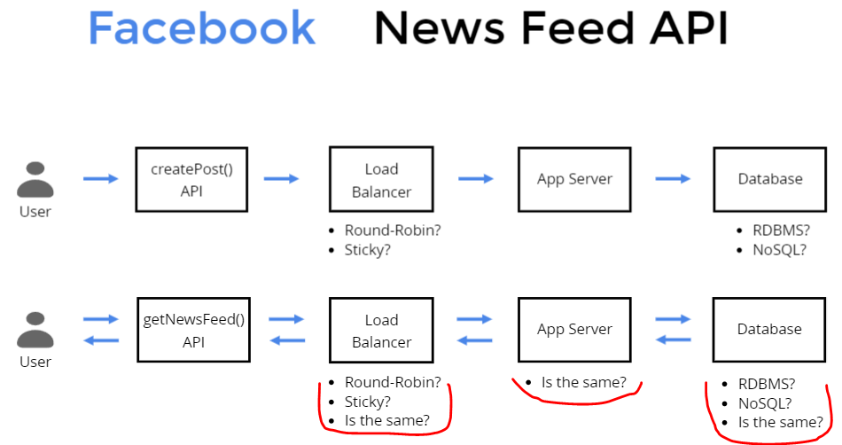
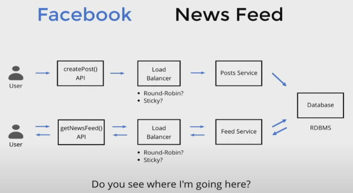
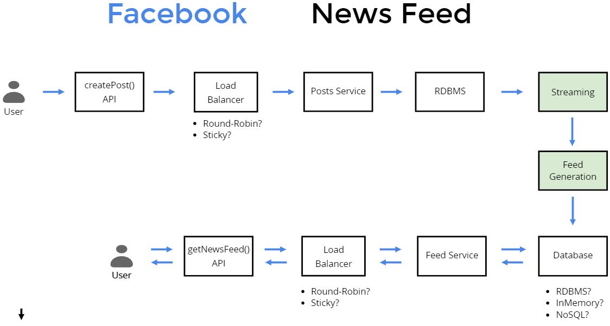
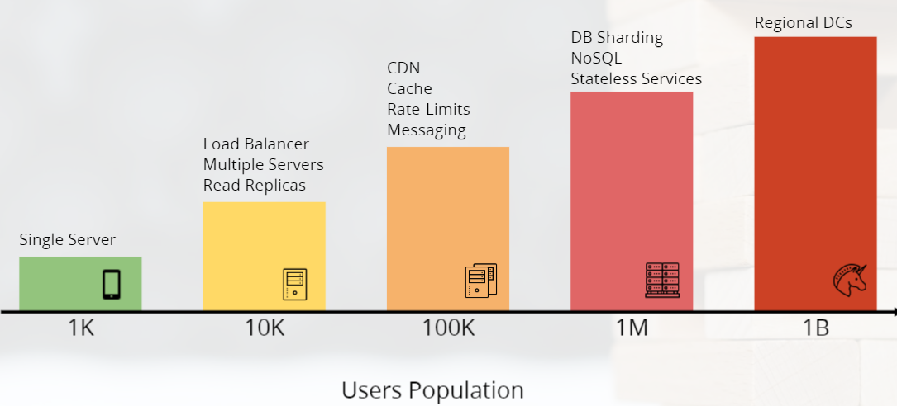
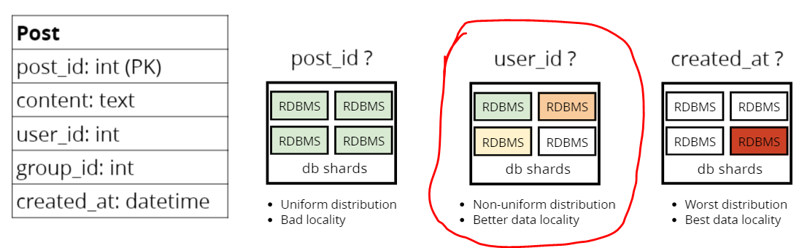
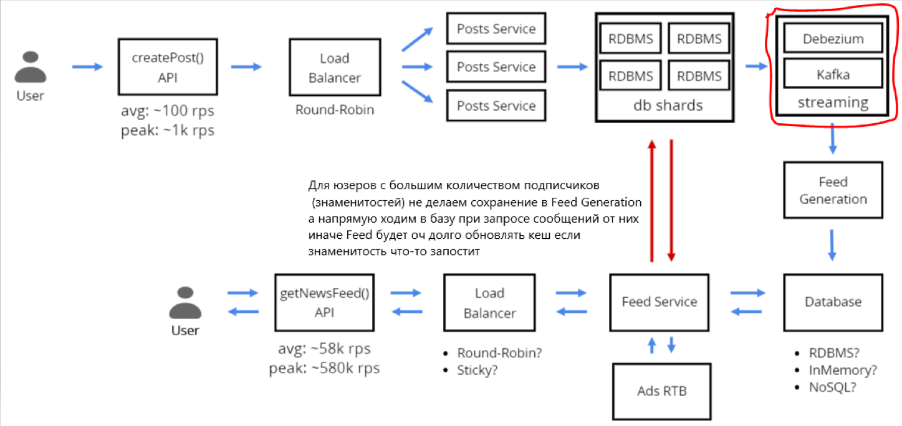
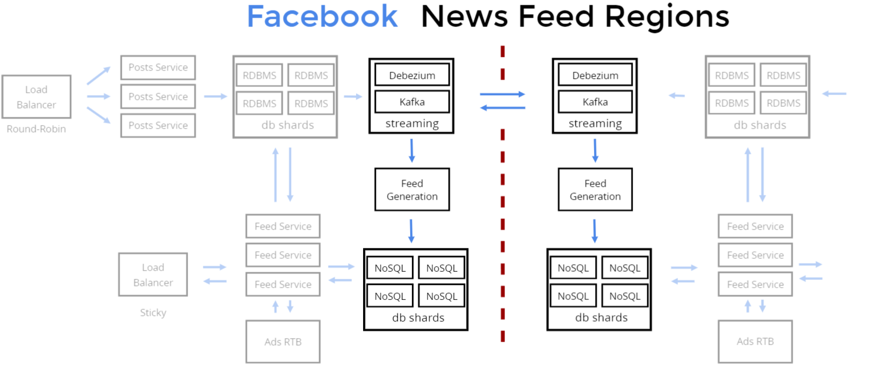

== Как задизайнить Facebook за пол часа или секреты System Design Interview

link:https://www.youtube.com/watch?v=Be7INI_U6GY[youtube] +
presentation: link:https://slides.com/alexhelkar/system-design-interview[slides.com] (Katukov/Katukov)

=== План

- 1) реквайременты (4 мин)
- 2) эстимейты (3 мин)
- 3) AIP/системный интерфейс - точки входа и выхода в систему (3 мин)
- 4) highlevel design (5 мин)
- 5) Component detailed design (15 мин)
- 6) Scale the design / Bottlenecks (5 мин)
- 7) Summary (5 мин)

=== Requirements classification

===== Что должна система делать?
Мы строим facebook или мы строим систему "как facebook"? Наша задача - урезать скоуп. +
"Какую часть фейсбука мы сегодня строим?" - вот еще один вариант. Допустим - News Feed.

- *_Q: What part of Facebook we're going to design?_* +
_A: Design Facebook News Feed_

-  *_Q: What part of Facebook News Feed do we need to design? Adding new posts? Showing posts from friends/groups? Real-time updates? Likes? Comments?_* +
_A: Adding new posts and loading news feed. Ultimately, we want to design a feed generation and refreshing piece of the data pipeline_

- *_Q: Should we handle video and photo uploads?_* +
_A: Let's keep it for the v2_

- *_Q: Do we need to design any posts ranking system or should they be in chronological order?_* +
_A: Let's have a list of posts in chronological order_

- *_Q: What about Ads in the news feed?_* +
_A: That'd be nice if we could have them. But it's not a priority for now._

- *_Q: Should we consider implementing also user friend requests and groups membership? Or can we assume this data is already available somewhere?_* +
_A: We can assume this data is available in the DB_

- *_Q: Are we designing a global multi-region service or a regional one?_* +
_A: We want this feature to be available globally_

- *_Q: How quickly do we need to have an update in a news feed once a post is published?_* +
_A: It may depend on location. Users in the same region should see updates in seconds. Users over the ocean may see an update within a minute_

- *_Q: What type of availability are we aiming for?_* +
_A: I'd say rather durability is important. We can't lose a post once it's created. High Availability is a second priority._

- *_Q: How many daily active users do we have?_* +
_A: About 1 billion_

- *_Q: How many posts per day do we have?_* +
_A: 10 million posts per day_

- *_Q: How many friends does a user has on average?_* +
_A: About 500 friends. Of course, there are users that have much more._

- *_Q: How many News Feed views user can do per day? 5-10?_* +
_A: Let it be a 5 news feed views per day_

===== Summary

- Design FB News Feed
- No photo/video in posts
- No post ranking. Chronological order
- Ads - nice to have (soft requirement)
- Multi-region (hard requirement)
- Latency (within region): < 1s
- Latency (multi-region): < 60s
- Durability is very important
- Availability less important
- 1B daily active users
- 10M posts per day
- 500 average friends
- 5 news feed views per user per day

===== Estimation Cheat Sheet

*_Storage Scale_*

- Character = 1 byte
- Metadata = 5-10 KB
- 1080p Image = 2MB
- 1080p Video (1 min) = 30MB

*_Server Capacity_*

- Disk Space = ~ 10TB
- RAM = ~256GB - 512GB

*_Facts_*

- 1B daily active users (DAU)
- 5B views per day
- 10M posts per day

*_Estimates_*

- _Read-write ratio_: +
  5B / 10M = 500:1 -> В 500 раз больше чтений чем записей
- _RPS_: +
  Read: 5B / (24*60*60) = ~58k rps +
  Write: 10M /(24*60*60) = ~115 rps
- _Posts DB Storage_: +
10KB * 10M = 100GB (Daily) +
30 * 100GB = 3TB (Monthly)
- _Throughput_: +
Read: 5B * 20pst * 10KB = 1PB/day +
Write: 10M * 10KB = 100GB/day

=== Highlevel Design

=== Detailed Design

- Схема базы данных и запросы
- Представление различных подходов (за/против)
- Выберите решение и объясните компромиссы
- Удовлетворение функциональных требований
- Проверка на нарушение нефункциональных требований
- Попробуйте подумать об edge-cases

===== Performance Mantras

- Don't do it (если можете не делать - не делайте)
- Do it, but don't do it again (если не можете не делать - делайте ток 1 раз - препроцессинг)
- Do it less (делать реже)
- Do it later (отложите обработку)
- Do it when they're not looking (пока юзер не видит)
- Do it concurrently
- Do it cheaper (как можно дешевле)

Streaming database - link:https://bigdataschool.ru/blog/how-to-choose-streaming-database.html[bigdataschool.ru]

Feed Generation - link:https://liuzhenglaichn.gitbook.io/system-design/news-feed/design-a-news-feed-system[liuzhenglaichn]

===== Scalability and Bottlenecks

Debezium - CDC СУДБ->KAFKA (Capture Data Change) - link:https://habr.com/ru/companies/flant/articles/523510/[habr]

===== Facebook Feed Regions

