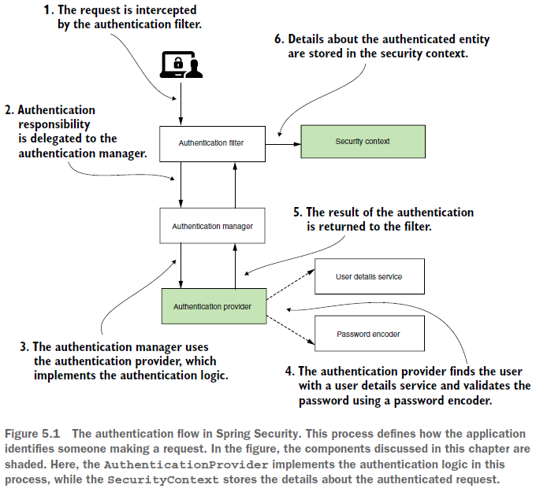
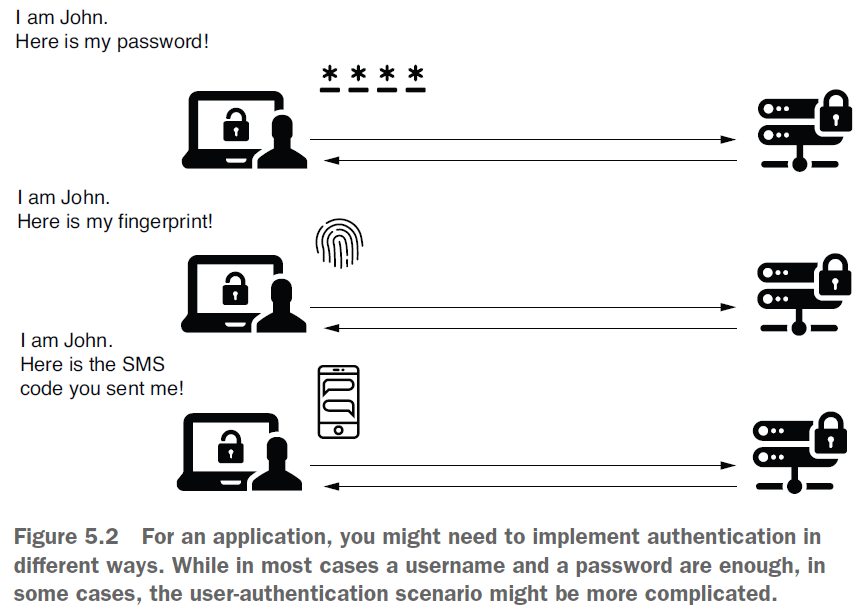
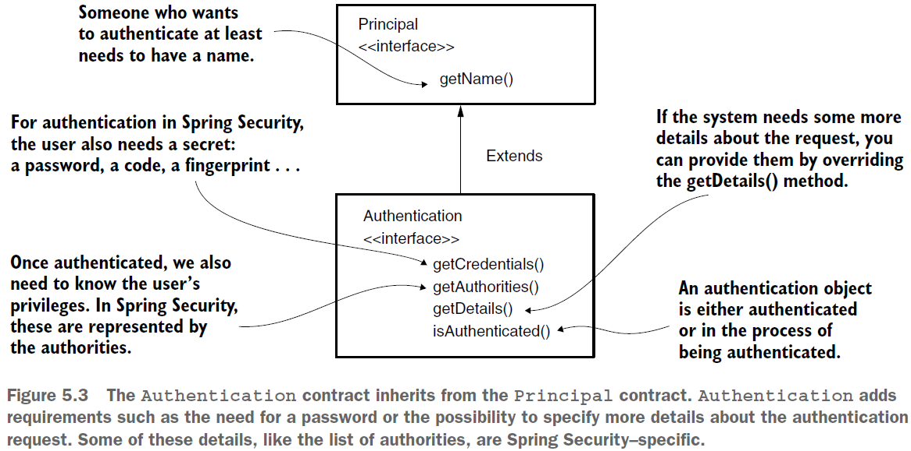
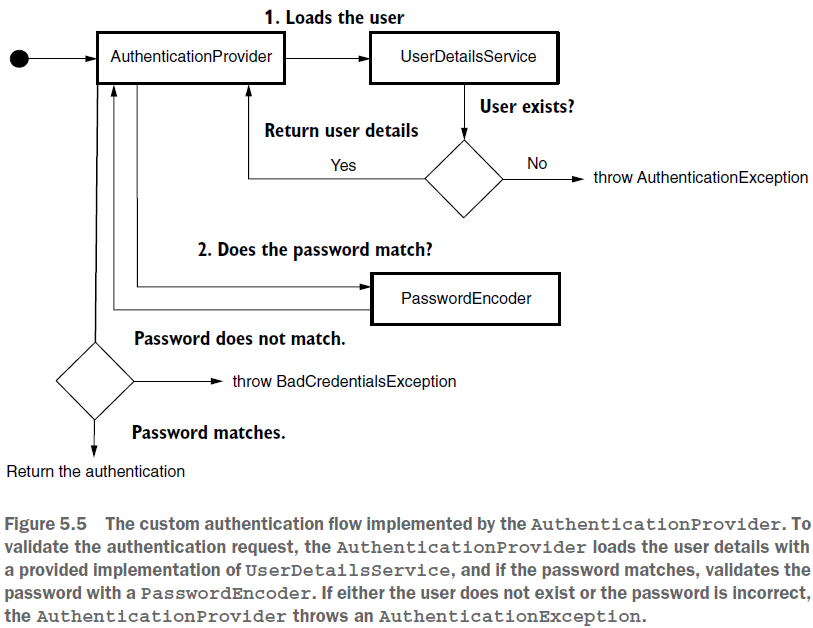

== Реализация аутентификации

*Content:*

- 1. Intro
- 2. Понимание контракта AuthenticationProvider
  * 2.1 Authentication interface. Principal.
  * 2.2 Интерфейс AuthenticationProvider
- 3. Реалищация кастомной логики аутентификации

=== 1. Intro

Уровень *_AuthenticationProvider_*, который мы ранее подробно рассмотрели (_UserDetailsService_, _UserDetailsManager_, _PasswordEncoder_), отвечает за следующее - аутентифицировать запрос или нет. А вот компонент, который делегирует эту ответственность _AuthenticationProvider-у_, называется *AuthenticationManager*, который получает запрос от уровня HTTP-фильтров.

Для простоты давайте рассмотрим такую аутентификацию, которая имеет только два результата:

- 1) _The entity making the request is *not authenticated*._ Пользователь не распознается, и приложение отклоняет запрос, не делегируя его авторизации. Обычно в этом случае статус ответа, отправляемого обратно клиенту, — HTTP 401 Unauthorized.
- 2) _The entity making the request is *authenticated*._ Сведения о реквестере сохраняются таким образом, что приложение может использовать их для авторизации. Как мы узнаем позже, сведения о текущем аутентифицированном запросе хранятся в интерфейсе *_SecurityContext_*.

Вернемся к нашей рассмотренной ранее схеме:

Мы рассмотрим оставшиеся части аутентификации - *_AuthenticationManager_* и *_SecurityContext_*. Мы начнем с интерфейса *Authentication* и узнаем, что происходит с request details после успешной аутентификации. Также после успешной аутентификации в дело вступает *_SecurityContext_*. Также мы рассмотрим аутентификацию на основе HTTP Basic и на основе форм входа (form-based login).

=== 2. Понимание контракта AuthenticationProvider

Бывают ситуации, когда стандартная реализация аутентификации на основе username/password не применяется или же используется совместно с другими сценариями. например, подтверждение личности через код SMS-сообщения или другого приложения (при входе в VPN). Или пользователь должен предоставить ключ определенного типа, хранящийся в файле. Возможно, вам даже потребуется использовать представление отпечатка пальца пользователя для реализации логики аутентификации. Spring Security достаточно гибкий фреймворк, и если даже он не может сам реализовать ваш сценарий, вы можете использовать контракт _AuthenticationProvider_ для кастомной логики.

Итак:

- 1) Проанализируем, как Spring Security представляет *_authentication event_* (событие аутентификации).
- 2) Раасмотрим контракт *_AuthenticationProvider_*, который отвечает за логику аутентификации.
- 3) Напишем пример кастомной логики аутентификации имплементируя интерфейс _AuthenticationProvider_

=== 2.1 Authentication interface. Principal.

*Authentication* - один из основных интерфейсов процесса аутентификации. Интерфейс _Authentication_ представляет собой событие *_authentication request_* и содержит сведения об объекте, который запрашивает доступ к приложению. Информация о _authentication request_ доступна во время и даже после аутентификации. Пользователь, запрашивающий доступ к приложению, называется *Principal*. В _Java Security API_ интерфейс *Principal* представляет такую же концепцию, а интерфейс _Authentication_ расширяет его:

Рассмотрим сам интерфейс _Authentication_:
[source, java]
----
public interface Authentication extends Principal, Serializable {
    Collection<? extends GrantedAuthority> getAuthorities();
    Object getCredentials();
    Object getDetails();
    Object getPrincipal();
    boolean isAuthenticated();
    void setAuthenticated(boolean isAuthenticated) throws IllegalArgumentException;
}
----
Прямо сейчас нам нужны всего три метода (остальные обсудим позже):

- `isAuthenticated()` - Returns true if the authentication process ends or false
if the authentication process is still in progress.
- `getCredentials()` - Returns a password or any secret used in the process of
authentication.
- `getAuthorities()` - Returns a collection of granted authorities for the
authenticated request.

=== 2.2 Интерфейс AuthenticationProvider

Реализация интерфейса *_AuthenticationProvider_* по умолчанию делегирует ответственность за поиск системного пользователя службе *_UserDetailsService_*. Он также использует *_PasswordEncoder_* для управления паролями в процессе аутентификации. Рассмотрим определение интерфейса:
[source, java]
----
public interface AuthenticationProvider {

    Authentication authenticate(Authentication authentication) throws AuthenticationException;

    boolean supports(Class<?> authentication);
}
----
Он тесно связан с интерфейсом _Authentication_.

==== 2.2.1 AuthenticationProvider.authenticate()

Метод `authenticate()` получает и возвращает _Authentication_ и должен имплементировать логику аутентификации. Можно резюмировать способ реализации метода *_authenticate()_* в трех пунктах:

- 1) Метод должен выкинуть *_AuthenticationException_* если аутентификация провалилась.
- 2) Если объект аутентификации не поддерживается текущей имплементацией _AuthenticationProvider_, метод _authenticate()_ возвращает _null_. Благодаря этому мы можем использовать множественные типы аутентификации на уровне HTTP-фильтра.
- 3) Метод должен вернуть объект _Authentication_, представляющий полностью аутентифицированный объект. В этом случае метод *_isAuthenticated()_* возвращает значение _true_, а полученный объект _Authentication_ содержит все сведения об аутентифицированном объекте. Обычно приложение также удаляет из этого экземпляра _Authentication_ конфиденциальные данные, такие как пароль (мы потом рассмотрим метод _ProviderManager.setEraseCredentialsAfterAuthentication(boolean eraseSecretData)_ который позволяет переопределить поведение стирания пароля).

==== 2.2.2 AuthenticationProvider.supports()

Метод `supports()` возвращает _true_, если ваш кастомный AuthenticationProvider  поддерживает тип, указанный в качестве объекта _Authentication_. Хотя даже в этом случае метод _authenticate()_ может вернуть _null_ - поскольку _AuthenticationProvider_ может отклонить запрос аутентификации на основе сведений о запросе, а не только по его типу.

=== 3. Реализация кастомной логики аутентификации

*_See_* _p102_Implementing_authentication/security/CustomAuthenticationProvider.java_

Определяем свой _CustomAuthenticationProvider_.

- 1) *метод _supports()_* +
Если мы ничего не настраиваем на уровне фильтра аутентификации (сделаем это позже, в главе 9), то стандартный запрос аутентификации с именем пользователя и паролем представляется с помощью *UsernamePasswordAuthenticationToken* - поэтому мы проверяем именно этот тип в методе *_supports()_*. +
*NOTE!* +
_UsernamePasswordAuthenticationToken_ <- _AbstractAuthenticationToken_ <- _Authentication_
- 2) *метод _authenticate()_* +
Данный метод описан в виде блок-схемы на следующем рисунке. AuthenticationProvider загружает сведения о пользователе из UserDetailsService и, если username совпадает, проверяет пароль с помощью PasswordEncoder. Если пользователь не существует или пароль неверный, AuthenticationProvider выдает исключение AuthenticationException:

Чтобы подключить новую реализацию AuthenticationProvider, надо переопределить метод +
`WebSecurityConfigurerAdapter.configure(AuthenticationManagerBuilder auth)` +
в классе конфигурации проекта, наследуемого от WebSecurityConfigurerAdapter. Этот метод добавит текущий AuthenticationProvider в список который потом будет назначен реализации _AuthenticationManager_ - *_ProviderManager_*, содержащему несколько _AuthenticationProvider_. +
(Кстати, у этого *_ProviderManager_* можно вызвать метод `ProviderManager.setEraseCredentialsAfterAuthentication(boolean eraseSecretData)` и запретить стирание пароля)

*_See_* _p102_Implementing_authentication/config/ProjectConfig.java_

А еще мы туда добавим бины _UserDetailsService_ и _PasswordEncoder_ для использования их внутри _CustomAuthenticationProvider_. +
Кстати, если делать все так как в source code к книжке:
[source, java]
----
@Configuration
public class ProjectConfig extends WebSecurityConfigurerAdapter {

    // Circular Dependency because CustomAuthenticationProvider
    // depends on UserDetailsService/PasswordEncoder
    @Autowired
    private AuthenticationProvider authenticationProvider;

    @Override
    protected void configure(AuthenticationManagerBuilder auth) {
        auth.authenticationProvider(authenticationProvider);
    }

    @Bean
    public UserDetailsService userDetailsService(DataSource dataSource) {
        // omitted
    }
    @Bean
    public PasswordEncoder passwordEncoder() {
       // omitted
    }
}
----
То можно получить Circular Dependency из-за того что CustomAuthenticationProvider зависит от UserDetailsService/PasswordEncoder

Выход следующий: не делать _CustomAuthenticationProvider_ *_@Component_*-ом а регать как бин в ProjectConfig (как это и сделано).