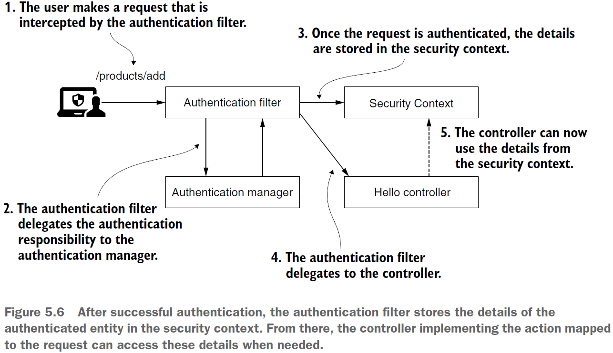

== SecurityContext

*Content:*

- 1. Intro
  * 1.1 MODE_THREADLOCAL
  * 1.2 MODE_INHERITABLETHREADLOCAL
- 2. Пропагация SecurityContext через DelegatingSecurityContextRunnable/DelegatingSecurityContextCallable
- 3. Пропагация SecurityContext через DelegatingSecurityContextExecutorService

=== 1. Intro

Вполне вероятно, что вам потребуются подробности об аутентифицированном объекте после завершения процесса аутентификации. Например, вам нужно получить имя или роли пользователя. Как только _AuthenticationManager_ успешно завершает процесс аутентификации, он сохраняет экземпляр _Authentication_ в *SecurityContext*.

Пример доступа к ролям токена:
[source, java]
----
public List<String> getBearerTokenRoles() {
    Authentication authentication = SecurityContextHolder.getContext().getAuthentication();
    if (auth == null || auth instanceof AnonymousAuthenticationToken) {
        return null;
    }
    List<? extends GrantedAuthority> authorities = (List) authentication.getAuthorities();
    if (authorities == null) {
        return null;
    }
    return authorities.stream().map(GrantedAuthority::getAuthority)
        .filter(Objects::nonNull).collect(Collectors.toList());
}
----
Рассмотрим сам интерфейс *_SecurityContext_*. По факту он просто хранит объект Authentication:
[source, java]
----
public interface SecurityContext extends Serializable
    Authentication getAuthentication(); // getter
    void setAuthentication(Authentication authentication); // setter
}
----
Но как управляется сам SecurityContext? Spring Security предоставляет три стратегии управления _SecurityContext_ с помощью менеджера _SecurityContext_ - *SecurityContextHolder*:

- MODE_THREADLOCAL - Каждый поток хранит свои данные в контексте безопасности - обычно классика для веба, т. к. каждый запрос имеет отдельный поток. Контекст не наследуется _@Async_-методами.  +
- MODE_INHERITABLETHREADLOCAL - похоже на MODE_THREADLOCAL, но при вызове метода с *_@Async_* этот метод наследует поток безопасности (не работает при старте обычного потока).
- MODE_GLOBAL - все потоки приложения используют общий контекст безопасности. Нужна синхронизация.

А вот когда вы определяете свои собственные потоки, неизвестные Spring, вам нужно явно скопировать _SecurityContext_ в новый поток. Spring Security не может автоматически управлять объектами, не находящимися в Spring context, но предоставляет для этого несколько служебных классов. Кстати, можно сделать свой личный *AppContext* и сетать его, например, в кастомной имплементации HandlerInterceptor - перехватчика запросов.

=== 1.1 MODE_THREADLOCAL

Стратегия by default. Использует *_ThreadLocal_* (реализация, предоставляемая JDK) для управления контекстом. Каждый поток видит только свой _SecurityContext_, а чужих не видит - безопасно. Важно отметить, что эта архитектура применима только к традиционным сервлет-приложениям, где каждому запросу назначается собственный поток. Это не относится к реактивным приложениям.

Для получения этого контекста можно вызвать статический метод `SecurityContextHolder.getContext()` как показано в листинге выше - *_See_* _"Пример доступа к ролям токена"_. При этом на уровне эндпоинта этот контекст можно получить и таким образом:
[source, java]
----
@GetMapping("/hello")
public String hello(Authentication a) { // просто добавляем параметр Authentication в метод эндпоинта
  return "Hello, " + a.getName() + "!";
}
----
*_See_* _p113_SecurityContext/controllers/HelloController.hello()_

=== 1.2 MODE_INHERITABLETHREADLOCAL

Про _@Async_ - см link:https://www.tune-it.ru/web/romo/blog/-/blogs/12523232#:~:text=%D0%90)%20%D0%90%D0%BD%D0%BD%D0%BE%D1%82%D0%B0%D1%86%D0%B8%D1%8F%20%40Async%20%D0%B4%D0%BE%D0%BB%D0%B6%D0%BD%D0%B0%20%D0%BF%D1%80%D0%B8%D0%BC%D0%B5%D0%BD%D1%8F%D1%82%D1%8C%D1%81%D1%8F,%D0%B6%D0%B5%20%D0%BA%D0%BB%D0%B0%D1%81%D1%81%D0%B0%2C%20%D0%B3%D0%B4%D0%B5%20%D0%BE%D0%BD%20%D0%BE%D0%BF%D1%80%D0%B5%D0%B4%D0%B5%D0%BB%D0%B5%D0%BD.[link] +
Для пропагации _SecurityContext_ при вызове метода с _@Async_. Пример настройки:
[source, java]
----
@Configuration
@EnableAsync
public class ProjectConfig {
    @Bean
    public InitializingBean initializingBean() {
        return () -> SecurityContextHolder.setStrategyName(
            SecurityContextHolder.MODE_INHERITABLETHREADLOCAL);
    }
}
----
*_See_* _p113_SecurityContext/controllers/HelloController.goodbye()_, _p113_SecurityContext/config/ProjectConfig.java_

=== 2. Пропагация SecurityContext через DelegatingSecurityContextRunnable/DelegatingSecurityContextCallable

Spring Security не пропагирует SecurityContext при создании обычных потоков. Но можно использовать

- `DelegatingSecurityContextRunnable implements Runnable`.
- `DelegatingSecurityContextCallable<T> implements Callable<T>`.

По сути это декораторы над _Runnable_ и _Callable_, которые переопределяют метод _call()_, копируя контекст безопасности в новый поток и выполняя метод _call()_ родительского интерфейса. Пример их применения:
[source, java]
----
@GetMapping("/ciao")
public String ciao() throws Exception {
    Callable<String> task = () -> { // создаем Callable таску
        SecurityContext context = SecurityContextHolder.getContext();
        return context.getAuthentication().getName();
    };

    ExecutorService e = Executors.newCachedThreadPool(); // новый ExecutorService
    try {
        // оборачиваем Callable таску в DelegatingSecurityContextCallable декоратор
        // для пропагации контекста
        var contextTask = new DelegatingSecurityContextCallable<>(task);
        return "Hello, " + e.submit(contextTask).get() + "!";
    } finally {
        e.shutdown();
    }
}
----
*_See_* _p113_SecurityContext/controllers/HelloController.ciao()_

=== 3. Пропагация SecurityContext через DelegatingSecurityContextExecutorService

Есть и второй вариант обработки пропагации _SecurityContext_ при создании новых потоков - управдение этим из пула потоков *DelegatingSecurityContextExecutorService*. Этот пул потоков перед вызовом родительского метода _submit()_ оборачивает Runnable/Callable таску в DelegatingSecurityContextRunnable/DelegatingSecurityContextCallable. +
Пример использования:
[source, java]
----
@GetMapping("/hola")
public String hola() throws Exception {
    Callable<String> task = () -> { // создаем Callable таску
        SecurityContext context = SecurityContextHolder.getContext();
        return context.getAuthentication().getName();
    };

    // создаем DelegatingSecurityContextExecutorService (передавая ему delegate)
    ExecutorService e = Executors.newCachedThreadPool();
    e = new DelegatingSecurityContextExecutorService(e);
    try {
        return "Hola, " + e.submit(task).get() + "!";
    } finally {
        e.shutdown();
    }
}
----
*_See_* _p113_SecurityContext/controllers/HelloController.hola()_

Также Spring Security предлагает другие декораторы для пропагации _SecurityContext_ в потоки. Об этих классах *_See_* link:../ch2_plain_java/sn9_concurrent.adoc[]:

- DelegatingSecurityContextExecutor - декоратор Executor
- DelegatingSecurityContextScheduledExecutorService - декоратор ScheduledExecutorService
