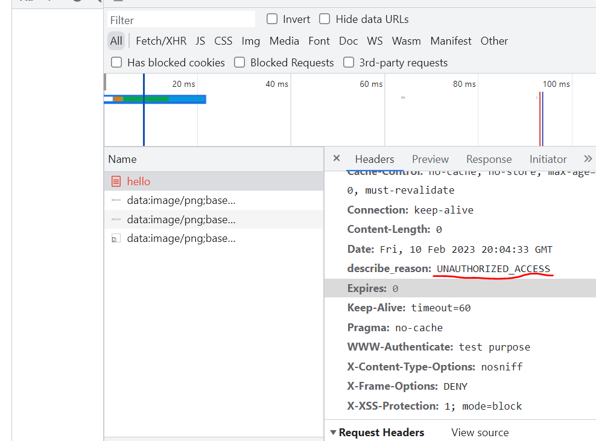
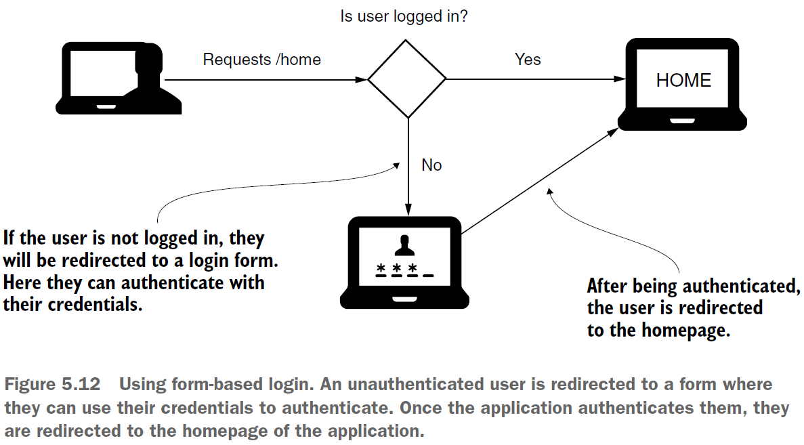
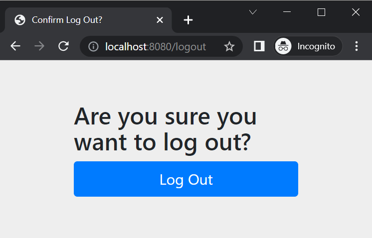

== More about HTTP Basic. FormLogin (form-based login)

*Source code:*

- _p124_HTTP_Basic_and_form_based_login_auth/..._ (1, 2)
- _p127_formLogin_homepage/..._ (3)
- _p130_authenticationHandlers/..._ (4)

*Content:*

- 1. Использование и настройка HTTP Basic. Customizer
- 2. AuthenticationEntryPoint. Настройка ответа на неудачную аутентификацию
- 3. FormLogin
- 4. AuthenticationSuccessHandler и AuthenticationFailureHandler для кастомизации логики аутентификации

---

Давайте узнаем больше о конфигурациях, связанных с HTTP Basic. Кроме того, рассмотрим новый метод аутентификации под названием *formLogin*.

=== 1. Использование и настройка HTTP Basic. Customizer

HTTP Basic является методом аутентификации по умолчанию. Рассмотрим дополнительные сведения о настройке этого метода аутентификации. +
Для теоретических сценариев прекрасно подходят дефолтные настройки HTTP Basic. Но в более сложном приложении вам может понадобиться настроить некоторые из этих параметров. Например, вы можете захотеть реализовать определенную логику для случая, когда происходит сбой процесса аутентификации - допустим, настроить отправку response клиенту после этого. Рассмотрим эти случаи на практических примерах:

- 1) Вы можете вызвать метод httpBasic() с параметром типа *Customizer*. Этот параметр позволяет настроить некоторые параметры, связанные с методом аутентификации, например, реалм. *_See_* _p124_HTTP_Basic_and_form_based_login_auth/config/ProjectConfig.java_:

[source, java]
----
@Configuration
public class ProjectConfig extends WebSecurityConfigurerAdapter {
  //метод для настройки аутентификации (тип аутентификации и проч)
  // по дефолту этот метод вызывает у HttpSecurity
  // методы httpBasic(), formLogin() и authorizeRequests()
  @Override
  protected void configure(HttpSecurity http) throws Exception {
    http.httpBasic(customizer -> { // Customizer<HttpBasicConfigurer<HttpSecurity>>
      customizer.realmName("OTHER");
      // Эта строка относится уже к AuthenticationEntryPoint - смотри пункт 2
      customizer.authenticationEntryPoint(new CustomEntryPoint());
    });

    http.authorizeRequests().anyRequest().authenticated();
  }
}
----
Кстати, дефолтный `protected void configure(HttpSecurity http)` внутри себя вызывает у HttpSecurity методы _httpBasic()_, _formLogin()_ и _authorizeRequests()_.

Если запустить это приложение (без класса CustomEntryPoint), то можно заметить (см консоль браузера), что при неуспешной аутентификации в response headers возвращается header `WWW-Authenticate: Basic realm="OTHER"`. При успешной аутентификации же такого не возвращается.

=== 2. AuthenticationEntryPoint. Настройка ответа на неудачную аутентификацию

С помощью Customizer мы можем настроить ответ на неудачную аутентификацию. Это нужно сделать, если клиент ожидает особенного response при неудачной аутентификации. Возможно, вам нужно добавить или удалить один или несколько header-ов. Или у вас может быть логика, которая удяляет конфиденциальные данные из response body.

Чтобы настроить ответ на неудачную аутентификацию, мы можем реализовать *AuthenticationEntryPoint*. Его метод `commence()` принимает _HttpServletRequest_, _HttpServletResponse_ и исключение _AuthenticationException_, которое и привело к сбою аутентификации. +
Имя у класса _AuthenticationEntryPoint_ вводит в заблуждение, поскольку не отражает его использование при сбое аутентификации. Этот класс используется только компонентом *_ExceptionTranslationManager_*, который обрабатывает любые исключения _AccessDenied_ и _AuthenticationException_, созданные в цепочке фильтров. По факту _ExceptionTranslationManager_ является мостом между Java exceptions и HTTP responses.

Рассмотрим реализацию AuthenticationEntryPoint. *_See_* _p124_HTTP_Basic_and_form_based_login_auth/config/CustomEntryPoint.java_:
[source, java]
----
public class CustomEntryPoint implements AuthenticationEntryPoint {
    @Override
    public void commence(HttpServletRequest request, HttpServletResponse response,
                         AuthenticationException authException) throws IOException, ServletException {
      // добавляем кастомный HEADER в response
      // default реализация commence() как раз и добавляет здесь header:
      // 'WWW-Authenticate: Basic realm="..."'
      response.addHeader("describe_reason", "UNAUTHORIZED_ACCESS");
      response.sendError(HttpStatus.UNAUTHORIZED.value());
    }
}
----
Теперь при заходе на страницу в браузере вы не будете видеть вкладки login - будет просто 401. И в этом 401 вы и сможете увидеть хидер `describe_reason: UNAUTHORIZED_ACCESS`:

=== 3. FormLogin. Вход в систему через форму логина

При разработке веб-приложения надо предоставить удобную для пользователя форму входа. Кроме того, зачастую необходимо, чтобы аутентифицированные пользователи могли просматривать веб-страницы после того, как они вошли в систему, и иметь возможность выйти из системы. Для небольшого веб-приложения можно воспользоваться методом входа на основе формы.

Для изменения метода атентификации надо в методе `protected void configure(HttpSecurity http)` вызвать метод _HttpSecurity_ `formLogin()` (см. выше). Этот метод возвращает объект _FormLoginConfigurer_, принадлежащий объекту _HttpSecurity_.

Итак, мы можем создать форму логина. Давайте теперь создадим домашнюю страницу, куда будет попадать юзер после успешной аутентификации: в папку _resources/static_ добавим файл домашней страницы *_p127_home.html_*. Изменится и контроллер. Мы аннотируем его через _@Controller_, а не через _@RestController_, поэтому Spring находит view для домашней страницы. *_See_* _p127_formLogin_homepage/..._:
[source, java]
----
@Controller // not @RestController
public class HelloController {
    @GetMapping("/home")
    public String home() {
      return "p127_home.html";
    }
}
----
При попытке получить доступ к `/home` пользователь будет перенаправлен на страницу логина. После успешного входа он будет перенаправлен на домашнюю страницу _p127_home.html_. Теперь пользователь может получить доступ к странице выхода `/logout` и разлогиниться:

При этом если изначально ввести несуществующий урл и залогиниться, то будет выдана страница с ошибкой. Чтобы после логина на несуществующий урл пользователь переходил на домашнюю страницу, нужно вызвать метод `http.formLogin().("/home", true)`. Первый параметр показывает адрес (в контроллере), куда перенаправлять пользователя. И пользователь будет всегда переправляться туда при успешном логине. *_See_* _p127_formLogin_homepage/..._:
[source, java]
----
@Override
protected void configure(HttpSecurity http) throws Exception {
    http.formLogin()
        .defaultSuccessUrl("/home", true);
    http.authorizeRequests().anyRequest().authenticated();
}
----

=== 4. AuthenticationSuccessHandler и AuthenticationFailureHandler для кастомизации логики аутентификации

Если необходимо еще больше кастомизировать поведение приложения после успешной или неуспешной аутентификации, то можно использовать *AuthenticationSuccessHandler* и *AuthenticationFailureHandler*.

Рассмотрим пример настройки *_AuthenticationFailureHandler_* - мы при неудачной аутентификации добавляем дополнительный header. *_See_* _p130_authenticationHandlers/..._:
[source, java]
----
@Component
public class CustomAuthenticationFailureHandler
    implements AuthenticationFailureHandler {
    @Override
    public void onAuthenticationFailure(HttpServletRequest httpServletRequest,
        HttpServletResponse httpServletResponse, AuthenticationException e) {
        httpServletResponse
            .setHeader("failed", LocalDateTime.now().toString());
        httpServletResponse.setStatus(HttpStatus.UNAUTHORIZED.value());
        // а можем вместо сетания хидера редиректнуть на логин повторно
        // httpServletResponse.sendRedirect("/login");
    }
}
----

А теперь - пример настройки *_AuthenticationSuccessHandler_* - мы после аутентификации получаем роли и смотрим, есть ли роль "read". Если есть, то принудительно редиректим на урл "/home", а если нет - редиректим обратно на "/login" и убираем объект _Authentication_ из _SecurityContext_. *_See_* _p130_authenticationHandlers/..._:

[source, java]
----
@Component
public class CustomAuthenticationSuccessHandler implements AuthenticationSuccessHandler {
    @Override
    public void onAuthenticationSuccess(HttpServletRequest httpServletRequest,
        HttpServletResponse httpServletResponse, Authentication authentication)
        throws IOException {

        var authorities = authentication.getAuthorities();
        var auth = authorities.stream()
                    .filter(a -> a.getAuthority().equals("read"))
                    .findFirst();
        if (auth.isPresent()) {
            httpServletResponse.sendRedirect("/home");
        } else {
            // logout the user - clear security context
            SecurityContextHolder.clearContext();
            httpServletResponse.sendRedirect("/error");
        }
    }
}
----
Данные handler-s мы можем подключить в configuration-классе через метод *_formLogin()_* у объекта _FormLoginConfigurer_, принадлежащего объекту _HttpSecurity_. *_See_* _p130_authenticationHandlers/..._:
[source, java]
----
@Configuration
public class ProjectConfig extends WebSecurityConfigurerAdapter {

    @Autowired
    private CustomAuthenticationSuccessHandler authenticationSuccessHandler;

    @Autowired
    private CustomAuthenticationFailureHandler authenticationFailureHandler;

    @Override
    protected void configure(HttpSecurity http) throws Exception {
        http.
            formLogin()
            .successHandler(authenticationSuccessHandler)
            .failureHandler(authenticationFailureHandler)
        .and()
            .httpBasic();

        http.authorizeRequests()
                .anyRequest().authenticated();
    }

    @Override
    public void configure(WebSecurity web) throws Exception {
        web.ignoring().antMatchers("/error");
    }
}
----

