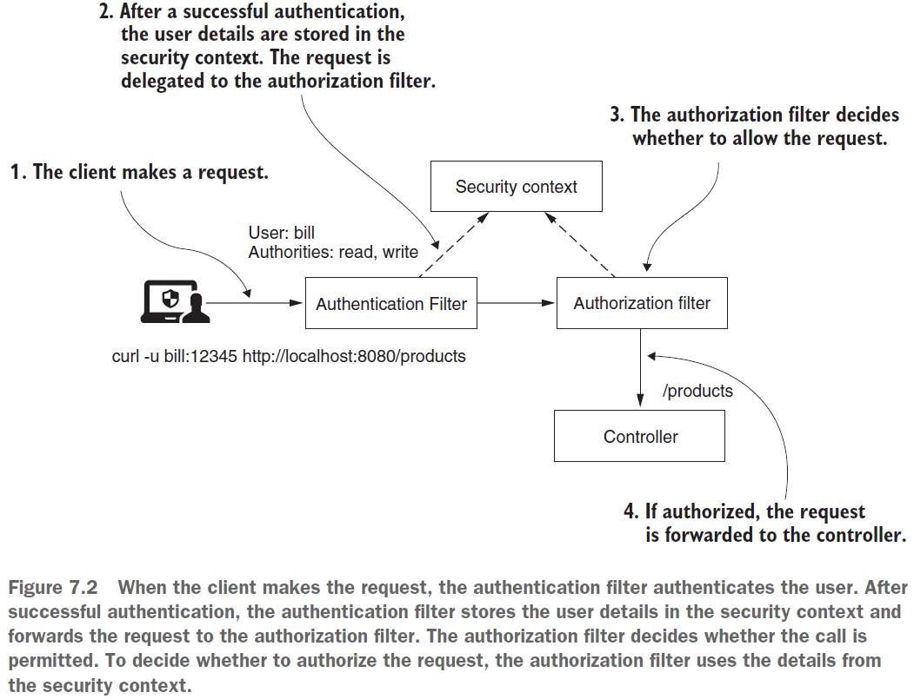
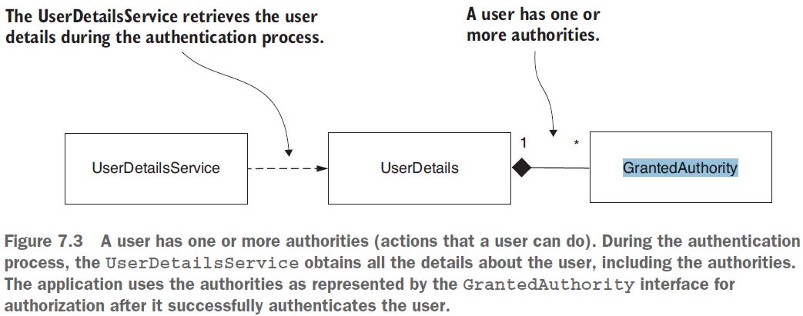

== Configuring authorization: Restricting access. GrantedAuthority. Authorities and roles

*Source code:*

- _p153_Authorization_RestrictingAccess/..._

*Content:*

- 1. Intro
- 2. Restricting access based on authorities and roles. GrantedAuthority
- 3. Методы проверки authorities
- 4. Реализация проверки authorities & roles

=== 1. Intro

*Авторизация* — это процесс, в ходе которого система решает, имеет ли аутентифицированный клиент разрешение на доступ к запрошенному ресурсу. +
Когда клиент делает запрос, фильтр аутентификации аутентифицирует пользователя. После успешной аутентификации фильтр аутентификации сохраняет сведения о пользователе в контексте безопасности и перенаправляет запрос _фильтру авторизации_. Фильтр авторизации разрешает или отклоняет запрос на основе настроенных правил авторизации, используя сведения из _SecurityContext_.

=== 2. Restricting access based on authorities and roles. GrantedAuthority

Пользователи имеют доступ к действиям на основе *_привилегий_*. Приложение предоставляет привилегии в виде *_authority_* и *_roles_*. +
Ранее мы уже рассматривали интерфейс GrantedAuthority (link - link:61_managing_users.adoc[]). Давайте подробнее изучим его:

У пользователя может быть несколько _authority_, которые считываются для авторизации после аутнтификации пользователя. Каждое _authority_ имеет string-имя, которое возвращается методом *_getAuthority()_*.

Еще раз посмотрим на интерфейс _GrantedAuthority_:
[source, java]
----
public interface GrantedAuthority extends Serializable {
  String getAuthority();
}
----

Напомним, что _UserDetails_ представляет собой контракт, описывающий пользователя. Он имеет набор экземпляров _GrantedAuthority_, как показано на рисунке выше. После завершения аутентификации _authorities_ становятся частью сведений о вошедшем в систему пользователе, которые приложение может использовать для предоставления разрешений.
[source, java]
----
public interface UserDetails extends Serializable {

    Collection<? extends GrantedAuthority> getAuthorities();

    // Omitted code
}
----

=== 3. Методы проверки authorities

Для проверки _authorities_ можно использовать три основных метода (аналогичные методы используются для ролей):

- `hasAuthority(String authority)` - позволяет настроить правило для конкретной _authority_
- `hasAnyAuthority()` - пользователь должен иметь по крайней мере одно из указанных _authority_
- `access()` - можно задать правила авторизации на основе SpEL. Однако это затрудняет чтение и отладку. Пример - надо задать чтобы у юзера были сразу и роль 'ADMIN', и роль 'DBA':

[source, java]
----
protected void configure(HttpSecurity http) throws Exception {
    http
        .authorizeRequests()
            .antMatchers("/resources/**", "/signup", "/about").permitAll()
            .antMatchers("/admin/**").hasRole("ADMIN")
            .antMatchers("/db/**").access("hasRole('ADMIN') and hasRole('DBA')")
            .anyRequest().authenticated()
            .and()
        // ...
        .formLogin();
}
----

=== 4. Реализация проверки authorities & roles

Вспомнили контракты _UserDetails_ и _GrantedAuthority_ и взаимосвязь между ними - теперь напишем приложение, применяющее правила авторизации. Создадим пример множества правил *_See_* _p153_Authorization_RestrictingAccess/config/ProjectConfig.java_:

[source, java]
----
@Configuration
public class ProjectConfig extends WebSecurityConfigurerAdapter {

  @Bean
  public UserDetailsService userDetailsService() {
    UserDetailsManager userDetailsManager = new InMemoryUserDetailsManager();

    UserDetails u1 = User.withUsername("john")
        .password("1234")
        .authorities("READ", "WRITE")
        .build();
    UserDetails u2 = User.withUsername("jane")
        .password("1234")
        .authorities("READ")
        .build();
    UserDetails u3 = User.withUsername("notifier")
        .password("1234")
        .authorities("NOTIFY")
        .build();

    userDetailsManager.createUser(u1);
    userDetailsManager.createUser(u2);
    userDetailsManager.createUser(u3);
    return userDetailsManager;
  }

  @Override
  protected void configure(HttpSecurity http) throws Exception {
    http.httpBasic();
    http.formLogin();

    http.authorizeRequests()
        .antMatchers("/info").permitAll()
        .antMatchers("/aboutYou").authenticated() // any authenticated user can access
        .antMatchers("/read").hasAuthority("READ")
        // both authorities READ & WRITE should be present
        .antMatchers("/write").access("hasAuthority('READ') and hasAuthority('WRITE')")
        .antMatchers("/notify").hasAnyAuthority("WRITE", "NOTIFY")
        .antMatchers("/dangerous").denyAll();
  }

  @Bean
  public PasswordEncoder passwordEncoder() {
    return NoOpPasswordEncoder.getInstance();
  }
}
----

Здесь мы используем 5 эндпоинтов и вешаем на них правила для _authority_ (эндпоинт *_"/dangerous"_* - см. link:169_restricting_access_to_all_endpoints.adoc[]) . По аналогии мы можем повесить на них правила для ролей:

[source, java]
----
http.authorizeRequests()
    .antMatchers("/read").hasRole("ROLE_ADMIN")
    .antMatchers("/notify").hasAnyRole("ADMIN", "USER")
    .antMatchers("/write").access("hasRole('ADMIN') and hasRole('USER')")
    .antMatchers("/console").hasAuthority("ROLE_ADMIN") // "синтетическое" создание роли с помощью префикса
----

