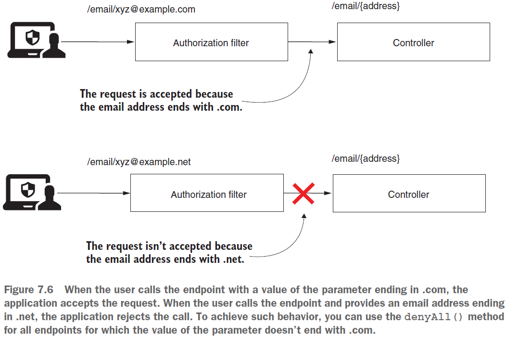
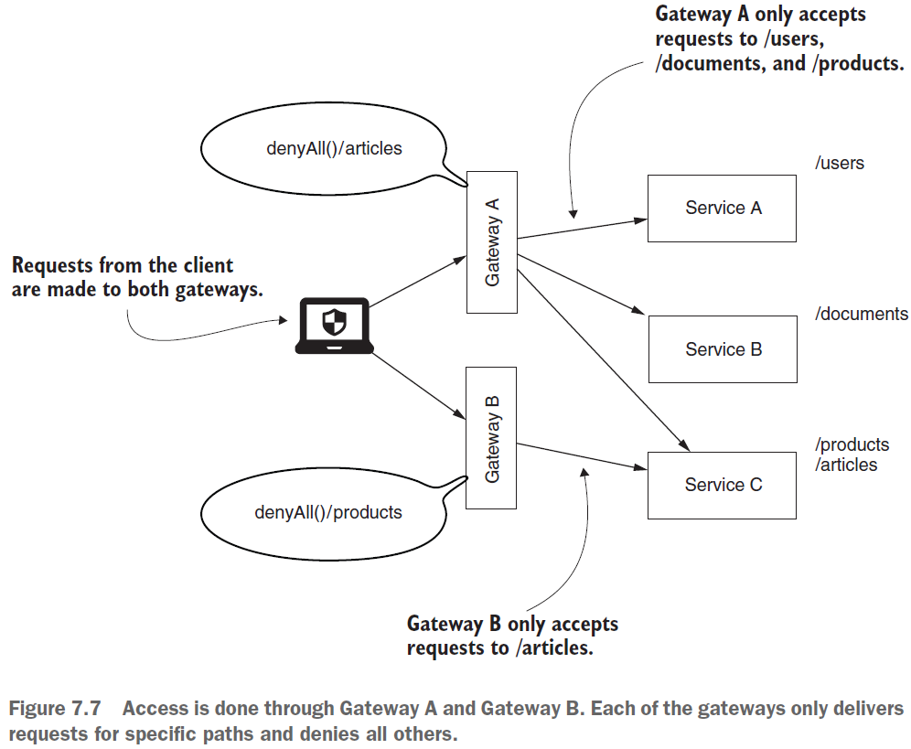

== Restricting access to all endpoints

Обсудим ограничение доступа ко всем запросам. Мы знаем, что, используя метод `allowAll()`, можно разрешить доступ для всех запросов. Но при этом также можно отклонить все запросы. Метод `denyAll()` полностью противоположен методу _allowAll()_:
[source, java]
----
@Override
protected void configure(HttpSecurity http) throws Exception {
    http.httpBasic();
    http.authorizeRequests()
        .anyRequest().denyAll(); // Uses denyAll() to restrict access for everyone
}
----

Также *_See_* _p153_Authorization_RestrictingAccess/config/ProjectConfig.java_:
[source, java]
----
  @Override
  protected void configure(HttpSecurity http) throws Exception {
    http.httpBasic();
    http.formLogin();

    http.authorizeRequests()
        ...
        .antMatchers("/dangerous").denyAll();
  }
----

Когда нам вообще нужно такое ограничение? +
Предположим, что есть эндпоинт, получающая email в _path variable_. И вы хотите разрешить запросы, значения email у которых заканчиваются только на `.com`. (Далее мы узнаем, как применять ограничения группы запросов на основании _url path, path variables и HTTP method_). Вы не хотите, чтобы приложение принимало любой другой формат адреса электронной почты. Вы используете regex для группировки всех _non-".com"_ запросов, а затем применяете denyAll() к данному regex:

Также можно представить себе приложение, которое спроектировано так:

Приложение состоит из нескольких сервисов, которые доступны через эндпоинты. Но для доступа к эндпоинтам используется _gateway_ (шлюз). Допустим, у нас есть два разных gateway - *_Gateway A_* & *_Gateway B_*. Для доступа к урлам `/products` используется _Gateway A_, для доступа к урлам `/articles` - _Gateway B_. Каждый сервис gateway отклоняет те урлы, которые они не обслуживают. Этот упрощенный сценарий показывает смысл применения метода *_denyAll()_*. В реальности вы можете найти аналогичные случаи в более сложных архитектурах:

