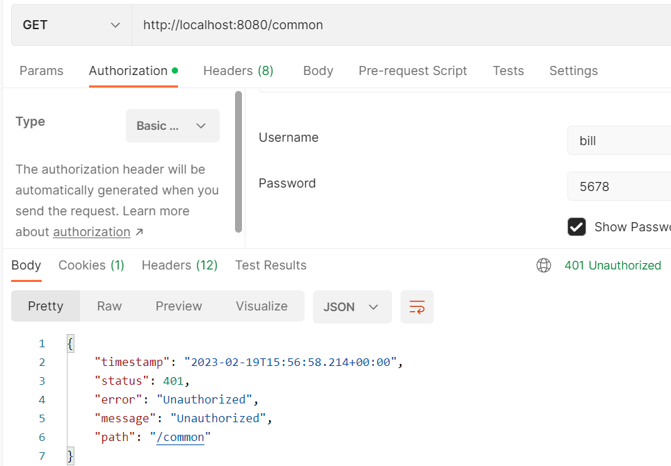
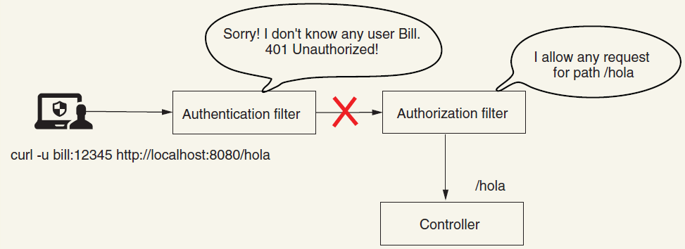

== Configuring authorization: Applying restrictions

*Source code:*

- _p172_restrict_specific_endpoints/..._ (3)
- _p179_csrf_disable_for_post_requests/..._ (5)
- _p184_mvcMatchers_regex_path_variable/..._ (6)

*Content:*

- 1. Настройка ограничений для отдельных urls. Matchers
- 2. Разница между antMatchers/mvcMatchers/regex matchers
  * 2.1 mvcMatcher
  * 2.2 antMatcher
  * 2.3 REGEX matchers
- 3. Реализация mvcMatchers
- 4. Вызов public-эндпоинта с неправильными кредами
- 5. csrf disable for post/put/delete requests
- 6. mvcMatchers and regex in path variable

=== 1. Настройка ограничений для отдельных urls. Matchers

Ранее мы настраивали ограничения либо для всех урлов, либо используя метод *_.antMatchers("...")_*. Данный метод сопоставления урлов и подобные ему мы еще обсудим далее.

Первым методом сопоставления урлов, с которым мы встретились, был метод *_anyRequest()_*. Этот метод сопоставляет все урлы. Для сопоставления же запросов по _paths_ мы можем использовать три основных типа _matchers_:

- *_MVC matchers_* - You use MVC expressions for paths to select endpoints
- *_Ant matchers_* - You use Ant expressions for paths to select endpoints
- *_regex matchers_* - You use regular expressions (regex) for paths to select
endpoints.

=== 2. Разница между antMatchers/mvcMatchers/regex matchers

link:https://bushansirgur.in/everything-need-to-know-about-matchers-methods-in-spring-security/[link]

[source, java]
----

antMatchers("/users/**") // matches ANY path starting with '/users'
antMatchers("/users")    // matches ONLY the exact '/users' URL
mvcMatchers("/users")    // matches '/users', '/users/', '/users.html'

protected void configure(HttpSecurity http) throws Exception {
  http
    .authorizeRequests()
    .antMatchers("/users/movie/**") // matches any path starting with /users/movie
    .hasRole("ADMIN")
    ...
}

----
В целом, *_mvcMatchers()_* _более безопасный_, чем *_antMatchers()_*:

- *_antMatchers("/protected")_* matches only the exact *_/protected_* URL
- *_mvcMatchers("/protected")_* matches *_/protected_* as well as *_/protected/_*, *_/protected.html_*, *_/protected.xyz_*, etc.

==== 2.1 mvcMatcher

mvcMatchers uses Spring MVC’s *_HandlerMappingIntrospector_* to match the path and extract variables.

- `mvcMatchers(HttpMethod method, String... patterns)` - можно конфигурировать path pattern и HTTP method для задания ограничений:

[source, java]
----
http.authorizeRequests().mvcMatchers(HttpMethod.GET, "/protected").authenticated()
    .mvcMatchers(HttpMethod.GET, "/home").permitAll()
    .anyRequest().denyAll()
    .and().formLogin()
    .and().httpBasic();
----

- `mvcMatchers(String... patterns)` - можно конфигурировать только path pattern, работает для всех HTTP методов.

[source, java]
----
http.authorizeRequests().mvcMatchers("/protected/**").authenticated()
		.mvcMatchers("/home/**").permitAll()
		.anyRequest().denyAll()
		.and().formLogin()
		.and().httpBasic();
----

*NOTE!*

- Double stars ($$**$$) indicates *any number of paths*. For example, *_/x/$$**$$/z_* will match both *_/x/y/z_* and *_/x/y/abc/z_*
- Single star ($$*$$) indicates *single path*. For example, *_/x/$$*$$/z_* will indicate *_/x/y/z_*, *_/x/abc/z_* but not *_/x/y/abc/z_*

==== 2.2 antMatcher

It is an implementation for *_Apache Ant-style_* path patterns.

- `antMatchers(HttpMethod method, String... patterns)` - можно конфигурировать path pattern и HTTP method для задания ограничений:

[source, java]
----
http.authorizeRequests().antMatchers(HttpMethod.GET, "/protected").authenticated()
    .mvcMatchers(HttpMethod.GET, "/home").permitAll()
    .anyRequest().denyAll()
    .and().formLogin()
    .and().httpBasic();
----

- `antMatchers(String... patterns)` - можно конфигурировать только path pattern, работает для всех HTTP методов:

[source, java]
----
http.authorizeRequests().antMatchers("/protected/**").authenticated()
    .antMatchers("/home/**").permitAll()
    .anyRequest().denyAll()
    .and().formLogin()
    .and().httpBasic();
----

- `antMatchers(HttpMethod method)` - можно конфигурировать только HTTP method для задания ограничений. Работает для всех path:

[source, java]
----
http.authorizeRequests().antMatchers(HttpMethod.POST).authenticated()
    .antMatchers(HttpMethod.GET).permitAll()
    .anyRequest().denyAll()
    .and().formLogin()
    .and().httpBasic();
----

==== 2.3 REGEX matchers

*_Regexs_* могут использоваться для любого формата строки:

- `regexMatchers(HttpMethod method, String regex)` - можно конфигурировать regex pattern и HTTP method для задания ограничений (в листинге ниже допустимы только реквесты *_/en, /es, /zh_*):

[source, java]
----
http.authorizeRequests().regexMatchers(HttpMethod.GET, "/(en|es|zh)").authenticated()
    .anyRequest().denyAll()
    .and().formLogin()
    .and().httpBasic();
----

- `regexMatchers(HttpMethod method, String regex)` - можно конфигурировать только regex patterns:

[source, java]
----
http.authorizeRequests().regexMatchers("/(en|es|zh)").authenticated()
    .anyRequest().denyAll()
    .and().formLogin()
    .and().httpBasic();
----

=== 3. Реализация mvcMatchers

Реализуем пример с _MVC matchers_ - *_See_* link:../../spring-security-learning/src/main/java/ch5_spring_security_in_action/p172_restrict_specific_endpoints[p172_restrict_specific_endpoints/...]:
[source, java]
----
@Configuration
public class ProjectConfig extends WebSecurityConfigurerAdapter {
  @Bean
  public UserDetailsService userDetailsService() {
    UserDetailsManager manager = new InMemoryUserDetailsManager();
    UserDetails user1 = User.withUsername("john")
        .password("1234")
        .roles("ADMIN")
        .build();
    UserDetails user2 = User.withUsername("jane")
        .password("1234")
        .roles("MANAGER")
        .build();

    manager.createUser(user1);
    manager.createUser(user2);
    return manager;
  }

  @Override
  protected void configure(HttpSecurity http) throws Exception {
    http.httpBasic();
    http.formLogin();
    http.authorizeRequests()
        .mvcMatchers("/admin").hasRole("ADMIN")
        .mvcMatchers("/manager").hasRole("MANAGER")
        .anyRequest().permitAll();
    //  .anyRequest().permitAll(); - for '/common' endpoint explicitly. But it works
    //  even without 'permitAll()'. Так лучше не делать - однако в этом случае
    //  Spring Security не будет делать никакой authentication и эндпоинт будет доступен
  }

  @Bean
  public PasswordEncoder passwordEncoder() { return NoOpPasswordEncoder.getInstance(); }
}
----

=== 4. Вызов public-эндпоинта с неправильными кредами

Что интересно, эндпоинт *_/common_* будет доступен при вызове без авторизации:
----
curl http://localhost:8080/common
---------------------------------
"Hello, common"
----
Однако, если предоставить в запросе неверную авторизацию (неверные креды), вы получите *_401 Unauthorized_*:
----

curl -u bill:abcde http://localhost:8080/common
---------------------------------
{
  "status":401,
  "error":"Unauthorized",
  "message":"Unauthorized",
  "path":"/common"
}
----

Это так работает, потому что аутентификация предшествует авторизации. И запрос оставливается на этапе фильтра аутентификации, не доходя до фильтра авторизации, который позволяет нам ходить на эндпоинт _/common_:

=== 5. csrf disable for post requests

По дефолту, Spring Security использует защиту от _cross-site request forgery (CSRF)_, которая запрещает вызывать методы *_POST_*, *_PUT_*, *_PATCH_* и *_DELETE_* (даже через Postman). Для того, чтобы решить эту проблему, используются CSRF-токены, которые будут обсуждены в _Главе 10_. Но сейчас, для демонстрационного примера, можно просто отключить csrf-защиту. +
*_See_* _p179_csrf_disable_for_post_requests/..._:
[source, java]
----
@Configuration
public class ProjectConfig extends WebSecurityConfigurerAdapter {
  @Override
  protected void configure(HttpSecurity http) throws Exception {
    http.httpBasic();
    http.formLogin();
    http.csrf().disable(); // disable csrf to enable POST/PUT/PATCH/DELETE
    http.authorizeRequests().anyRequest().permitAll();
  }
}
----

В реальных приложениях такого делать, конечно, нельзя.

=== 6. mvcMatchers and regex in path variable

Реализуем пример с regexs в _MVC matchers_ - *_See_* _p184_mvcMatchers_regex_path_variable/..._:
[source, java]
----
@RestController
public class ProductController {
    @GetMapping("/product/{code}")
    public String productCode(@PathVariable String code) {
        return code;
    }
    @GetMapping("/regex/item/{code}")
    public String itemCode(@PathVariable String code) {
        return "regex item: " + code;
    }
    @GetMapping("/regex/Capital/{code}")
    public String capitalCode(@PathVariable String code) {
        return "Capital item: " + code;
    }
}

...

@Configuration
public class ProjectConfig extends WebSecurityConfigurerAdapter {
    @Override
    protected void configure(HttpSecurity http) throws Exception {
        http.httpBasic();
        http.authorizeRequests()
            // Обычно пишут вот так - используют с regex только path variables:
            .mvcMatchers( "/product/{code:^[0-9]*$}").permitAll()
            // Но можно сделать и так - с regex матчить и обычные эндпоинты. Это тоже может быть ограничением
            // поскольку, например, эндпоинт '/regex/Capital/{code}' в указанный ниже regex не матчится.
            // В целом, это можно использовать для api-gateway сервисов:
            .mvcMatchers( "/regex/{:^[a-z]*$}/{code:^[0-9]*$}").permitAll()
            .anyRequest().denyAll();
    }
}
----
По факту - regex обычно используют с path variables, но ими можно матчить и обычные эндпоинты. Это можно использовать для api-gateway сервисов.
