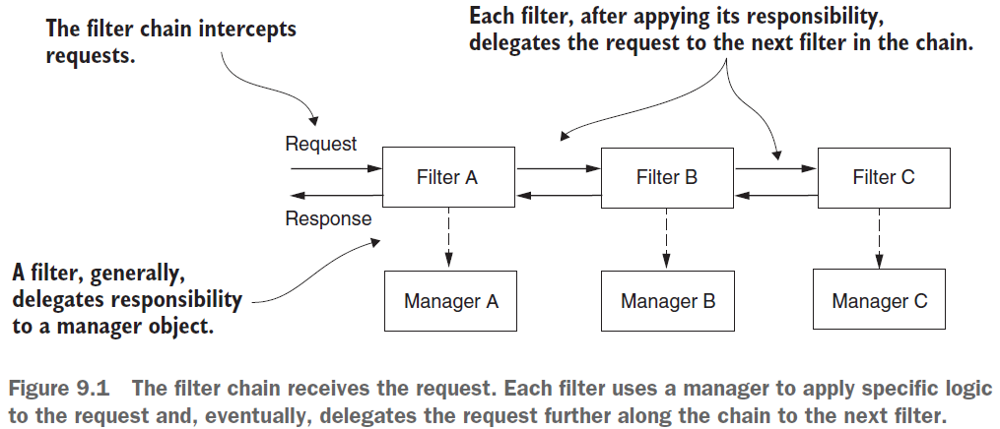
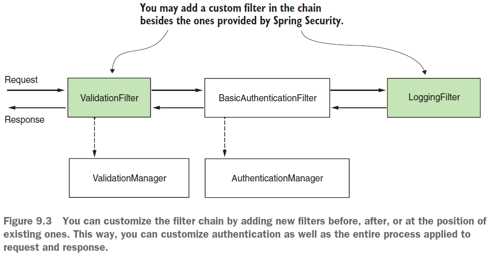
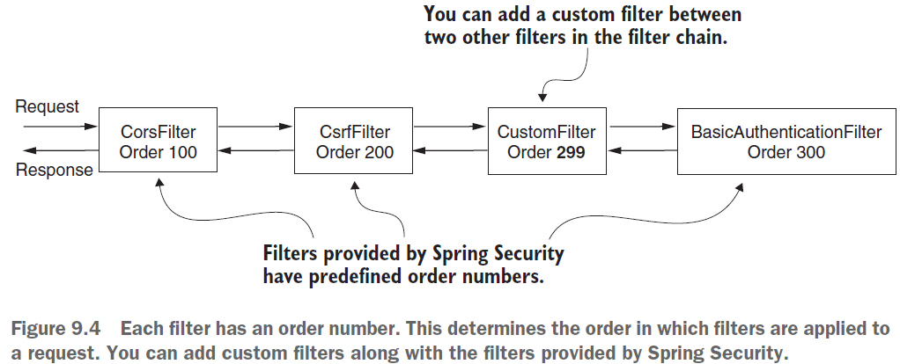
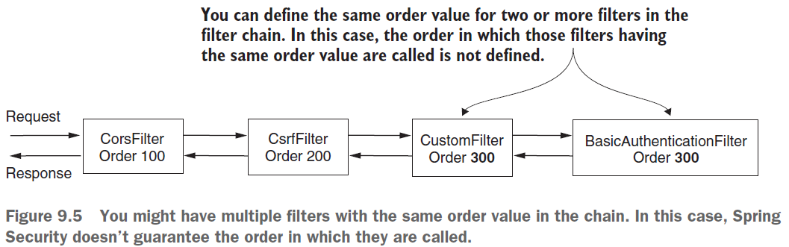
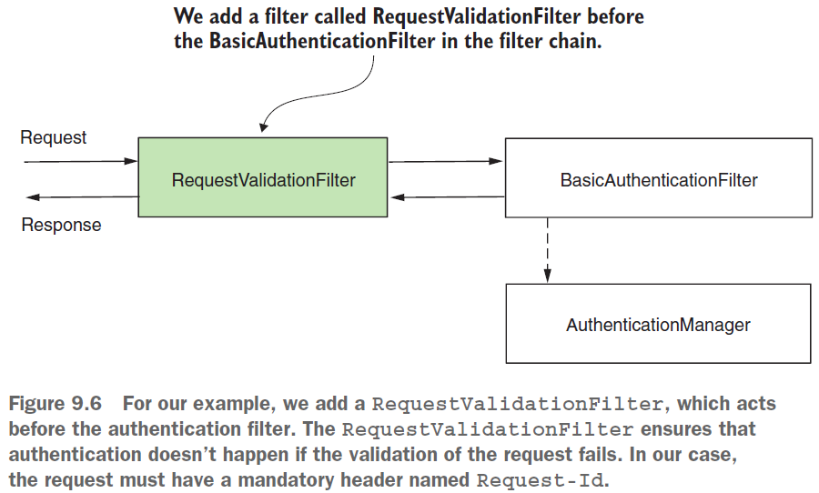
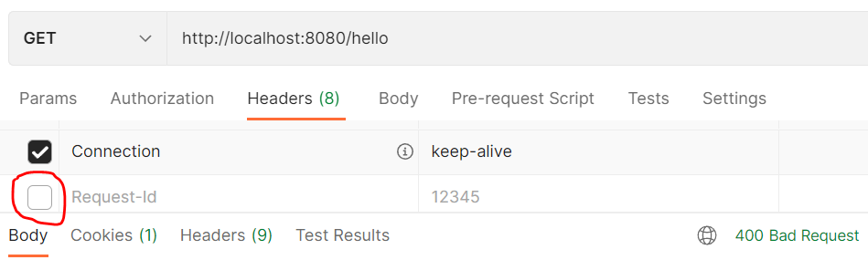
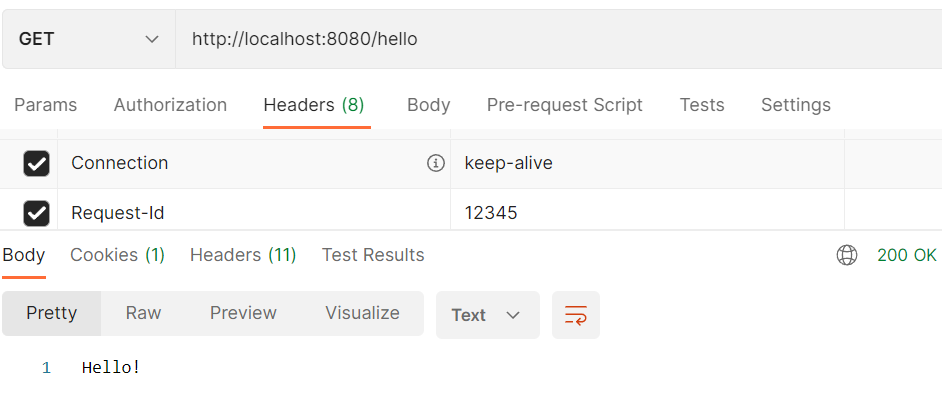
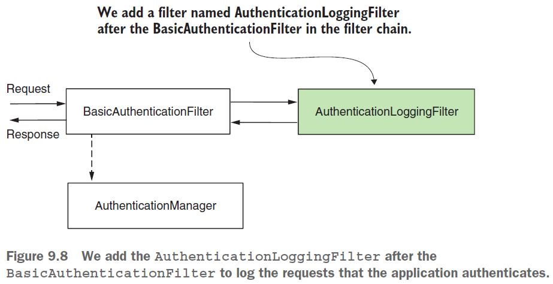

== HTTP filters

*Source code:*

- link:../../spring-security-learning/src/main/java/ch5_spring_security_in_action/p199_custom_filter_before_standard[p199_custom_filter_before_standard/...] (3)

*Content:*

- 1. Intro
- 2. Цепь фильтров. Дефотные фильтры. Порядок фильтров
- 3. Добавление фильтра перед существующим в цепочку фильтров
  * 3.1 First step
  * 3.2 Second step
- 4. Добавление фильтра после существующего в цепочку фильтров

=== 1. Intro

Ранее мы уже встречались с HTTP фильтрами, такими как _authentication filter_ и _authorization filter_. В Spring Security фильтры управляют любым воздействием над запросом. Они формируют *_chain of responsibilities_*:

Мы можем настраивать фильтры и добавлять новые - например, усилить аутентификацию проверкой email или использованием одноразового пароля, реализовать аудит аутентификации. На практике дефолтная конфигурация используется редко (например, вы точно будете избегать HTTP Basic) - поэтому часто надо настраивать HTTP-фильтры или создавать новые для других стратегий аутентификации (по отпечатку пальца, например):

=== 2. Цепь фильтров. Дефотные фильтры. Порядок фильтров

Обсудим как фильтры и цепочка фильтров работает в Spring Security. Ранее упоминалось, что _authentication filter_ перехватывает запрос и делегирует обработку аутентификации authorization manager. Чтобы реализоваьсвою логику перед аутентификацией, нужно вставить свой фильтр перед _authentication filter_. +
Фильтры в Spring Security - это обычные HTTP фильтры. Мы можем их создавать, реализуя интерфейс *_javax.servlet.Filter_* из пакета _javax_. Как и для любого другого HTTP-фильтра, вам необходимо переопределить метод *_doFilter()_*, чтобы реализовать его логику. Этот метод получает в качестве параметров _ServletRequest_, _ServletResponse_ и _FilterChain_:

- *_ServletRequest_* - представляет HTTP Request, используется для получения сведений о запросе.
- *_ServletResponse_* - представляет HTTP Response, используется для изменения response перед его отправкой обратно клиенту или далее по цепочке HTTP-фильтров.
- *_FilterChain_* - представляет цепочку фильтров, объект _FilterChain_ используется для пересылки запроса следующему фильтру в цепочке.

Цепочка фильтров - это набор фильтров с определенным порядком вызова. Spring Security предоставляет нам некоторые реализации фильтров и их порядок. Фильтров довольно много, да и многие из них обычно не используются для модификации, поэтому рассмотрим те, которые наиболее важны для нас:

- *_BasicAuthenticationFilter_* - обеспечивает Basic HTTP auth, если она включена.
- *_CsrfFilter_* - предоставляет защиту от подделки межсайтовых запросов (CSRF) - рассмотрим чуть позже.
- *_CorsFilter_* - защищает правила авторизации совместного использования ресурсов (CORS, link:https://developer.mozilla.org/ru/docs/Web/HTTP/CORS[link]) - рассмотрим чуть позже.

Важно понимать, что приложение не обязательно имеет экземпляры всех этих фильтров в чейне. Чейна фильтров длиннее или короче в зависимости от того, как вы настроите приложение. Например, при вызове метода _httpBasic()_ класса _HttpSecurity_ экземпляр _BasicAuthenticationFilter_ добавляется в чейну. В зависимости от написанных вами конфигураций, цепочка фильтров будет выглядеть так или иначе:

Каждый фильтр имеет order - в каком порядке их вызывать. Если вы добавите фильтры с одинаковым номером order, то порядок их вызова будет не определен:

=== 3. Добавление фильтра перед существующим в цепочку фильтров

Обсудим применение пользовательских фильтров HTTP перед существующим в цепочке фильтров. +
Рассмотрим тривиальный сценарий - мы хотим, чтобы любой запрос имел *_Request-Id_* header. Мы хотим провалидировать запрос до того, как приложение выполнит аутентификацию. Процесс аутентификации может включать в себя запрос к базе данных или другие ресурсоемкие действия, которые мы не хотим выполнять, если формат запроса недействителен. +
Как нам это сделать? Для решения текущего требования требуется всего два шага:

- 1. реализовать фильтр *_RequestValidationFilter_* который проверяет существование header-а в запросе.
- 2. Добавить фильтр в цепочку фильтров с помощью метода *_configure()_* в конфигурационном классе.

и в итоге цепочка фильтров выглядит так:

==== 3.1 First step

При имплементации любого фильтра наиболе важным является метод _doFilter()_. Давайте напишем проверку на существование `Request-Id` header. *_See_* link:../../spring-security-learning/src/main/java/ch5_spring_security_in_action/p199_custom_filter_before_standard[p199_custom_filter_before_standard/...]:
[source, java]
----
public class RequestValidationFilter implements Filter {

    public static final String REQUEST_ID = "Request-Id";

    @Override
    public void doFilter(ServletRequest request, ServletResponse response,
                         FilterChain filterChain) throws IOException, ServletException {
        HttpServletRequest httpRequest = (HttpServletRequest) request;
        HttpServletResponse httpResponse = (HttpServletResponse) response;

        String requestId = httpRequest.getHeader(REQUEST_ID);
        if (requestId == null || requestId.isBlank()) {
            // если header-а нет, то HTTP статус ставится 400, а request
            // не отправляется дальше в filter chain
            httpResponse.setStatus(HttpServletResponse.SC_BAD_REQUEST);
            return;
        }
        // header есть, request перенаправляется дальше в filter chain
        filterChain.doFilter(request, response);
    }
}
----

==== 3.2 Second step

Чтобы добавить _RequestValidationFilter_ в цепочку фильтров, мы используем метод *_addFilterBefore()_* объекта *_HttpSecurity_*, поскольку мы хотим, чтобы приложение выполняло наш фильтр перед аутентификацией. Этот метод получает два параметра:

- Объект _custom filter_ который мы хотим добавить - в нашем случае это _RequestValidationFilter_
- *_Class фильтра_*, перед которым мы поставим наш кастомный - в нашем случае это _BasicAuthenticationFilter.class_ - тип фильтра аутентификации по умолчанию.

[source, java]
----
@Configuration
public class ProjectConfig extends WebSecurityConfigurerAdapter {
    @Override
    protected void configure(HttpSecurity http) throws Exception {
        http.addFilterBefore( // метод для добавления фильтра перед другим
                new RequestValidationFilter(), BasicAuthenticationFilter.class)
            .authorizeRequests()
            .anyRequest().permitAll(); // разрешаем все запросы для простоты
    }
}
----

Если запрос не будет иметь header `"Request-Id"`, то мы получим _400 Bad Request_:

В противном случае - 200 OK и ответ `"Hello"`:

=== 4. Добавление фильтра после существующего в цепочку фильтров

Обсудим добавление фильтра после существующего в цепочке фильтров. +
Обычно этот подход исользуется, когда нужно выполнить некоторую логику после процесса аутентификации. Примерами этого может быть уведомление другой системы после определенных событий аутентификации или просто для logging and tracing purposes.

Например, мы хотим регистрировать все успешные события аутентификации (отправляя ивенты или что-то подобное). Поэтому нам надо добавить HTTP фильтр после  _authentication filter_:

Добавим класс фильтра в наш уже написанный проект. +
*_See_* link:../../spring-security-learning/src/main/java/ch5_spring_security_in_action/p199_custom_filter_before_standard/filters/AuthenticationLoggingFilter.java[p199_custom_filter_before_standard/filters/AuthenticationLoggingFilter.java]:
[source, java]
----
@Slf4j
public class AuthenticationLoggingFilter implements Filter {
    @Override
    public void doFilter(ServletRequest request, ServletResponse response,
                         FilterChain filterChain) throws IOException, ServletException {
        HttpServletRequest httpRequest = (HttpServletRequest) request;
        String requestId = httpRequest.getHeader("Request-Id"); // получаем header
        log.info("Successfully authenticated request with id {}", requestId); // логируем его
        filterChain.doFilter(request, response);
    }
}
----
Чтобы добавить _AuthenticationLoggingFilter_ в цепочку фильтров, мы используем метод *_addFilterAfter()_* объекта *_HttpSecurity_*. +
*_See_* link:../../spring-security-learning/src/main/java/ch5_spring_security_in_action/p199_custom_filter_before_standard/config/ProjectConfig.java[p199_custom_filter_before_standard/config/ProjectConfig.java]:
[source, java]
----
@Configuration
public class ProjectConfig extends WebSecurityConfigurerAdapter {
    @Override
    protected void configure(HttpSecurity http) throws Exception {
        http.addFilterBefore( // метод для добавления фильтра перед другим
                new RequestValidationFilter(), BasicAuthenticationFilter.class)
            .addFilterAfter(  // метод для добавления фильтра после другого
                new AuthenticationLoggingFilter(), BasicAuthenticationFilter.class)
            .authorizeRequests()
            .anyRequest().permitAll(); // разрешаем все запросы для простоты
    }
}
----
