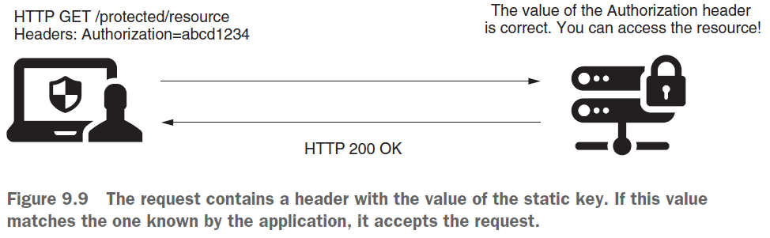
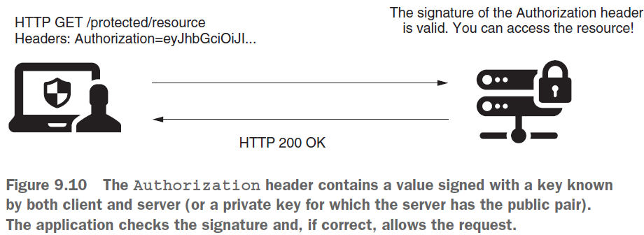
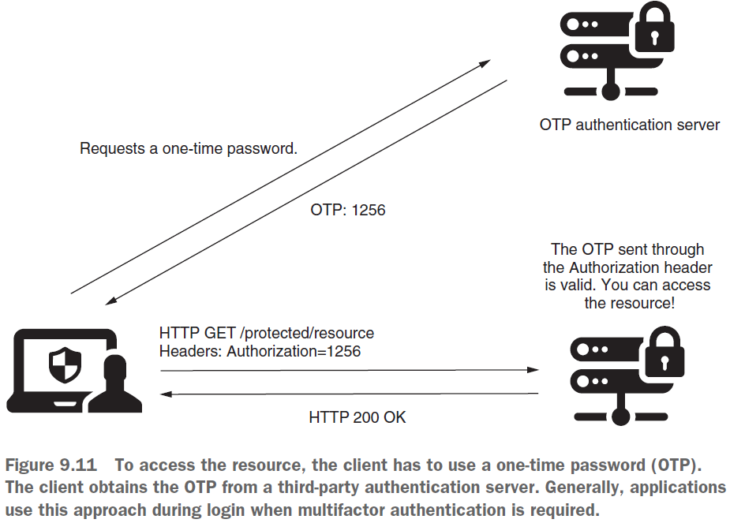
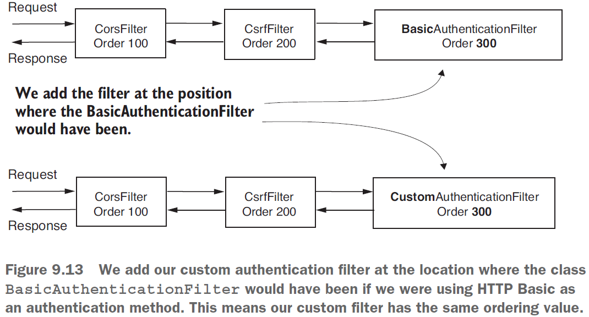

== HTTP filters. Замена существующего фильтра другим. Дефолтные HTTP фильтры из Spring Security

*Source code:*

- link:../../spring-security-learning/src/main/java/ch5_spring_security_in_action/p207_static_key_authentication[p207_static_key_authentication/...] (6)
- link:../../spring-security-learning/src/main/java/ch5_spring_security_in_action/p210_OncePerRequestFilter_impl[p210_OncePerRequestFilter_impl/...] (7)

*Content:*

- 5. Добавление фильтра на место другого в цепочку фильтров
  * 5.1 Идентификация на основе static key
  * 5.2 Идентификация на основе симметричного ключа для подписи запроса
  * Идентификация на основе одноразового пароля
- 6. Реализация идентификации на основе static key
- 7. Дефолтные HTTP фильтры из Spring Security. GenericFilterBean & OncePerRequestFilter

=== 5. Добавление фильтра на место другого в цепочку фильтров

Обсудим добавление фильтра на место другого в цепочке фильтров. +
Обычно это используется для замены реализации того или иного фильтра на кастомную. Типичный сценарий — кастомная аутентификация.

Предположим, что вместо основного потока аутентификации HTTP вы хотите реализовать что-то другое. И вместо использования username/password вам нужно применить другой подход. Вот несколько примеров сценариев, с которыми вы можете столкнуться:

- Идентификация на основе static key в request/response header-ах
- Использование симметричного ключа для подписи запроса
- Использование одноразового пароля (OTP, one-time password)

==== 5.1 Идентификация на основе static key

В данном сценарии клиент отправляет приложению строку в _HTTP-request header-е_, которая всегда одна и та же. Приложение где-то хранит эти значения, зачастую в хранилище секретов или в БД и на их основе идентифицирует клиента. Безопасность слабая, но этот метот очень прост и может использоваться во внутренней коммуникации между сервисами. Идентификация выполняется быстро, т.к. здесь не нужны выполнять сложные вычисления, как в случае применения криптографической подписи:

==== 5.2 Идентификация на основе симметричного ключа для подписи запроса

В данном сценарии и клиент, и сервер знают значение ключа и используют его совместно. Клиент использует ключ для подписи части запроса (например, для подписи значения конкретных заголовков), а сервер проверяет, действительна ли подпись, используя тот же ключ. Сервер может хранить индивидуальные ключи для каждого клиента в БД или хранилище секретов. Также вы можете использовать пару асимметричных ключей. +
*NOTE!* К слову, об access token написано link:https://habr.com/ru/post/710552/[здесь - habr]

==== 5.2 Идентификация на основе одноразового пароля

Последний вариант - получение одноразового пароля через SMS или другим способом. Обычно используется как дополнительное подтверждение либо при регистрации:

=== 6. Реализация идентификации на основе static key

Реализуем идентификацию на основе static key. В нашем сценарии у нас есть значение статического ключа, одинаковое для всех запросов. Для аутентификации пользователь должен добавить правильное значение статического ключа в заголовок авторизации.

Начнем с реализации кастомного фильтра _StaticKeyAuthenticationFilter_. Он считывает static key из `application.properties` и проверяет совпадение. +
*_See_* link:../../spring-security-learning/src/main/java/ch5_spring_security_in_action/p207_static_key_authentication/filters/StaticKeyAuthenticationFilter.java[p207_static_key_authentication/filters/StaticKeyAuthenticationFilter.java]:
[source, java]
----
@Component
public class StaticKeyAuthenticationFilter implements Filter {

    @Value("${authorization.key}")
    private String authorizationKey;

    @Override
    public void doFilter(ServletRequest request, ServletResponse response,
                         FilterChain filterChain) throws IOException, ServletException {
        HttpServletRequest httpRequest = (HttpServletRequest) request;
        HttpServletResponse httpResponse = (HttpServletResponse) response;
        String authentication = httpRequest.getHeader("Authorization"); // получаем header
        // сравниваем его со статическим ключом
        if (authorizationKey.equals(authentication)) {
            filterChain.doFilter(request, response);
        } else {
            httpResponse.setStatus(HttpServletResponse.SC_UNAUTHORIZED);
        }
    }
}
----
Мы добавляем кастомный фильтр в цепочку фильтров на позицию _BasicAuthenticationFilter_ с помощью метода *_addFilterAt()_*:

Но тут важно отметить, что в случае обычного добавления у нас просто будут на одной позиции два фильтра - стандартный _BasicAuthenticationFilter_ и наш _StaticKeyAuthenticationFilter_. Мы должны сами не добавлять якобы "вытесняемый" фильтр из цепочки. По факту, в данном случае надо просто не вызывать метод *_httpBasic()_* класса *_HttpSecurity_*, чтобы не добавлять _BasicAuthenticationFilter_ в цепочку. +
*_See_* link:../../spring-security-learning/src/main/java/ch5_spring_security_in_action/p207_static_key_authentication/config/ProjectConfig.java[p207_static_key_authentication/config/ProjectConfig.java]:
[source, java]
----
@Configuration
public class ProjectConfig extends WebSecurityConfigurerAdapter {

  @Autowired
  private StaticKeyAuthenticationFilter filter; // inject custom filter

  @Override
  protected void configure(HttpSecurity http) throws Exception {
    // don't call http.httpBasic()
    // to prevent adding BasicAuthenticationFilter to chain
    http.addFilterAt(filter, BasicAuthenticationFilter.class)
        .authorizeRequests()
        .anyRequest().permitAll();
  }
}
----

Теперь для доступа к эндпоинту нужно использовать header _Authorization:SD9cICjl1e_.

Поскольку мы не настраиваем *_UserDetailsService_*, Spring Boot автоматически создает дефолтный (глава 2). Но в нашем сценарии вам вообще не нужен _UserDetailsService_, потому что понятия _user-а_ тут не существует - мы только проверяем, что пользователь, запрашивающий вызов конечной точки на сервере, знает заданное значение. Поэтому мы отключаем автоконфигурацию _UserDetailsService_ в Main:
[source, java]
----
@SpringBootApplication(exclude = {
    UserDetailsServiceAutoConfiguration.class,
    DataSourceAutoConfiguration.class})
public class Main {
  // omitted code
}
----

=== 7. Дефолтные HTTP фильтры из Spring Security

Spring Security предоставляет классы фильтров, которые реализуют _interface **Filter**_ и которыми вы можете расширить свои реализации. Например, вы можете расширить класс *_GenericFilterBean_*, который позволит вам использовать параметры инициализации, которые вы определили бы в _web.xml descriptor file_ (если он используется в вашем приложении).

Более полезным классом, расширяющим _GenericFilterBean_, является *_OncePerRequestFilter_*. Вообще, при добавлении фильтра в цепочку Spring не гарантирует, что он будет вызываться только один раз для каждого запроса. _OncePerRequestFilter_, как следует из названия, гарантирует, что метод фильтра *_doFilter()_* выполняется только один раз для каждого запроса.

При этом, если вам не нужна дополнительная функциональность _GenericFilterBean_ или _OncePerRequestFilter_, лучше просто имплементировать интерфейс _Filter_.

Чтобы было предельно ясно, как использовать такой класс, давайте напишем пример. Написанный в предыдущей части *_AuthenticationLoggingFilter_* (see link:195_HTTP_filters.adoc[]) для логирования, отлично подходит для использования _OncePerRequestFilter_. Мы хотим избежать логирования одних и тех же запросов несколько раз. Spring Security не гарантирует, что фильтр не будет вызываться более одного раза, поэтому мы должны позаботиться об этом сами. Самый простой способ — реализовать фильтр с помощью класса _OncePerRequestFilter_, переопределив метод *_doFilterInternal()_*. +
*_See_* link:../../spring-security-learning/src/main/java/ch5_spring_security_in_action/p210_OncePerRequestFilter_impl/filters/AuthenticationLoggingFilter.java[p210_OncePerRequestFilter_impl/filters/AuthenticationLoggingFilter.java]:
[source, java]
----
@Slf4j
public class AuthenticationLoggingFilter extends OncePerRequestFilter { // extends abstract class
    @Override
    public void doFilterInternal(HttpServletRequest request,
                                 @NonNull HttpServletResponse response, // @NonNull to prevent warning
                                 FilterChain filterChain) throws IOException, ServletException {
        String requestId = request.getHeader("Request-Id"); // получаем header
        log.info("Successfully authenticated request with id {}", requestId); // логируем его
        filterChain.doFilter(request, response);
    }
}
----
Немного о функциональности _OncePerRequestFilter_ ради которой вы можете его расширять в своих кастомных фильтрах:

- С одной стороны, он поддерживает только HTTP-запросы, с другой - он сразу приводит типы к HttpServletRequest и _HttpServletResponse_.
- Вы можете реализовать логику, чтобы фильтр не применялся для определенных запросов. Даже при добавлении фильтра в цепочку, вы можете запретить его применения для определенных запросов. Для этого нужно переопределить метод *_shouldNotFilter(HttpServletRequest)_*. По умолчанию _OncePerRequestFilter_ применяется ко всем запросам.
- По умолчанию _OncePerRequestFilter_ не применяется к async-запросам или error dispatch requests (запросы отправки ошибок). Это поведение можно изменить, переопределив методы *_shouldNotFilterAsyncDispatch()_* и *_shouldNotFilterErrorDispatch()_*.
