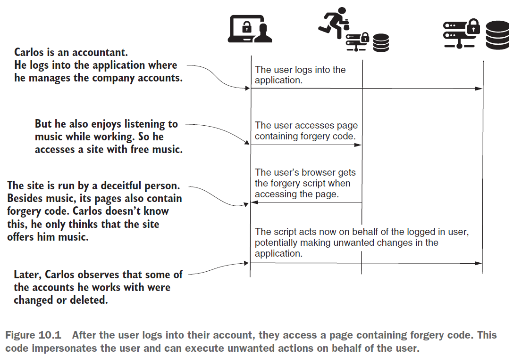
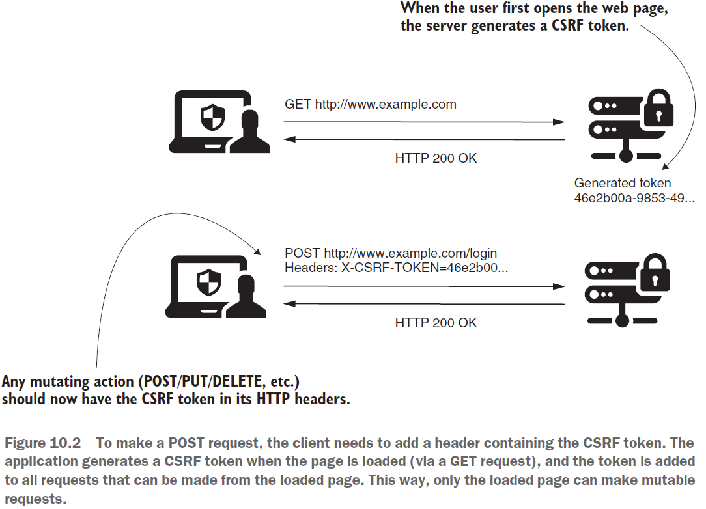
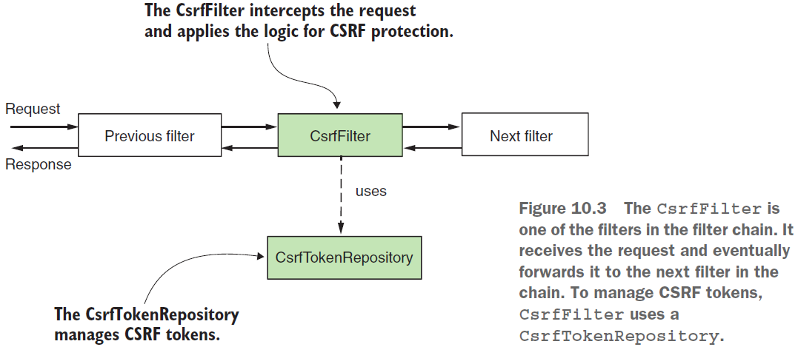
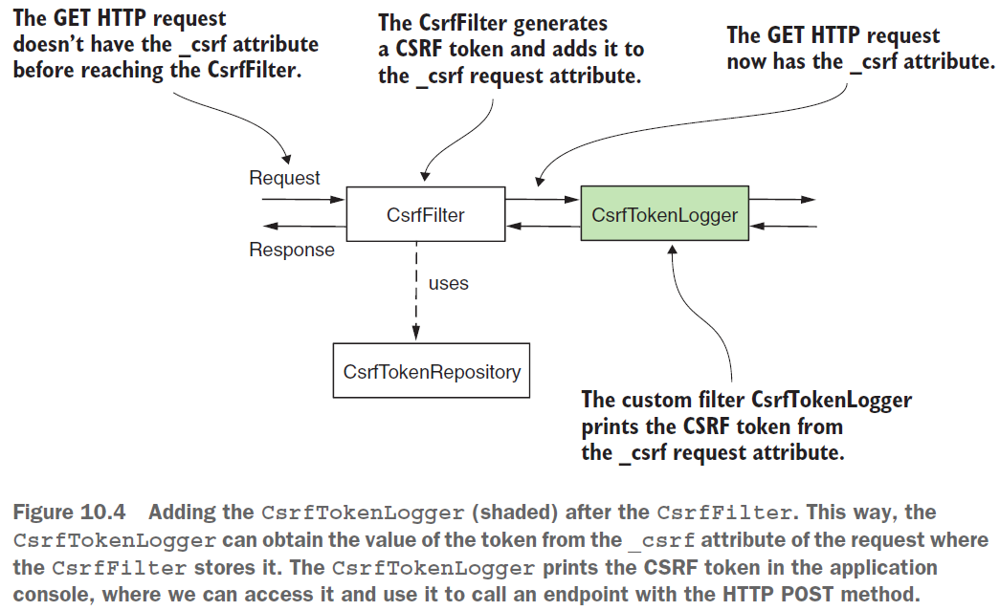
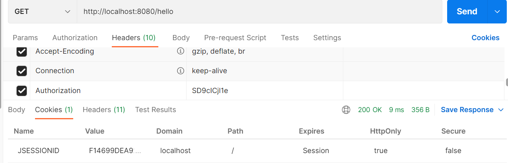
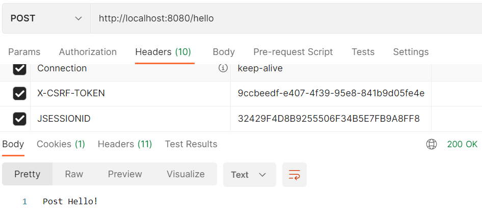

== Cross-site request forgery (CSRF) protection

*Source code:*

- link:../../spring-security-learning/src/main/java/ch5_spring_security_in_action/p217_CsrfToken_logging[p217_CsrfToken_logging/...] (5)

*Content:*

- 1. Защита от подделки межсайтовых запросов в приложениях
- 2. Сценарий CSRF-атаки
- 3. Защита от CSRF-атаки. CSRF-токены
- 4. Как CSRF-protection работает в Spring Security
- 5. Реализация POST-запроса с CSRF-токеном

=== 1. Защита от подделки межсайтовых запросов в приложениях

*_CSRF protection_* - это защита от _подделки межсайтовых запросов_ в приложениях. В приложениях, которые имплементировались ранее, в основном были только GET-эндпоинты. Для добавления POST-эндпоинтов нам пришлось отключать CSRF-защиту (см. link:../../spring-security-learning/src/main/java/ch5_spring_security_in_action/p179_csrf_disable_for_post_requests[p179_csrf_disable_for_post_requests/...]). Причина этого - дефолтная CSRF-защита в Spring Security.

CSRF — это широко распространенный тип атаки, и приложения, уязвимые к CSRF, могут заставить пользователей выполнять нежелательные действия в веб-приложении после аутентификации.

Мы начнем с рассмотрения того, что такое CSRF и как он работает. Затем мы обсудим механизм CSRF-токенов, который Spring Security использует для противодействия CSRF. Мы обычно получаем токен и использеум его для доступа к POST-эндпоинту. Также рассмотрим, как использовать CSRF-токен в реальных сценариях и обсудим возможные настройки механизма CSRF-токенов в Spring Security.

=== 2. Сценарий CSRF-атаки

Важно сначала понять основной механизм защиты от CSRF. В качестве примера рассмотрим следующий сценарий:

- Вы используете веб-инструмент для хранения файлов и управления ими. С его помощью можно добавлять/редактировать/удалять файлы.
- Вы получаете фишинговое письмо на email с просьбой открыть страницу по определенной причине. Вы открываете страницу, но она пуста или перенаправляет вас на известный веб-сайт. Вы возвращаетесь к своей работе, но замечаете, что все ваши файлы исчезли!

Что случилось? Ранее вы вошли в приложение для работы с файлами. Вы работаете с ними, а веб-страница вызывает эндпоинты на бэкенде. Когда вы открыли чужую страницу, нажав на неизвестную ссылку в письме, эта страница вызвала сервер и выполнила действия от вашего имени (она удалила ваши файлы). Это могло произойти, потому что вы вошли в систему ранее, а сервер считал, что действия исходили от вас:

Атаки CSRF предполагают, что пользователь вошел в веб-приложение. Злоумышленник обманом заставляет их открыть страницу, содержащую сценарии, выполняющие действия в том же приложении, над которым работал пользователь. Поскольку пользователь уже вошел в систему, код вредоносного скрипта теперь может выдавать себя за пользователя и выполнять действия от его имени.

=== 3. Защита от CSRF-атаки. CSRF-токены

Как защититься от предыдущего сценария? CSRF-защита гарантирует, что только внешний интерфейс веб-приложений может выполнять _операции изменения_ (методы HTTP, отличные от GET, HEAD, TRACE или OPTIONS). Тогда чужая страница, как в нашем примере, не может действовать от имени пользователя.

Как мы можем этого добиться? Прежде чем выполнять какое-либо действие, которое может изменить данные, пользователь должен отправить запрос с помощью GET-запроса, чтобы просмотреть веб-страницу. Когда это происходит, приложение _генерирует уникальный токен_. Теперь приложение принимает только те запросы на операции изменения, которые содержат это уникальное значение в заголовке. Приложение считает, что знание значения токена является доказательством того, что это само приложение делает запрос на изменение, а не другая система. Любая страница, содержащая изменяющие вызовы, такие как _POST_, _PUT_, _DELETE_ и т. д., должна получать в ответе CSRF-токен, и страница должна использовать этот токен при совершении изменяющих вызовов.

Что это за токен и откуда он взялся? Эти токены являются не чем иным, как _строковыми значениями (string)_. Мы должны добавить токен в заголовок запроса, когда используем любой метод, кроме GET, HEAD, TRACE или OPTIONS. Если не добавить заголовок, содержащий токен, приложение не примет запрос:

=== 4. Как CSRF-protection работает в Spring Security

Отправной точкой защиты от CSRF является фильтр в цепочке фильтров под названием *_CsrfFilter_*. Он разрешает все GET, HEAD, TRACE и OPTIONS запросы. Для остальных типов запросов фильтр ожидает получить заголовок, содержащий токен. Если этот заголовок не существует или содержит неверное значение токена, приложение отклоняет запрос и возвращает 403 Forbidden.

_CsrfFilter_ использует компонент *_CsrfTokenRepository_* для управления значениями CSRF-токенов. _CsrfTokenRepository_ генерирует новые токены, сохраняет их и в самом конце инвалидирует токены. По умолчанию _CsrfTokenRepository_ хранит токен в HTTP-сессии и создает UUID-токены. В большинстве случаев этого достаточно, но вы также можете использовать кастомную реализацию _CsrfTokenRepository_.

=== 5. Реализация POST-запроса с CSRF-токеном

Создадим приложение, которое имеет два эндпоинта - _/hello_ GET и _/hello_ POST. Реализуем вызов POST-эндпоинта, не отключая CSRF-защиту. Нам нужно получить CSRF-токен, чтобы мы могли использовать его в заголовке вызова. _CsrfFilter_ добавляет сгенерированный CSRF-токен к атрибуту HTTP-запроса с именем *__csrf_*:

Мы добавляем наш кастомный фильтр *_CsrfTokenLogger_*, который будет логировать значение токена в консоль, откуда мы потом сможем достать его и использовать для POST-запроса. +
*_See_* link:../../spring-security-learning/src/main/java/ch5_spring_security_in_action/p217_CsrfToken_logging/filters/CsrfTokenLogger.java[p217_CsrfToken_logging/filters/CsrfTokenLogger.java]:
[source, java]
----
@Slf4j
public class CsrfTokenLogger implements Filter {
    @Override
    public void doFilter(ServletRequest request, ServletResponse response,
                         FilterChain filterChain) throws IOException, ServletException {
        CsrfToken token = (CsrfToken) request.getAttribute("_csrf");
        log.info("CSRF token: {}", token.getToken());
        filterChain.doFilter(request, response);
    }
}
----
В конфигурационном классе мы добавляем наш фильтр после _CsrfFilter_. +
*_See_* link:../../spring-security-learning/src/main/java/ch5_spring_security_in_action/p217_CsrfToken_logging/config/ProjectConfig.java[p217_CsrfToken_logging/config/ProjectConfig.java]:
[source, java]
----
@Configuration
public class ProjectConfig extends WebSecurityConfigurerAdapter {
    @Override
    protected void configure(HttpSecurity http) throws Exception {
        http.addFilterAfter(
            new CsrfTokenLogger(), CsrfFilter.class
        ).authorizeRequests().anyRequest().permitAll();
    }
}
----
Теперь мы можем вызвать GET-method /hello чтобы получить _CSRF-token_ в консоли и cookie *JSESSIONID*:

----
 [nio-8080-exec-9] c.p.filters.CsrfTokenLogger   : CSRF token: 9ccbeedf-e407-4f39-95e8-841b9d05fe4e
----
Для посылки POST-запроса вам надо добавить два headers: *X-CSRF-TOKEN* и *JSESSIONID*. Последний header нужен, потому что дефолтная имплементация _CsrfTokenRepository_ хранит значение токена в сессии:

Вы можете спросить: как клиенты получают CSRF-токен? В нашем примере (чтение из логов) мы просто изучаем, как работает реализация CSRF-защиты. В общем случае серверное приложение несет ответственность за добавление значения CSRF-токена в HTTP-response, который будет использоваться клиентом.
