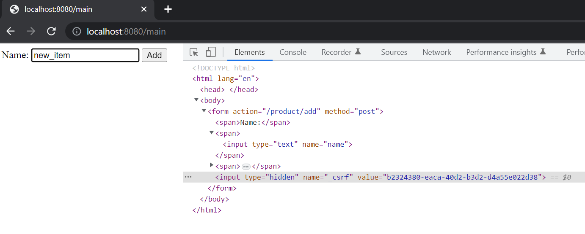

== Использование CSRF-токена в реальных сценариях

*Source code:*

- link:../../spring-security-learning/src/main/java/ch5_spring_security_in_action/p220_CsrfToken_in_web_forms[p220_CsrfToken_in_web_forms/...] (6)

*Content:*

- 6. Использование CSRF-токена в реальных сценариях

=== 6. Использование CSRF-токена в реальных сценариях

В этом разделе мы обсудим применение защиты CSRF в практических ситуациях. Теперь, когда вы знаете, как работает защита CSRF в Spring Security, вам нужно знать, где вы должны использовать ее в реальном мире. Какие виды приложений должны использовать защиту CSRF?

Вы используете защиту CSRF для веб-приложений, работающих в браузере, поскольку операции изменения могут выполняться браузером, который загружает веб-страницы. Простейший пример — это веб-приложение на основе стандартного _Spring MVC flow_. При использовании *_formLogin_* (см. link:../../spring-security-learning/src/main/java/ch5_spring_security_in_action/p127_formLogin_homepage[p127_formLogin_homepage/...]) мы как раз и создали такое приложение, и это веб-приложение использовало защиту CSRF. При этом операция входа в систему использовала POST-запрос! Тогда почему нам не нужно было отключать CSRF-защиту в этом случае? Причина заключается в том, что мы сами не добавили своих _операций изменения_.

Для _formLogin_ по умолчанию Spring Security позаботится о добавлении токена CSRF в запросе на вход. Давайте теперь разработаем аналогичное приложение, чтобы поближе рассмотреть, как работает CSRF-защита. В этом примере приложения мы заметим, что POST-request не будет работать, пока мы правильно не используем CSRF-токены, а также узнаем, как применять токены CSRF в форме на веб-странице.

Для начала в класс конфигурации добавим пользователя и установим formLogin. +
*_See_* link:../../spring-security-learning/src/main/java/ch5_spring_security_in_action/p220_CsrfToken_in_web_forms/config/ProjectConfig.java[p220_CsrfToken_in_web_forms/config/ProjectConfig.java]:
[source, java]
----
protected void configure(HttpSecurity http) throws Exception {
    http.authorizeRequests().anyRequest().authenticated();
    http.formLogin()
        .defaultSuccessUrl("/main", true);
}
----
Создадим два контроллера - _HelloController_ и _ProductController_. *_See_* link:../../spring-security-learning/src/main/java/ch5_spring_security_in_action/p220_CsrfToken_in_web_forms/controllers[p220_CsrfToken_in_web_forms/controllers].

_HelloController_ используется для возврата домашней страницы. Если мы проверим форму с помощью "inspect element" в браузере, то увидим, что реализация формы входа по умолчанию отправляет токен CSRF. Вот почему логин-форма работает с включенной защитой CSRF, даже если он использует POST-запрос!

Что если мы создадим свои собстенные эндпоинты с _операциями изменения_? Мы сами должны позаботиться об отправке CSRF-токена если включена CSRF-защита. Давайте создадим свою страницу (первая версия *_p220_main.html_*) с формой, которая будет отсылать POST-request к  _ProductController_ (*_/product/add_*):
[source, html]
----
<form action="/product/add" method="post">
    Name:
    <input type="text" name="name"/>
    <button type="submit">Add</button>
</form>
----

Если мы запустим приложение и попытаемся отправить что-то через нашу форму, то получим _403 error_:

Тобы исправить данную проблему, нам надо добавить CSRF-токен в запрос, который исходит из кастомной формы. Мы используем hidden input, как мы видели в форме входа по умолчанию. В этом примере мы используем _Thymeleaf_, потому что он предоставляет простой способ получить значение атрибута запроса в представлении.
*_See_* link:../../spring-security-learning/src/main/resources/static/p220_CsrfToken_in_web_forms/p220_main.html[p220_main.html]:
[source, html]
----
<html lang="en" xmlns:th="http://www.thymeleaf.org">

<!-- omitted code -->

<form action="/product/add" method="post">
    Name:
    <input type="text" name="name" />
    <button type="submit">Add</button>
    <input type="hidden"
           th:name="${_csrf.parameterName}"
           th:value="${_csrf.token}" />
</form>
----

Тогда имеем следующее - *__csrf_* отсылается в браузер для нас и мы можем отправлять запросы:

Логи:
[source, text]
----
[nio-8080-exec-6] c.p.controllers.ProductController    : Adding product sdff
[nio-8080-exec-4] c.p.controllers.ProductController    : Adding product new_item
----

Для любого действия или асинхронного запроса JavaScript, который страница использует для _операции изменения_, необходимо отправить валидный CSRF-токен. Этот подход позволяет приложению убедиться, что запрос не исходит от третьего лица.

CSRF-токены хорошо работают в архитектуре, где один и тот же сервер отвечает как за внешний, так и за внутренний интерфейс, в основном из-за его простоты. Но CSRF-токены не работают, когда клиент не зависит от бэкенда (клиент и бэкенд разнесены) - в случае веб-приложения, микросервисной архитектуры и пр. Веб-клиент, разработанный с помощью таких фреймворков, как Angular, ReactJS или Vue.js, повсеместно используется в архитектурах веб-приложений, поэтому нам необходимо знать, как реализовать подход к безопасности и в этих случаях. Мы обсудим это позже:

- В _главе 11_ мы будем работать над практическим приложением, в котором решим задачу реализации веб-приложения с отдельными веб-серверами, независимо поддерживающими интерфейсные и внутренние решения. Для этого примера мы снова проанализируем применимость защиты CSRF с помощью токенов.

- В _главах с 12 по 15_ мы рассмотрим и реализуем спецификацию *_OAuth 2_*, которая отлично подходит для раздельных приложений фронта и бэка.

*_NOTE!_* Это может показаться очевидным, но стоит отдельно сказать - никогда нельзя использовать GET-запросы для _операций изменения_! Как минимум потому что для вызова GET-запроса CSRF-токен не нужен.
