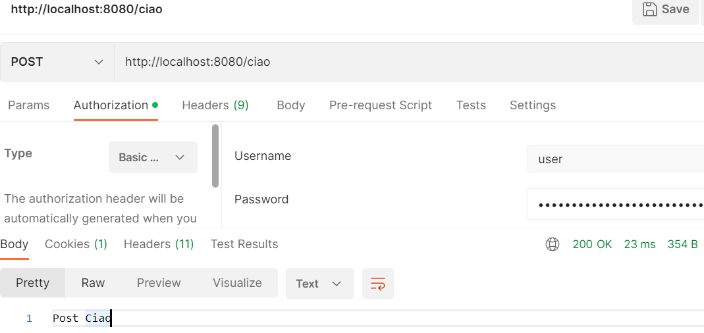

== Customizing CSRF protection

*Source code:*

- link:../../spring-security-learning/src/main/java/ch5_spring_security_in_action/p226_partial_CSRF_protection[p226_partial_CSRF_protection/...] (2)
- link:../../spring-security-learning/src/main/java/ch5_spring_security_in_action/p230_custom_csrf_token_in_db/[p230_custom_crfs_token_in_db/...] (3-4)

*Content:*

- 1. Кастомизация CSRF-защиты
- 2. Configuring paths for CSRF-protection
- 3. Customizing the management of CSRF-tokens
- 4. Тестирование реализации кастомного CSRF-токена

=== 1. Кастомизация CSRF-защиты

В этом разделе мы будем изучать кастомизацию дефолтной CSRF-защиты в Spring Security. Мы будем настраивать наиболее часто подвергающиеся кастомизации части механизма CSRF-защиты. Это:

- Configuring *_paths_* for which CSRF applies
- Managing *_CSRF-tokens_*

=== 2. Configuring paths for CSRF-protection

Мы используем защиту CSRF только тогда, когда страница, которая потребляет ресурсы, производимые сервером, сама генерируется тем же сервером. Но вы можете разрабатывать веб-приложение, в котором некоторые эндпоинты будут вызываться из других мест. Например, в случае мобильных приложений вы можете использовать OAuth 2 flow и не прибегать к CSRF-защите.

По умолчанию CSRF-защита применяется к любому пути для конечных точек, вызываемых с помощью HTTP-методов, отличных от GET, HEAD, TRACE, или OPTIONS. Но что, если вы хотите отключить его только для некоторых _paths_ вашего приложения? Вы можете это быстро сконфигурить с помощью объекта *_Customizer_*, аналогичного тому, как мы настраивали HTTP Basic для методов formLogin в главе 3 (см. link:124_HTTP_Basic_and_form_based_login_auth.adoc[]). +
Давайте реализуем это. +
*_See_* link:../../spring-security-learning/src/main/java/ch5_spring_security_in_action/p226_partial_CSRF_protection[p226_partial_CSRF_protection/...]

В этом приложении мы добавляем два POST-эндпоинта - *_/hello_* и *_/ciao_*, и к первому эндпоинту мы применяем CSRF-защиту, а ко второму - нет. *_See_* link:../../spring-security-learning/src/main/java/ch5_spring_security_in_action/p226_partial_CSRF_protection/controllers/HelloController.java[HelloController.java]:
[source, java]
----
@RestController
public class HelloController {
    @GetMapping("/hello")
    public String getHello() { return "Get Hello!"; }
    @PostMapping("/hello")
    public String postHello() { return "Post Hello!"; }
    @PostMapping("/ciao")
    public String postCiao() { return "Post Ciao"; }
}
----
Для кастомизации CSRF-защиты, вы можете использовать *_csrf()_* метод в *_configuration()_* с объектом *_Customizer_*. *_See_* link:../../spring-security-learning/src/main/java/ch5_spring_security_in_action/p226_partial_CSRF_protection/config/ProjectConfig.java[ProjectConfig.java]:
[source, java]
----
@Configuration
public class ProjectConfig extends WebSecurityConfigurerAdapter {
    @Override
    protected void configure(HttpSecurity http) throws Exception {
        // Параметр лямбды имеет тип Customizer<CsrfConfigurer<HttpSecurity>>
        // Вызывая методы CsrfConfigurer,
        // можно настраивать CSRF-защиту различными способами
        http.csrf(c ->
            c.ignoringAntMatchers("/ciao"));
        http.authorizeRequests()
            .anyRequest().permitAll();
    }
}
----

Вызывая *_ignoringAntMatchers(String paths)_*, мы можем указать Ant expressions, которые обозначают paths, исключаемые из-под CSRF-защиты. +
Более generic-подходом является использование _RequestMatcher_. В _csrf()_-методе можно использовать как *_MvcRequestMatcher_*:
[source, java]
----
http.csrf(c -> {
    HandlerMappingIntrospector i = new HandlerMappingIntrospector();
    MvcRequestMatcher r = new MvcRequestMatcher(i, "/ciao");
    c.ignoringRequestMatchers(r);
});
----
так и *_RegexRequestMatcher_*:
[source, java]
----
http.csrf(c -> {
    String pattern = ".*[0-9].*";
    String httpMethod = HttpMethod.POST.name();
    RegexRequestMatcher r = new RegexRequestMatcher(pattern, httpMethod);
    c.ignoringRequestMatchers(r);
});
----

Так выглядит попытка обратиться к защищенному эндпоинту без CSRF-токена:

А так - попытка обратиться к незащищенному эндпоинту:

=== 3. Customizing the management of CSRF-tokens

Еще одна часто использующаяся кастомизация — настройка управления CSRF-токенами. Как мы уже упоминали узнали, по умолчанию приложение хранит CSRF-токены в *_HTTP-сессии_* на стороне сервера. Этот простой подход подходит для небольших приложений, но не подходит для приложений, которые обслуживают большое количество запросов и требуют горизонтального масштабирования. HTTP-сессия сохраняет состояние и снижает масштабируемость приложения.

Допустим, мы хотим хранить токены где-то в базе данных, а не в сеансе HTTP. Spring Security предлагает два контракта, которые вам необходимо реализовать для этого:

- *_CsrfToken_* — интерфейс CSRF-токена
- *_CsrfTokenRepository_* — интерфейс, реализация которого создает, хранит и загружает токены CSRF.

Объект CsrfToken имеет три основных параметра:

- The name of the header in the request that contains the value of the CSRF token (_default named **X-CSRF-TOKEN**_)
- The name of the attribute of the request that stores the value of the token (_default named **_csrf**_)
- The value of the token

[source, java]
----
public interface CsrfToken extends Serializable {
    String getHeaderName();
    String getParameterName();
    String getToken();
}
----

Зачастую нам для токена, кроме этих трех параметров, ничего не нужно. Для этой функциональности Spring Security предлагает реализацию под названием _**DefaultCsrfToken** implements CsrfToken_, которую мы также будем использовать в нашем примере. _DefaultCsrfToken_ immutable и содержит token, parameterName и headerName.

Реализации интерфейса *_CsrfTokenRepository_* отвечают за управление CSRF-токенами в Spring Security. Нам нужно реализовать его кастомную имплементацию. Давайте модифицируем приложение, которое мы создали в предыдущем пункте и добавим новую реализацию _CsrfTokenRepository_, которая хранит токены в базе данных. На рисунке показаны компоненты, которые мы реализуем для этого примера, и связь между ними:

В нашем примере мы используем таблицу в базе данных для хранения CSRF-токенов. Мы предполагаем, что у клиента есть ID. Приложению нужен этот ID для получения CSRF-токена и его проверки. Как правило, ID будет получен во время входа в систему и должен быть разным каждый раз, когда один и тот же пользователь входит в систему. Эта стратегия управления токенами аналогична их хранению в памяти. В этом случае вы используете session-ID. Таким образом, новый идентификатор для этого примера просто заменяет session-ID.

Альтернативный подход - использование CSRF-токенов с определенным временем жизни (lifetime). Вы можете хранить токены в базе данных, не привязывая их к конкретному идентификатору пользователя. Вам нужно только проверить, существует ли токен, предоставленный через HTTP-запрос, и не истек ли его срок действия.

Для упрощения примера предположим, что у клиента уже есть сгенерированный ID.

Мы создадим файл link:../../spring-security-learning/src/main/resources/application-p230.properties[application-p230.properties] с параметрами для базы H2. А также схему таблицы с токенами - link:../../spring-security-learning/src/main/resources/schema_p230.sql[schema_p230.sql]. Из интересного - пропертя *_spring.jpa.properties.hibernate.default_schema_* может использоваться для пееопределения проперти _**schema.name** for Hibernate_ - по дефолту _schema.name="public"_:

[source, properties]
----
spring.datasource.url=jdbc:h2:file:C:/.../DRIVE/embedded-db/test
spring.datasource.username=sa
spring.datasource.password=password
spring.h2.console.enabled=true
spring.sql.init.mode=always
spring.sql.init.schema-locations=classpath:schema_p79.sql
spring.sql.init.data-locations=classpath:data_p79.sql
# To enable schema.name for Hibernate
# If not specified otherwise, the default schema in PostgreSQL is public
spring.jpa.properties.hibernate.default_schema=spring
----

See: link:../../spring-security-learning/src/main/java/ch5_spring_security_in_action/p230_custom_csrf_token_in_db/[p230_custom_crfs_token_in_db/...].

Для хранения токена мы используем БД - поэтому нам нужна entity для токена - link:../../spring-security-learning/src/main/java/ch5_spring_security_in_action/p230_custom_csrf_token_in_db/entity/Token.java[Token.java] и репозиторий - link:../../spring-security-learning/src/main/java/ch5_spring_security_in_action/p230_custom_csrf_token_in_db/repository/JpaTokenRepository.java[JpaTokenRepository.java].

Имея доступ к базе данных, мы можем начать писать реализацию _CsrfTokenRepository_ - *_CustomCsrfTokenRepository_*. See: link:../../spring-security-learning/src/main/java/ch5_spring_security_in_action/p230_custom_csrf_token_in_db/csrf/CustomCsrfTokenRepository.java[CustomCsrfTokenRepository.java]:

[source, java]
----
public class CustomCsrfTokenRepository implements CsrfTokenRepository {
  @Autowired
  private JpaTokenRepository jpaTokenRepository;

  @Override
  public CsrfToken generateToken(HttpServletRequest httpServletRequest) {
    String uuid = UUID.randomUUID().toString(); // генерируем токен
    // оставляем такие же headerName/parameterName как и в дефолтной реализации
    return new DefaultCsrfToken("X-CSRF-TOKEN", "_csrf", uuid);
  }

  @Override
  public void saveToken(CsrfToken csrfToken, HttpServletRequest httpServletRequest,
                        HttpServletResponse httpServletResponse) {
    String identifier = httpServletRequest.getHeader("X-IDENTIFIER");
    // ищем токен в базе по ID = "X-IDENTIFIER"
    Optional<Token> existingToken = jpaTokenRepository.findTokenByIdentifier(identifier);
    if (existingToken.isPresent()) { // токен найден
      Token tokenFromDb = existingToken.get();
      if (csrfToken != null && csrfToken.getToken() != null) {
        if (!csrfToken.getToken().equals(tokenFromDb.getToken())) {
          tokenFromDb.setToken(csrfToken.getToken()); // обновляем значение если токены разные
        } // по хорошему стоит удалять токен из базы если csrfToken == null
      }
    } else { // токен не нашли - создаем новую запись
      Token newToken = new Token();
      newToken.setToken(csrfToken.getToken());
      newToken.setIdentifier(identifier);
      jpaTokenRepository.save(newToken);
    }
  }

  @Override
  public CsrfToken loadToken(HttpServletRequest httpServletRequest) {
    String identifier = httpServletRequest.getHeader("X-IDENTIFIER");
    Optional<Token> existingToken = jpaTokenRepository.findTokenByIdentifier(identifier);
    // Ищет токен по "X-IDENTIFIER" из HttpServletRequest и загружает его, если он существует
    if (existingToken.isPresent()) {
      Token token = existingToken.get();
      return new DefaultCsrfToken("X-CSRF-TOKEN", "_csrf", token.getToken());
    }
    return null;
  }
}
----

- 1. Механизм CSRF-protection вызывает метод *_generateToken()_*, когда приложению необходимо сгенерировать новый токен. Мы используем класс UUID для генерации нового случайного значения UUID и оставляем те же имена для header и атрибута запроса - _X-CSRF-TOKEN_ и __csrf_ - что и в дефолтной реализации Spring Security.

- 2. Метод *_saveToken()_* сохраняет сгенерированный токен для конкретного клиента. По дефолту для идентификации CSRF-токена используется HTTP-сессия (в *_HttpSessionCsrfTokenRepository_*). В же нашем случае мы предполагаем, что у клиента есть ID, который отправляется клиентом в *_X-IDENTIFIER_* header. Мы проверяем, существует ли значение в базе данных. Если он существует и токены имеют разные значения, мы обновляем базу данных новым значением токена. Если нет, мы создаем новую запись в таблице для этого ID.

- 3. Метод *_loadToken()_* загружает сведения о токене из _HttpServletRequest_, если они существуют, или возвращает *_null_* в противном случае.

Мы подключаем наш кастомный CustomCsrfTokenRepository к механизму CSRF-защиты с помощью метода *_csrfTokenRepository()_* в классе конфигурации link:../../spring-security-learning/src/main/java/ch5_spring_security_in_action/p230_custom_csrf_token_in_db/config/ProjectConfig.java[ProjectConfig.java].

=== 4. Тестирование реализации кастомного CSRF-токена

Схема работы приложения выглядит как-то так:

При вызове *_GET-запроса "/hello"_* вы получите ответ и сгенерируете токен, если текущего "X-IDENTIFIER" не существует. Если вы не укажете "X-IDENTIFIER" то будет считаться что _"X-IDENTIFIER"==null_.

В нормальных приложениях сгенерированный токен отдается обратно, мы же можем посмотреть его значение в базе данных:

Теперь в дело вступает CSRF-защита. При попытке вызвать *_POST-запрос "/hello"_* без _"X-CSRF-TOKEN"-header_ или с неправильным значением этого токена мы получим 403 Forbidden:

Если же указать правильное значение CSRF-токена, то POST-запрос завершится успешно:

Ну и если вызывать *_POST-запрос "/ciao"_*, который добавлен в исключения CSRF-защиты, то он будет вести себя как GET-запрос. С новым _X-IDENTIFIER_ он сгенерирует новый токен:

*_NOTE!_* При попытке отправить _GET-запрос "/hello"_ или _POST-запрос "/ciao"_ с существующим значением _X-IDENTIFIER_ и новым значением _X-CSRF-TOKEN_ значение токена в базе не изменится. За генерацию токена отвечает только само приложение - внешними усилиями его никак не задать (и не нужно этого делать). Header _X-CSRF-TOKEN_ нужен только запросам _операций изменения_ (POST, PATCH и др) для сравнения со значением токена в базе и выдачи разрешения на полученный запрос.