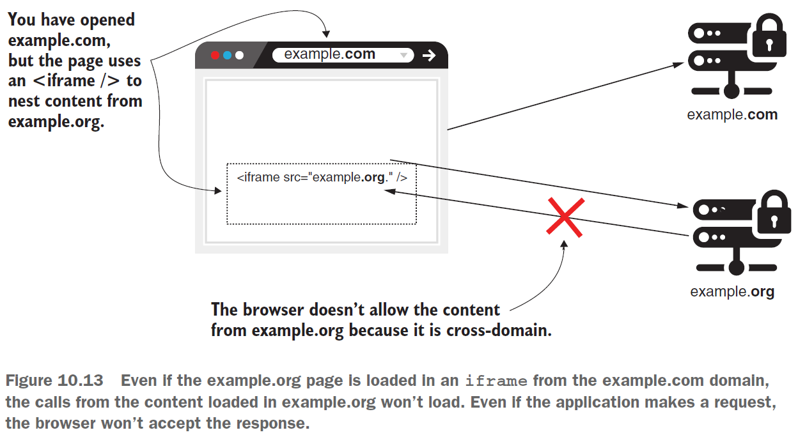
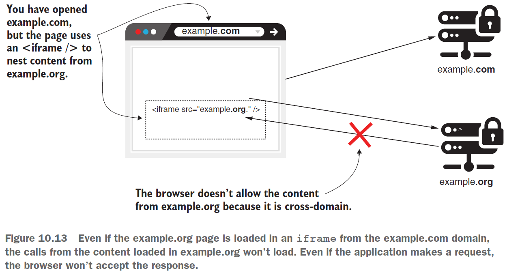
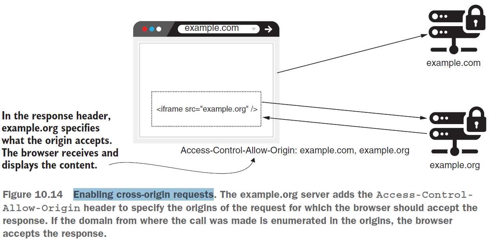
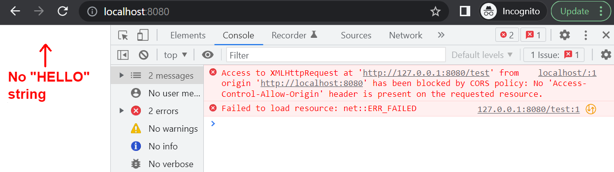
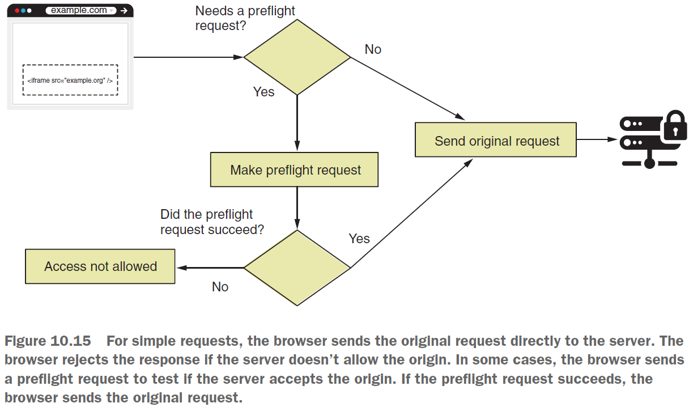
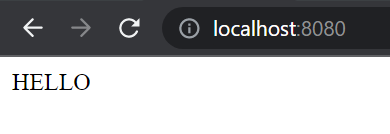

== Cross-origin resource sharing (обмен ресурсами между истчниками)

*Source code:*

- link:../../spring-security-learning/src/main/java/ch5_spring_security_in_action/p235_cross_origin_resource_sharing/[p235_cross_origin_resource_sharing/...] (2-4)

*Content:*

- 1. CORS Intro
- 2. Как работает CORS? CORS-headers
- 3. Применение CORS-политик с помощью аннотации @CrossOrigin
- 4. Применение CORS-политик с помощь CorsConfigurer

Ссылка на интересное видео про CORS - link:https://deworker.pro/edu/series/http-basics/cors-headers[deworker.pro] +
Как выглядит всё это со стороны браузера - link:https://learn.javascript.ru/xhr-crossdomain[learn.javascript.ru]

=== 1. CORS Intro

В этом разделе мы обсудим совместное использование ресурсов между источниками (CORS) и способы его применения с помощью Spring Security. Необходимость в CORS возникла из-за веб-приложений. По умолчанию браузеры не разрешают запросы, сделанные для любого домена, кроме того, с которого загружается сайт. Например, если вы заходите на сайт с `example.com`, браузер не позволит сайту делать запросы к `api.example.com`:

Если вкратце, браузер использует *_механизм CORS_*, чтобы ослабить эту строгую политику и разрешить запросы между разными источниками в некоторых случаях. Это особенно актуально, когда интерфейс и серверная часть являются отдельными приложениями. Обычно _frontend-app_ разрабатывается с использованием таких фреймворков, как _Angular_, _ReactJS_ или _Vue_, и размещается в одном домене, при этом вызывает эндпоинты бэкэнда, размещенного в другом домене.

В этом разделе мы разработаем несколько примеров, из которых узнаем, как применять политики CORS для веб-приложений. Мы также опишем некоторые детали, которые необходимо знать, чтобы избежать нарушений безопасности в приложениях.

=== 2. Как работает CORS? CORS-headers

В этом разделе мы обсудим, как CORS применяется к веб-приложениям. Например, если вы являетесь владельцем сайта `example.com`, и по какой-то причине разработчики сайта `example.org` решили вызывать эндпоинты `example.com` со своего веб-сайта, они не смогут этого сделать. Такая же ситуация может произойти, если домен загружает ваше приложение, например, с помощью *_iframe_* +
*_Iframe_* — это элемент HTML, который используется для встраивания содержимого, созданного веб-страницей, в другую веб-страницу (например, для вставки содержимого с одного сайта внутри страницы другого сайта):

Любая ситуация, в которой приложение исполняет запросы между двумя разными доменами, запрещена. Но, конечно, можно найти случаи, когда такие запросы нужно делать. В таких ситуациях CORS позволяет указать, из какого домена ваше приложение разрешает запросы и какими сведениями можно делиться. Механизм CORS работает на основе HTTP-headers:

Наиболее важными headers являются:

- *_Access-Control-Allow-Origin_* — указывает внешние домены (источники), которые могут получить доступ к ресурсам в вашем домене.

- *_Access-Control-Allow-Methods_* — позволяет обращаться к ресурсу только с использованием определенных HTTP-методов. например, если мы хотим обратиться к другому домену с GET-запросом, мы должны получить от него такой header _Access-Control-Allow-Methods_, который содержит в т. ч. и GET-метод (либо же разрешает все методы - `Access-Control-Allow-Methods: *`).

- *_Access-Control-Allow-Headers_* — добавляет ограничения на то, какие заголовки можно использовать в конкретном запросе (можно отправлять серверу).

В Spring Security по умолчанию ни один из этих заголовков не добавляется в ответ. Итак, давайте начнем с самого начала: что происходит, когда вы делаете вызов из другого источника, если вы не настроили CORS в своем приложении. Когда приложение делает запрос, оно ожидает, что ответ имеет заголовок _Access-Control-Allow-Origin_, содержащий источники, которые одобрены сервером. Если этого не произойдет, то, браузер не примет response.

Давайте продемонстрируем это в небольшом веб-приложении. *_See_* link:../../spring-security-learning/src/main/java/ch5_spring_security_in_action/p235_cross_origin_resource_sharing/[p235_cross_origin_resource_sharing/...] Приложение содержит контроллер с двумя методами (link:../../spring-security-learning/src/main/java/ch5_spring_security_in_action/p235_cross_origin_resource_sharing/controllers/MainController.java[MainController.java]):
[source, java]
----
@Slf4j
@Controller
public class MainController {
    // Defines a main.html page that makes the request
    @GetMapping("/")  // to the '/test' endpoint
    public String main() {
        return "p235_cross_origin_resource_sharing/p235_main.html";
    }
    // Defines an endpoint that we call from a different origin
    @PostMapping("/test") // to prove how CORS works
    @ResponseBody
    public String postHello() {
        log.info("Test method called");
        return "HELLO";
    }
}
----

Файл p235_main.html содержит код JavaScript, вызывающий эндпоинт `/test`. Чтобы имитировать вызов из другого источника, мы можем получить доступ к странице в браузере, используя домен localhost. Из кода JavaScript мы делаем вызов, используя IP-адрес *_127.0.0.1_*. Даже если _localhost_ и _127.0.0.1_ относятся к одному и тому же хосту, браузер видит их как разные строки и считает, что это разные домены:
[source, html]
----
<!DOCTYPE HTML>
<html lang="en">
<head>
    
</head>
<body>

</body>
</html>
----

Запустив приложение и открыв страницу в браузере с _localhost:8080_, мы видим, что страница ничего не отображает. Мы ожидали увидеть строку `HELLO` на странице,которую возвращает эндпоинт /test. В консоли браузера, мы видим ошибку, напечатанную вызовом JavaScript:

Сообщение об ошибке сообщает нам, что ответ не был принят, поскольку _Access-Control-Allow-Origin_-header не существует. Такое поведение происходит потому, что мы не настроили CORS в нашем приложении - Spring Boot по умолчанию не добавляет никаких CORS-header-ов. Таким образом, браузер отработал правильно. Однако мы дожны отметить, что логи в консоли приложения журнал доказывают, что метод был вызван:
----
INFO 21436 [nio-8080-exec-2] c.p.controllers.MainController : Test method called
----

Этот аспект очень важен! Некоторые думают, что CORS - это ограничение, подобное авторизации или CSRF-защите. На самом деле CORS помогает ослабить жесткое ограничение для междоменных вызовов. В нашем примере браузер делает запрос, но мы не принимаем ответ, если в ответе не указаны CORS-headers. Механизм CORS связан с браузером и не является способом защиты эндпоинтов, поскольку вызов эндпоинта все равно произошел. Единственное, что он гарантирует - это то, что только разрешенные в headers исходные домены могут выполнять запросы со своих определенных страниц в браузере.

Что важнее, даже при наложенных ограничениях иногда браузер сначала делает вызов, используя метод HTTP OPTIONS, чтобы проверить, следует ли разрешить запрос. Мы называем этот тестовый запрос предварительным запросом. Если предварительный запрос завершится ошибкой, браузер не будет пытаться выполнить первоначальный запрос. +
Предварительный запрос и решение о том, делать его или нет, являются обязанностью браузера. Нам не нужно реализовывать эту логику. Но это важно понимать, поэтому мы не будем удивлены, увидев междоменные вызовы к серверной части, даже если мы не указали никаких политик CORS для конкретных доменов. Это также может произойти, если у вас есть клиентское приложение, разработанное с использованием _Angular_ или _ReactJS_. Схема работы предварительного запроса представлена ниже:

=== 3. Применение CORS-политик с помощью аннотации @CrossOrigin

CORS-полтитики можно настроить через аннотацию *_@CrossOrigin_*. @CrossOrigin снавится над методом или классом контроллера для применения ко всем эндпоинтам. Преимущество использования аннотации @CrossOrigin заключается в том, что она упрощает настройку CORS для каждой конечной точки.

Мы используем приложение, созданное ранее и вносим изменения в класс link:../../spring-security-learning/src/main/java/ch5_spring_security_in_action/p235_cross_origin_resource_sharing/controllers/MainController.java[MainController.java]

[source, java]
----
@Slf4j
@Controller
public class MainController {

    // ... omitted code

    @CrossOrigin( // enabling cross-origin
        value = "http://localhost:8080",
        methods = {RequestMethod.POST})
    @PostMapping("/test") // to prove how CORS works
    @ResponseBody
    public String postHello() {
        log.info("Test method called");
        return "HELLO";
    }
}
----

Повторно запустим приложение. Теперь на странице должна отображаться строка, возвращаемая конечной точкой /test: HELLO:

Пример параметров _@CrossOrigin_:
[source, java]
----
@CrossOrigin(
    value = {"example.com", "example.org"},
    methods = {RequestMethod.POST},
    allowedHeaders = "checksum",
    exposedHeaders = "checksum")
----

- Параметр *_value_* _@CrossOrigin_ получает массив, позволяющий определить несколько источников. Header - _Access-Control-Allow-Origin_
- Параметр *_methods_* позволяет задать HTTP-методы, с которыми можно ходить к вашему api. Header - _Access-Control-Allow-Methods_
- Параметр *_allowedHeaders_* позволяет задать HTTP-headers, которые сервер принимает. Header - _Access-Control-Allow-Headers_
- Параметр *_exposedHeaders_* позволяет задать HTTP-headers, которые сервер позволяет читать браузеру. Чтобы JavaScript мог прочитать HTTP-заголовок ответа, сервер должен указать его имя в _Access-Control-Expose-Headers_ (см. link:https://learn.javascript.ru/xhr-crossdomain#zagolovki-otveta[learn.javascript.ru]). Header - _Access-Control-Allow-Headers_

Как для источников, так и для заголовков можно использовать звездочку (*), чтобы обозначить все заголовки или все источники. Но всегда лучше фильтровать источники и заголовки, которые вы хотите разрешить, и никогда не позволять какому-либо домену реализовывать код, который обращается к ресурсам вашего приложения. Разрешая все источники, вы подвергаете приложение запросам межсайтового скриптинга (XSS), что в конечном итоге может привести к DDoS-атакам.

=== 4. Применение CORS-политик с помощь CorsConfigurer

Преимущество использования _@CrossOrigin_ - хорошая прозрачность правил. Недостатком является то, что он может привести к boilerplate-code, что также создает риск того, что разработчик может забыть добавить аннотацию для новых эндпоинтов. Поэтому рассмотрим централизованное применение конфигурации CORS в классе конфигурации:

[source, java]
----
@Configuration
public class ProjectConfig extends WebSecurityConfigurerAdapter {
    @Override
    protected void configure(HttpSecurity http) throws Exception {
        http.cors(c -> {
            CorsConfigurationSource source = request -> {
                CorsConfiguration config = new CorsConfiguration();
                config.setAllowedOrigins(
                    List.of("example.com", "example.org"));
                config.setAllowedMethods(
                    List.of("GET", "POST", "PUT", "DELETE"));
                return config;
            };
            c.configurationSource(source);
        });
        http.csrf().disable();
        http.authorizeRequests()
            .anyRequest().permitAll();
    }
}
----

Метод *_cors()_* объекта _HttpSecurity_ получает в качестве параметра объект *_Customizer<CorsConfigurer>_*. Для этого объекта мы устанавливаем *_CorsConfigurationSource_*, который возвращает *_CorsConfiguration_* для HTTP-запроса. _CorsConfiguration_ — это объект, в котором указаны _allowedOrigins_, _allowedMethods_, _allowedHeaders_, _exposedHeaders_, etc. Если вы используете этот подход, вы должны как минимум указать _allowedMethods_ и _allowedOrigins_. Если вы укажете только _allowedOrigins_, ваше приложение не будет разрешать запросы, потому, что объект _CorsConfiguration_ по умолчанию не определяет никаких методов.

В этом примере, чтобы упростить выражение, используется лямбда. Но рекомендуется перенести код настройки CORS-политик в отдельный класс.