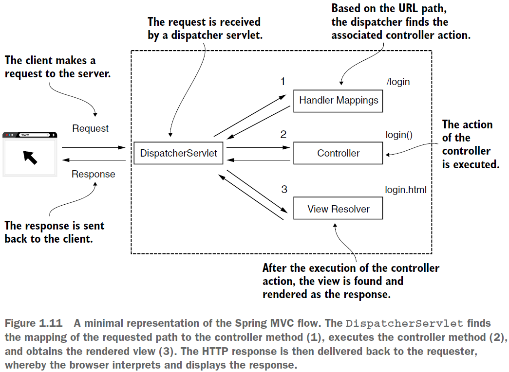
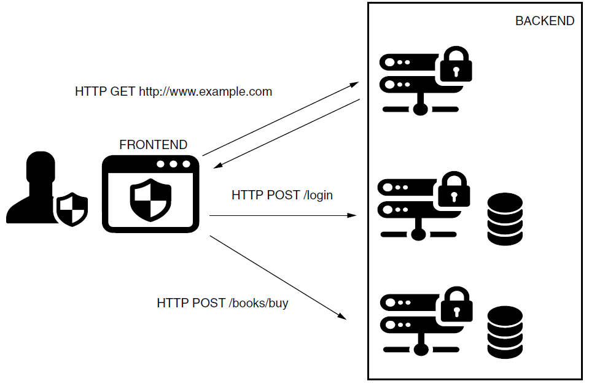
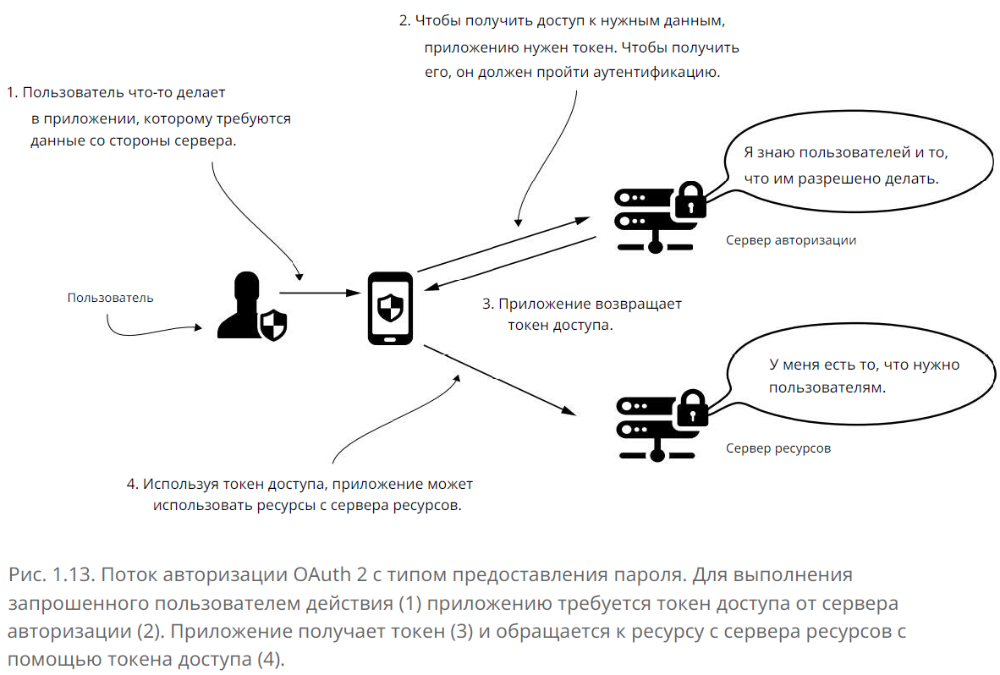
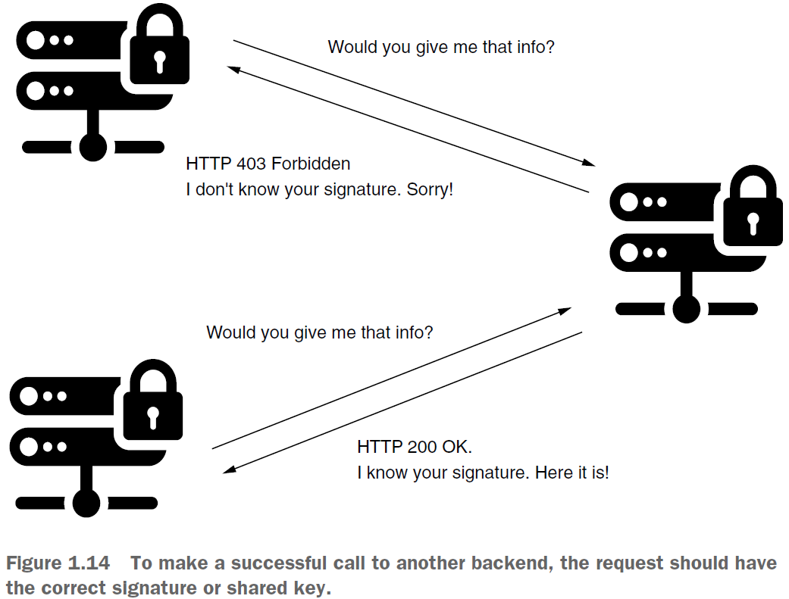

== Security in different architectures

Архитектура сильно влияет на выбор конфигурации Spring Security для ваших приложений так же как и функциональные и нефункциональные требования.

*Content:*

- 1. Безопасность монолитной архитектуры
- 2. Безопасность при отдельных фронте и бэке
- 3. OAuth 2 flow
  * 3.1 Принцип работы
  * 3.2 Преимущества OAuth2 flow и управление токенами
- 4. Использование API keys, криптографических сигнатур и IP address whitelisting

=== 1. Безопасность монолитной архитектуры

В веб-приложении нет прямого разделения между бэком и фронтом. Обычно это общий flow сервлетов: приложение получает HTTP-запрос и возвращает HTTP-ответ клиенту. Иногда сервер использует сессии для каждого клиента. В данном туториале для демонстрации подобного будет использоваться *_Spring MVC_*:

DispatcherServlet находит сопоставление path с методом контроллера (1), выполняет метод контроллера (2) и получает view (3). Затем HTTP-ответ отправляется клиенту, интерпретируется и отображается браузером. +
При работе с сессиями нельзя забывать о таких уявзимостях как фиксированная сессия и подделка межсайтовых запросов.

Сессии хранятся на сервере достаточно долго, и поэтому к ним могут обращаться очень часто. Например, человек, имеющий доступ к дампу кучи, может прочитать информацию во внутренней памяти приложения. При этом иногда неправильная настройка Spring Boot Actuator позволяет легко получить этот дамп через эндпоинт, не требуя root-доступа.

Говоря о подделке межсайтовых запросов - *_CSRF_* - самый простой способ смягчить уязвимость — использовать *_анти-CSRF_* токены. К счастью, в Spring Security эта возможность доступна из коробки. Защита от CSRF, а также CORS (link:https://developer.mozilla.org/ru/docs/Web/HTTP/CORS[developer.mozilla.org]) включены по умолчанию. Для аутентификации и авторизации вы можете использовать неявную конфигурацию логин-формы из Spring Security. Вы должны переопределить только внешний данной формы, и, по факту, вы получаете дефолтную интеграцию с конфигурацией аутентификации и авторизации. Кроме того вы получает защиту от Session fixation уязвимости.

Если вы реализуете аутентификацию и авторизацию, это значит, что у вас будут пользователи и их учетные данные. Этими учетками может управлять либо ваше приложение, либо вы можете разрешать использование учетки из другой системы (например, учетки Facebook, GitHub илиLinkedIn). В любом из этих случаев Spring Security предоставляет простые настройки управления пользователями. Вы можете хранить информацию о пользователе в базе данных, использовать веб-службу или подключиться к другой платформе. Абстракции, используемые в архитектуре Spring Security, делают ее несвязанной, что позволяет вам выбрать любую реализацию, подходящую для вашего приложения.

=== 2. Безопасность при отдельных фронте и бэке

В основном в веб-приложениях происходит разделение фронтенда (Angular, ReactJS, Vue.js и др) и бэкенда (рис. 1.12). В этом случае сессии обычно реализуются на стороне клиента. Фронтенд взаимодействует с бэкендом через REST-эндпоинты. Мы будем реализовывать примеры применения Spring Security для этих архитектур, начиная с главы 11. Такой дизайн системы аналогичен тому, который используется в мобильных приложениях. Приложения, работающие в операционных системах Android или iOS, взаимодействуют с серверной частью REST.

При реализации безопасности появляются другие аспекты. Например, конфигурации CSRF и CORS обычно гораздо сложнее - поскольку origin (источник) у бэка и фронта может отличаться, тем более если речь идет о мобильных приложениях. +
Самый простой (и плохой) вариант - использовать HTTP Basic (link:https://developer.mozilla.org/ru/docs/Web/HTTP/Authentication[link1], link:https://habr.com/ru/post/488388/[link2]) для аутентификации. При всей своей простоте он довольно уязвим - например, мы отправляем учетные данные при каждом вызове в кодировке Base64 без шифровки. Кроме того, креды будут хранится на стороне клиента (браузер) что тоже очень плохо. Поэтому лучше использовать альтернативы - такие как OAuth2 flow.

=== 3. OAuth2 flow

==== 3.1 Принцип работы

Мы хотим использовать такое решение, которое не будет нас заставлять повторно отправлять учетные данные при каждом из запросов.

OAuth2 определяет две отдельных сущности: сервер авторизации и сервер ресурсов. Цель сервера авторизации — авторизовать пользователя и предоставить ему токен, который в том числе определяет набор ролей. Часть серверной части, которая работает с этими ролями, называется сервером ресурсов. Эндпоинты, которые можно вызвать, считаются защищенными ресурсами. На основе полученного токена и после выполнения авторизации вызов ресурса разрешается или запрещается.

На рис. 1.13 представлена общая картина стандартного флоу авторизации OAuth 2:

- 1) Пользователь взаимодействует с приложением (клиентским), которому необходимо вызвать ресурс на бэкенд-сервере.
- 2) Чтобы вызвать ресурс, приложение должно получить access token, поэтому оно идет к серверу авторизации  за токеном, отправляя ему креды пользователя либо refresh token.
- 3) Если креды или токен обновления правильные, сервер авторизации возвращает (или создает) токен доступа.
- 4) The header of the request to the resource server uses the access token when calling the needed resources.

Токен имеет фиксированный срок действия, обычно короткий. Когда срок действия токена истекает, приложению необходимо получить новый. При необходимости сервер может дисквалифицировать токен до истечения срока его действия.

==== 3.2 Преимущества OAuth2 flow и управление токенами

Ниже перечислены некоторые *_преимущества_* OAuth 2 flow:

- 1) Клиент не обязан хранить креды пользователя. Все что нужно сохранить - это токен доступа и (иногда) токен обновления.
- 2) Приложение не раскрывает учетные данные пользователя, который часто находятся в сети.
- 3) Если кто-то перехватил токен, вы можете его дисквалифицировать без необходимости менять креды пользователя.
- 4) Токен может использоваться третьей стороной для доступа к ресурсам от имени пользователя без необходимости представления пользователя. Конечно, в этом случае злоумышленник может украсть токен. Однако из-за ограниченного срока действия токена временные рамки, в течение которых можно использовать эту уязвимость, ограничены.

Конечно, OAuth2 не идеален, и его нужно адаптировать к дизайну приложения. Один из основных вопросов - *_как лучше всего управлять токенами_*? Позже мы рассмотрим несколько возможностей:

- Сохранение токенов в памяти приложения
- Сохранение токенов в БД
- Использование криптографических подписей с веб-токенами JSON (JWT)

=== 4. Использование API keys, криптографических сигнатур и IP address whitelisting

Вам не всегдя нужны креды для аутентификации и авторизации caller-а, но вы хотите убедиться, что никто не изменил обменяемые сообщения. Вам может понадобиться этот подход, когда запросы выполняются между двумя внутренними компонентами или между внутренним и внешним бэкендом. Существующие подходы перечислены ниже:

- Using static keys in request and response headers
- Signing requests and responses with cryptographic signatures
- Applying validation for IP addresses (IP address whitelisting)

Использование *_статических ключей_* — самый слабый подход. В заголовках запроса и ответа мы используем ключ. Запросы и ответы не принимаются, если значение заголовка неверно. Конечно, это предполагает, что мы часто обмениваемся значением ключа в сети; если трафик выходит за пределы дата-центра, его будет легко перехватить. Поэтому этот подход обычно используется вместе с белым списком IP-адресов.

Лучшим подходом к проверке подлинности связи является использование *_криптографических подписей_*:

При таком подходе для подписи запроса и ответа используется ключ. Вам не нужно отправлять ключ по сети - стороны могут использовать свой ключ для проверки подписи. Реализация может быть выполнена с использованием двух пар асимметричных ключей. Этот подход предполагает, что мы никогда не обмениваемся закрытым ключом. В более простой версии используется симметричный ключ, который требует первоначального обмена для настройки. Недостатком является то, что вычисление подписи потребляет больше ресурсов.

Если вы знаете адрес или диапазон  IP-адресов, откуда должен прийти запрос, то вместе с одним из вышеупомянутых решений можно применить проверку IP-адреса. Однако в большинстве случаев эта проверка IP выполняется не на уровне приложений, а гораздо раньше, на сетевом уровне.