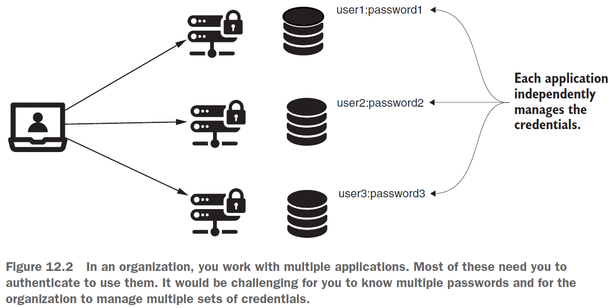
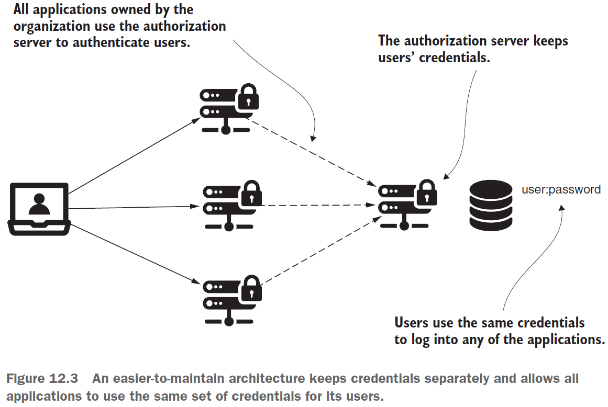

== Как работает OAuth 2?

*Content:*

- 1. OAuth 2 Intro
- 2. Зачем нужен OAuth 2 framework
- 3. Компоненты архитектуры OAuth 2
- 4. Проблемы и уязвимости OAuth 2

=== 1. OAuth 2 Intro

Структура *_OAuth 2_* — обширная тема, для освещения которой может потребоваться целая книга. Однако в следующих четырех главах мы постараемся разобраться со всем, что нам нужно знать о применении _OAuth 2_ с _Spring Security_. Мы начнем с обзора, из которого узнаем, что основными акторами в  OAuth 2 являются _user_, _client_, _resource server_ и _authorization server_ (4 актора). После общего введения мы будем использовать Spring Security для реализации клиента. Затем, в главах с 13 по 15, мы обсудим реализацию двух последних компонентов: сервера ресурсов и сервера авторизации, приведем примеры и приложения, которые можно адаптировать к любым реальным сценариям.

Мы обсудим, что такое OAuth 2, а затем применим его к приложению, ориентированному на аутентификацию с помощью единого входа (SSO, single sign-on). SSO сам по себе очень прост, но вместе с тем и очень полезен. Он позволяет сделать обзор OAuth 2 и дает возможность реализовать полностью работающее приложение без написания слишком большого количества кода.

В главах с 13 по 15 мы применим то, что описано в этой главе, в примерах кода, с которыми мы уже знакомы из предыдущих приложений. Когда мы закончим эти четыре главы, у нас будет отличный обзор того, что нам нужно для реализации OAuth 2 с Spring Security в ваших приложениях. Поскольку OAuth 2 — очень обширная тема, периодиччсеки будем ссылаться на другие важные ресурсы. Впрочем, сам Spring Security упрощает разработку приложений с помощью OAuth 2.

=== 2. Зачем нужен OAuth 2 framework

В большинстве случаев OAuth 2 называют *_authorization framework_* (или *_specification framework_*), основная цель которой — разрешить стороннему веб-сайту или приложению доступ к ресурсу. Иногда люди называют OAuth 2 *_delegation protocol_*. Как бы мы его ни называли, важно помнить, что OAuth 2 — это не конкретная реализация или библиотека. Это *_протокол авторизации_*, а _протокол_ - это стандарт, описывающий правила взаимодействия, но никак не сама реализация!

Отличный способ понять, что такое OAuth 2 и в чем его полезность, — это начать обсуждение с примеров, которые мы уже проанализировали в этой книге. Самый простой способ аутентификации, который мы уже видели во множестве примеров, — это метод аутентификации _HTTP Basic_. И его недостаточно для наших систем - у _HTTP Basic_ есть две основные проблемы:

- Мы отправляем учетные данные для каждого запроса
- Мы используем учетные данные пользователей, которые управляются отдельной системой (и отдельной аутентификацией)

Отправка учетных данных для каждого запроса может работать в отдельных случаях, но в целом это нежелательно, поскольку подразумевает

- Частый обмен учетными данными по сети
- Необходимость хранить учетные данные на стороне клиента (в браузере в случае веб-приложения), чтобы клиент мог отправить их на сервер с запросом на аутентификацию и авторизацию.

Мы хотим избавиться от этих двух моментов в архитектуре наших приложений, потому что они ослабляют безопасность, делая учетные данные уязвимыми. Чаще всего мы хотим иметь отдельную систему для управления учетными данными пользователей. Представьте, что вам нужно настроить и использовать одни и те же учетные данные для всех приложений, с которыми вы работаете в своей организации:

Было бы лучше, если бы мы изолировали ответственность за управление учетными данными в одном компоненте нашей системы. Назовем его _сервером авторизации_. Такой подход исключает дублирование учетных данных, представляющих одно и то же лицо. Таким образом, архитектура становится проще и легче в обслуживании:

=== 3. Компоненты архитектуры OAuth 2

В этом разделе мы обсудим компоненты-акторы, действующие в реализациях аутентификации OAuth 2. Нам необходимо знать эти компоненты и роль, которую они играют, поскольку мы будем ссылаться на них в следующих разделах. В разделе 12.3 мы узнаем больше способов, которыми эти компоненты "общаются" друг с другом, а также узнаем о различных потоках, которые вызывают различное взаимодействие между этими компонентами.

Как уже упоминалось, компоненты OAuth 2 - это:

- *_Сервер ресурсов_* — приложение, на котором размещены ресурсы, принадлежащие пользователям. Ресурсами могут быть данные пользователей или их санкционированные действия.
- *_Пользователь_* (a также - *_владелец ресурса_*) — физическое лицо, которому принадлежат ресурсы, предоставляемые сервером ресурсов. Обычно у пользователя есть username/password, которые он использует для идентификации.
- *_Клиент_* — приложение, которое обращается к ресурсам, принадлежащим пользователю, от его имени. Клиент использует clientId/clientSecret для идентификации себя. Важно заметить, что эти учетные данные не совпадают с учетными данными пользователя. Клиенту нужны собственные учетные данные, чтобы идентифицировать себя при выполнении запроса.
- *_Сервер авторизации_* — приложение, которое разрешает _клиенту_ доступ к ресурсам _пользователя_, которые предоставляются _сервером ресурсов_. Когда _сервер авторизации_ решает, что клиенту разрешен доступ к ресурсу от имени пользователя, он выдает токен. Клиент использует этот токен, чтобы показать _серверу ресурсов_, что он был авторизован сервером авторизации. Сервер ресурсов позволяет клиенту получить доступ к запрошенному им ресурсу, если у него есть действительный токен.

=== 4. Проблемы и уязвимости OAuth 2

В этом разделе мы обсудим возможные уязвимости OAuth 2. Важно понимать, что может пойти не так при использовании OAuth 2, чтобы избежать таких сценариев. OAuth 2 не является серебрянной пулей и имеет свои уязвимости, о которых мы должны знать при создании наших приложений. Перечислим некоторые из наиболее распространенных:

- Использование *_CSRF-атаки_* на _клиенте_. Если пользователь вошел в систему, CSRF возможен, если приложение не имеет механизма CSRF-защиты.
- *_Stealing client credentials_* (кража учетных данных клиента) -  Хранение или передача незащищенных учетных данных может привести к нарушениям, которые позволят злоумышленникам украсть и использовать их.
- *_Replaying tokens_* (воспроизведение токенов) - Как мы узнаем из глав 13 и 14, _токены_ — это ключи, которые мы используем для доступа к ресурсам. Они отправляются их по сети, но иногда они могут быть перехвачены. В случае перехвата они украдены и могут быть использованы повторно. Представьте, что вы потеряли ключ от входной двери вашего дома. Что может случиться? Кто-то другой может использовать его, чтобы открыть дверь столько раз, сколько захочет (replay). В главе 14 мы узнаем больше о токенах и о том, как избежать повторного использования токенов.
- *_Token hijacking_* (перехват токена) — подразумевает, что кто-то вмешивается в процесс аутентификации и крадет токены, которые он может использовать для доступа к ресурсам. Это также потенциальная уязвимость при использовании токенов обновления, поскольку их также можно перехватить и использовать для получения новых токенов доступа. МОжно почитать эту статью: link:https://blog.intothesymmetry.com/2015/06/on-oauth-token-hijacks-for-fun-and.html[blog.intothesymmetry.com]

Помните, OAuth 2 — это фреймворк. Уязвимости являются результатом неправильной реализации функциональности над ним. Использование Spring Security уже помогает нам устранить большинство этих уязвимостей в наших приложениях. При реализации приложения с помощью Spring Security, как вы увидите в этой главе, нам нужно установить конфигурации, но мы полагаемся на flow, реализованный Spring Security.
