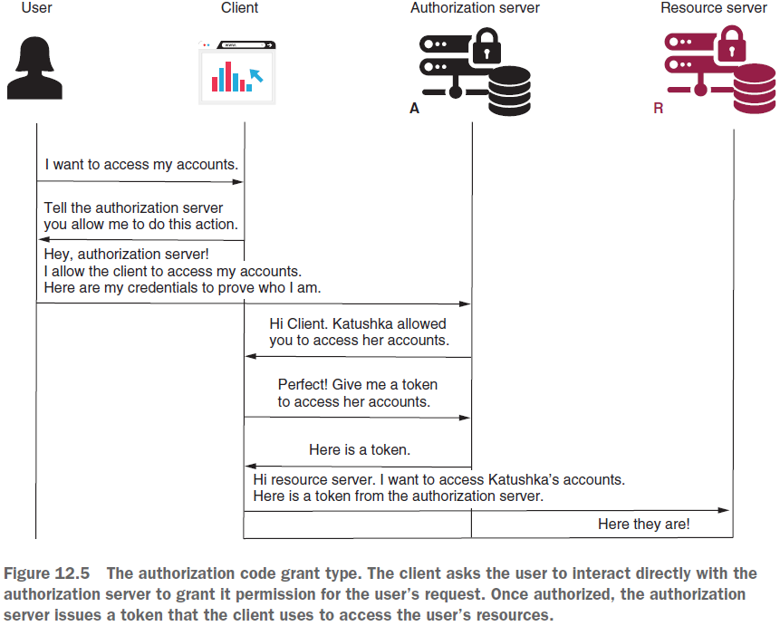
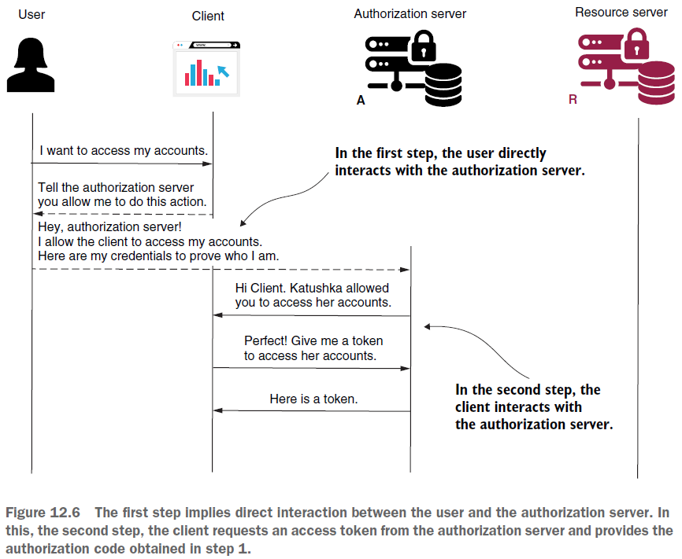

== Implementation choices with OAuth 2. Grant type authorization code

*Content:*

- 1. Grant types
- 2. Implementing the authorization code grant type
  * 2.1 Step 1 - Make the authentication request
  * 2.2 Step 2 - Obtain an access token
  * 2.3 Step 3 - Call the protected resource

=== 1. Grant types

В этом разделе мы обсудим, как применять OAuth 2 в зависимости от архитектуры приложения. OAuth 2 предоставляет разные authentication flows, подходящие для одного или другого сценария. В этом разделе рассмотрим наиболее наиболее распространенные сценарии. Важно сделать это перед началом первой реализации, чтобы мы понимали, что мы реализуем.

Так как же работает OAuth 2? Что означает внедрение аутентификации и авторизации OAuth 2? Зачастую OAuth 2 относится к использованию _токенов_ для авторизации. Получив токен, вы можете получить доступ к определенным ресурсам. Но OAuth 2 предлагает несколько возможностей для получения токена, называемых *_grants_*. Вот наиболее распространенные гранты OAuth 2:

- Authorization code (код авторизации)
- Password
- Refresh token
- Client credentials

При реализации нужно выбрать тип _grant_. Для каждого типа гранта токены создаются по-своему. Давайте проанализируем каждый тип гранта и посмотрим, где он применяется.

=== 2. Implementing the authorization code grant type

_**Authorization code** grant type_ является одним из наиболее часто используемых OAuth 2 flow. (Стрелки на схеме - это не всегда HTTP-запросы, зто упрощенное описание связей между акторами OAuth 2):

Вот как упрощенно работает authorization code:

- Step 1. Make the authentication request
- Step 2. Obtain an access token
- Step 3. Call the protected resource

=== 2.1 Step 1 - Make the authentication request

The client redirects the user to an endpoint of the _authorization server_, где ему необходимо пройти аутентификацию. Вы можете представить, что используете приложение _"App X"_, и вам нужен доступ к защищенному ресурсу. Перед предоставлением доступа к ресурсу, _"App X"_ необходима ваша аутентификации. Приложение открывает для вас страницу с login form on the _authorization server_, которую вы должны заполнить своими учетными данными. Здесь важно отметить, что пользователь напрямую взаимодействует с _authorization server_ и не не отправляет учетные данные клиентскому приложению (_"App X"_).

Когда клиент редиректит пользователя на сервер авторизации, клиент вызывает эндпоинт авторизации со следующими details в request query:

- *_response_type_* with the _value '**code**'_, which tells the authorization server that the client expects a _code_. The client needs the code to obtain an access token, as you’ll see in the second step.
- *_client_id_* with the value of the _client ID_, which identifies the client application itself.
- *_redirect_uri_*, сообщающий серверу авторизации, куда перенаправить пользователя после успешной аутентификации. Иногда сервер авторизации знает _redirect URI_ перенаправления по умолчанию для каждого клиента. В этом случае клиенту не нужно отправлять _redirect URI_.
- *_scope_* (_client scope_), which is similar to the _granted authorities_ (полномочия, которые мы обсуждали раньше).
- *_state_*, которое определяет CSRF-токен, используемый для защиты от CSRF-атак.

После успешной аутентификации сервер авторизации вызывает callbackUrl to client и предоставляет _code_ и _state_. Клиент проверяет, совпадает ли _state_ со значением, которое он отправил в запросе, чтобы подтвердить, что это не кто-то другой пытался вызвать redirect URI. После этого клиент использует _code_ для получения access token.

=== 2.2 Step 2 - Obtain an access token

Чтобы позволить пользователю получить доступ к ресурсам, клиенту необходим *_code_*, полученный в результате шага 1. Это является доказательством клиента, что пользователь прошел аутентификацию. Именно поэтому тип гранта называется _authorization code_. Теперь клиент вызывает _authorization server_ с *_code_* для получения токена.

Во многих случаях эти первые два шага создают путаницу. Люди обычно недоумевают, зачем потоку нужны два обращения к серверу авторизации и два разных токена — код авторизации и токен доступа. Поясним:

- Сервер авторизации генерирует первый код как доказательство того, что пользователь напрямую взаимодействовал с ним. Клиент получает этот код и должен снова пройти аутентификацию, используя его и свои учетные данные, чтобы получить токен доступа.
- Клиент использует второй токен для доступа к ресурсам на сервере ресурсов.

Почему же сервер авторизации напрямую не вернул access token юзеру? Ну, OAuth 2 определяет flow, называемый *_implicit grant type_* (_grant type неявного предоставления_), когда сервер авторизации напрямую возвращает токен доступа. Неявный тип мы не рассмариваем, потому что его использование не рекомендуется, и большинство серверов авторизации сегодня не разрешают его. Тот факт, что сервер авторизации будет вызывать redirect URI напрямую с токеном доступа, не убедившись, что это действительно правильный клиент, получающий этот токен, делает flow менее безопасным.

После получения _authorization code_ технически клиент отправляет запрос серверу авторизации. Этот запрос содержит следующие данные:

- *_code_*, который является кодом авторизации, полученным на шаге 1. Это подтверждает, что пользователь прошел аутентификацию.
- *_client_id_* и *_client_secret_*, учетные данные клиента.
- *_redirect_uri_*, тот же самый, который использовался на шаге 1 для проверки.
- *_grant_type:author_code_* (_authorization code_). Значение _author_code_ идентифицирует тип используемого потока. Сервер может поддерживать несколько потоков, поэтому важно всегда указывать, какой из них является текущим выполняемым потоком аутентификации.

В ответ сервер отправляет обратно *_access_token_*. Этот токен представляет собой значение, которое клиент может использовать для вызова ресурсов, предоставляемых сервером ресурсов.

=== 2.3 Step 3 - Call the protected resource

После успешного получения _access_token_ с сервера авторизации клиент теперь может вызывать защищенный ресурс. Клиент использует header _Authorization:{{access_token_value}}_.

Грант авторизации типа _authorization code_ имеет большое преимущество, поскольку позволяет пользователю разрешить клиенту выполнять определенные действия без необходимости делиться своими учетными данными с клиентом. Но у этого типа гранта есть недостаток: что будет, если кто-то перехватит значение _code_ - код авторизации? Конечно, клиент должен пройти аутентификацию со своими учетными данными, как мы обсуждали ранее. Но что, если учетные данные клиента также каким-то образом будут украдены? Даже если этот сценарий реализовать непросто, мы можем считать его уязвимостью данного типа гранта. Чтобы уменьшить эту уязвимость, вам нужно полагаться на более сложный сценарий - _Proof Key for Code Exchange (*PKCE*) authorization code grant_. Вы можете найти отличное описание _PKCE_ непосредственно в link:https://tools.ietf.org/html/rfc7636[RFC 7636]. Для обсуждения этой темы также рекомендуется прочитать link:http://mng.bz/nzvV[section 7.3.2 of API Security in Action by Neil Madden (Manning, 2020)].

&nbsp;

*_Далее смотри:_* link:293_OAuth_2_implementation_part2.adoc[]