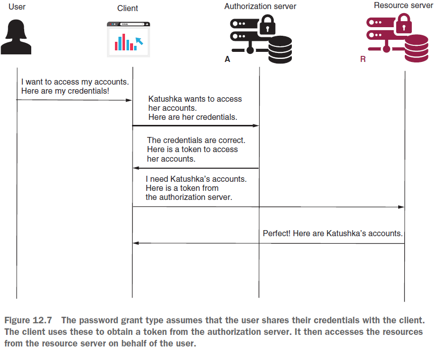
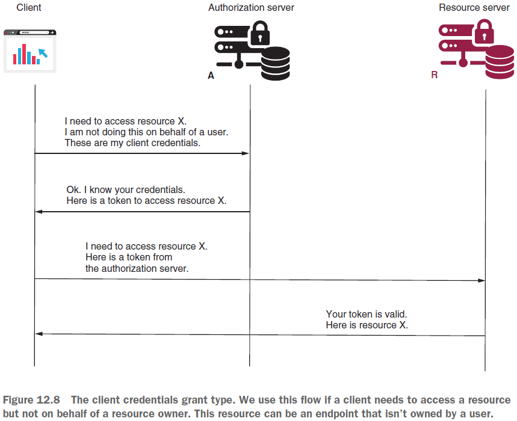
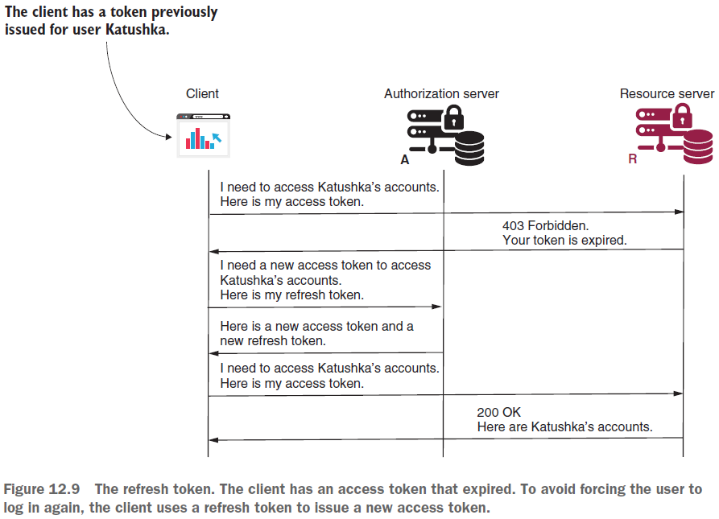

== Implementation choices with OAuth 2. Password, client credentials, refresh token grant types

*Content:*

- 3. Implementing the password grant type
  * 3.1 Step 1 - Request an access token
  * 3.2 Step 2 - Use the access token для доступа к ресурсам
- 4. Implementing the client credentials grant type
  * 4.1 Step 1 & Step 2 - Request/use access token
- 5. Refresh token. Using refresh tokens to obtain new access tokens

=== 3. Implementing the password grant type

*_Password grant type_* также известен как *_resource owner credentials grant type_*.  Приложения, использующие этот flow, предполагают, что клиент собирает учетные данные пользователя и использует их для аутентификации и получения токена с сервера авторизации.

Этот flow используется только в том случае, когда клиент и сервер авторизации созданы и поддерживаются _одной и той же организацией_. Почему? Предположим, вы создаете систему микросервисов и за безопасность у вас отвечает _отдельный микросервис_ - это повышает масштабируемость системы, разделяя обязанности для каждого сервиса.

Далее предположим, что пользователи вашей системы используют клиентское веб-приложение, разработанное с помощью фреймворка, такого как Angular, ReactJS или Vue.js, либо используют мобильное приложение. В этом случае пользователи могут счесть странным редирект из _вашей системы_ в _вашу же систему_ для аутентификации, а затем _обратно_. Так будет работать _authorization code grant type_. В случае _password grant type_ ваше приложение представит пользователю форму входа и позволит клиенту позаботиться об отправке учетных данных на сервер для аутентификации. Пользователю не нужно знать, как вы разработали ответственность аутентификации в своем приложении. Вот как упрощенно работает password grant type:

- Step 1. Request an access token
- Step 2. Use the access token для доступа к ресурсам

=== 3.1 Step 1 - Request an access token

Процесс намного проще, чем в случае с _authorization code_. Клиент собирает учетные данные пользователя и вызывает сервер авторизации для получения токена доступа. При запросе токена доступа клиент также отправляет в запросе следующие данные:

- *_grant_type:password_*
- *_client_id_* и *_client_secret_*, учетные данные клиента.
- *_scope_*, аналог granted authorities.
- *_username_* и *_password_*, учетные данные пользователя. Они отправляются в виде plain text как значения request header.

Клиент получает в ответ токен для вызова эндпоинтов сервера ресурсов.

=== 3.2 Step 2 - Use the access token для доступа к ресурсам

По аналогии с _authorization code grant type_ после получения _access_token_ с сервера авторизации клиент может вызывать защищенный ресурс. Клиент использует header _Authorization:{{access_token_value}}_.

_Password grant type_ менее безопасен, чем _authorization code grant type_, главным образом потому, что он предполагает шаринг пользовательских кредов клиентскому приложению. Старайтесь избегать данного _grant type_ в реальных сценариях. Даже если сервер авторизации и клиент созданы одной и той же организацией, в первую очередь стоит подумать об использовании _authorization code_.

=== 4. Implementing the client credentials grant type

*_Client credentials grant type_* - самый простой грант, описанный в OAuth 2. Он используется когда юзера не существует - а у вас есть просто взаимодействие между двумя приложениями (_external client_). Предполагается, что есть система, реализующая аутентификацию с помощью OAuth 2, и нужно разрешить внешнему приложению (e. g. на другом сервере) аутентифицироваться и вызывать определенный ресурс данной системы. Ранее мы обсуждали API key - link:24_security_in_architectures.adoc[24_security_in_architectures.adoc]. Этот подход нужно заменить на OAuth 2 _client credentials_ flow.

Шаги для _client credentials_ аналогичны шагам для _password grant type_. Единственным исключением является то, что при запросе токена доступа не требуются учетные данные пользователя:

- Step 1. Request an access token
- Step 2. Use the access token для доступа к ресурсам

=== 4.1 Step 1 & Step 2 - Request/use access token

Чтобы получить токен, клиент отправляет запрос на сервер авторизации со следующими данными:

- *_grant_type:client_credentials_*
- *_client_id_* и *_client_secret_*, учетные данные клиента.
- *_scope_*, аналог granted authorities.

В ответ клиент получает токен доступа. *_Step 2_* аналогичен _password grant type_.

=== 5. Refresh token. Using refresh tokens to obtain new access tokens

До сих пор мы говорили, что результатом OAuth 2 _flow_, который мы также называем _grant_, является токен доступа. Но мы мало говорили об этом токене. В конце концов, OAuth 2 не предполагает конкретной реализации токенов. Токен, независимо от того, как он реализован, может истечь, за исключением токенов с бесконечным сроком жизни (но не рекомендуется их использовать). Refresh token - это альтернатива использования credentials для получения нового токена доступа. Мы реализуем refresh token чуть позже, в главе 13.

В какой-то момент токен с истекшим сроком действия больше нельзя будет использовать. Клиент должен получить другой токен доступа, не используя аутентификацию. Поэтому зачастую _authorization server_ при первичной аутентификации выдает вместе с *_access_token_* также и *_refresh_token_* (example - keycloack), используемый приложением для получения нового _access_token_ (_flow: authorization code или password_).

Если мы не используем _refresh_token_, но мы не хотим постоянно разлогинивать пользователя (например, используя _password grant type_), мы будем вынужены хранить credentials пользователя (на клиентской стороне) - что очень небезопасно в случае атаки клиентских приложений. Поэтому использование _refresh_token_ - просто необходимость. Вместо небезопасного хранения учетных данных и без необходимости каждый раз перенаправлять пользователя вы можете сохранить _refresh_token_ и использовать его для получения нового _access_token_ при необходимости. Если _refresh_token_ всё же был раскрыт, его всегда можно отозвать.

_Сервер авторизации_ возвращает _refresh_token_ вместе с _access_token_ при использовании таких _flow_, как _authorization code_ или _password_. При использовании _client credentials flow_ сервер авторизации не выдает  _refresh_token_, поскольку данному _flow_ не нужны учетные данные пользователя.

Когда срок действия токена доступа истечет, клиент должен отправить запрос со следующими данными:

- *_grant_type:refresh_token_*
- *_refresh_token_* со значением токена обновления.
- *_client_id_* и *_client_secret_*, учетные данные клиента.
- *_scope_*, аналог granted authorities, определяющий те же или меньшие предоставленные полномочия. Если необходимо авторизовать больше предоставленных полномочий, необходима повторная аутентификация.

В ответ на этот запрос _сервер авторизации_ выдает новый _access_token_ и новый _refresh_token_.

