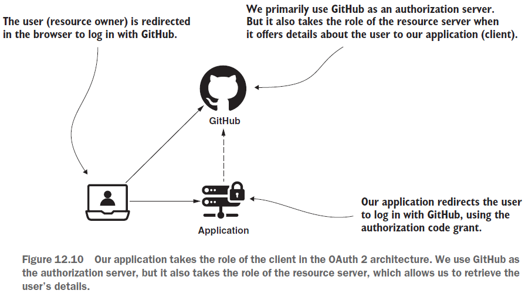
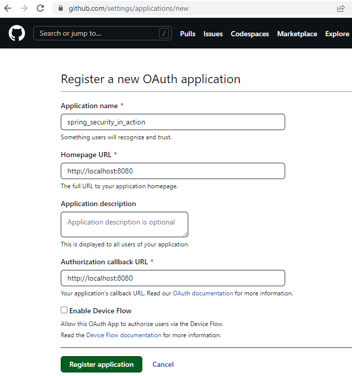
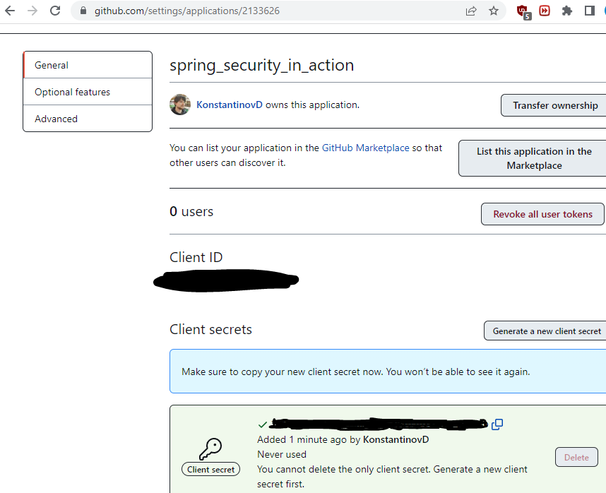
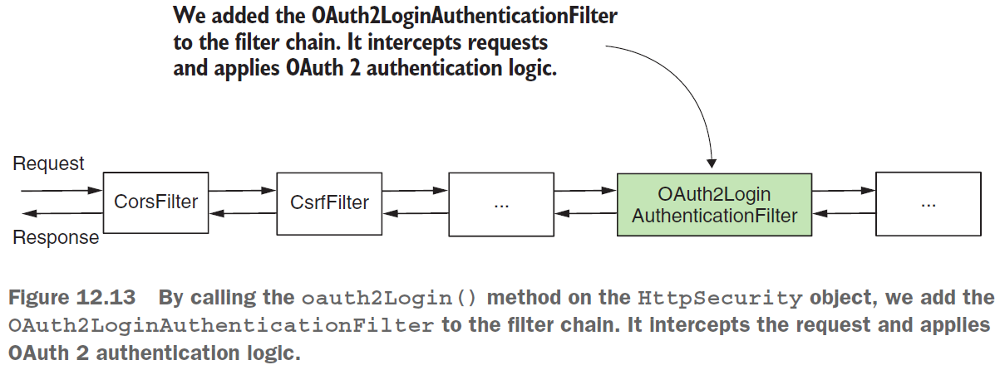
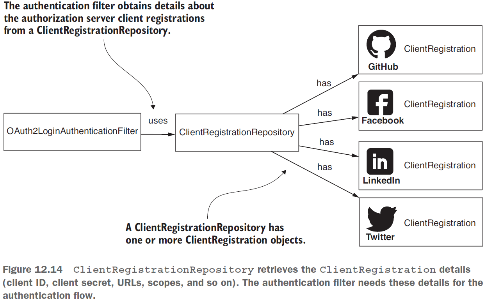
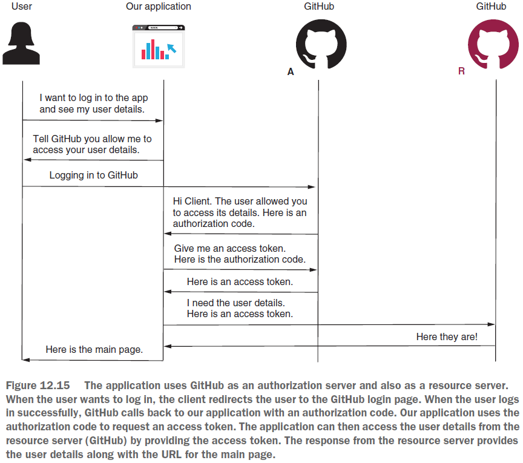

== Implementing a simple single sign-on application

*Source code:*

- link:../../spring-security-learning/src/main/java/ch5_spring_security_in_action/p303_oauth2_github_sso_application[p303_oauth2_github_sso_application/...] (3-7)

*Content:*

- 1. Введение в имплементацию
- 2. Настройка сервера авторизации
- 3. Имплементация - настройка конфигурации. oauth2Login()
- 4. Имплементация - ClientRegistration
- 5. Имплементация - ClientRegistrationRepository
- 6. Получение сведений об аутентифицированном пользователе
- 7. Тестирование

=== 1. Введение в имплементацию

В этом разделе мы реализуем приложение, использующее инфраструктуру OAuth 2 с Spring Boot и Spring Security. *_Single sign-on (SSO)_* приложение — это приложение, в котором вы проходите аутентификацию через сервер авторизации, а затем приложение сохраняет вас залогированным, используя _refresh_token_. В нашем случае мы будем реализовывать только клиента из архитектуры OAuth 2.

В нашем приложении мы используем GitHub в качестве authorization & resource servers и реализуем _authorization code grant type_. В главах 13 и 14 мы реализуем как сервер авторизации, так и сервер ресурсов в архитектуре OAuth 2.

=== 2. Настройка сервера авторизации

В этом разделе мы настраиваем сервер авторизации. Мы воспользуемся существующим: GitHub. В главе 13 вы узнаете, как реализовать собственный сервер авторизации. Это означает, что наше приложение не будет управлять своими пользователями и любой сможет войти в наше приложение, используя свою учетную запись GitHub. Как и любому другому серверу авторизации, GitHub необходимо знать клиентское приложение, которому он выдает токены. Клиент использует _client_id_/_client_secret_ для аутентификации на сервере авторизации, поэтому приложение OAuth должно быть зарегистрировано на сервере авторизации GitHub. Для этого заполняем короткую форму по следующей ссылке - _https://github.com/settings/applications/new_:

Когда вы добавляете новое приложение OAuth, вам нужно указать имя приложения, homepage url и callback url, который будет вызывать GitHub. Используемый grant type - _authorization code_. Этот грант предполагает, что клиент редиректит пользователя на сервер авторизации (в нашем случае GitHub) для входа в систему, а затем сервер авторизации вызывает callback url у клиента. Клиентская сторона GitHub (ваш браузер) вызывает localhost - и мы можем протестировать свое приложение локально.

Как только вы заполните форму и выберите «Зарегистрировать приложение», GitHub предоставит вам _client_id_/_client_secret_:

Эта конфигурация — все, что нам нужно сделать для сервера авторизации. Теперь, когда у нас есть учетные данные клиента, мы можем начать работу над нашим приложением.

=== 3. Имплементация - настройка конфигурации. oauth2Login()

Начнем с написания класса конфигурации. Мы расширяем WebSecurityConfigurerAdapter и переопределяем метод `configure(HttpSecurity http)`. А теперь внимание: вместо использования _httpBasic()_ или _formLogin()_, мы вызываем другой метод с именем *_oauth2Login()_*. *_See:_* link:../../spring-security-learning/src/main/java/ch5_spring_security_in_action/p303_oauth2_github_sso_application/config/ProjectConfig.java[ProjectConfig.java]:

[source, java]
----
@Configuration
public class ProjectConfig extends WebSecurityConfigurerAdapter {

    @Override
    protected void configure(HttpSecurity http) throws Exception {
        http.oauth2Login(); // Установка метода аутентификации
        http.authorizeRequests() // юзер должен быть залогирован для вызова запроса
                .anyRequest().authenticated();
    }
}
----

Как и в случае с _httpBasic()_ или _formLogin()_, *_oauth2Login()_* просто добавляет новый фильтр аутентификации в цепочку фильтров:

=== 4. Имплементация - ClientRegistration

Обсудим реализацию связи между клиентом OAuth 2 и сервером авторизации. Если мы запустим приложение сейчас, мы не сможем получить доступ к главной странице. Причина заключается в том, что юзер должен быть аутентифицирован для вызова любого запроса, но мы не предоставили никакого способа аутентификации. Нам нужно установить, что GitHub является нашим сервером авторизации. Для этой цели Spring Security определяет контракт *_ClientRegistration_*.

Интерфейс _ClientRegistration_ представляет клиента в архитектуре OAuth 2. Для клиента вам необходимо определить все его необходимые детали:

- The client ID and secret;
- The grant type used for authentication;
- The redirect URI;
- The scopes.

Приложению нужны все эти детали для процесса аутентификации (рассматривали ранее). Spring Security также предоставляет билдер для _ClientRegistration_ простой способ создания экземпляра билдера - *_See:_* link:../../spring-security-learning/src/main/java/ch5_spring_security_in_action/p303_oauth2_github_sso_application/config/ProjectConfig.java[commented code in ProjectConfig.java]:

[source, java]
----
ClientRegistration cr =
  ClientRegistration
    .withRegistrationId("github")
    .clientId("a7553955a0c534ec5e6b")
    .clientSecret("1795b30b425ebb79e424afa51913f1c724da0dbb")
    .scope(new String[]{"read:user"})
    .clientName("GitHub")
    .authorizationUri(
      "https://github.com/login/oauth/authorize")
    .tokenUri("https://github.com/login/oauth/access_token")
    .userInfoUri("https://api.github.com/user")
    .userNameAttributeName("id")
    .authorizationGrantType(AuthorizationGrantType.AUTHORIZATION_CODE)
    .redirectUriTemplate("{baseUrl}/{action}/oauth2/code/{registrationId}")
    .build();
----

Мы устанавливаем registration id по желанию, устанавливаем clientId/clientSecret, определяем scope и clientName. The _registrationId_ is a _unique identifier_ for the _ClientRegistration_ - link:https://docs.spring.io/spring-security/site/docs/5.2.12.RELEASE/reference/html/oauth2.html#:~:text=The%20registrationId%20is%20a%20unique%20identifier%20for%20the%20ClientRegistration.&text=If%20the%20OAuth%20Client%20is,template%20variables%20for%20redirect%2Duri%20[docs.spring.io].

Помимо этих деталей, я должен предоставить URL-адреса сервера авторизации:

- Authorization URI — URI, на который клиент перенаправляет пользователя для аутентификации.
- Token URI — URI, который клиент вызывает для получения access/refresh tokens.
- User info URI — URI, который клиент может вызвать после получения токена доступа, чтобы получить более подробную информацию о пользователе

Откуда мы взяли все эти URI? Если сервер авторизации разработан не вами, как в нашем случае, вам нужно их получить из документации. Например, для GitHub вы можете найти их здесь: link:https://developer.github.com/apps/building-oauth-apps/authorizing-oauth-apps/[docs.github.com]

При этом Spring Security определяет класс *_CommonOAuth2Provider_*, который частично определяет экземпляры _ClientRegistration_ для наиболее распространенных провайдеров, которые вы можете использовать для аутентификации, в том числе:

- Google
- GitHub
- Facebook
- Окта

Если вы используете один из этих провайдеров, вы можете определить ClientRegistration следующим образом - *_See:_* link:../../spring-security-learning/src/main/java/ch5_spring_security_in_action/p303_oauth2_github_sso_application/config/ProjectConfig.java[ProjectConfig.java]:

[source, java]
----
ClientRegistration cr =
  CommonOAuth2Provider.GITHUB
    .getBuilder("github") // выбрали github
    .clientId("a7553955a0c534ec5e6b") // clientId
    .clientSecret("1795b30b42. . .") // clientSecter
    .build();
----

Если же вы используете что-то другое (_VK_, _Mail.ru_, etc.), то вы определяете _ClientRegistration_ целиком.

=== 5. Имплементация - ClientRegistrationRepository

Рассмотрим, как зарегистрировать экземпляры _ClientRegistration_ для Spring Security, чтобы использовать их для аутентификации. После создания и настройки _ClientRegistration_ необходимо настроить его для использования для аутентификации. Для этой цели Spring Security использует объект типа *_ClientRegistrationRepository_*:

Интерфейс _ClientRegistrationRepository_ аналогичен интерфейсу _UserDetailsService_. Точно так же, как объект _UserDetailsService_ находит _UserDetails_ по имени пользователя, объект _ClientRegistrationRepository_ находит _ClientRegistration_ по его *_registrationId_*.

Spring Security предлагает только реализацию *_InMemoryClientRegistrationRepository_*, которая хранит в памяти экземпляры _ClientRegistration_. ПОэтому нам самим надо реализовывать _ClientRegistrationRepository_, чтобы указать платформе, где найти экземпляры _ClientRegistration_. В нашем же приложении мы будем использовать просто _InMemoryClientRegistrationRepository_ - *_See:_* link:../../spring-security-learning/src/main/java/ch5_spring_security_in_action/p303_oauth2_github_sso_application/config/ProjectConfig.java[ProjectConfig.java]:

[source, java]
----
@Configuration
public class ProjectConfig extends WebSecurityConfigurerAdapter {
  @Bean
  public ClientRegistrationRepository clientRepository() {
     var c = clientRegistration();
     return new InMemoryClientRegistrationRepository(c);
 }
 // ...
}
----

Добавления _ClientRegistrationRepository_ в качестве bean-компонента в контексте Spring достаточно, чтобы Spring Security мог найти бин. В качестве альтернативы этому способу регистрации вы можете использовать объект _Customizer_ в качестве параметра метода _oauth2Login()_:

[source, java]
----
@Configuration
public class ProjectConfig extends WebSecurityConfigurerAdapter {
  @Override
  protected void configure(HttpSecurity http) throws Exception {
    http.oauth2Login(c -> {
        c.clientRegistrationRepository(clientRepository());
    });

    http.authorizeRequests()
        .anyRequest()
        .authenticated();
}
// ...
}
----

*NOTE!* Реализация метода _configure(HttpSecurity http)_ при наследовании класса _WebSecurityConfigurerAdapter_ приведет к _circular dependency_ с классом *_OAuth2WebSecurityConfiguration_*. Поэтому можно либо использовать отдельный класс конфигурации как у нас - *_See:_* link:../../spring-security-learning/src/main/java/ch5_spring_security_in_action/p303_oauth2_github_sso_application/config/SecondProjectConfig.java[SecondProjectConfig.java], либо не наследовать _WebSecurityConfigurerAdapter_ - и будет использоваться _OAuth2WebSecurityConfiguration$OAuth2SecurityFilterChainConfiguration_.

=== 6. Получение сведений об аутентифицированном пользователе

Мы уже знаем, что в архитектуре Spring Security именно _SecurityContext_ хранит сведения об аутентифицированном пользователе. После завершения процесса аутентификации соответсвующий фильтр сохраняет объект _Authentication_ в _SecurityContext_. Приложение может брать данные о пользователе оттуда и использовать их при необходимости. То же самое происходит и с аутентификацией OAuth 2. В данном случае реализация объекта Authentication, используемого платформой, называется OAuth2AuthenticationToken.  Вы можете взять его непосредственно из SecurityContext или позволить Spring Boot внедрить его в параметр метода эндпоинта. - *_See:_* link:../../spring-security-learning/src/main/java/ch5_spring_security_in_action/p303_oauth2_github_sso_application/controllers/MainController.java[MainController.java]:

[source,java]
----
@Slf4j
@Controller
public class MainController {

    @GetMapping("/")
    public String main(OAuth2AuthenticationToken token) {
        log.info("Received token: " + token);
        return "p303_oauth2_github_sso_application/p303_main.html";
    }
}
----

=== 7. Тестирование

Сначала мы выходим из аккаунта github, затем открываем консоль браузера, чтобы проверить историю навигации по запросам. Запускаем приложение и идем по урлу `http://localhost:8080/`.

Приложение перенаправляет вас на URL-адрес авторизации GitHub (настраивается в классе _CommonOauth2Provider_ для GitHub) с дополнительными параметрами запроса:
----
https://github.com/login/oauth/authorize?response_type=code&client_id=31c663418786e60bfc30&scope=read:user&state=GkgqMAh-ZLSfcSmrFIDxOq3M5FfH7Oe77CQbfNeS7aA%3D&redirect_uri=http://localhost:8080/login/oauth2/code/github
----

Мы используем наши учетные данные GitHub и входим в наше приложение с помощью GitHub. Нас перенаправляют обратно на страницу, на которую мы пытались войти (`http://localhost:8080/`). При этом GitHub дергает callback URL, который мы ему отправили в параметрах запроса как *_redirect_uri_*, добавляя к нему параметр *_code_*:

----
http://localhost:8080/login/oauth2/code/github?code=9821376f027fb8ac2d02&state=GkgqMAh-ZLSfcSmrFIDxOq3M5FfH7Oe77CQbfNeS7aA%3D
----

Полученный код авторизации наше приложение использует для запроса токена доступа. Мы не увидим вызовы конечной точки токена из браузера, так как это происходит непосредственно из нашего приложения. Но мы можем быть уверены, что приложению удалось получить токен, потому что мы можем видеть информацию о пользователе, напечатанную в консоли:

----
Principal=Name: [...], Granted Authorities: [[ROLE_USER, SCOPE_read:user]], User Attributes: [{login=..., id=..., node_id=..., avatar_url=https://avatars.githubusercontent.com/u/32042793?v=4, gravatar_id=, url=https://api.github.com/users/KonstantinovD, html_url=https://github.com/KonstantinovD,.. }],..
----
