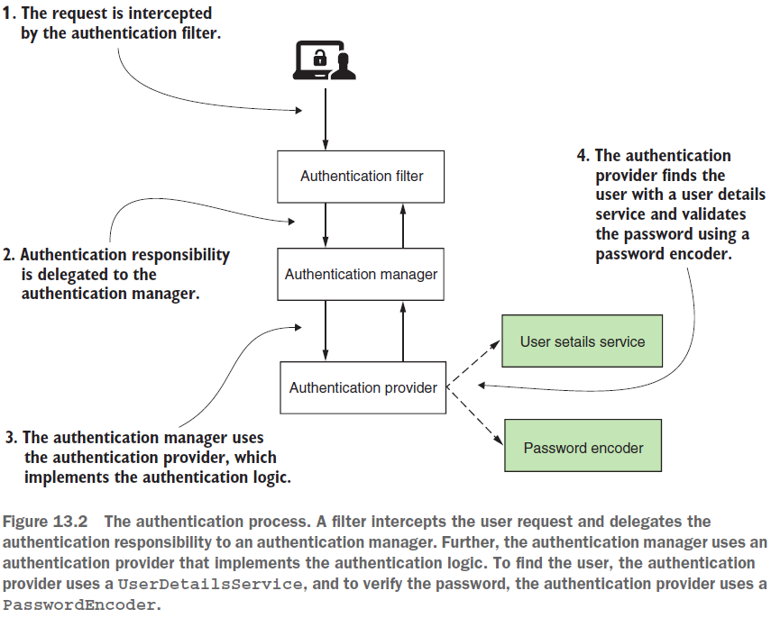
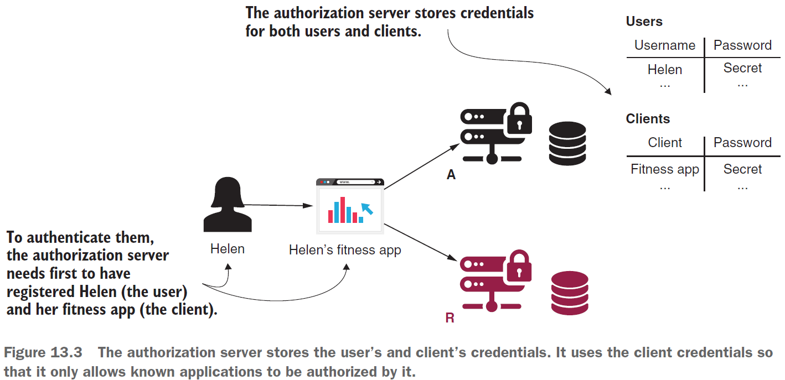
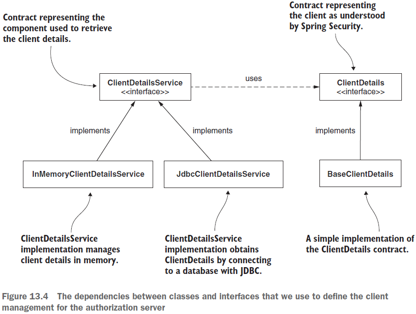

== Implementing Authorization server

*Source code:*

- link:../../spring-security-learning/src/main/java/ch5_spring_security_in_action/p316_implement_auth_server/[p316_implement_auth_server/...] (2-5) - *_not working_*

*Content:*

- 1. Введение в имплементацию
- 2. Написание собственной реализации authorization server
- 3. Настройка управления пользователями
- 4. Регистрация клиентов
- 5. Использование password grant type
- 6. Использование нескольких типов грантов для клиента

=== 1. Введение в имплементацию

Роль _сервера авторизации_ заключается в аутентификации пользователя и предоставлении токена клиенту. Клиент использует этот токен для доступа к ресурсам, предоставленным сервером ресурсов от имени пользователя. Поведение сервера авторизации отличается в зависимости от выбранного гранта - OAuth 2 flow для получения токена. В этой главе мы узнаем, как настроить сервер авторизации для наиболее распространенных типов грантов OAuth 2: _Authorization code_, _Password_, _Client credentials_. Мы также научимся настраивать сервер авторизации для выдачи _refresh_tokens_.

В большинстве случаев вам не придётся имплементить сервер авторизации - вы будете использовать что-то типа _Keycloack_, _Okta_ или вообще недавно появившийся link:https://spring.io/blog/2020/04/15/announcing-the-spring-authorization-server[spring-authorization-server]. Но все же лучше знать Best Practices для имплементации сервера авторизации.

=== 2. Написание собственной реализации authorization server

В link:../../spring-security-learning/pom.xml[pom.xml] необходимо добавить тег *_<dependencyManagement>_* для идентификатора артефакта spring-cloud-dependencies:

[source, xml]
----
    <dependencies>
        <dependency>
            <groupId>org.springframework.cloud</groupId>
            <artifactId>spring-cloud-starter-oauth2</artifactId>
            <version>2.2.0.RELEASE</version>
        </dependency>
    </dependencies>

    <dependencyManagement>
        <dependencies>
            <dependency>
                <groupId>org.springframework.cloud</groupId>
                <artifactId>spring-cloud-dependencies</artifactId>
                <version>Hoxton.SR1</version>
                <type>pom</type>
                <scope>import</scope>
            </dependency>
        </dependencies>
    </dependencyManagement>
----

Теперь мы можем определить класс конфигурации *_AuthServerConfig_*. Помимо классической аннотации _@Configuration_, нам также необходимо аннотировать этот класс с помощью *_@EnableAuthorizationServer_*. Таким образом, мы указываем Spring Boot включить конфигурацию сервера авторизации OAuth 2. Мы можем настроить эту конфигурацию, расширив класс AuthorizationServerConfigurerAdapter и переопределив определенные методы, которые мы обсудим позже - *_See:_* link:../../spring-security-learning/src/main/java/ch5_spring_security_in_action/p316_implement_auth_server/config/AuthServerConfig.java[AuthServerConfig.java]:

[source, java]
----
@Configuration
@EnableAuthorizationServer
public class AuthServerConfig extends AuthorizationServerConfigurerAdapter {
   // omited code
}
----

У нас уже есть минимальная конфигурация для нашего сервера авторизации. Но нам все еще нужно реализовать управление пользователями, зарегистрировать хотя бы одного клиента и решить, какие типы грантов поддерживать.

=== 3. Настройка управления пользователями

Реализация управления пользователями для сервера авторизации аналогична обсуждаемой ранее, в главах 3 и 4. Мы продолжаем использовать контракты _UserDetails_, _UserDetailsService_ и _UserDetailsManager_ для управления учетными данными. А для управления паролями мы продолжаем использовать контракт _PasswordEncoder_. А теперь рассмотрим следующую схему:

Схема отображает основные компоненты, действующие в процессе аутентификации в Spring Security. Сравнив с аналогичной диаграммой, обсуждаемой ранее, мы увидим, что у нас больше нет _SecurityContext_ на этой диаграмме. Это изменение произошло из-за того, что результат аутентификации не сохраняется в _SecurityContext_. Вместо этого аутентификация управляется токеном из *_TokenStore_*. Мы узнаем больше о _TokenStore_ в главе 14, где будем обсуждать сервер ресурсов.

Создадим отдельный конфиг для управления пользователями - *_WebSecurityConfig_*. Помимо стандартного создания бинов _UserDetailsService_ и _PasswordEncoder_ нам нужно связать управление пользователями с конфигурацией сервера авторизации. Для этого мы добавляем бин *_AuthenticationManager_* как бин в контекст Spring (благодаря тому, что _WebSecurityConfig extends WebSecurityConfigurerAdapter_), а затем используем его в классе AuthServerConfig.

*_See:_* link:../../spring-security-learning/src/main/java/ch5_spring_security_in_action/p316_implement_auth_server/config/WebSecurityConfig.java[WebSecurityConfig.java]:

[source, java]
----
@Configuration
public class WebSecurityConfig extends WebSecurityConfigurerAdapter {
  @Bean // стандартный бин UserDetailsService
  public UserDetailsService uds() {
    var uds = new InMemoryUserDetailsManager();
    var u = User.withUsername("john")
        .password("12345")
        .authorities("read")
        .build();
    uds.createUser(u);
    return uds;
  }

  @Bean // стандартный бин NoOpPasswordEncoder
  public PasswordEncoder passwordEncoder() {
    return NoOpPasswordEncoder.getInstance();
  }

  // We should extend the WebSecurityConfigurerAdapter
  // to access the AuthenticationManager instance
  @Bean
  public AuthenticationManager authenticationManagerBean() throws Exception {
    return super.authenticationManagerBean();
  }
}
----

Теперь мы можем изменить класс link:../../spring-security-learning/src/main/java/ch5_spring_security_in_action/p316_implement_auth_server/config/AuthServerConfig.java[AuthServerConfig.java], чтобы зарегистрировать _AuthenticationManager_ на сервере авторизации:

[source, java]
----
@Configuration
@EnableAuthorizationServer
public class AuthServerConfig extends AuthorizationServerConfigurerAdapter {
  @Autowired
  private AuthenticationManager authenticationManager;

  @Override // Overrides the configure() method to set the AuthenticationManager
  public void configure(AuthorizationServerEndpointsConfigurer endpoints) {
    endpoints.authenticationManager(authenticationManager);
  }
}
----

Теперь у нас есть пользователи. Но архитектура OAuth 2 предполагает, что пользователи взаимодействуют с сервером ресурсов через клиента.

=== 4. Регистрация клиентов

В этом разделе вы узнаете, как сделать ваших клиентов известными серверу авторизации. Клиенту нужны собственные учетные данные. Сервер авторизации также управляет этими учетными данными и разрешает запросы только от зареистрированных клиентов:

По аналогии с GitHub, где мы регистрировали своего клиента и использовали его учетные данные, наш сервер авторизации тоже должен работать с клиентами. Интерфейс, определяющий клиента для сервера авторизации, называется *_ClientDetails_*. Интерфейс, определяющий объект для получения _ClientDetails_ по их _clientId_, называется *_ClientDetailsService_*.

Эти интерфейсы работают так же, как интерфейсы _UserDetails_ и _UserDetailsService_, но они представляют клиентов. Многое из того, что мы обсуждали в главе 3, одинаково работает для _ClientDetails_ и _ClientDetailsService_. Например, *_InMemoryClientDetailsService_* — это реализация интерфейса _ClientDetailsService_, который управляет _ClientDetails_ в памяти. Он работает аналогично классу _InMemoryUserDetailsManager_ для _UserDetails_. Точно так же *_JdbcClientDetailsService_* похож на _JdbcUserDetailsManager_. На схеме ниже показаны эти классы и интерфейсы, а также связи между ними:

Рассмотрим, как определить конфигурацию клиента и настроить ее с помощью _InMemoryClientDetailsService_. Класс _BaseClientDetails_ является реализацией интерфейса _ClientDetails_:

[source, java]
----
@Configuration
@EnableAuthorizationServer
public class AuthServerConfig extends AuthorizationServerConfigurerAdapter {

  // onitted code

  @Override
  public void configure(ClientDetailsServiceConfigurer clients) throws Exception {
    InMemoryClientDetailsService service = new InMemoryClientDetailsService();
    BaseClientDetails cd = new BaseClientDetails();

    cd.setClientId("client");
    cd.setClientSecret("secret");
    cd.setScope(List.of("read"));
    cd.setAuthorizedGrantTypes(List.of("password"));

    service.setClientDetailsStore(Map.of("client", cd));
    clients.withClientDetails(service);
  }

}
----

=== 5. Использование password grant type

В этом разделе мы используем сервер авторизации с password grant type OAuth 2. Ну, мы в основном проверяем, работает ли он, потому что текущая реализация уже есть работающий сервер авторизации, который использует password grant type.

Запустим приложение и протестируем его. Мы можем запросить токен через эндпоинт *_/oauth/token_*. Spring Security автоматически настраивает этот эндпоин. Мы используем учетные данные клиента с HTTP Basic для доступа к конечной точке и отправки необходимых сведений в качестве параметров запроса. Как мы уже упоминали раньше, в этом запросе нам нужно отправить следующие параметры:

- *_grant_type:password_*
- *_username_* and *_password_* - креды пользователя
- *_scope_* - аналог granted authorities.

Отправим приложению следующий запрос:

----
"curl -v -XPOST -u client:secret http://localhost:8080/oauth/token?grant_type=password&username=john&password=12345&scope=read"
----

И должны получить что-то похожее на следующий ответ, который выдаст нам токен со скоупами и пр. (по умолчанию, токены _@EnableAuthorizationServer_ представлены в виде _UUID_):

[source, json]
----
{
  "access_token":"693e11d3-bd65-431b-95ff-a1c5f73aca8c",
  "token_type":"bearer",
  "expires_in":42637,
  "scope":"read"
}
----

Но по факту имеем ошибку "_Failed to introspect Class [org.springframework.cloud.context.properties.ConfigurationPropertiesBeans] from ClassLoader [jdk.internal..._" при запуске приложения - какая-то несовместимость между _Spring Boot_ и _spring-cloud-starter-oauth2_.

=== 6. Использование нескольких типов грантов для клиента

Для одного клиента можно разрешить несколько типов грантов. Но нужно быть осторожным с этим подходом. Тип гранта — это flow, посредством которого клиент (приложение) получает токен доступа, чтобы он мог получить доступ к определенному ресурсу. При реализации клиента мы пишем логику в зависимости от используемого типа гранта.

Так в чем же причина назначения нескольких типов грантов одному и тому же клиенту на стороне сервера авторизации? Плохая практика — это совместное использование учетных данных клиента, когда разные клиентские приложения используют одни и те же учетные данные клиента.

В потоке OAuth 2 клиент, даже если это приложение, действует как независимый компонент. Поскольку мы не делимся учетными данными пользователя, мы также не должны делиться учетными данными клиента. Даже если все приложения, определяющие клиентов, являются частью одной системы, ничто не мешает нам зарегистрировать их как отдельные клиенты на уровне сервера авторизации. Индивидуальная регистрация клиентов на сервере авторизации дает следующие преимущества:

- Предоставляет возможность аудита событий индивидуально из каждого приложения. Когда мы регистрируем события, мы знаем, какой клиент их сгенерировал.
- Это обеспечивает более сильную изоляцию. Утечка credentials затрагивает только одного клиента.
- It allows separation of scope. Мы можем назначать разные scopes (granted authorities) клиенту, который получает токен тем или иным образом.

Разделение областей является фундаментальным, и неправильное управление им может привести к странным сценариям. Предположим, мы определили клиента, как показано в следующем фрагменте кода:

[source, java]
----
clients.inMemory()
    .withClient("client")
    .secret("secret")
    .authorizedGrantTypes(
        "authorization_code",
        "client_credentials")
    .scopes("read")
----

Этот клиент настроен для _authorization_code_ и _client_credentials_ grant types. Используя любой из них, клиент получает токен доступа, который предоставляет ему права на чтение. Что здесь странно, так это то, что клиент может получить один и тот же токен, либо аутентифицируя пользователя, либо используя только свои собственные учетные данные. Это явная уязвимость в системе безопасности приложения.

Бывает и так, что все клиенты в системе настроены на один и тот же список, содержащий все возможные типы грантов (и некоторые из них представляют собой строки, которые даже не существуют как типы грантов!). Это может привести к ошибкам. И да, мы можем написать конфигурацию, подобную той, что представлена в этом фрагменте кода:

[source, java]
----
clients.inMemory()
    .withClient("client")
    .secret("secret")
    .authorizedGrantTypes("password", "abracadabra")
    .scopes("read")
----

Пока мы не попытаемся использовать тип гранта "_abracadabra_", приложение будет работать.

Исключение для назначения нескольких типов грантов - это _refresh_token_. Представленный фрагмент кода оформлен корректно:

[source, java]
----
clients.inMemory()
    .withClient("client")
    .secret("secret")
    .authorizedGrantTypes("password", "refresh_token")
    .scopes("read")
----

Ответ сервера авторизации для такого клиента будет выглядеть как-то так:
[source, json]
----
{
  "access_token":"da2a4837-20a4-447d-917b-a22b4c0e9517",
  "token_type":"bearer",
  "refresh_token":"221f5635-086e-4b11-808c-d88099a76213",
  "expires_in":43199,
  "scope":"read"
}
----