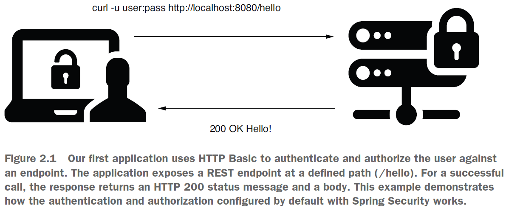
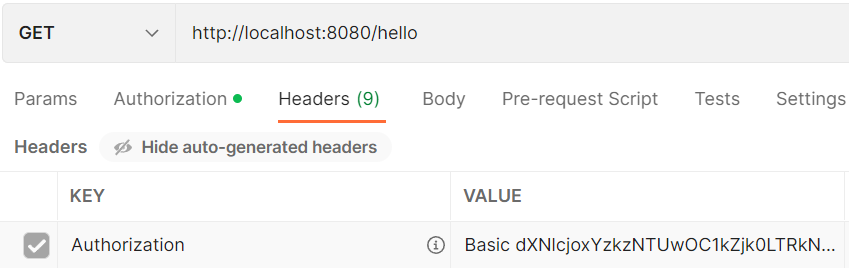
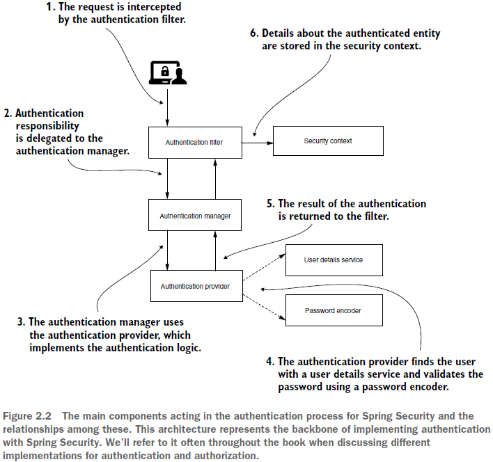

== Hello Spring Security

*Source code:*

p36_ex1_basic_auth/... (1) +
p44_ex2_InMemoryUserDetailsManager/... (2-4)

*Content:*

- 1. Spring Security default Basic auth
- 2. Which are the default configurations?
  * 2.1 UserDetailsService/PasswordEncoder default implementation
  * 2.2 Something else "by default"
- 3. Переопределение компонентов UserDetailsService и PasswordEncoder
- 4. WebSecurityConfigurerAdapter

=== 1. Spring Security default Basic auth

*_See_* _p36_ex1_basic_auth/..._

Будем создавать web-приложение с дефолтной конфигурацией Spring Security, чтобы посмотреть, как оно будет вести себя, если вы не добавите какую-либо конфигурацию. Таким образом, вы поймете, чего следует ожидать от конфигурации по умолчанию для аутентификации и авторизации. +
Первое приложение использует HTTP Basic для эндпоинта `/hello`. В случае успешного вызова ответ возвращает сообщение о состоянии HTTP 200 и response body. Это - дефолтная конфигурация Spring Security.

Если мы вызовем эндпоинт `/hello` просто так, то мы получим 401. +
Но в наших логах можно увидеть строчку:
----
Using generated security password: 1c935508-df94-4d6a-890c-f8bffc7e4cee
----
Username по дефолту будет '*user*'. Если сделать Basic авторизацию с этими кредами через Postman->Authorization->Basic Auth или
----
curl -u user:93a01cf0-794b-4b98-86ef-54860f36f7f3 http://localhost:8080/hello
----
То мы получим ответ:
----
Hello!
----

За кулисами '*_curl -u_*' кодирует строку строку `<username>:<password>` в Base64 и отправляет отправляет ее как значение заголовка Authorization с префиксом строки Basic:

В основном мы используем конфигурации по умолчанию, чтобы убедиться, что установлены правильные зависимости. Никакой безопасности здесь нет, но, по крайней мере, мы знаем, что Spring Security на месте.

=== 2. Which are the default configurations?

В этом разделе мы обсудим основные элементы общей архитектуры Spring Security, которые принимают участие в процессе аутентификации и авторизации. Впоследствии придется переопределить эти предварительно сконфигурированные компоненты, чтобы они соответствовали потребностям приложения. Вкратце обсудим все эти компоненты:

На рис. 2.2 вы можете видеть, что:

- 1) Authentication filter делегирует запрос проверки подлинности Authentication manager и на основе ответа настраивает Security context.
- 2) Authentication manager использует Authentication provider для обработки аутентификации.
- 3) Authentication provider разделяет логику на управление пользователями и управление паролями.
- 4) User details service реализует управление пользователями.
- 5) The password encoder (кодировщик) реализует правление паролями.
- 6) Security context хранит данные аутентификации после процесса аутентификации.

По факту, Authentication provider реализуется двумя основными бинами - *_UserDetailsService_* и *_PasswordEncoder_*.

==== 2.1 UserDetailsService/PasswordEncoder default implementation

Дефолтная имплементация *_UserDetailsService_* регистрирует учетные данные по умолчанию во внутренней памяти приложения. Креды по умолчанию - "`user`" с паролем по умолчанию в виде UUID. Этот пароль генерируется случайным образом при загрузке контекста Spring. В это время приложение выводит пароль в консоль (как в примере выше). Эти креды хранятся в памяти приложения.

Дефолтная имплементация *_PasswordEncoder_* делает две вещи:

- Кодирует пароль
- Проверяет, соответствует ли пароль существующей кодировке

Простейшая реализация PasswordEncoder управляет паролями в виде обычного текста и не кодирует их.

Когда мы меняем дефолтную имплементацию UserDetailsService на собственную реализацию, мы должны также имплементировать и PasswordEncoder.

==== 2.2 Something else "by default"

-  Boot по умолчанию использует метод аутентификации HTTP Basic access.
- *_AuthenticationProvider_* определяет логику аутентификации, делегируя управление пользователями и паролями. Реализация поставщика аутентификации по умолчанию использует реализации по умолчанию, предоставленные для UserDetailsService и PasswordEncoder.
- Spring Security по умолчанию делает защищенными все эндпоинты
- По умолчанию есть только один экземпляр кредов user/password

=== 3. Переопределение компонентов UserDetailsService и PasswordEncoder

*_See_* _p44_ex2_InMemoryUserDetailsManager/..._

В главе 3 расмотрим создание собственной реализации UserDetailsService или использовать предопределенную, предоставленную Spring Security. В этой главе мы пока не будем подробно описывать реализации, предоставляемые Spring Security. Сейчас же используем реализацию, предоставленную Spring Security, `InMemoryUserDetailsManager`. Эта реализация хранит учетные данные в памяти, которые затем могут использоваться Spring Security для аутентификации запроса. Реализация InMemoryUserDetailsManager не предназначена для готовых к использованию приложений, но это отличный инструмент для примеров или проверки концепций. В некоторых случаях все, что вам нужно, это пользователи. Вам не нужно тратить время на реализацию этой части функционала. InMemoryUserDetailsManager может хранить более одного пользователя.

При добавлении бина *_InMemoryUserDetailsManager_* можно заметить, что вы не можете получить доступ к эндпоинту по двум причинам:

- У вас нету пользователей
- У вас нет реализации PasswordEncoder.

Поэтому нам нужно 1) создать пользователя с кредами 2) добавить пользователя так, чтобы им управляла наша реализация *_UserDetailsService_* 3) определить бин *_PasswordEncoder_*, который наше приложение может использовать для сверки данного пароля с тем, который хранится и управляется UserDetailsService.

Во-первых, мы объявляем и добавляем набор учетных данных, которые мы можем использовать для аутентификации, в экземпляр InMemoryUserDetailsManager. В главе 3 мы подробнее поговорим о пользователях и о том, как ими управлять. При создании экземпляра *_UserDetails_* мы должны указать имя пользователя, пароль и хотя бы одну роль (*_See_* _p44_ex2_InMemoryUserDetailsManager/config/ProjectConfig.java_):
[source, java]
----
UserDetails user =
    User.withUsername("john")
        .password("12345")
        .authorities("read")
        .build();
userDetailsService.createUser(user);
----
Во-вторых, надо объявить *_PasswordEncoder_*. При попытке зайти сейчас с кредами john/12345 мы получим exception '_java.lang.IllegalArgumentException: There is no PasswordEncoder mapped for the id "null"_', а клиент получает "401 Unauthorized". Поэтому объявим бин (*_See_* _p44_ex2_InMemoryUserDetailsManager/config/ProjectConfig.java_):
[source, java]
----
@Bean
public PasswordEncoder passwordEncoder() {
  return NoOpPasswordEncoder.getInstance();
}
----
Экземпляр *_NoOpPasswordEncoder_* обрабатывает пароли как обычный текст. Он не шифрует и не хеширует их. Для сопоставления NoOpPasswordEncoder сравнивает только строки, используя базовый метод *_String.equals(Object o)_*. Именно поэтому он Deprecated.

И теперь мы можем зайти на страницу с кредами john/12345.

=== 4. WebSecurityConfigurerAdapter

С реализованным новым управлением пользователями мы можем обсудить метод аутентификации и конфигурацию для эндпоинтов. Много нового о настройке авторизации будет сказано в главах 7, 8 и 9. В конфигурации по умолчанию есть только один юзер и используется Basic auth. Basic auth не подходит для приложений. Точно так же не все эндпоинты должны быть защищены. Давайте перестанем секьюрить все эндпоинты. Чтобы внести такие изменения, расширим WebSecurityConfigurerAdapter (был задепрекейчен в Spring Security 5.7.0 - link:https://spring.io/blog/2022/02/21/spring-security-without-the-websecurityconfigureradapter[spring.io]) нашим классом ProjectConfig (*_See_* _p36_ex1_basic_auth/config/ProjectConfig.java_):
[source, java]
----
public class ProjectConfig extends WebSecurityConfigurerAdapter {
  ...
  @Override
  protected void configure(HttpSecurity http) throws Exception {
    http.httpBasic();
    http.authorizeRequests().anyRequest().permitAll();
  }
}
----
Если же мы хотим вернуть аунтентификацию обратно, то можем заменить *_.permitAll()_* на *_.authenticated()_* (also *_See_* link:https://laurspilca.com/configuring-the-endpoint-authorization-in-spring-security-without-extending-the-websecurityconfigureradapter-class/[configure method http chain]):
[source, java]
----
http.httpBasic().and().authorizeRequests().anyRequest().permitAll();
----

