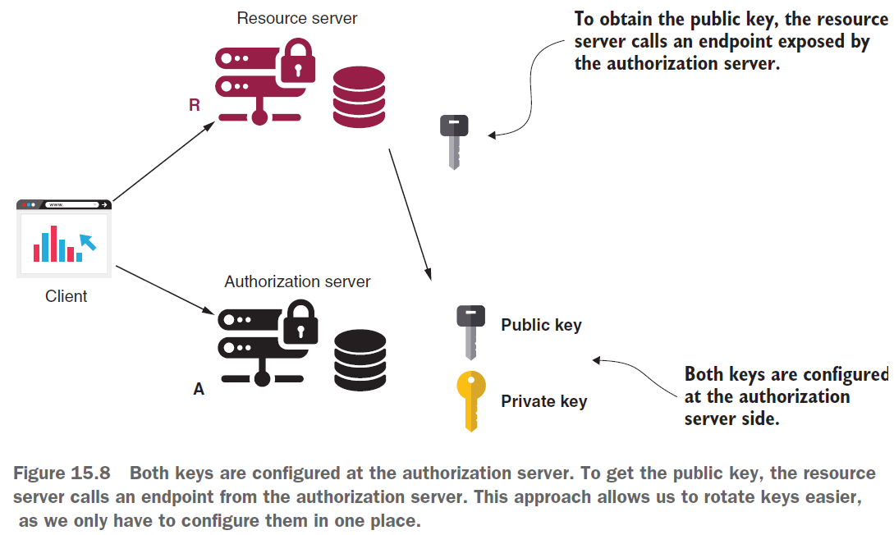

== OAuth 2: Using JWT and cryptographic signatures - Part 2

*Content:*

- 4. JWT, подпись и шифрование. JWS, JWE
- 5. Использование JWT, подписанных симметричными ключами
- 6. Использование JWT, подписанных ассимметричными ключами
- 7. Генерация private/public asymmetric key
- 8. Примеры authorization/resource server с использованием ассимметричных ключей
- 9. Эндпоинт для получения public key
- 10. Добавление пользовательских данных в JWT

=== 4. JWT, подпись и шифрование. JWS, JWE

В качестве _токена_ практически всегда используется JWT. JWT состоит из трех частей: _заголовка_, _тела_ и подписи. Детали в заголовке и теле представлены в формате JSON и закодированы в Base64. Третья часть — это подпись, сгенерированная с использованием криптографического алгоритма, использующего в качестве входных данных заголовок и тело:

Криптографический алгоритм также подразумевает необходимость наличия *_ключа_*. Ключ подобен паролю. Тот, у кого есть соответствующий ключ, может _подписать токен или подтвердить подлинность подписи_. Если подпись на токене подлинная, это гарантирует, что никто не изменил токен после того, как он был подписан.

Когда JWT подписан, мы также называем его *_JWS_* (_JSON Web Token Signed_). Обычно достаточно применить криптографический алгоритм для подписи токена, но при необходимости вы даже можете зашифровать токен. Если токен подписан, вы можете увидеть его содержимое без ключа или пароля. Но даже если хакер увидит содержимое токена, он не сможет изменить содержимое токена, поскольку в этом случае подпись станет недействительной. Чтобы быть действительной, подпись должна:

- Быть сгенерированной с правильным ключом
- Соответствовать содержимому токена

Если токен зашифрован, мы также называем его *_JWE_* (_JSON Web Token Encrypted_). Вы не можете увидеть содержимое зашифрованного токена без действительного ключа.

=== 5. Использование JWT, подписанных симметричными ключами

Самый _простой подход_ к подписи токенов — использование *_симметричных ключей_*. При таком подходе с помощью одного и того же ключа можно и подписывать токен, и проверять его подпись. Использование симметричных ключей для подписи токенов имеет то преимущество, что оно проще, чем другие подходы. Но оно менее безопасно, чем _асимметричные ключи_ - потому что мы делимся одним и тем же ключом, которые используют и сам сервер авторизации, и клиент. Сервер авторизации подписывает токен с помощью ключа, а сервер ресурсов проверяет подпись с помощью того же ключа:

Компонент, управляющий токенами — это *_TokenStore_*. При реализации сервера авторизации мы используем *_JwtTokenStore_*. Кроме того, нам нужно определить объект  *_JwtAccessTokenConverter_*. С его помощью мы настраиваем, как сервер авторизации проверяет токены; в нашем случае - с помощью симметричного ключа. Пример конфигурации сервера авторизации с симметричным ключом:

[source, java]
----
@Configuration
@EnableAuthorizationServer
public class AuthServerConfig
        extends AuthorizationServerConfigurerAdapter {

    @Value("${jwt.key}") // берем из properties
    private String jwtKey;

    @Autowired
    private AuthenticationManager authenticationManager;

    @Override
    public void configure(ClientDetailsServiceConfigurer clients) throws Exception {
        clients.inMemory()
                .withClient("client")
                .secret("secret")
                .authorizedGrantTypes("password", "refresh_token")
                .scopes("read");
    }

    @Override
    public void configure(AuthorizationServerEndpointsConfigurer endpoints) {
        endpoints
          .authenticationManager(authenticationManager)
          .tokenStore(tokenStore())
          .accessTokenConverter(jwtAccessTokenConverter());
    }

    @Bean
    public TokenStore tokenStore() {
        return new JwtTokenStore(jwtAccessTokenConverter());
    }

    @Bean
    public JwtAccessTokenConverter jwtAccessTokenConverter() {
        var converter = new JwtAccessTokenConverter();
        converter.setSigningKey(jwtKey);
        return converter;
    }
}
----

Пример конфигурации сервера ресурсов с симметричным ключом:
[source, java]
----
@Configuration
@EnableResourceServer
public class ResourceServerConfig extends ResourceServerConfigurerAdapter {

    @Value("${jwt.key}") // берем из properties
    private String jwtKey;

    @Override
    public void configure(ResourceServerSecurityConfigurer resources) {
        resources.tokenStore(tokenStore());
    }

    @Bean
    public TokenStore tokenStore() {
        return new JwtTokenStore(jwtAccessTokenConverter());
    }

    @Bean
    public JwtAccessTokenConverter jwtAccessTokenConverter() {
        var converter = new JwtAccessTokenConverter();
        converter.setSigningKey(jwtKey);
        return converter;
    }
}
----

Ключ, используемый для симметричного шифрования или подписи, представляет собой просто случайную строку байтов. В реальных условиях хорошей идеей будет использовать случайно сгенерированное значение длиной более 258 байт.

=== 6. Использование JWT, подписанных ассимметричными ключами

Иногда использовать симметричный ключ невозможно. Часто такой сценарий возникает, если _сервер авторизации_ и _сервер ресурсов_ разрабатываются в разных организациях. В этом случае мы говорим, что _сервер авторизации_ "не доверяет" _серверу ресурсов_. С симметричными ключами у сервера ресурсов слишком много возможностей: не только проверять токены, но и подписывать их:

Большая ошибка - обмениваться симметричными ключами по почте или другим незащищенным каналам. Симметричный ключ — это закрытый ключ. Тот, у кого есть такой ключ, может использовать его для доступа к системе. Если вам нужно поделиться ключом за пределами вашей системы, то лучше не делать его симметричным.

Когда _сервер авторизации_ "не доверяет" _серверу ресурсов_, мы используем _пары асимметричных ключей_. Концепция довольно проста. _Пара асимметричных ключей_ имеет два ключа: один называется _закрытым ключом_, а другой - __открытым ключо__м. Сервер авторизации использует _закрытый ключ_ для подписи токенов, и кто-либо может подписывать токены только с помощью _закрытого ключа_. _Открытый ключ_ связан с _закрытым ключом_, поэтому мы называем их парой. Но _открытый ключ_ можно использовать только для проверки подписи. Никто не может подписать токен _открытым ключом_:

=== 7. Генерация private/public symmetric key

Нам нужна пара асимметричных ключей для настройки сервера авторизации и сервера ресурсов. Для создания пары ключей можно использовать *_keytool_* и *_OpenSSL_* — два простых в использовании инструмента командной строки. Ваш JDK устанавливает _keytool_, поэтому он, вероятно, уже установлен на вашем компьютере. _OpenSSL_ встроен в Git Bash. После этого нам нужно запустить две команды чтобы:

- Сгенерировать private key
- Получить public key для ранее сгенерированного private key

давайте сгенерируем private key в файле с именем *_ssia.jk_*. Также будем использовать пароль *_ssia123_* для защиты закрытого ключа и _alias **ssia**_, чтобы дать ключу имя. Команда для генерации ключа RSA выглядит так:
[source, bash]
----
keytool -genkeypair -alias ssia -keyalg RSA -keypass ssia123 -keystore ssia.jks -storepass ssia123
----

Чтобы получить открытый ключ для ранее сгенерированного закрытого ключа, можно запустить две команды keytool/openssl:

[source, bash]
----
keytool -list -rfc --keystore ssia.jks | openssl x509 -inform pem -pubkey
----

Вам будет предложено ввести пароль, используемый при создании открытого ключа; в данном случае - _ssia123_. В выводе консоли вы найдете PUBLIC KEY и CERTIFICATE:

[source, bash]
----
-----BEGIN PUBLIC KEY-----
MIIBIjANBgkqhkiG9w0BAQEFAAOCAQ8AMIIBCgKCAQEAnxPm2Txqo90Ikpc2eNAS
HMVQfTSk6dzq/WVCAK9LPGpPhYEVoiOKjzwg57Vorxyu7jVsPPzb5vFuCndbi0Wa
s/lWtEQGRTU2F3N2+yJr7B25SlXyqxkSpCXcY9M5R8NhPtkpNRTj6xYReZ3M+NUt
fAO4f35znp1v2hqKbxw4a+oTXBa1FiAkAiqyd3Wigcc6P7IEP3TPOqYeRE5QKETM
ykaCD7bT8v8J4vELDfhCs1XZhoKSvkWdM5wEDXtotxj3fGdyKGi6NG3FTbVJjKsi
GvblZ7yzdxlZWvZfolDq+gAVyLBAIxN8OuE3PTNVt6WvFLXzZqWVzHj1/GCCxRSS
IwIDAQAB
-----END PUBLIC KEY-----
----
[source, bash]
----
-----BEGIN CERTIFICATE-----
MIIDdzCCAl+gAwIBAgIEFbLqjjANBgkqhkiG9w0BAQsFADBsMRAwDgYDVQQGEwdV
bmtub3duMRAwDgYDVQQIEwdVbmtub3duMRAwDgYDVQQHEwdVbmtub3duMRAwDgYD
VQQKEwdVbmtub3duMRAwDgYDVQQLEwdVbmtub3duMRAwDgYDVQQDEwdVbmtub3du
MB4XDTIzMDMxNDIxNDYyNVoXDTIzMDYxMjIxNDYyNVowbDEQMA4GA1UEBhMHVW5r
bm93bjEQMA4GA1UECBMHVW5rbm93bjEQMA4GA1UEBxMHVW5rbm93bjEQMA4GA1UE
ChMHVW5rbm93bjEQMA4GA1UECxMHVW5rbm93bjEQMA4GA1UEAxMHVW5rbm93bjCC
ASIwDQYJKoZIhvcNAQEBBQADggEPADCCAQoCggEBAJ8T5tk8aqPdCJKXNnjQEhzF
UH00pOnc6v1lQgCvSzxqT4WBFaIjio88IOe1aK8cru41bDz82+bxbgp3W4tFmrP5
VrREBkU1Nhdzdvsia+wduUpV8qsZEqQl3GPTOUfDYT7ZKTUU4+sWEXmdzPjVLXwD
uH9+c56db9oaim8cOGvqE1wWtRYgJAIqsnd1ooHHOj+yBD90zzqmHkROUChEzMpG
gg+20/L/CeLxCw34QrNV2YaCkr5FnTOcBA17aLcY93xncihoujRtxU21SYyrIhr2
5We8s3cZWVr2X6JQ6voAFciwQCMTfDrhNz0zVbelrxS182allcx49fxggsUUkiMC
AwEAAaMhMB8wHQYDVR0OBBYEFF/i2g3hVDSZ8YQvxu3tdwJbnXyhMA0GCSqGSIb3
DQEBCwUAA4IBAQBTb9RMlmGmmg3K2YbNq96dN+j8KgZ8yQ6oj1G/r1KQXYBesVtj
nJRkhiERwSiLnjySCKGVs868iQh7RMY6u34BJUC1ouxTqOrHjWGnMJwmJ8y/G+Jk
7cKgMUPCfC+b4mFKltyByB0WSOF6C/NKleegKGZ8LTugdfKg8FNZ74YaaHFw+ID1
yXa+vODhAfD8zqfWPNwFHEQAUqrvCjTPWNuIbmi3I3ub/MXibaXkgz1cmqdHjiZL
CO1GoDCqsJng3PMCNnTRsGOj5ILyZTwwYZToQifXs6uny26O3ZPjHUFR3SKKsnJz
QjTm9yYj8oiIo4p1vkOgZgc5h9Sn3X2h+3I1
-----END CERTIFICATE-----

----

Вот и все! У нас есть закрытый ключ, который мы можем использовать для подписи JWT, и открытый ключ, который мы можем использовать для проверки подписи. Теперь нам просто нужно настроить их на наших серверах авторизации и ресурсов.

Сертификат – это цифровой сертификат, удостоверяющий подлинность чего-либо (например, сайта или сервера ресурсов) и позволяющий использовать зашифрованное соединение/организовать доступ к ресурсам, etc. Пример из SSL-шифрования: link:https://www.kaspersky.ru/resource-center/definitions/what-is-a-ssl-certificate[Что такое SSL-сертификат].

=== 8. Примеры authorization/resource server с использованием ассимметричных ключей

Файл закрытого ключа _ssia.jks_ копируется в папку ресурсов приложения (обычно используются сикреты). В файле application.properties мы указываем имя файла, псевдоним ключа и пароль, используемый для защиты закрытого ключа Эти данные нужны нам для настройки _JwtTokenStore_. Пример `application.properties` файла для сервера авторизации с ассимметричным ключом:
[source, properties]
----
password=ssia123
privateKey=ssia.jks
alias=ssia
----

По сравнению с настройками, которые мы сделали для _сервера авторизации_ с использованием _симметричного_ ключа, единственное, что изменилось, — это определение объекта _JwtAccessTokenConverter_. Мы по-прежнему используем _JwtTokenStore_. Ранее мы использовали _JwtAccessTokenConverter_ для настройки симметричного ключа. Теперь же мы используем тот же объект _JwtAccessTokenConverter_ для настройки закрытого ключа. Пример конфигурации _сервера авторизации_ с _ассимметричным_ ключом:
[source, java]
----
@Configuration
@EnableAuthorizationServer
public class AuthServerConfig extends AuthorizationServerConfigurerAdapter {

    @Value("${password}") // Используется в jwtAccessTokenConverter()
    private String password;
    @Value("${privateKey}") // путь к файлу private key - ssia.jks
    private String privateKey;
    @Value("${alias}") // alias - псевдоним ключа для получения его из ssia.jks
    private String alias; // Используется в jwtAccessTokenConverter()

    @Autowired
    private AuthenticationManager authenticationManager;

    @Override
    public void configure(ClientDetailsServiceConfigurer clients) throws Exception {
        clients.inMemory()
                .withClient("client")
                .secret("secret")
                .authorizedGrantTypes("password", "refresh_token")
                .scopes("read");
    }

    @Override
    public void configure(AuthorizationServerEndpointsConfigurer endpoints) {
        endpoints
          .authenticationManager(authenticationManager)
          .tokenStore(tokenStore())
          .accessTokenConverter(jwtAccessTokenConverter());
    }

    @Bean
    public TokenStore tokenStore() {
        return new JwtTokenStore(jwtAccessTokenConverter());
    }

    @Bean
    public JwtAccessTokenConverter jwtAccessTokenConverter() {
        var converter = new JwtAccessTokenConverter();
        KeyStoreKeyFactory keyStoreKeyFactory =
            new KeyStoreKeyFactory( // принимает ресурс ssia.jks как private key
                new ClassPathResource(privateKey),
                password.toCharArray()); // и пароль к данному файлу
        converter.setKeyPair(keyStoreKeyFactory.getKeyPair(alias));
        return converter;
    }
}
----

_Сервер авторизации_ использует закрытый ключ для подписи токенов, а _сервер ресурсов_ использует открытый ключ для проверки подписи. Ключи используются только для подписи токенов, а не для их шифрования. _Сервер ресурсов_ должен иметь открытый ключ пары для проверки подписи токена, поэтому можно добавить этот ключ в файл `application.properties`:
[source, properties]
----
server.port=9090
publicKey=-----BEGIN PUBLIC KEY-----MIIBIjANBgkqhkiG9w0BAQEFAAOCAQ8AMIIB...-----END PUBLIC KEY-----
----

Пример конфигурации _сервера ресурсов_ с public asymmetric key:
[source, java]
----
@Configuration
@EnableResourceServer
public class ResourceServerConfig extends ResourceServerConfigurerAdapter {

    @Value("${publicKey}") // берем из properties
    private String publicKey;

    @Override
    public void configure(ResourceServerSecurityConfigurer resources) {
        resources.tokenStore(tokenStore());
    }

    @Bean
    public TokenStore tokenStore() {
        return new JwtTokenStore(jwtAccessTokenConverter());
    }

    @Bean
    public JwtAccessTokenConverter jwtAccessTokenConverter() {
        var converter = new JwtAccessTokenConverter();
        // отличие от симметричных ключей - setVerifierKey() а не setSigningKey()
        converter.setVerifierKey(publicKey);
        return converter;
    }
}
----

=== 9. Эндпоинт для получения public key

Что если мы захотим изменить пару ключей (чтобы если вдруг злоумышленник похитил ключ, он не смог его использовать долго). Но если _public key_ передается серверу ресурсов, то надо поменять ключ и у него вместе с _private key_. Решение заключается в хранении пары ключей на стороне _сервера авторизации_ и предоставлении _серверу ресурсов_ доступа к _public key_ через эндпоинт (через client credentials):

Для _сервера авторизации_ можно оставить те же настройки, что и в предыдущем листинге в _пункте 8 - Примеры authorization/resource server с использованием ассимметричных ключей_. Надо только сделать доступной эндпоинт, который предоставляет _public key_. Spring Boot по дефолту настраивает такой эндпоинт - *_/oauth/token_key_* - но он недоступен по дефолту. Для переопределения конфигурации эндпоинта следует внести следующие изменения:
[source, java]
----
@Configuration
@EnableAuthorizationServer
public class AuthServerConfig extends AuthorizationServerConfigurerAdapter {

    // ... Omitted code

    @Override
    public void configure(ClientDetailsServiceConfigurer clients) throws Exception {
        clients.inMemory()
                .withClient("client")
                .secret("secret")
                .authorizedGrantTypes("password", "refresh_token")
                .scopes("read")
             .and() // добавляем креды для resource server чтобы он мог вызывать
                .withClient("resourceserver") // эндпоинт для получения public key
                .secret("resourceserversecret");
    }

    @Override
    public void configure(AuthorizationServerSecurityConfigurer security) {
        // настраиваем режим доступа для '/oauth/token_key' - эндпоинта для получения public key
        security.tokenKeyAccess("isAuthenticated()");
    }
}
----

Чтобы _сервер ресурсов_ мог получить _public key_, нужно указать эндпоинт и credentials в `application.properties` сервера ресурсов:
[source, properties]
----
server.port=9090
security.oauth2.resource.jwt.key-uri=http://localhost:8080/oauth/token_key
security.oauth2.client.client-id=resourceserver
security.oauth2.client.client-secret=resourceserversecret
----

Поскольку _сервер ресурсов_ теперь берет открытый ключ по эндпоинту *_/oauth/token_key_* _сервера авторизации_, не нужно настраивать его в классе конфигурации _сервера ресурсов_. Класс конфигурации _сервера ресурсов_ может оставаться пустым:
[source, java]
----
@Configuration
@EnableResourceServer
public class ResourceServerConfig extends ResourceServerConfigurerAdapter {
}
----

=== 10. Добавление пользовательских данных в JWT

В большинстве случаев вам будет достаточно того, что Spring Security уже добавляет в токен. По умолчанию токен из Spring Security обычно хранит все данные, необходимые для базовой авторизации:
[source, json]
----
{
  "exp": 1582581543,     // The timestamp when the token expires
  "user_name": "john",   // The user that authenticated to allow the client to access their resources
  "authorities": [       // The permissions granted to the user
    "read"
  ],
  "jti": "8e208653-79cf-45dd-a702-f6b694b417e7", // A unique identifier of the token
  "client_id": "client", // The client that requested the token
  "scope": [             // The permissions granted to the client
    "read"
  ]
}
----

Однако в реальных сценариях иногда необходимо добавить в токен дополнительные пользовательские данные. например, в случаях если:

- Вы используете сервер авторизации в приложении, где ваши читатели рецензируют книги. Некоторые эндпоинты должны быть доступны только для пользователей, оставивших более определенного количества отзывов.
- Разрешать вызовы нужно только в том случае, если пользователь прошел аутентификацию из определенного часового пояса.

Для этого нам необходимо реализовать интерфейс *_TokenEnhancer_*:
[source, java]
----
public class CustomTokenEnhancer implements TokenEnhancer {
    @Override
    public OAuth2AccessToken enhance(
      OAuth2AccessToken accessToken,
      OAuth2Authentication authentication) {
        Map<String, Object> additionalInfo = new HashMap<>();
        additionalInfo.put(
          "organization", authentication.getName() + randomAlphabetic(4));
        ((DefaultOAuth2AccessToken) accessToken).setAdditionalInformation(
          additionalInfo);
        return accessToken;
    }
}
----
Который мы потом подключаем в наш класс конфигурации. Подробнее смотри на link:https://www.baeldung.com/spring-security-oauth-jwt-legacy#enhancer[baelding - jwt enhancer].

К слову, baelding утверждает что данный стек Spring Security - устаревший (deprecated). Вместо этого для добавления параметров в токен лучше использовать *_OAuth2AuthorizationRequestResolver_* и *_OAuth2AccessTokenResponseHttpMessageConverter_*, переопределив их методы - link:https://www.baeldung.com/spring-security-custom-oauth-requests[baelding - custom-oauth-requests].