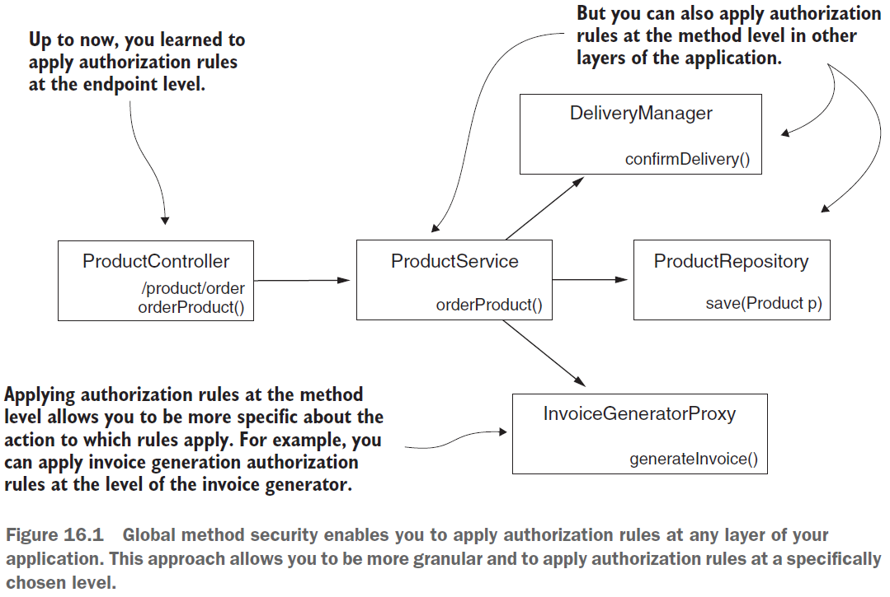
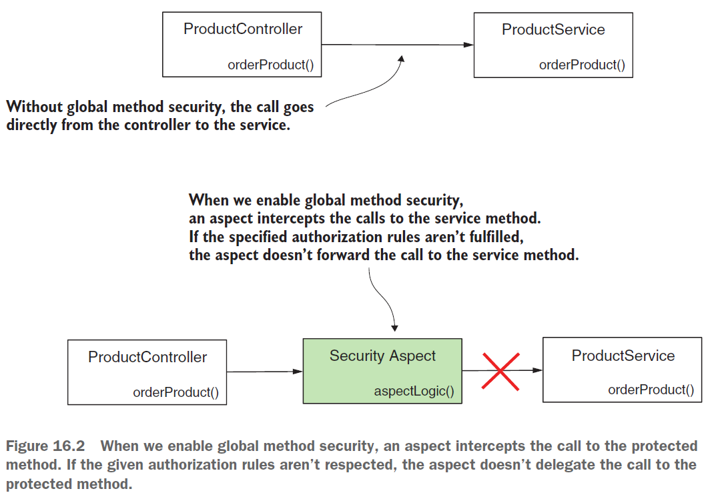
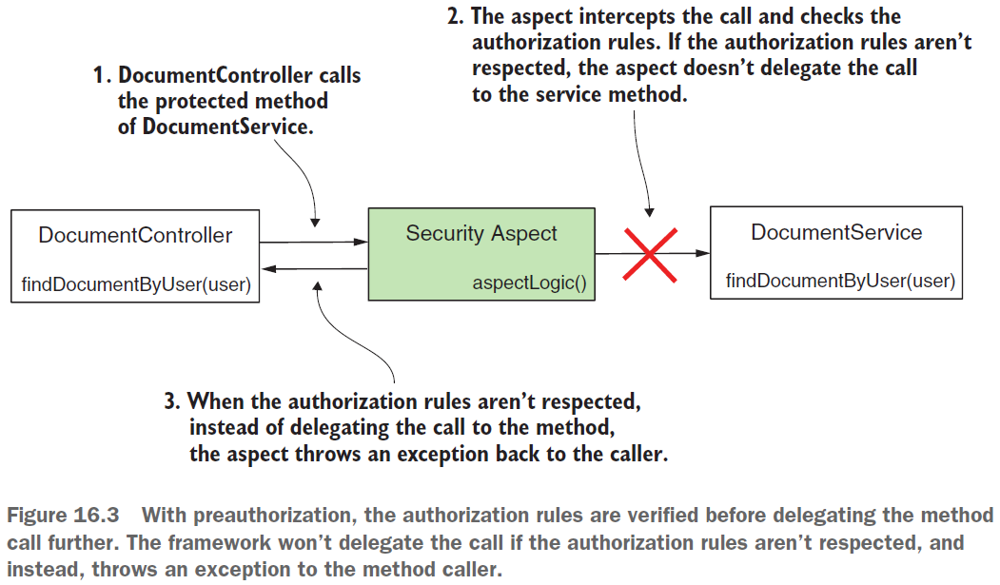
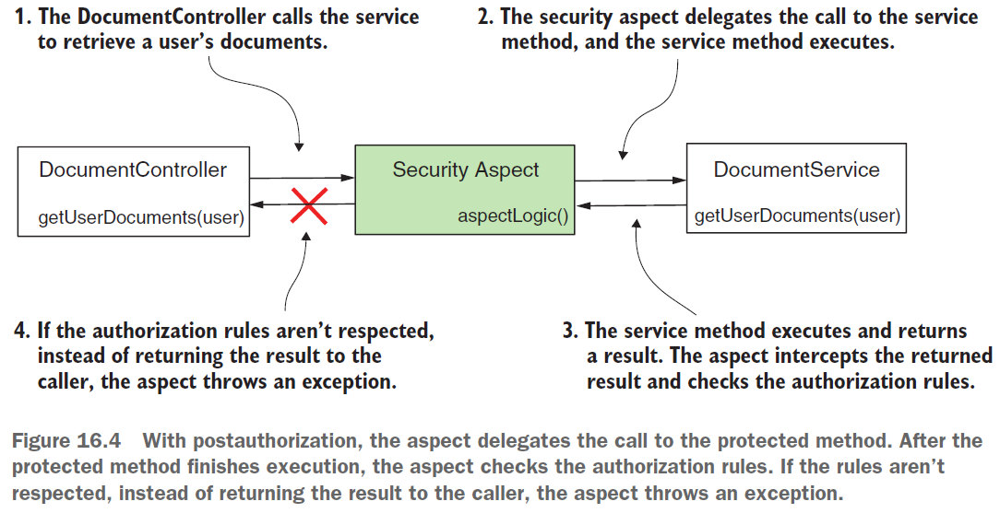
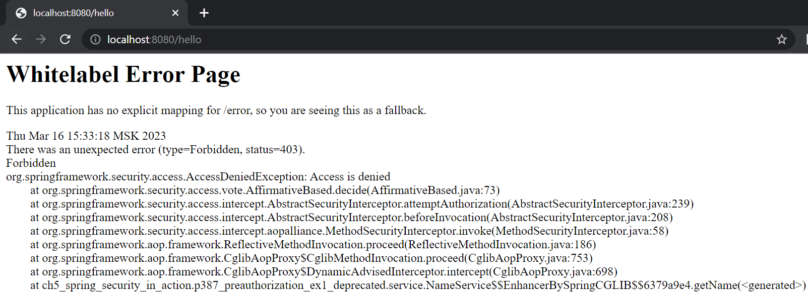
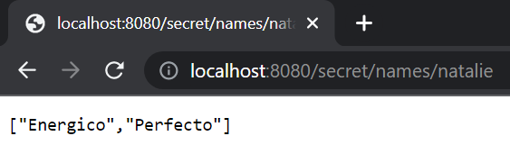
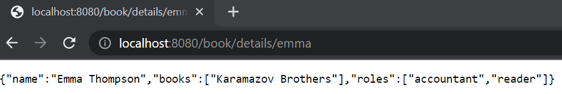

== Global method security

*Source code:*

- link:../../spring-security-learning/src/main/java/ch5_spring_security_in_action/p387_pre_post_authorization[p387_pre_post_authorization/...] (4-5)

*Content:*

- 1. Enabling global method security
- 2. Call authorization (авторизация вызова)
  * 2.1 Call Preauthorization
  * 2.2 Call Postauthorization
- 3. Enabling global method security in your project
- 4. Реализация preauthorization - проверка authorities и roles
- 5. Реализация preauthorization - проверка параметров метода
- 6. Реализация postauthorization

=== 1. Enabling global method security

До сих пор с точки зрения авторизации мы обсуждали только конфигурацию на уровне endpoint-ов. Предположим, ваше приложение не является веб-приложением — разве вы не можете использовать Spring Security для аутентификации и авторизации? Spring Security хорошо подходит и для сценариев, которые не затрагивают эндпоинты. В этой части мы узнаем, как настроить авторизацию на уровне метода. Мы будем использовать этот подход для настройки авторизации как в веб-приложениях, так и в других. Он называется *_global method security_*:

Даже для non-web приложений _global method security_ дает возможность реализовать правила авторизации. В веб-приложениях этот подход дает нам возможность гибко применять правила авторизации на разных уровнях нашего приложения, а не только на уровне эндпоинтов.

В этом разделе мы узнаем, как включить авторизацию на уровне метода, а также всевозможные опции для применения различных правил авторизации. Это позволяет решать проблемы, когда авторизацию просто невозможно настроить только на уровне эндпоинта.

По умолчанию _global method security_ отключена, поэтому сначала нужно ее включить. Вкратце, _global method security_ используется для двух основных вещей:

- *_Call authorization_* — решает, может ли кто-либо вызывать метод в соответствии с некоторыми реализованными privilege rules (_preauthorization_) или может ли кто-то получить доступ к тому, что возвращает метод после его выполнения (_postauthorization_).
- *_Фильтрация_* — решает, что метод может получить через свои параметры (_prefiltering_) и что вызывающая его система может получить обратно из метода после его выполнения (_postfiltering_). Фильтрацию мы обсудим в следующей главе.

=== 2. Call authorization (авторизация вызова)

При _авторизация вызовов_ правила авторизации, определяют, можно ли вызвать метод, или может ли вызывающий объект получить доступ к результату после вызова метода. Часто нам нужно решить, может ли кто-то получить доступ к той или иной бизнес-логике в зависимости от входных параметров или ее результата.

_Global method security_ работает через аспекты. Когда мы включаем глобальную безопасность методов в нашем приложении, мы фактически включаем *_Spring aspect_*. Этот аспект перехватывает вызовы метода, для которого мы применяем правила авторизации, и на основе этих правил авторизации решает, перенаправлять ли вызов исходному методу:

Авторизация вызовов подразделяется на:

- *_Preauthorization_* — платформа проверяет правила авторизации перед вызовом метода.
- *_Postauthorization_* — платформа проверяет правила авторизации после выполнения метода.

Давайте рассмотрим оба подхода и реализуем их в примерах.

=== 2.1 Call Preauthorization

Допустим, у нас есть метод *_findDocumentsByUser(String username)_*, который возвращает документы для конкретного пользователя. Вызывающая система присылает username пользователя, для которого метод извлекает документы. Предположим, вам нужно убедиться, что аутентифицированный пользователь может получать только свои собственные документы.

Мы можем применить правило к этому методу, чтобы были разрешены только вызовы метода, которые получают имя аутентифицированного пользователя. Это и есть предварительная авторизация. В случае предварительной авторизации Spring Security проверяет условия авторизации перед выполнением метода. Если вызывающая сторона не имеет разрешений в соответствии с определяемыми нами правилами авторизации, фреймворк не делегирует вызов методу. Вместо этого фреймворк выдает исключение. Это наиболее часто используемый подход.

=== 2.1 Call Postauthorization

Когда мы применяем правила авторизации, которые позволяют кому-то вызывать метод, но не обязательно получать результат, возвращаемый методом, мы используем пост-авторизацию. При пост-авторизации Spring Security проверяет правила авторизации после выполнения метода. Вы можете использовать этот вид авторизации, чтобы ограничить доступ к результату метода при определенных условиях. Поскольку поставторизация происходит после выполнения метода, вы можете применить правила авторизации к результату, возвращаемому методом.

Обычно мы используем поставторизацию для применения правил авторизации на основе того, что метод возвращает после выполнения. Но будьте осторожны с пост-авторизацией! Если метод что-то изменяет во время своего выполнения, это изменение происходит независимо от того, удалась ли авторизация в конце.

*NOTE!* Даже с аннотацией *_@Transactional_* изменение не откатывается, если поставторизация не удалась. Исключение, создаваемое функцией пост-авторизации, создается после того, как _TransactionManager_ коммитит транзакцию.

=== 3. Enabling global method security in your project

_Global method security_ отключена по умолчанию. Чтобы использовать его, мы используем аннотации *_@EnableGlobalMethodSecurity_* или *_@EnableMethodSecurity_* в классе конфигурации. Аннотация _@EnableGlobalMethodSecurity_ deprecated since Spring Security 5.8.0 и в Spring Boot 3 - см. link:https://docs.spring.io/spring-security/reference/servlet/authorization/method-security.html[гайд по миграции] и link:https://docs.spring.io/spring-security/site/docs/current/api/org/springframework/security/config/annotation/method/configuration/GlobalMethodSecurityConfiguration.html[GlobalMethodSecurityConfiguration.html].

_Global method security_ предлагает нам три подхода к определению правил авторизации:

- pre-/postauthorization annotations
- JSR 250 annotation, *_@RolesAllowed_*
- *_@Secured_* annotation

Чтобы включить _global method security_, мы используем атрибут *_prePostEnabled_* аннотации _@EnableGlobalMethodSecurity_ или аннотацию _@EnableMethodSecurity_ - это первый подход. Два других обсудим позже. Пример класса конфигурации:
[source, java]
----
@Configuration
// @EnableGlobalMethodSecurity(prePostEnabled = true) - будет deprecated
@EnableMethodSecurity
public class ProjectConfig {
}
----
Вы можете использовать глобальную безопасность метода с любым типом аутентификации, от _HTTP Basic_ до _OAuth 2_. Чтобы не усложнять примеры, мы будем использовать _HTTP Basic_.

=== 4. Реализация preauthorization - проверка authorities и roles

В этом разделе мы реализуем пример преавторизации. В нашем примере мы продолжаем проект ssia-ch16-ex1, начатый в разделе 16.1. Как мы обсуждали в разделе 16.1, предварительная авторизация подразумевает определение правил авторизации, которые Spring Security применяет перед вызовом определенного метода. Если правила не соблюдаются, фреймворк не вызывает метод.

Реализуем простой сценарий. Приложение имеет эндпоинт *_/hello_*, который возвращает строку *_"Hello, {\{username}}"_*. Для получения имени контроллер вызывает метод сервиса *_NameService.getName()_*. Этот метод использует преавторизацию для проверки наличия у пользователя права на запись.

Добавим UserDetailsService и PasswordEncoder для поддержки пользователей. Нам нужны два пользователя: один пользователь с write authority, а другой — без write authority. Первый пользователь сможет вызвать эндпоинт, а для второго пользователя приложение выдает исключение авторизации при попытке вызвать метод. Класс конфигурации выглядит так - link:../../spring-security-learning/src/main/java/ch5_spring_security_in_action/p387_pre_post_authorization/config/ProjectConfig.java[ProjectConfig.java]:
[source, java]
----
@Configuration
// Enables global method security for pre-/postauthorization
@EnableGlobalMethodSecurity(prePostEnabled = true)
public class ProjectConfig {
  @Bean // Adds a UserDetailsService with two users for testing
  public UserDetailsService userDetailsService() {
    var service = new InMemoryUserDetailsManager();
    var u1 = User.withUsername("natalie")
        .password("12345")
        .authorities("read")
        .build();
    var u2 = User.withUsername("emma")
        .password("12345")
        .authorities("write")
        .build();
    service.createUser(u1);
    service.createUser(u2);
    return service;
  }

  @Bean // Adds a PasswordEncoder for users
  public PasswordEncoder passwordEncoder() {
    return NoOpPasswordEncoder.getInstance();
  }
}
----

Чтобы определить правило авторизации для этого метода, мы используем аннотацию *_@PreAuthorize_*. Аннотация получает в качестве значения выражение _Spring Expression Language (SpEL)_, описывающее правило авторизации. В этом примере мы применяем простое правило. Мы можем определить ограничения для пользователей на основе их полномочий, используя метод hasAuthority(). Сервис, предоставляющий значение для имени - link:../../spring-security-learning/src/main/java/ch5_spring_security_in_action/p387_pre_post_authorization/service/NameService.java[NameService.java]:
[source, java]
----
public class NameService {

  // Only users having 'write' authority can call the method
  @PreAuthorize("hasAuthority('write')")
  public String getName() {
    return "Fantastico";
  }
}
----

Запустим и протестируем приложение. Если залогинимся с кредами `natalie/12345`, то получим _403 Forbidden_:

Если залогинимся уже с кредами `emma/12345`, то успешно получим ответ:

----
Hello, Fantastico
----

Точно так же вы можете использовать любое другое выражение, которое мы обсуждали в главе 7 для аутентификации эндпоинта: `hasAnyAuthority()`, `hasRole()`, `hasAnyRole()`, etc.

*NOTE!* _@EnableGlobalMethodSecurity_ мы можем спокойно заменить на _@EnableMethodSecurity_. И лучше именно так и поступить. See: link:../../spring-security-learning/src/main/java/ch5_spring_security_in_action/p387_pre_post_authorization/config/ProjectConfig.java[ProjectConfig.java].

=== 5. Реализация preauthorization - проверка параметров метода

Давайте расширим наш пример, чтобы показать, как можно использовать значения параметров метода для определения правил авторизации. Добавим новый эндпоинт - *_/secret/names/{name}_*, который могут вызывать оба наших пользователя. Только для одного из них значения будут одни, для другого - другие. Они могут получить доступ только если входной параметр *_name_* из _path variable_ равен имени текущего пользователя. Реализация контроллера теперь выглядит так - link:../../spring-security-learning/src/main/java/ch5_spring_security_in_action/p387_pre_post_authorization/controllers/HelloController.java[HelloController.java]:
[source, java]
----
@RestController
public class HelloController {
    @Autowired
    private NameService nameService;

    @GetMapping("/hello")
    public String hello() {
        return "Hello, " + nameService.getName();
    }

    @GetMapping("/secret/names/{name}")
    public List<String> names(@PathVariable String name) {
        return nameService.getSecretNames(name);
    }
}
----

Внесем изменения и в класс link:../../spring-security-learning/src/main/java/ch5_spring_security_in_action/p387_pre_post_authorization/service/NameService.java[NameService.java]. Выражение, которое мы сейчас используем для авторизации - *_#name == authentication.principal.username_*. В этом выражении мы используем *_#name_* для ссылки на значение параметра метода *_NameService.getSecretNames()_* с именем _name_, и у нас есть прямой доступ к объекту аутентификации, который мы можем использовать для получения текущего аутентифицированного пользователя. Выражение указывает на то, что метод может быть вызван только в том случае, если имя аутентифицированного пользователя совпадает со значением, отправленным через параметр метода. Другими словами, пользователь может получить только свои собственные _secret names_. See link:../../spring-security-learning/src/main/java/ch5_spring_security_in_action/p387_pre_post_authorization/service/NameService.java[NameService.java]:

[source, java]
----

@Service
public class NameService {

  // ... omitted code

  private final Map<String, List<String>> secretNames =
      Map.of(
          "natalie", List.of("Energico", "Perfecto"),
          "emma", List.of("Fantastico"));

  // User can get access only to values by its username
  @PreAuthorize("#name == authentication.principal.username")
  public List<String> getSecretNames(String name) {
    return secretNames.get(name);
  }
}
----

Запустим и протестируем приложение. Если залогинимся с кредами `natalie/12345` и сходим по урлу:

----
http://localhost:8080/secret/names/natalie
----

То получим 200 OK:

Если по таким урлам:

----
http://localhost:8080/secret/names/emma

http://localhost:8080/secret/names/abcd
----

То получим _403 Forbidden_.

*NOTE!* Мы можем применить глобальную защиту методов к любому уровню вашего приложения. В этом примере правила авторизации применялись к классу сервису. Но мы можем применять правила авторизации с _global method security_ в любой части вашего приложения: repositories, managers, proxies, etc.

=== 6. Реализация postauthorization

Теперь предположим, что эндпоинт доступен для вызова, но периодически вы не хотите, чтобы пользователь получил возвращаемое значение - в случае, когда решение о допустимости передачи ответа можно получить только после получения результата работы бизнес-логики. Например, если парвила доступа к некоторым материалам на сайте может быть изменен в любой момент (_'all', 'only admin', 'manager+', etc_). Тогда необходимо применить _postauthorization_.

Для применения _postauthorization_, мы используем аннотацию *_@PostAuthorize_*, аналогичную _@PreAuthorize_. Аннотация получает в качестве значения _SpEL_, определяющий правило авторизации.

Реализуем аннотацию _@PostAuthorize_. Давайте добавим в наш пример функционал получения книг. Книги могут получать только _Сотрудники_, представленными объектами *_Employee_*. У каждого _Employee_ есть _name_, _list of books_ and _roles_.  Мы хотим убедиться, что юзер может получить сведения о сотруднике только в том случае, если _сотрудник_ имеет _право на чтение_. Поскольку мы не знаем _roles_ у объекта _Employee_, для начала нам нужно получить запись о запрашиваемом объекте (из _БД_, например, но в нашем примере используем обычную _Map_ для простоты), и только после выполнения метода применить правила авторизации. По этой причине мы используем аннотацию _@PostAuthorize_.

Реализация класса link:../../spring-security-learning/src/main/java/ch5_spring_security_in_action/p387_pre_post_authorization/model/Employee.java[Employee.java] выглядит так:
[source, java]
----
@Data
@NoArgsConstructor
@AllArgsConstructor
// Включаем в equals/hashCode только те поля,
// которые прямо выделены аннотацией @EqualsAndHashCode.Include
@EqualsAndHashCode(onlyExplicitlyIncluded = true)
public class Employee {

  @EqualsAndHashCode.Include
  private String name;
  private List<String> books; // не включаем в equals/hashCode
  @EqualsAndHashCode.Include
  private List<String> roles;
}
----

Реализация класса link:../../spring-security-learning/src/main/java/ch5_spring_security_in_action/p387_pre_post_authorization/service/BookService.java[BookService.java] выглядит так:
[source, java]
----
@Service
public class BookService {

  private Map<String, Employee> records =
      Map.of("emma",
          new Employee("Emma Thompson",
              List.of("Karamazov Brothers"),
              List.of("accountant", "reader")),
          "natalie",
          new Employee("Natalie Parker",
              List.of("Beautiful Paris"),
              List.of("researcher")));

  // проверяем что объект 'Employee' содержит роль 'reader' в списке Employee.roles
  @PostAuthorize("returnObject.roles.contains('reader')")
  public Employee getBookDetails(String name) {
    return records.get(name);
  }
}
----

Расширим наш контроллер эндпоинтом *_/book/details/{name}_* - link:../../spring-security-learning/src/main/java/ch5_spring_security_in_action/p387_pre_post_authorization/controllers/HelloController.java[HelloController.java]:
[source, java]
----
@RestController
public class HelloController {

    // ... omitted code

    @Autowired
    private BookService bookService;

    @GetMapping("/book/details/{name}")
    public Employee getDetails(@PathVariable String name) {
        return bookService.getBookDetails(name);
    }
}
----

Запустим и протестируем приложение. Если залогинимся с кредами `natalie/12345` и сходим по урлу:
----
http://localhost:8080/book/details/emma
----

То получим _200 OK_, и нам вернется объект _Employee_:
----
{"name":"Emma Thompson","books":["Karamazov Brothers"],"roles":["accountant","reader"]}
----

Если по такому урлу:

----
http://localhost:8080/book/details/natalie
----

То получим _403 Forbidden_, поскольку _Employee_ с именем `natalie` не имеет роли `"reader"`.

*NOTE!* Мы можем использовать как *_@PreAuthorize_*, так и *_@PostAuthorize_* в одном и том же методе, если нам нужна и предварительная авторизация, и пост-авторизации.