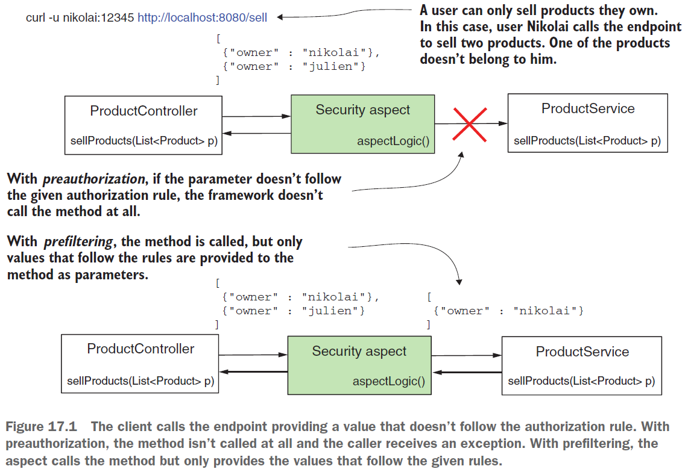
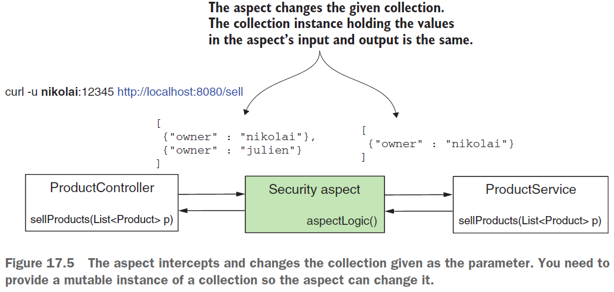
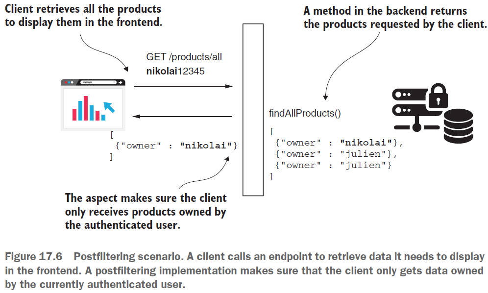

== Global method security: pre- and postfiltering

*Source code:*

- link:../../spring-security-learning/src/main/java/ch5_spring_security_in_action/p416_method_prefiltering/[p416_method_prefiltering/...] (2-4)

*Content:*

- 1. Filtering intro
- 2. Применение prefiltering для авторизации метода
- 3. Применение postfiltering для авторизации метода

Ранее мы применяли правила авторизации, используя аннотации _@PreAuthorize_ и _@PostAuthorize_. Такой подход либо разрешает вызов метода, либо полностью отклоняет вызов. Предположим, вы не хотите запрещать вызов метода, но хотите, чтобы передаваемые ему параметры соответствовали определенным правилам. Или же вы хотите убедиться, что тот, кто вызвал метод, получит только разрешенную часть возвращаемого значения. данная функциональность называется фильтрацией и делится на два типа:

- *_Prefiltering_* — платформа фильтрует значения параметров перед вызовом метода.
- *_Postfiltering_* — платформа фильтрует возвращаемое значение после вызова метода.

При фильтрации _Spring Security_ выполняет вызов и не генерирует исключение, если параметр или возвращаемое значение не соответствует определенному вами правилу авторизации. Вместо этого он отфильтровывает элементы, которые не соответствуют заданным вами условиям:

Очевидно, что *_фильтрация применима только к коллекциям и массивам_*. Её можно использовать в двух случаях - если метод получает в качестве параметра _массив_ или _коллекцию_ - в случае _prefiltering_ - или если метод возвращает _коллекцию_ или _массив_ - в случае _postfiltering_.

=== 2. Применение prefiltering для авторизации метода

*_Prefiltering_* периодически встречается на практике, потому что она отделяет правила авторизации от бизнес-логики, реализуемой методом. Как и в случае _pre/postauthorization_ вызовов, которую мы обсуждали в link:387_global_method_security.adoc[], при реализации фильтрации Spring Security также использует _aspects_. При _prefiltering_ аспект перехватывает методы, аннотированные аннотацией *_@PreFilter_*, и фильтрует значения в коллекции, предоставленной в качестве параметра. В *_@PreFilter_* точно также используются выражения _SpEL_, где используется *_filterObject_* для ссылки на элемент коллекции или массива, например:
[source, java]
----
@PreFilter("filterObject.owner == authentication.name")
public List<Product> sellProducts(List<Product> products) {
  // ... method logic
}
----

Напишем пример *_prefiltering_* - приложение для покупки и продажи товаров, которое имеет эндпоинт *_/sell_* - см. link:../../spring-security-learning/src/main/java/ch5_spring_security_in_action/p416_method_prefiltering/controllers/ProductController.java[ProductController.java]. Пользователь вызывает этот эндпоинт, когда продает список продуктов. Но авторизованный пользователь может продавать только те продукты, которыми он владеет.

Наш класс конфигурации - link:../../spring-security-learning/src/main/java/ch5_spring_security_in_action/p416_method_prefiltering/config/ProjectConfig.java[ProjectConfig.java] - сдержит базовые настройки UserDetailsService/PasswordEncoder и создает двух пользователей - `nikolai` и `pavel` с _authorities_ `read` и `write` соответственно.

Класс ProductService принимает значение продуктов на продажу и возвращает те, которые были проданы. Над методом `sellProducts()` мы используем аннотацию _@PreFilter_. Поскольку у нас есть список продуктов, объект filterObject в нашем _SpEL_-выражении имеет тип Product поэтому мы можем получить значение *_Product.owner_*. Для аннотаций _@PreFilter_ и _@PostFilter_ мы можем напрямую обратиться к объекту аутентификации, который доступен в _SecurityContext_ после аутентификации - см link:../../spring-security-learning/src/main/java/ch5_spring_security_in_action/p416_method_prefiltering/service/ProductService.java[ProductService.java]:
[source, java]
----
@Service
public class ProductService {

    @PreFilter("filterObject.owner == authentication.name")
    public List<Product> sellProducts(List<Product> products) {
        log.info("received and filtered products: {}", products);
        // sell products and return the sold products list
        return products;
    }
}
----

*NOTE!* *_Аспект изменяет переданную коллекцию_*, поэтому при передаче _immutable_ коллекции мы получим _UnsupportedOperationException_. Аспект работает таким образом:

Запустим и протестируем приложение. Залогинимся с кредами `nikolai/12345`:
----
http://localhost:8080/sell
->
200 OK, [{"name":"beer","owner":"nikolai"},{"name":"candy","owner":"nikolai"}]
----
Мы получили только два продукта из трёх, как и ожидалось. При этом в логах тоже будет два продукта, поскольку _Aspect_ изменил список, отфилтьтровав результаты, еще до вызова метода:
----
received and filtered products: [Product(name=beer, owner=nikolai), Product(name=candy, owner=nikolai)]
----

=== 3. Применение postfiltering для авторизации метода

Пример применения: которое не умеет фильтровать результаты на своей стороне *_(?)_*:

Расширим наш предыдущий пример. Добавим новый эндпоинт  *_/find_*, который позволяет искать и получать продукты - см. link:../../spring-security-learning/src/main/java/ch5_spring_security_in_action/p416_method_prefiltering/controllers/ProductController.java[ProductController.java]. +
Пусть нам нужно фильтровать ответы по *_owner_*. Тогда будем использовать аннотацию *_@PostFilter_* в классе link:../../spring-security-learning/src/main/java/ch5_spring_security_in_action/p416_method_prefiltering/service/ProductService.java[ProductService.java] . Расширим класс сервиса соответствующим методом поиска:
[source, java]
----
@Service
public class ProductService {

    // ... omitted code

    @PostFilter("filterObject.owner == authentication.name")
    public List<Product> findProducts() {
        // должен быть immutable list
        List<Product> products = new ArrayList<>();
        products.add(new Product("beer", "nikolai"));
        products.add(new Product("candy", "nikolai"));
        products.add(new Product("chocolate", "julien"));
        return products;
    }
}
----

Запустим и протестируем приложение. Залогинимся с кредами `nikolai/12345`:
----
http://localhost:8080/find
->
200 OK, [{"name":"beer","owner":"nikolai"},{"name":"candy","owner":"nikolai"}]
----

Залогинимся с кредами `pavel/12345`:
----
http://localhost:8080/find
->
200 OK, [{"name":"chocolate","owner":"pavel"}]
----
