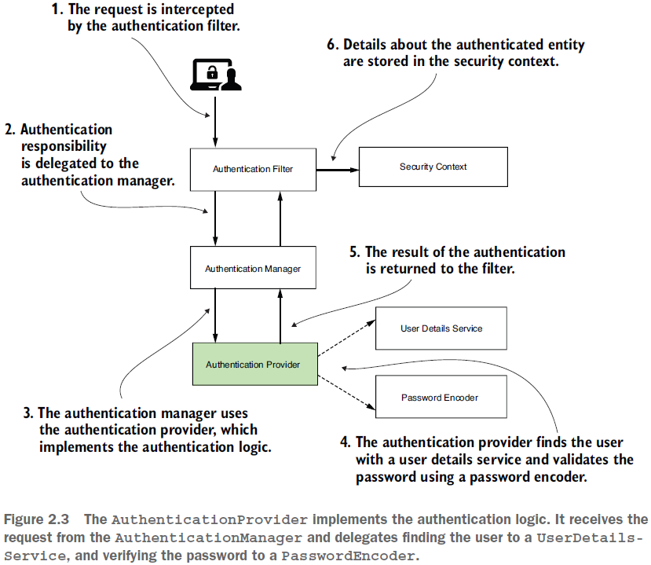

== AuthenticationProvider

*Source code:*

_p53_customAuthenticationProvider/..._ (1) +

*Content:*

- 1. Переопределение AuthenticationProvider

=== 1. Переопределение AuthenticationProvider

Сейчас мы знаем о назначении и способах конфигурации *UserDetailsService* и *PasswordEncoder*. Но мы также можем конфигурить компонент, который делегирует им управление - *_AuthenticationProvider_*:

В большинстве случаев лучше оставлять текущую архитектурную реализацию Spring Security. Но при этом вы можете вносить в нее изменения, если это вам нужно. Например, вы можете переопределить AuthenticationProvider так, чтобы вам не нужны были UserDetailsService или PasswordEncoder. Далее рассмотрим как создать кастомный AuthenticationProvider:

*_See_* _p53_customAuthenticationProvider/security/CustomAuthenticationProvider.java_

Метод `authenticate(Authentication authentication)` выполняет аутентификацию и возвращает полностью аутентифицированный объект, включая учетные данные. Он может вернуть значение null, если AuthenticationProvider не поддерживает аутентификацию переданного объекта Authentication. В этом случае будет предпринята попытка использовать следующий AuthenticationProvider, поддерживающий представленный класс Authentication.

Метод `supports()` возвращает true, если этот AuthenticationProvider поддерживает указанный объект Authentication. Его использование будет рассмотрено в главе 5.

В классе конфигурации вы можете зарегистрировать AuthenticationProvider в методе `configure(AuthenticationManagerBuilder auth)`:

*_See_* _p53_customAuthenticationProvider/config/ProjectConfig.java_

