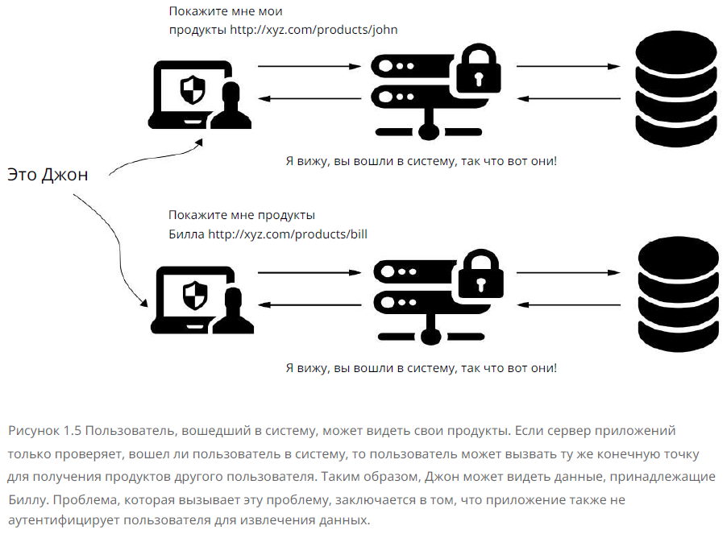
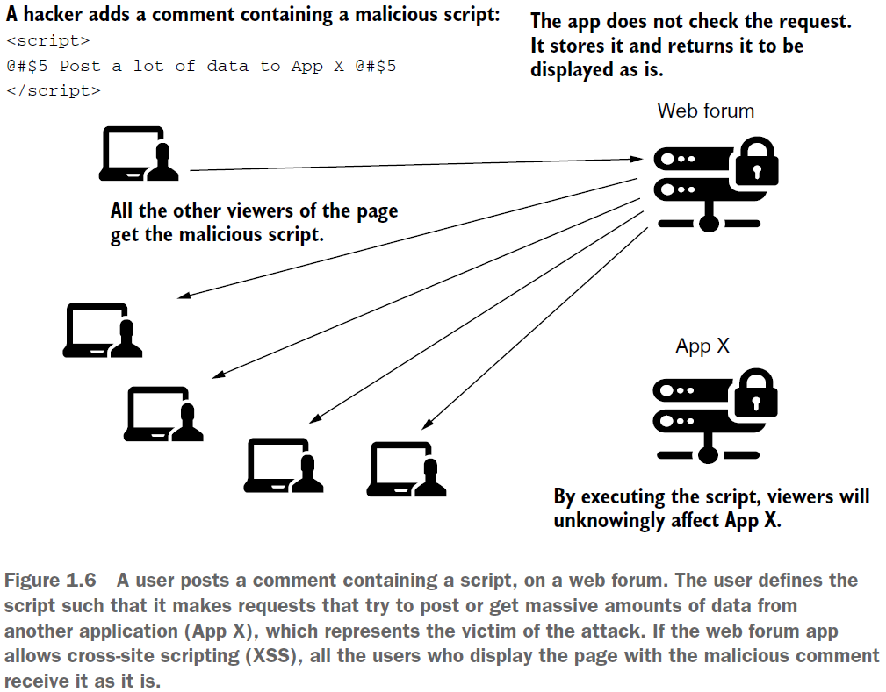
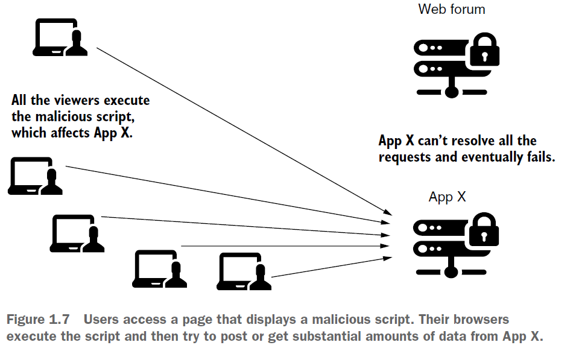
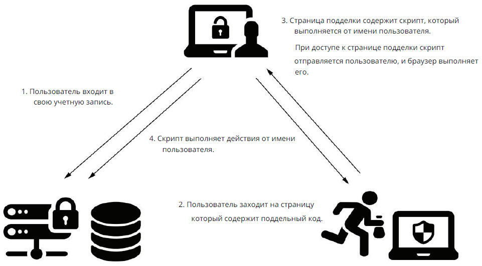
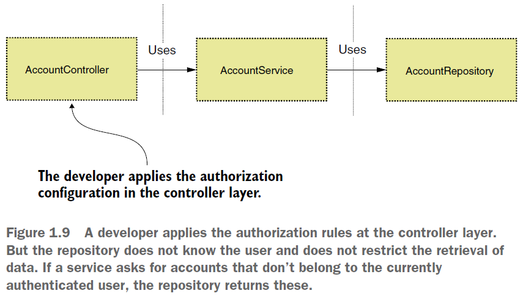
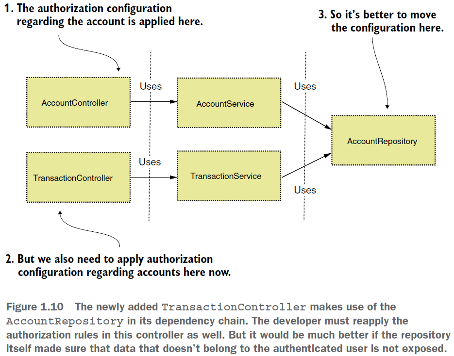

== Security today

*Content:*

- 1. Аутентификация / Авторизация
- 2. Распространенные уязвимости безопасности
  * 2.1 Broken authentication (сломанная аутентификация). Уязвимости в аутентификации и авторизации
  * 2.2 Session fixation
  * 2.3 Cross-site scripting (XSS) (межсайтовый скриптинг)
  * 2.4 Cross-site request forgery (CSRF) (Подделка межсайтовых запросов)
  * 2.5 Injections
  * 2.6 Раскрытие конфиденциальных данных
  * 2.7 Lack of method access control (Отсутствие/недостаток контроля доступа к методам)
  * 2.8 Использование зависимостей с известными уязвимостями

=== 1. Аутентификация / Авторизация

Аутентификация и авторизация - разные вещи. Через *_аутентификацию_* приложение идентифицирует пользователя (человека или другое приложение). Цель их идентификации состоит в том, чтобы иметь возможность впоследствии решить, что им должно быть позволено делать — это *_авторизация_*.

В приложении часто возникает необходимость реализации авторизации в различных сценариях. Большинство приложений ограничивают доступ пользователя к тому или иному функционалу. Для начала сначала определить, кто запрашивает конкретную функцию — это и есть аутентификация. Кроме того, нам нужно знать привилегии того, кто запрашивает, чтобы позволить пользователю использовать эту часть системы.

Допустим, принтеру нужен доступ для чтения документов пользователя. Должны ли вы просто поделиться учетными данными пользователя с принтером? Но это дает принтеру больше прав, чем необходимо! И это также раскрывает учетные данные пользователя. Есть ли правильный способ сделать это, не выдавая себя за пользователя? Далее мы ответим на это вопрос.

Также приложение не должно хранить все свои данные в удобочитаемом формате. Иногда необходимо хранить данные либо в зашифрованном виде с помощью закрытого ключа, либо в хешированном виде. Секреты, такие как учетные данные и закрытые ключи, также могут считаться данными, и их следует
бережно хранить, обычно в *_secrets vault_* (хранилище секретов).

=== 2. Распространенные уязвимости безопасности

Отличным началом для понимания уязвимостей является знакомство с проектом Open Web Application  Security Project, также известным как OWASP link:https://www.owasp.org[www.owasp.org]. На OWASP вы найдете описания наиболее распространенных уязвимостей, которых следует избегать в своих приложениях. Давайте рассмотрим наиболее популярные:

- Broken authentication (сломанная аутентификация)
- Session fixation (фиксация сеанса, link:https://www.styler.ru/styler/session-fixation/[link])
- Cross-site scripting (XSS) (межсайтовый скриптинг)
- Cross-site request forgery (CSRF) (Подделка межсайтовых запросов)
- Injections
- Sensitive data exposure (Раскрытие конфиденциальных данных)
- Lack of method access control (Отсутствие/недостаток контроля доступа к методам)
- Using dependencies with known vulnerabilities (Использование зависимостей с известными уязвимостями)

==== 2.1 Broken authentication (сломанная аутентификация). Уязвимости в аутентификации и авторизации

Аутентификация представляет собой процесс, в котором приложение идентифицирует того, кто пытается его использовать. Когда кто-то или что-то использует приложение, мы хотим установить его личность, чтобы решить - выдавать ему доступ или нет. Получив личность пользователя, мы можем обработать авторизацию. Авторизация — это процесс установления, имеет ли вызывающий абонент, прошедший проверку подлинности, права на использование определенных функций и данных. Мы можем сказать, что у нас нарушена авторизация, если злоумышленник каким-то образом получает доступ к функциям или данным, которые ему не принадлежат.

Простейший пример - пусть приложение проверяет только эндпоинты. Например, пользователь, прошедший аутентификацию, имеет доступ к эндпоинту `/products/{name}`. Однако авторизация должна ограничивать допустимые параметры, которые пользователь может подставить в *_"{name}"_*. В противном слусае пользователь может найти способ получить данные другого
пользователя:

==== 2.2 Session fixation

link:https://www.styler.ru/styler/session-fixation/[link]

_Фиксация сессии_ - уязвимость, которая позволяет злоумышленнику выдать себя за действительного пользователя, повторно используя ранее сгенерированный идентификатор сессии. Эта уязвимость может возникнуть, если в процессе аутентификации веб-приложение не назначает уникальный идентификатор сессии. Это потенциально может привести к повторному использованию существующих идентификаторов сеансов. Эксплуатация этой уязвимости заключается в получении валидного идентификатора сессии и попытке заставить браузер жертвы использовать этот идентификатор.

В зависимости от того, как вы реализуете свое веб-приложение, люди могут использовать эту уязвимость различными способами. Например, если приложение предоставляет идентификатор сеанса в URL-адресе, жертву можно обмануть, заставив щелкнуть по вредоносной ссылке. Если приложение использует скрытый атрибут, злоумышленник может обманом заставить жертву использовать чужую форму, а затем отправить действие на сервер. Если приложение сохраняет значение сеанса в файле cookie, злоумышленник может внедрить скрипт и заставить браузер жертвы выполнить его.

==== 2.3 Cross-site scripting (XSS) (межсайтовый скриптинг)

Уязвимость, связанная с фиксацией сеанса , является более специфической и серьезной слабостью веб-приложения. Если он присутствует, он позволяет злоумышленнику выдать себя за действительного пользователя, повторно используя ранее сгенерированный идентификатор сеанса. Эта уязвимость может возникнуть, если в процессе аутентификации веб-приложение не назначает уникальный идентификатор сеанса. Это потенциально может привести к повторному использованию существующих идентификаторов сеансов. Эксплуатация этой уязвимости заключается в получении действительного идентификатора сеанса и использовании его браузером предполагаемой жертвы. В зависимости от того, как вы реализуете свое веб-приложение, люди могут использовать эту уязвимость различными способами. Например, если приложение предоставляет идентификатор сеанса в URL-адресе, жертву можно обмануть, заставив щелкнуть вредоносную ссылку. Если приложение использует скрытый атрибут, злоумышленник может обманом заставить жертву использовать чужую форму, а затем отправить действие на сервер. Если приложение сохраняет значение сеанса в файле cookie, злоумышленник может внедрить сценарий и заставить браузер жертвы выполнить его:

Рис. 1.6. Пользователь публикует комментарий, содержащий скрипт, на Web-forum. Скрипт отправляет запросы, пытающиеся опубликовать или получить огромные объемы данных из другого приложения (App X), которое представляет собой жертву атаки. Если Web-forum разрешает межсайтовый скриптинг (XSS), все пользователи, отображающие страницу с вредоносным комментарием, получают скрипт как есть.

Рис. 1.7. Пользователи получают доступ к странице, на которой отображается вредоносный сценарий. Их браузеры выполняют скрипт, который пытается опубликовать или получить значительные объемы данных из приложения X - браузеры пользователей создают серьезную нагрузку на App X.

==== 2.4 Cross-site request forgery (CSRF) (Подделка межсайтовых запросов)

Атаки CSRF предполагают, что URL-адрес, вызывающий действие на определенном сервере, может быть извлечен и повторно использован вне приложения (рис. 1.8). Если сервер доверяет выполнению без какой-либо проверки происхождения запроса, его можно выполнить из любого другого места. С помощью CSRF злоумышленник может заставить пользователя выполнять нежелательные действия на сервере, скрывая эти действия. Обычно с помощью этой уязвимости злоумышленник нацелен на действия, которые изменяют данные в системе. Одним из способов устранения этой уязвимости является использование токенов для идентификации запроса или использование ограничений совместного использования ресурсов между источниками (CORS). Иначе говоря, нужно проверять происхождение запроса. +
На Рис. 1.8 злоумышленник, по факту, скармливает скрипту URL-адрес базы для выполнения каких-то действий.

==== 2.5 Injections

При инъекции злоумышленник, использующий уязвимость, вводит в систему определенные данные. Цель состоит в том, чтобы нанести вред системе, изменить данные нежелательным образом или получить данные, которые не предназначены для доступа злоумышленника. +
Существует много типов инъекционных атак. Даже XSS, о котором мы упоминали, можно считать инъекцией. В конце концов, инъекционные атаки внедряют в клиентский скрипт средства каким-то образом нанести вред системе. Другими примерами могут быть:

- инъекция SQL
- инъекция XPath
- инъекция команд ОС
- инъекция LDAP и т. д.

Результатом инъекции может быть изменение, удаление или доступ к данным. Например, если ваше приложение уязвимо к LDAP, злоумышленник может обойти аутентификации и контролировать важные части системы. То же самое может произойти при инъекции команд XPath или ОС. +
Одним из старейших и, возможно, хорошо известных типов уязвимостей, связанных с инъекциями, является SQL-инъекция. Если ваше приложение имеет уязвимость SQL-инъекции, злоумышленник может попытаться изменить или запустить различные SQL-запросы, чтобы изменить, удалить или извлечь данные из вашей системы. В самых продвинутых SQL-инъекциях человек может даже запускать команды ОС в системе.

==== 2.6 Раскрытие конфиденциальных данных

Для простоты различные туториалы предпочитают создавать приложения, где секретные данные (в т. ч. пароли и URL к БД) хранятся в файлах конфигурации, таких как *application.properties*, *application.yml* и пр. Также к раскрытию конфиденциальных данных относится информация в лог-журналах, записываемая вашим приложением на консоль или хранящаяся в базах данных, таких как Splunk или Elasticsearch. В реальном приложении такое недопустимо.

Тщательно обрабатывайте то, что сервер возвращает клиенту. Особенно это касается исключений, когда приложение возвращает слишком много деталей, раскрывающих реализацию. Например:

[source]
----
at java.base/java.util.concurrent.ThreadPoolExecutor.runWorker(ThreadPoolExecutor.java:1128) ~[na:na]
at java.base/java.util.concurrent.ThreadPoolExecutor$Worker.run(ThreadPoolExecutor.java:628) ~[na:na]
at org.apache.tomcat.util.threads.TaskThread$WrappingRunnable.run(TaskThread.java:61) ~[tomcat-embed-core-9.0.26.jar:9.0.26]
at java.base/java.lang.Thread.run(Thread.java:830) ~[na:na]
----

Этот подход раскрывает внутреннюю структуру приложения. В стеке исключений вы можете увидеть нотации имен, а также объекты потоков и обработки потоков и связи между ними. Но что еще хуже, журналы иногда могут раскрывать версии зависимостей, которые использует ваше приложение, допустим, версию ядра Tomcat, как в примере выше.

==== 2.7 Lack of method access control (Отсутствие/недостаток контроля доступа к методам)

Даже на уровне приложения вы не применяете авторизацию только к одному из уровней (controller, service, repository, etc.). Иногда необходимо гарантировать, что конкретный функционал вообще не может быть вызван (например, если привилегии текущего аутентифицированного пользователя не позволяют этого). Представьте ситуацию, когда авторизация выполняется только на уровне эндпоинтов, но не применяются на уровне сервиса и/или репозитория:

Если service запрашивает учетные записи, которые не принадлежат текущему аутентифицированному пользователю, repository возвращает их. В случае рис. 1.9, работает правильно, но авторизация только на уровне контроллера может привести к тому, что при имплементации другого контроллера, который использует тото же репозиторий, можно забыть о secure rules для контроллера. На рис. 1.10 вы можете увидеть, что может произойти, если разработчик добавит другую функциональность, зависящую от того же репозитория.

Рис. 1.10. Недавно добавленный TransactionController использует AccountRepository в своей цепочке зависимостей. Разработчик также должен повторно применить правила авторизации в этом контроллере. Но было бы намного лучше, если бы репозиторий сам позаботился о том, чтобы данные, которые не принадлежат аутентифицированному пользователю, не были раскрыты.

==== 2.8 Использование зависимостей с известными уязвимостями

Иногда уязвимыми местами является не приложение, которое вы разрабатываете, а зависимости, такие как библиотеки или фреймворки, которые вы используете для создания функциональности. К счастью, добавив плагин в конфигурацию Maven или Gradle, можно сканировать зависимости на предмет уязвимостей. При разработке приложения нужно избегать использования любых зависимостей с известными уязвимостями. Если мы обнаружим, что использовали такую зависимость, то мы должны не только быстро это исправить, но и выяснить, использовалась ли уже уязвимость в наших приложениях и принять необходимые меры.