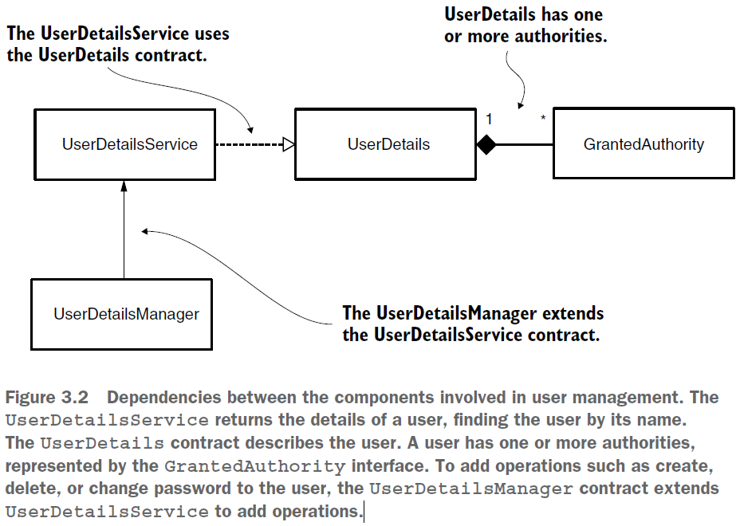

== Управление пользователями - Глава 2

Начнем с того, как Spring Security понимает определение пользователя. Для этого мы обсудим контракты UserDetails и GrantedAuthority (определяет привилегии пользователя). Затем мы подробно рассмотрим UserDetailsService и то, как UserDetailsManager расширяет этот контракт. В частности, поговорим о InMemoryUserDetailsManager, JdbcUserDetailsManager и LdapUserDetailsManager.

*Source code:*

*Content:*

- 1. Зависимости между user-management компонентами
- 2. Описание пользователя
- 3. GrantedAuthority contract
- 4. Builder для создания объектов UserDetails
- 5. Пример разделения ответственности для классов пользователя

=== 1. Зависимости между user-management компонентами

В рамках управления пользователями мы используем интерфейсы *UserDetailsService* и *UserDetailsManager*. UserDetailsService отвечает только за получение пользователя по имени пользователя. Это единственное действие, необходимое платформе для завершения аутентификации. UserDetailsManager дополнительно позволяет добавлять или удалять пользователя, изменять его пароль, что необходимо в большинстве приложений. Разделение интерфейсов обеспечивает большую гибкость, поскольку если приложению требуется только аутентифицировать пользователей, то реализация контракта UserDetailsService достаточна для обеспечения желаемой функциональности.

Нам также необходим способ представления пользоваталей в системе. Spring Security предлагает контракт *UserDetails*. В Spring Security у пользователя есть набор привилегий (ролей), которые представляют собой действия, которые ему разрешено выполнять с помощью интерфейса GrantedAuthority. Мы их рассмотрим позднее в главах 7 и 8, когда будем обсуждать авторизацию.

Рисунок 3.2. Зависимости между компонентами, участвующими в управлении пользователями. UserDetailsService возвращает сведения о пользователе, находя пользователя по его имени. Контракт UserDetails описывает пользователя. У пользователя есть одно или несколько authority (права), представленных интерфейсом GrantedAuthority. UserDetailsManager расширяет UserDetailsService и позволяет добавлять/удалять пользователя и изменять его пароль.

=== 2. Описание пользователя

Изучение того, как представлять пользователей и сообщать о них платформе, является важным шагом в построении  аутентификационного flow. В зависимости от пользователя приложение принимает решение разрешить или запретить ему вызов определенной функции. Для работы со Spring Security определение пользователя должно имплементировать интерфейс *_UserDetails_*. Мы обсудим методы, объявленные интерфейсом _UserDetails_, чтобы понять, каким образом их реализовывать:

[source, java]
----
public interface UserDetails extends Serializable {
  String getUsername();
  String getPassword();
  Collection<? extends GrantedAuthority> getAuthorities();
  boolean isAccountNonExpired();
  boolean isAccountNonLocked();
  boolean isCredentialsNonExpired();
  boolean isEnabled();
}
----
- Методы getUsername() и getPassword() Приложение использует в процессе аутентификации, и это единственные методы _UserDetails_, относящиеся к аутентификации.
- Все остальные пять методов связаны с авторизацией пользователя для доступа к приложению.

Как видно из контракта UserDetails, с помощью 4 последних методов пользователь может:

- Let the account expire
- Lock the account
- Let the credentials expire
- Disable the account

Если вам не нужно реализовывать эти функциональные возможности в вашем приложении, вы можете просто заставить эти четыре метода возвращать значение true. Наивную реализацию этих методов можно увидеть в: *_See_* _p74_more_about_UserDetailsService/model/CustomUser.java_

=== 3. GrantedAuthority contract

*NOTE!* Не путайте права (authority) и роли. Это идеологически разные сущности - роль представляет пользователя, а право - действие. Хотя Spring Security и те же jwt токены их "кладут в одну корзину" - в Spring Security *_See_* _p56_use_multiple_configurations/config/UserManagementConfig.java_ (например на link:https://jwt.io/[jwt.io] "realm_access" -> "roles" -> список ролей). Так получаются роли ROLE_OPERATOR, ROLE_READER и пр. Подробнее про роли/права *_See_* link:https://www.javadevjournal.com/spring-security/granted-authority-vs-role-in-spring-security/[javadevjournal] и link:https://www.baeldung.com/spring-security-granted-authority-vs-role[baeldung].

Пользователь должен иметь по крайней мере одну authority. Чтобы создать authority, вам нужно только имя в string-формате для неё (для написания правил авторизации).

Мы реализуем метод getAuthority() для возврата имени авторитета в виде строки. Интерфейс *GrantedAuthority* имеет только один абстрактный метод. Но, поскольку он не помечен как *_@FunctionalInterface_*, не рекомендуется реализовывать его как лямбду (а вдруг когда-то разрабы добавят в него больше абстрактных методов). Лучше использовать класс *SimpleGrantedAuthority*.

Интерфейс *_GrantedAuthority_* выглядит следующим образом:
[source, java]
----
public interface GrantedAuthority extends Serializable {
  String getAuthority();
}
----

=== 4. Builder для создания объектов UserDetails

Класс *_User_* из пакета _org.springframework.security.core.userdetails_ — это простой способ создания экземпляров типа UserDetails . Используя этот класс, вы можете создавать неизменяемые экземпляры UserDetails. Вам необходимо указать по крайней мере имя пользователя и пароль. Создавая пользователя таким образом, вам не нужно иметь реализацию интерфейса UserDetails. +
Рассмотрим этот билдер поподробнее. Метод `withUsername(String username)` возвращает экземпляр класса билдера *User.UserBuilder*. Другой способ создать билдер - начать с другого экземпляра UserDetails:
[source, java]
----
User.UserBuilder builder1 = User.withUsername("bill");
UserDetails u1 = builder1
                 .password("12345")
                 .authorities("read", "write")
                 .passwordEncoder(p -> encode(p)) // Кодировщик паролей — это всего лишь функция, выполняющая кодирование
                 .accountExpired(false)
                 .disabled(true)
                 .build();

User.UserBuilder builder2 = User.withUserDetails(u1);
UserDetails u2 = builder2.build();
----
Заметьте, что метод `.passwordEncoder(p -> encode(p))` - кодировщик паролей — это не то же самое, что bean-компонент PasswordEncoder. Мы обсудим кодировщик паролей чуть позже.

=== 5. Пример разделения ответственности для классов пользователя

Мы можем хранить пользователей в БД. И если мы хотим использовать имплементить UserDetails - то если класс имплементации сделать еще и *_@Entity_*, то мы совершенно запутаемся:
[source, java]
----
// The User class has two responsibilities
@Entity
public class User implements UserDetails {
  @Id
  private int id;
  private String username;
  private String password;
  private String authority;

  @Override
  public String getUsername() {
    return this.username;
  }
// Omitted code
  @Override
  public Collection<? extends GrantedAuthority> getAuthorities() {
    return List.of(() -> this.authority);
  }
// Omitted code
}
----
Класс становится очень сложным, поскольку содержит аннотации JPA, геттеры и сеттеры:

- *_getUsername()_* и *_getPassword()_* переопределяют методы в контракте UserDetails
- Метод *_getAuthority()_* возвращает строку, а метод *_getAuthorities()_* возвращает коллекцию.
- Метод *_getAuthority()_* является просто геттером в классе, тогда как *_getAuthorities()_* реализует метод интерфейса *_UserDetails_*.

Хорошая альтернатива - разделить эти два класса, определив отдельный класс *_SecurityUser_*. При этом класс *_User_* остается JPA-сущностью:
[source, java]
----
// The User class responsible only for JPA
@Entity
public class User {
  @Id
  private int id;
  private String username;
  private String password;
  private String authority;
  // Omitted getters and setters
}

...

public class SecurityUser implements UserDetails {

  private final User user; // агрегация (экземпляр User создается в другом месте кода и передается в конструктор в качестве параметра)
  //
  // Поскольку SecurityUser не имеет смысла без сущности User, делаем поле final

  public SecurityUser(User user) {
    this.user = user;
  }

  @Override
  public String getUsername() {
    return user.getUsername();
  }

  @Override
  public String getPassword() {
    return user.getPassword();
  }

  @Override
  public Collection<? extends GrantedAuthority> getAuthorities() {
    return List.of(() -> user.getAuthority());
  }
  // Omitted code
}
----
Мы используем класс SecurityUser только для сопоставления сведений о пользователе в системе с контрактом *_UserDetails_*, понятным Spring Security. Чтобы отметить факт что SecurityUser не имеет смысла без сущности User, делаем поле final.

