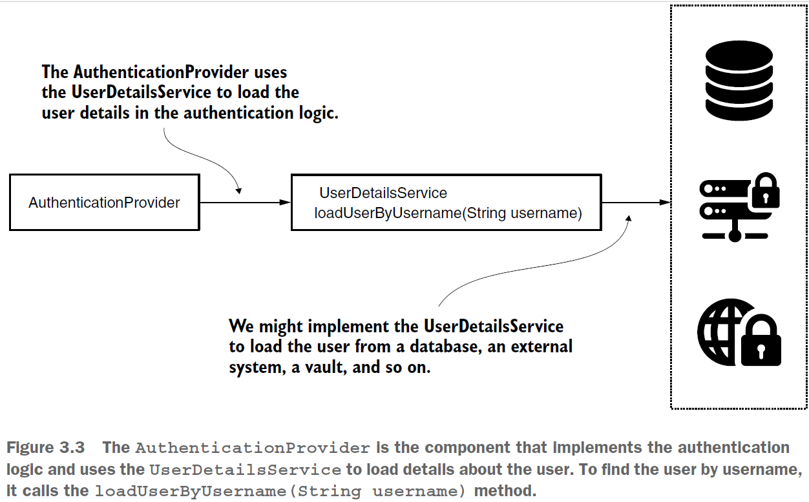
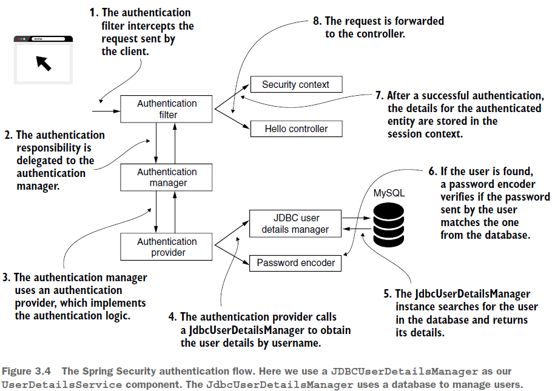

== СОбственная реализация UserDetails и UserDetailsService

Как Spring Security управляет пользователями? Откуда они берутся при сравнении учетных данных, и добавлять новых пользователей или изменять существующих? Специальный компонент для этого - *UserDetailsService*. В этом разделе мы экспериментируем с различными способами реализации класса UserDetailsService. Мы узнаем, как интерфейс UserDetailsManager добавляет дополнительное поведение. В конце раздела мы будем использовать реализации интерфейса UserDetailsManager, которые предлагает нам Spring Security. Мы напишем пример проекта, в котором будем использовать одну из самых известных реализаций, предоставляемых Spring Security, *JdbcUserDetailsManager*. Изучив это, вы узнаете, как сообщить Spring Security, где искать пользователей, что очень важно в процессе аутентификации.

*Source code:*

_p74_more_about_UserDetailsService/..._ (1-2) +
_p79_JdbcUserDetailsManager/..._ (3)

*Content:*

- 1. Понимание контракта UserDetailsService
- 2. Реализация интерфейса UserDetailsService
- 3. Реализация интерфейса UserDetailsManager. JdbcUserDetailsManager
  * 3.1 JdbcUserDetailsManager

=== 1. Понимание контракта UserDetailsService

Интерфейс UserDetailsService содержит только один метод:
[source, java]
----
public interface UserDetailsService {
  UserDetails loadUserByUsername(String username) throws UsernameNotFoundException;
}
----
Spring Security вызывает метод `loadUserByUsername(String username)` для получения сведений о пользователе с заданным именем пользователя. Имя пользователя, разумеется, *_считается уникальным_*. Если имя пользователя не существует, метод создает исключение UsernameNotFoundException:

Рисунок 3.3. *_AuthenticationProvider_* — это компонент, реализующий логику аутентификации и использующий UserDetailsService для загрузки сведений о пользователе. Чтобы найти пользователя по имени пользователя, он вызывает метод loadUserByUsername(String username).

*NOTE!* UsernameNotFoundException <- AuthenticationException <- RuntimeException

=== 2. Реализация интерфейса UserDetailsService

Учетные записи пользователей могут храниться в базе данных или обрабатываться другой системой. Независимо от того, как это происходит в вашей системе, единственное, что нужно Spring Security, — это реализация для получения пользователя по его username.

мы напишем UserDetailsService со списком пользователей в памяти. В главе 2 вы использовали реализацию из SS, которая делает то же самое, InMemoryUserDetailsManager. Но сейчас мы напишем ее самостоятельно. Мы предоставляем список пользователей при создании экземпляра нашего класса UserDetailsService:

*_See_* _p74_more_about_UserDetailsService/..._

*NOTE!* В *_CustomUser.java_* 4 метода для недоступности аккаунта (_isAccountNonExpired()_, _isAccountNonLocked()_,..) всегда возвращают "true". Это значит, что учетная запись не имеет срока действия и не может быть заблокирована. Пользователь всегда активен и доступен для использования.

=== 3. Реализация интерфейса UserDetailsManager. JdbcUserDetailsManager

Интерфейс *UserDetailsManager* расширяет UserDetailsService. Он направлен на функционал, который позволяет добавлять или удалять пользователей, а также редактировать их. UserDetailsManager добавляет больше методов, которые нужно реализовать:
[source, java]
----
public interface UserDetailsManager extends UserDetailsService {
  void createUser(UserDetails user);
  void updateUser(UserDetails user);
  void deleteUser(String username);
  void changePassword(String oldPassword, String newPassword);
  boolean userExists(String username);
}
----
Дефолтный класс SS InMemoryUserDetailsManager (из главы 2) на самом деле реализация UserDetailsManager. Мы тогда просто не рассматривали методы манипулации юзерами. Другая известная реализация UserDetailsManager - это *JdbcUserDetailsManager*.

==== 3.1 JdbcUserDetailsManager

*JdbcUserDetailsManager* управляет пользователями в базе данных SQL. Он подключается к базе данных напрямую через JDBC (не зависит от какой-либо другой инфраструктуры, связанной с подключением к БД).

Работа JdbcUserDetailsManager в аутентификационном флоу выглядит следующим образом:

Создадим приложение - пример использования *_JdbcUserDetailsManager_* - создав базу данных (spring) и две таблицы (users, authorities). Эти имена являются именами таблиц по умолчанию, с которыми работает JdbcUserDetailsManager, но их можно переопределить. Реализация JdbcUserDetailsManager предполагает наличие трех столбцов в таблице пользователей: username, password, enabled. Последнее значение можно использовать для деактивации пользователя. (Кроме того, это приложение описано в link:../spring/sn1_spring_datasource_and_h2_db.adoc[sn1_spring_datasource_and_h2_db.adoc] с точки зрения работы с бд H2)

*_See_* _p79_JdbcUserDetailsManager/..._

В классе конфигурации проекта вы определяете UserDetailsService и PasswordEncoder. JdbcUserDetailsManager нуждается в DataSource для подключения к базе данных. Источник данных может быть автоматически подключен через параметр метода (как представлено в _p79_JdbcUserDetailsManager/config/ProjectConfig.java_):
[source, java]
----
@Configuration
public class ProjectConfig extends WebSecurityConfigurerAdapter {

  @Bean
  public UserDetailsService userDetailsService(DataSource dataSource) {
    String usersByUsernameQuery =
      "select username, password, enabled from spring.users where username = ?";
    String authsByUserQuery =
      "select username, authority from spring.authorities where username = ?";

    var userDetailsManager = new JdbcUserDetailsManager(dataSource);
    userDetailsManager.setUsersByUsernameQuery(usersByUsernameQuery);
    userDetailsManager.setAuthoritiesByUsernameQuery(authsByUserQuery);
    return userDetailsManager;
  }

  // omitted code
}
----
В этом же листинге мы видим, что мы можем изменить все запросы к БД на свои кастомные при необходимости.

