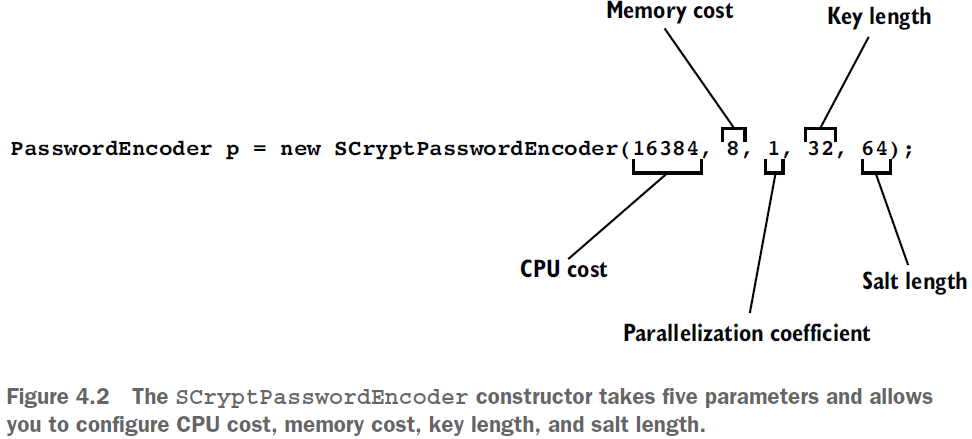

== PasswordEncoder - дефолтные реализации в Spring Security

*Source code:*

*Content:*

- 1. Выбор из предлагаемых Spring Security реализаций PasswordEncoder
  * 1.1 NoOpPasswordEncoder
  * 1.2 StandardPasswordEncoder
  * 1.3 Pbkdf2PasswordEncoder
  * 1.4 BCryptPasswordEncoder
  * 1.5 SCryptPasswordEncoder

=== 1. Выбор из предлагаемых Spring Security реализаций PasswordEncoder

Ранее (_86_more_about_PasswordEncoder.adoc_) мы уже рассмотрели как _PasswordEncoder_ можно заимплементить самостоятельно. Однако Spring Security уже предоставляет нам некоторые полезные его реализации:

- *_NoOpPasswordEncoder_* — не кодирует пароль, а сохраняет его в виде открытого текста. Мы используем эту реализацию только для примеров и никогда не используем в реальных кейсах.
- *_StandardPasswordEncoder_* - использует *_SHA-256_* для хеширования пароля. *_@Deprecated_* по причине того, что он использует алгоритм хеширования, который сейчас уже ненадёжный. Однако StandardPasswordEncoder  все еще используется в существующих приложениях.
- *_Pbkdf2PasswordEncoder_* - использует криптографическую функцию формирования ключа на основе пароля *_PBKDF2_*. PBKDF2 уже не такая сильная криптографическая функция и зачастую используется как часть составных функций (таких как scrypt).
- *_BCryptPasswordEncoder_* - использует достаточно надежную функцию хеширования bcrypt.
- *_SCryptPasswordEncoder_* - использует функцию хеширования scrypt.

=== 1.1 NoOpPasswordEncoder

*_NoOpPasswordEncoder_* не кодирует пароль. Его реализация аналогична PlainTextPasswordEncoder который упоминался ранее в _86_more_about_PasswordEncoder.adoc_. Класс NoOpPasswordEncoder - это singleton с приватным конструктором. Для получения эземпляра класса используется метод `NoOpPasswordEncoder.getInstance()`.

=== 1.2 StandardPasswordEncoder

*_StandardPasswordEncoder_* использует SHA-256 для хеширования пароля. В конструкторе можно указать секрет, используемый в процессе хеширования, иначе в качестве значения для ключа будет использована пустая строка. Однако *_SHA-256_* устарел и _StandardPasswordEncoder_ помечен как *_@Deprecated_*
[source, java]
----
PasswordEncoder p = new StandardPasswordEncoder();
PasswordEncoder p = new StandardPasswordEncoder("secret"); // передача ключа
----

=== 1.3 Pbkdf2PasswordEncoder

*_Pbkdf2PasswordEncoder_* использует использует *_PBKDF2_* — простую функцию медленного хеширования, которая выполняет несколько итераций. Второй и третий параметры конструктора - это количество итераций и размер хэша. Второй и третий параметры могут влиять на силу результата. Чем длиннее хэш или больше количество итераций, тем сильнее пароль. Однако имейте в виду, что эти значения влияют на производительность: чем больше итераций, тем больше ресурсов потребляет ваше приложение.
[source, java]
----
PasswordEncoder p = new Pbkdf2PasswordEncoder();
PasswordEncoder p = new Pbkdf2PasswordEncoder("secret");
PasswordEncoder p = new Pbkdf2PasswordEncoder("secret", 185000, 256); // значения по дефолту
----

=== 1.4 BCryptPasswordEncoder

*_BCryptPasswordEncoder_* использует надежную функцию хеширования *_bcrypt_*. Конструктор может принимать параметр *log_rounds* и экземпляр SecureRandom (java.security.Random - link:https://www.techiedelight.com/ru/difference-java-util-random-java-security-securerandom[link] - более безопасный радонмайзер, чем java.util.Random), используемый для шифрования. Количество используемых итераций составляет `2^(log_rounds)`, причем 4 ≤ log_rounds ≤ 31:
[source, java]
----
PasswordEncoder p = new BCryptPasswordEncoder();
PasswordEncoder p = new BCryptPasswordEncoder(4);

SecureRandom s = SecureRandom.getInstanceStrong(); // специфичная для каждой платформы "сильная" имплементация
PasswordEncoder p = new BCryptPasswordEncoder(4, s);
----

=== 1.5 SCryptPasswordEncoder

*_SCryptPasswordEncoder_* использует функцию хеширования *_scrypt_*. Есть два конструктора. Конструктор с параметрами принимает пять параметров и позволяет вам настроить стоимость ЦП, стоимость памяти, длину ключа и длину соли.
[source, java]
----
PasswordEncoder p = new SCryptPasswordEncoder();
PasswordEncoder p = new SCryptPasswordEncoder(16384, 8, 1, 32, 64);
----

