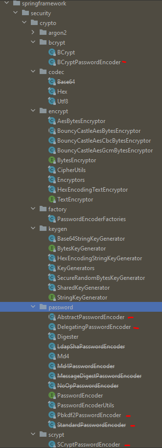

== Spring Security Crypto module (SSCM)

*Content:*

- 1. Intro to SSCM
- 2. Key generators
  * 2.1 StringKeyGenerator
  * 2.2 BytesKeyGenerator
- 3. Использование Encryptors для шифрования и дешифрования
  * 3.1 BytesEncryptors
  * 3.2 TextEncryptors

=== 1. Intro to SSCM

Plain Java не предлагает функций шифрования, дешифрования, генерации ключей и пр. Поэтому был  создан модуль *Spring Security Crypto (SSCM)*, который является частью Spring Security, связанной с криптографией. *_SSCM_* позволяет не использовать third-party библиотеки. Кодировщики паролей также являются частью SSCM, даже если мы рассматривали их отдельно в предыдущих разделах.

В этом разделе мы обсудим, какие другие варианты, связанные с криптографией, предлагает SSCM. Вы увидите примеры использования двух основных функций SSCM:

- *Key generators* — Objects used to generate keys for hashing and encryption algorithms
- *Encryptors* — Objects used to encrypt and decrypt data (обычно текст шифруется ключом=password+salt и потом передается по сети)

=== 2. Key generators

В этом разделе мы обсудим генераторы ключей. *Key generator* — это объект, используемый для генерации определенного типа ключа, обычно необходимого для алгоритма шифрования или хеширования. Реализации генераторов ключей, которые предлагает Spring Security, являются отличными служебными инструментами. Два интерфейса представляют два основных типа генераторов ключей:

- *StringKeyGenerator*
- *BytesKeyGenerator*

Мы можем создавать их напрямую, используя *KeyGenerators* factory.

=== 2.1 StringKeyGenerator
[source, java]
----
public interface StringKeyGenerator {
    String generateKey();
}
----
Единственный метод `generateKey()` возвращает строку ключа. В следующем фрагменте кода представлен пример того, как получить экземпляр *_StringKeyGenerator_* и как использовать его для получения значения соли. Генератор создает 8-байтовый ключ и кодирует его в виде шестнадцатеричной строки. Метод `generateKey()` возвращает результат этих операций в виде строки.
[source, java]
----
StringKeyGenerator keyGenerator = KeyGenerators.string();
String salt = keyGenerator.generateKey();
----

=== 2.2 BytesKeyGenerator
[source, java]
----
public interface BytesKeyGenerator {
    int getKeyLength();
    byte[] generateKey();
}
----
В дополнение к методу _generateKey()_, который возвращает ключ в виде _byte[]_, интерфейс определяет еще один метод, который возвращает длину ключа в байтах. *_ByteKeyGenerator_* по умолчанию генерирует ключи длиной 8 байт, но в конструкторе можно указать требуемую дину ключа:
[source, java]
----
BytesKeyGenerator keyGenerator = KeyGenerators.secureRandom();
byte [] key = keyGenerator.generateKey();
int keyLength = keyGenerator.getKeyLength(); // = 8

BytesKeyGenerator keyGenerator16Bytes = KeyGenerators.secureRandom(16);
byte [] key = keyGenerator.generateKey();
int keyLength = keyGenerator.getKeyLength(); // = 16
----
Ключи, сгенерированные BytesKeyGenerator, созданным с помощью метода `KeyGenerators.secureRandom()`, уникальны для каждого вызова метода `generateKey()`. +
Но в некоторых случаях мы предпочитаем реализацию, которая возвращает одно и то же значение ключа для каждого вызова одного и того же генератора ключей. В этом случае мы можем создать _BytesKeyGenerator_ с помощью метода `KeyGenerators.shared(int length)`. В этом фрагменте кода key1 и key2 имеют одинаковое значение:
[source, java]
----
BytesKeyGenerator keyGenerator = KeyGenerators.shared(16);
byte [] key1 = keyGenerator.generateKey();
byte [] key2 = keyGenerator.generateKey();
----

=== 3. Использование Encryptors для шифрования и дешифрования

Рассмотрим реализации *Encryptors (шифраторы)*, которые предлагает Spring Security. Шифратор — это объект, реализующий алгоритм шифрования. Говоря о безопасности, шифрование и дешифрование являются обычными операциями, поэтому ожидайте, что они потребуются в вашем приложении.

В SSCM определены два типа шифраторов: *BytesEncryptor* и *TextEncryptor*. Хотя у них схожие обязанности, они обрабатывают разные типы данных. TextEncryptor управляет данными как строкой. Его методы получают _String_ и возвращают _String_, как видно из определения интерфейса:
[source, java]
----
public interface TextEncryptor {
    String encrypt(String text);
    String decrypt(String encryptedText);
}
----
*BytesEncryptor* же более дженеричный, мы предоставляем входные/выходные данные в виде массива байтов:
[source, java]
----
public interface BytesEncryptor {
    byte[] encrypt(byte[] byteArray);
    byte[] decrypt(byte[] encryptedByteArray);
}
----

=== 3.1 BytesEncryptors

Рассмотрим, какие у нас есть возможности для получения и использования Encryptor-a. Factory class *_Encryptors_* позволяет создавать шифраторы различными способами. Для BytesEncryptor мы можем использовать методы `Encryptors.standard()` или `Encryptors.stronger()`:
[source, java]
----
String salt = KeyGenerators.string().generateKey();
String password = "secret";
String valueToEncrypt = "HELLO";

BytesEncryptor e = Encryptors.standard(password, salt);
byte [] encrypted = e.encrypt(valueToEncrypt.getBytes());
byte [] decrypted = e.decrypt(encrypted);

BytesEncryptor stronger = Encryptors.stronger(password, salt);
byte [] encrypted = stronger.encrypt(valueToEncrypt.getBytes());
byte [] decrypted = stronger.decrypt(encrypted);
----
Внутри *_Encryptors.standard()_* использует 256-битное AES-шифрование (link:https://habr.com/ru/post/112733/[habr]) с цепочкой блоков шифрования (CBC), которая считается более слабым методом. *_Encryptors.stronger()_* тоже использует AES, но уже с режимом Галуа/счетчика (GCM) в качестве режима работы. AES-шифрование преобразует один 256-битный блок в другой, используя секретный ключ, который нужен для такого преобразования. Дополнительно используется соль для улучшения шифрования - a hex-encoded, random, site-global salt value to use to generate the key. Грубо говоря, соль + пароль = секретный ключ. То есть у вас есть текст, который вы хотите зашифровать ключом (паролем + солью) - и вы задаете пароль, а соль у вас уже есть - это глобальное значение.

=== 3.2 TextEncryptors

Также *_See_* link:https://docs.spring.io/spring-security/site/docs/current/api/org/springframework/security/crypto/encrypt/Encryptors.html[docs.spring.io/Encryptors]

TextEncryptors бывают трех основных типов (и еще один - фиктивный):

- `Encryptors.noOpText()` - фиктивный
- `Encryptors.text()`
- `Encryptors.delux()`
- `Encryptors.queryableText()` - deprecated из-за небезопасности

*_Encryptors.noOpText()_* можно использовать для демонстрационных примеров или случаев, когда вы хотите протестировать производительность своего приложения, не тратя время на шифрование:
[source, java]
----
String valueToEncrypt = "HELLO";
TextEncryptor e = Encryptors.noOpText();
String encrypted = e.encrypt(valueToEncrypt); // does nothing, encrypted == "HELLO"
Assertions.assertThat(encrypted).isEqualTo("HELLO"); // asserted
----

*_Encryptors.text()_* использует описанный выше метод *_Encryptors.standard()_*, а *_Encryptors.delux()_* - *_Encryptors.stronger()_*. То есть в этих шифраторах используется AES-шифрование (по аналогии с BytesEncryptor-ами). +
Для этих обоих шифраторов метод *_encrypt()_*, вызываемый для одних и тех же входных данных, многократно генерирует разные выходные данные. Различные результаты возникают из-за рандомной генерации векторов инициализации, используемых в процессе шифрования.
[source, java]
----
String salt = KeyGenerators.string().generateKey();
String password = "secret";
String valueToEncrypt = "HELLO";

// Создание объекта TextEncryptor, который использует salt и password
TextEncryptor e = Encryptors.text(password, salt);
String encrypted = e.encrypt(valueToEncrypt);
String decrypted = e.decrypt(encrypted);
----

В реальном мире вы найдете случаи, когда вы хотите, чтобы для одних и тех же входных данных выдавались одинаковые результаты. Например, в случае с ключом API OAuth. Раньше для этого использовался queryable text - *_Encryptors.queryableText()_*. Этот шифратор гарантирует, что последовательные операции шифрования будут генерировать одинаковые выходные данные для одних и тех же входных данных:
[source, java]
----
String salt = KeyGenerators.string().generateKey();
String password = "secret";
String valueToEncrypt = "HELLO";

TextEncryptor e = Encryptors.queryableText(password, salt); // deprecated

String encrypted1 = e.encrypt(valueToEncrypt);
String encrypted2 = e.encrypt(valueToEncrypt); // encrypted1 == encrypted2
Assertions.assertThat(encrypted1).isEqualTo(encrypted2); // asserted
----
Однако в Spring Security 5.6.3 этот метод помечен как @Deprecated - this encryptor is not secure. Instead, look to your data store for a mechanism to query encrypted data (link:https://javadoc.io/static/org.springframework.security/spring-security-crypto/5.6.3/deprecated-list.html[org.springframework.security/deprecated-list]). +
Версии Spring Security 5.3.x (2020)- 4.2.x(2016) (link:https://github.com/spring-projects/spring-security/wiki/Spring-Security-Versions[versions]) использовали фиксированный нулевой вектор инициализации с CBC Mode в реализации queryable text encryptor. Злоумышленник, имеющий доступ к данным, зашифрованным с помощью такого шифровальщика, может получить незашифрованные значения с помощью атаки по словарю (link:https://spring.io/security/cve-2020-5408[spring.io/cve-2020-5408]).

