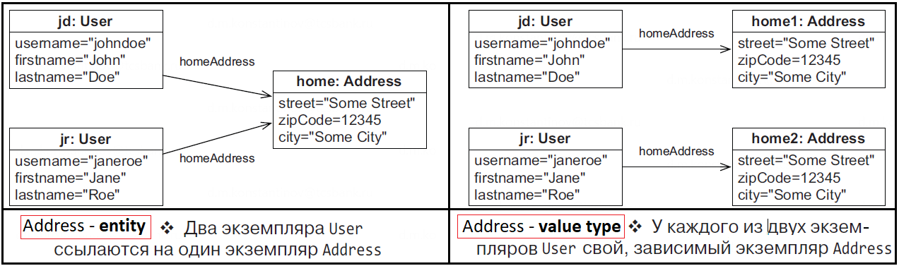

== Отображение классов Java -> ORM model

*Content:*

- 1. Понятие сущностей и типов-значений
- 2. Выбор первичного ключа
- 3. Генерация Id с помощью @GeneratedValue
- 4. Динамическое формирование SQL
- 5. Immutable entities

=== 1. Понятие сущностей и типов-значений

Цель Hibernate - это поддержка хорошо детализированных и насыщенных предметных моделей. Проще говоря, хорошо детализированный означает больше классов, чем таблиц. +
Для этого вводятся понятия *типов-сущностей* (*_entity_*) и *типов-значений* (*_embeddable class_*). Грубо говоря, каждая _entity_ требует под себя таблицу, а _embeddable class_ зависит от _entity_ и зачастую встраивается в таблицу соответствующего _entity_:

- *Экземпляр типа сущности* можно извлечь, используя его *_id_* – например, экземпляры User, Item или Category. Ссылка на экземпляр сущности сохраняется как foreign key. У экземпляра сущности собственный
жизненный цикл; он может существовать независимо от остальных сущностей.
- У *экземпляра типа-значения* отсутствует *_id_*; он принадлежит _экземпляру типа сущности_ (*_entity_*). Его время жизни определяется entity-владельцем. Тип-значение не поддерживает разделения ссылок. Наиболее очевидные типы-значения – String, Integer, примитивные типы. Вы также
можете отображать ваши классы модели предметной области как типы-значения – например, *_Address_* и *_MonetaryAmount_*.

=== 2. Выбор первичного ключа

*_@Id_* класса отображается в primary_key. *_Потенциальный ключ (candidate key)_* – это столбец (множество столбцов), который можно использовать для идентификации конкретной записи в таблице. Чтобы стать *_primary_key_*, _потенциальный ключ_ в Hibernate должен удовлетворять следующим требованиям:

- Значение *_любого_* столбца потенциального ключа (в т. ч. и составного) *_не может быть null_*. Хотя некоторые SQL-базы позволяют определять (составной) первичный ключ, значения столбцов которого могут быть null;
- Значение столбца (или столбцов) потенциального ключа должно быть уникальным для любой записи;
- Значение столбца (или столбцов) потенциального ключа никогда не обновляется – оно неизменяемо.

Подводя итоги, *primary_key* неизменяем, уникален и его значения не могут содержать _**null**_.

=== 3. Генерация Id с помощью @GeneratedValue

Обычно желательно, чтобы система сама формировала значение первичного ключа при сохранении экземпляра сущности, поэтому вслед за аннотацией @Id добавляют аннотацию *_@GeneratedValue_*. JPA стандартизирует несколько стратегий формирования id:

- *_GenerationType.AUTO_* (не нужно)
- *_GenerationType.SEQUENCE_* - работа с sequence в БД (_See:_ link:../../hibernate-learning/src/main/java/ch6_hibernate/p75_bean_hibernate_validator/Item.java[Item.java]) - самая быстрая. +
- *_GenerationType.IDENTITY_* - БД сама назначает индексы
- *_GenerationType.TABLE_* - самая непроизводительная

Несмотря на то, что *_SEQUENCE_* использует БД для генерации ID, присваивание значений производится в коде приложения. С одной стороны, это дает нам оптимизации и пакетные вставки данных, но с другой стороны если несколько клиентов работают с одной и той же базой, они не подозревают, что им нужно использовать определенную последовательность для генерации значений первичных ключей (если `allocationSize > 1`). Это может привести к тому, что другие клиенты назначают ID в соответствии со своими соображениями и полностью игнорируют последовательность. В итоге, мы можем запросто получить нарушения уникальности первичного ключа. Здесь гораздо лучше работает стратегия *_IDENTITY_*.

Либо есть другой вариант - использовать `allocationSize = 1` (_See:_ link:../../hibernate-learning/src/main/java/ch6_hibernate/p75_bean_hibernate_validator/Item.java[Item.java]). Поскольку sequences в postgresql не откатываются после транзакций, приложение спокойно может вызвать атомарную функцию `"select nextval ('public.s_items)')"`, потом сделать с id то, что оно хочет, и спокойно вставить его в БД - больше никто не займет этот номер.

*_Подробнее:_* link:https://habr.com/ru/companies/haulmont/articles/653843/[habr].
*_Про sequences:_* link:https://www.postgresql.org/docs/current/functions-sequence.html[postgresql docs]

При использовании *_GenerationType.TABLE_* Hibernate будет использовать дополнительную таблицу HIBERNATE_SEQUENCES, хранящую следующее числовое значение primary key: по одной строке на каждый Entity. Таблица будет читаться и обновляться перед выполнением INSERT.

=== 4. Динамическое формирование SQL

По умолчанию Hibernate формирует *_CRUD SQL-выражения_* не динамически - для каждого Entity sql-запросы создаются в момент запуска приложения и сохраняются в памяти. Это выгоднее, чем генерировать их каждый раз перед выполнением запроса. Да и кэширование подготовленных операторов на уровне JDBC тем более эффективно, чем меньше имеется операторов.

Но как может Hibernate создавать выражения UPDATE при запуске? В конце концов, столбцы для изменения в этот момент неизвестны. На самом деле сгенерированное SQL-выражение всегда обновляет все столбцы, и если значение какого-либо столбца не изменилось, выражение присваивает ему старое значение. То же касается и выражения CREATE:

[source, sql]
----
INFO ... Query:["insert into users (id, name, second_name, active, premium_id) values (?, ?, ?, ?, ?)"], Params:[(NULL(BIGINT),Pavel,NULL(VARCHAR),true,NULL(NUMERIC))]
----
В примере лога hibernate выше видно, что из пяти полей entity три были _nullable_ (id сгенерируется потом самой БД), но выражение CREATE все равно включает в себя обновление всех столбцов.

В некоторых случаях, например при работе со старыми таблицами с сотнями столбцов, когда SQL-выражения могут быть большими даже для простейших операций обновления одного столбца, стоит переключиться на *_динамическое формирование SQL-выражений_*. Чрезмерно большое количество сущностей также может повлиять на время запуска, потому что сначала Hibernate должен сгенерировать все SQL-выражения для операций CRUD. Потребление памяти кэшем запросов также будет велико, если туда поместить десятки выражений для тысяч сущностей. Это может стать проблемой в виртуальном окружении с ограничениями памяти или на устройствах малой мощности. +
Чтобы деактивировать создание SQL-выражений INSERT и UPDATE при запуске, потребуются оригинальные аннотации Hibernate:

[source, java]
----
@Entity
@org.hibernate.annotations.DynamicInsert
@org.hibernate.annotations.DynamicUpdate
public class Item {
    // ...
}
----

В этом случае инструкция UPDATE будет содержать только столбцы с новыми значениями, а INSERT – только столбцы, которые не могут принимать значение null.

=== 5. Immutable entities

Если Entity класс неизменяемый, то Hibernate никогда не потребуется выполнять операцию UPDATE над ним. Hibernate также может выполнить несколько оптимизаций – например, не проверять состояния объекта immutable entity. Так как immutable POJO обычно не имеет методов записи, Hibernate обращается к полям класса напрямую. Чтобы пометить entity как неизменяемый, нужно использовать аннотацию `@org.hibernate.annotations.Immutable`:

[source, java]
----
@Entity
@org.hibernate.annotations.Immutable
public class Bid {
    // ...
}
----
