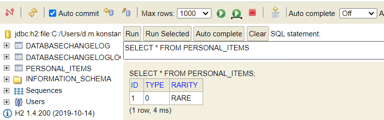

== Отображение типов-значений

*Content:*

- 1. Поддержка LocalDate и другие фишки в JPA 2.2
- 2. Отображение перечислений (enums)
- 3. Аннотация @Generated - автогенерация/триггеры из БД

=== 1. Поддержка LocalDate и другие фишки в JPA 2.2

В JPA 2.2 (2017) появилась, наконец таки, поддержка LocalDate. *_See:_* link:https://habr.com/ru/companies/otus/articles/423195/[habr],
link:https://vladmihalcea.com/whats-new-in-jpa-2-2-java-8-date-and-time-types/[link2]. Ранее, в JPA 2.1 нужно было писать специальные конвертеры для преобразования между `LocalDate` и `java.util.Date`. Если сейчас вам нужно сохранить в БД такие типы из `java.time`, которые всё еще не поддерживаются JPA 2.2, то конвертер все равно придется написать.

Поддержка JPA *_Date and Time API_* включает в себя следующие типы:

- java.time.LocalDate
- java.time.LocalTime
- java.time.LocalDateTime
- java.time.OffsetTime
- java.time.OffsetDateTime

До этого было необходимо использовать аннотацию *_@Temporal_* для приведения времени к той или иной точности в самой БД - link:https://www.baeldung.com/hibernate-date-time[baeldung].

=== 2. Отображение перечислений (enums)

При отображении *_enum_* в БД Hibernate может отобразить его в таблицу как число (`EnumType.ORDINAL`), так и как строку (`EnumType.STRING`). Для этого используется аннотация *_@Enumerated_*. При ее отсутствии enum будет отображаться в число. Такое поведение, во-первых, опасно, а во-вторых, неудобно. - Если вы поменяете значения enum местами, существующие числовые значения в БД больше не будут отображаться на нужные позиции. Кроме того, удобнее отображать строковые значения в строки в БД. Пример:

*_See:_* link:../../hibernate-learning/src/main/java/ch6_hibernate/p112_mapping_value_types/PersonalItem.java[PersonalItem.java]:
[source, java]
----
@NoArgsConstructor
@Entity
@Table(name = "personal_items")
@Getter
@Setter
@Accessors(chain = true)
public class PersonalItem {

    // @Id...

    @NotNull
    @Enumerated(EnumType.ORDINAL) // По умолчанию - ORDINAL
    private PersonalItemType type;

    @NotNull
    @Enumerated(EnumType.STRING)
    private PersonalItemRarity rarity;
}
----

Соответствующие записи в БД:

=== 3. Аннотация @Generated - автогенерация/триггеры из БД

Специфическая аннотация link:https://docs.jboss.org/hibernate/stable/core.old/reference/en/html/mapping-generated.html[@Generated] или же`@org.hibernate.annotations.Generated` предназначена для полей, которые автоматически обновляются базой данных при INSERT или UPDATE(например, через триггер).

[source, java]
----
@Column(insertable = false, updatable = false)
@org.hibernate.annotations.Generated(
  org.hibernate.annotations.GenerationTime.ALWAYS
)
// если триггера в БД нет и @Generated просто неоткуда взять значение
@org.hibernate.annotations.ColumnDefault("1.00")
protected Date lastModified;
----

Аннотация GenerationTime имеет два параметра: *_ALWAYS_* и *_INSERT_*:

- _ALWAYS_ говорит о том, что значение генерируется БД и при вставке, и при апдейте.
- _INSERT_ говорит о том, что значение генерируется БД только при вставке. При этом внутри себя БД может менять значение, но Рibernate его подхватывать не будет.

При этом необходимо добавить аннотацию `@Column(insertable = false, updatable = false)` - она запрещает Hibernate вставлять или обновлять значения.

Если мы не знаем, есть ли в БД соответствующий триггер - мы можем поставить дополнительную аннотацию link:https://docs.jboss.org/hibernate/orm/6.2/javadocs/org/hibernate/annotations/ColumnDefault.html[@ColumnDefault]. При отсутствии триггера поле в БД будет заполнено указанным в аннотации значением.
