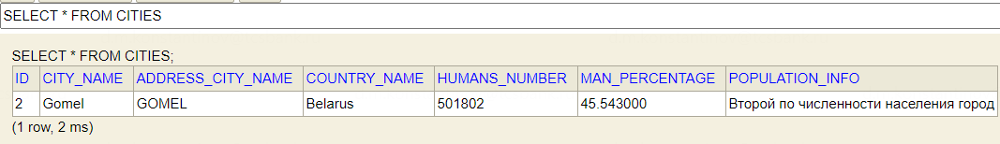

== Встраиваемые классы - JPA @Embedded And @Embeddable классы

*Content:*

- 1. Встраиваемые классы - JPA @Embedded And @Embeddable классы
- 2. Аннотации @Embeddable и @Embedded
- 3. @AttributeOverrides - изменение имени колонки для встроенного класса
- 4. Embeddable классы с null-значениями
- 5. Стратегия доступа к полям Embeddable-класса - AccessType FIELD/PROPERTY

=== 1. Встраиваемые классы - JPA @Embedded And @Embeddable классы

Во-первых, ссылки: link:https://www.baeldung.com/jpa-embedded-embeddable[baeldung] + link:https://habr.com/ru/post/180703/[habr].

Встраиваемые классы являются частью какой-то entity (композиция). Единственное их отличие от entity - у Embedded класса нет id-шника. Это по сути обыкновенный POJO. Он может иметь в себе различные jpa/hibernate аннотации (а может и не иметь, *_See:_* link:../../hibernate-learning/src/main/java/ch6_hibernate/p123_embedded_embeddable_classes/entity/PopulationData.java[PopulationData.java]). Все свойства embedded-класса по умолчанию сохраняются точно так же, как свойства entity.

Рассмотрим основной класс entity link:../../hibernate-learning/src/main/java/ch6_hibernate/p123_embedded_embeddable_classes/entity/City.java[City.java], который имеет встроенные классы link:../../hibernate-learning/src/main/java/ch6_hibernate/p123_embedded_embeddable_classes/entity/CityAddress.java[CityAddress.java] и link:../../hibernate-learning/src/main/java/ch6_hibernate/p123_embedded_embeddable_classes/entity/PopulationData.java[PopulationData.java]:

[source, java]
----
@Entity
@Data
@Table(name = "cities")
@Accessors(chain = true)
public class City {

    // @Id...

    @NotNull
    @Column(nullable = false)
    private String cityName;

    @AttributeOverrides({
            @AttributeOverride(name = "cityName",
                    column = @Column(name = "address_city_name"))
    })
    private CityAddress address;

    @Embedded
    private PopulationData populationData;

}
----

=== 2. Аннотации @Embeddable и @Embedded

У встраиваемых классов есть два вида аннотаций -  *_@Embeddable_* и *_@Embedded_*:

- _@Embeddable_ вешается на сам встраиваемый класс (link:../../hibernate-learning/src/main/java/ch6_hibernate/p123_embedded_embeddable_classes/entity/CityAddress.java[CityAddress.java]).
- _@Embedded_ вешается на поле основного класса (link:../../hibernate-learning/src/main/java/ch6_hibernate/p123_embedded_embeddable_classes/entity/City.java[City.java]). Эта аннотация может пригодиться для отображения стороннего класса, когда исходный код недоступен и нет возможности добавить первую аннотацию в сам класс.

=== 3. @AttributeOverrides - изменение имени колонки для встроенного класса

Аннотация *_@AttributeOverrides_* выборочно переопределяет отображение свойств встроенного класса. В листинге класса link:../../hibernate-learning/src/main/java/ch6_hibernate/p123_embedded_embeddable_classes/entity/City.java[City.java] мы изменяем имя колонки в БД для проперти `"cityName"` чтобы не перекрыть уже имеющуюся пропертю:

Каждая аннотация @AttributeOverride перед свойством-компонентом является "финальной": любые аннотации JPA или Hibernate над переопределяемым свойством будут игнорироваться. Это значит, что аннотации @Column в классе CityAddress будут проигнорированы и новое поле `ADDRESS_CITY_NAME` сможет хранить значение NULL! Однако Bean Validation по-прежнему будет распознавать аннотацию @NotNull перед свойством-компонентом; Hibernate лишь переопределит аннотации, связанные с хранением.

=== 4. Embeddable классы с null-значениями

Не существует способа представить ссылку на экземпляр встраиваемого класса со значениями NULL. Если попытаться создать такой embeddable-класс (*_See:_* link:../../hibernate-learning/src/main/java/ch6_hibernate/p123_embedded_embeddable_classes/EmbeddableClassesScheduler.java[EmbeddableClassesScheduler], метод _prepareWithNullEmbeddableClassesProperties_), то Hibernate при сохранении присвоит null ссылке на встраиваемый класс и не создаст никакого embeddable-класса при выборке данных из БД. Это может оказаться неожиданным, но, с другой стороны, вам в любом случае не следует использовать столбцы, в которых могут отсутствовать значения, а также следует избегать троичной логики.

=== 5. Стратегия доступа к полям Embeddable-класса - AccessType FIELD/PROPERTY

Embeddable-класс наследует стратегию доступа от своего владельца Entity. Это наследование также влияет на местоположение hibernate-аннотаций в Embeddable-классах. Однако стратегию можно переопределить (см. пункт 5):

- 1) @Entity использует стратегию *прямого доступа к полям* либо *_неявно_*, с помощью аннотации `@Id` перед полем, либо *_явно_*, с помощью аннотации `@Access(AccessType.FIELD)` перед классом -> все аннотации Embeddable-класса должны располагаться над *полями класса*, наличие методов доступа не обязательно.
- 2) @Entity использует стратегию *доступа к свойствам* либо *_неявно_*, с помощью аннотации `@Id` перед геттером, либо *_явно_*, с помощью аннотации `@Access(AccessType.PROPERTY)` перед классом -> все аннотации Embeddable-класса должны располагаться над *геттерами*
- 3) Отметить поле с типом Embeddable-класса в @Entity аннотацией `@Access(FIELD/PROPERTY)` -> Hibernate будет ожидать появления аннотаций перед полями/геттерами Embeddable-класса соответственно
- 4) Отметить аннотацией `@Access(FIELD/PROPERTY)` сам Embeddable-класс -> Hibernate будет использовать выбранную стратегию для доступа к свойствам Embeddable-класса
