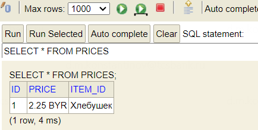

== Отображение типов Java и SQL с применением конвертеров

*Content:*

- 1. Комплексный класс для преобразования его в строку БД
- 2. JPA-конвертер для класса MonetaryAmount
- 3. Ограничения конвертеров JPA
- 4. Пользовательские типы в Hibernate

=== 1. Комплексный класс для преобразования его в строку БД

Предположим, что мы хотим хранить ценники в БД парами `<amount:currency>` - например, *_45.40 USD_*, *_77000 RUB_* и т. д. Для этого мы хотим использовать одну *_строковую_* колонку с именем `price`. Но вот незадача - наш класс, который мы хотим использовать как свойство класса-entity, имеет два поля `value` и `currency`:

[source, java]
----
public class MonetaryAmount implements Serializable {
    protected final BigDecimal value;
    protected final Currency currency;
}
----

Как же нам правильно отобразить класс `MonetaryAmount` в одну колонку БД? Для этого нам потребуются специальные jpa-конвертеры (hibernate-конвертеры), аннотируемые специальной аннотацией `javax.persistence.Converter`.

Но прежде рассмотрим полный листинг класса link:../../hibernate-learning/src/main/java/ch6_hibernate/p129_jpa_converters/dto/MonetaryAmount.java[MonetaryAmount.java]:

[source, java]
----
@Data
@AllArgsConstructor
public class MonetaryAmount implements Serializable {
    protected final BigDecimal value;
    protected final Currency currency;

    public String toString() {
        return getValue() + " " + getCurrency();
    }

    public static MonetaryAmount fromString(String s) {
        String[] split = s.split(" ");
        return new MonetaryAmount(
                new BigDecimal(split[0]),
                Currency.getInstance(split[1]));
    }
}
----

Что здесь наиболее важно отметить:

1. Во-первых, класс должен быть `Serializable`: когда Hibernate сохраняет Entity в разделяемом кэше второго уровня (раздел 20.2), то он разбирает состояние Entity на составляющие. Поэтому свойство типа MonetaryAmount сериализуется и сохраняется в кэше второго уровня. При загрузке данных сущности из кэша значение поля десериализуется и собирается обратно.
2. Во-вторых, нам понадобится строковое представление класса в виде экземпляра String (мы ведь хотим сохранять значение в строковом столбце БД). Поэтому мы реализуем метод *_toString()_* и статический метод *_fromString(String s)_* для создания экземпляров из объектов String.

=== 2. JPA-конвертер для класса MonetaryAmount

Рассмотрим класс конвертера link:../../hibernate-learning/src/main/java/ch6_hibernate/p129_jpa_converters/converter/MonetaryAmountConverter.java[MonetaryAmountConverter.java]:

[source, java]
----
@Converter(autoApply = true)
public class MonetaryAmountConverter
        implements AttributeConverter<MonetaryAmount, String> {

    @Override
    public String convertToDatabaseColumn(MonetaryAmount monetaryAmount) {
        return monetaryAmount.toString();
    }
    @Override
    public MonetaryAmount convertToEntityAttribute(String s) {
        return MonetaryAmount.fromString(s);
    }
}
----

Конвертер реализует интерфейс `AttributeConverter<T, V>`, где *T* - тип свойства в классе-Entity, а *V* - класс, в который отображается тип базы данных (String). Класс должен быть отмечен аннотацией `@Converter(autoApply=true)`. Если параметр аннотации включен, любое свойство типа `MonetaryAmount` в любом классе-Entity или Embeddable-классе будет обрабатываться конвертером автоматически. В противном случае над данным свойством нужно будет повесить аннотацию `@Convert`:
[source, java]
----
@Convert(
        converter = MonetaryAmountConverter.class,
        disableConversion = false)
----

Рассмотрим сам Entity-класс link:../../hibernate-learning/src/main/java/ch6_hibernate/p129_jpa_converters/entity/Price.java[Price.java]. Аннотация @Convert не обязательная, но для примера мы ее повесили:
[source, java]
----
@Entity
@Data
@Table(name = "prices")
@Accessors(chain = true)
public class Price {

    // @Id...

    @NotNull
    @Column(nullable = false)
    @Convert(converter = MonetaryAmountConverter.class,
            disableConversion = false)
    private MonetaryAmount price;

    // ...
}
----

В БД колонка выглядит следующим образом:

=== 3. Ограничения конвертеров JPA

1. Их нельзя применять к *_@Id_* или *_@Version_*
2. Их нельзя применять к *_@Enumerated_* или *_@Temporal_*, потому что эти аннотации уже определяют необходимые преобразования. Если потребуется применить собственный конвертер к перечислениям, не отмечайте их аннотацией @Enumerated

=== 4. Пользовательские типы в Hibernate

*_See:_* link:https://www.baeldung.com/hibernate-custom-types[baeldung]

Страница 142 книги и link:https://www.baeldung.com/hibernate-custom-types[ссылка] показывают еще большее расширение конвертеров (с использованием jdbc для получения аргументов и т. д.). Для этого используются интерфейсы `UserType`, `CompositeUserType`, `ParameterizedUserType`. Первый интерфейс также позволяет включить оптимизацию в случае сохранения immutable-классов.

Например, мы могли бы полностью обойтись без отдельных конвертеров, если бы `MonetaryAmount` реализовывал интерфейс `UserType`. Данный интерфейс маппит сложный Java-тип на один столбец таблицы. А вот следующий интерфейс, `CompositeUserType`, может маппить сложный Java-тип уже на несколько столбцов таблицы. С другой стороны, `CompositeUserType` зачастую может быть заменен на Embeddable-класс, поэтому пользовательские типы в Hibernate используются достаточно редко.
